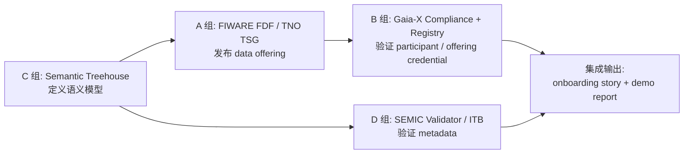

# DSSC Toolbox 研究场景

## 场景名称

**Building Energy Consumption Data Product**

简要描述：

> 一个能源数据提供方 `Energy Data Provider Ltd.` 在 data space 中发布建筑小时级用电量数据；数据消费者 `City Analytics Lab` 发现并申请访问；data space authority 要求该数据产品具备共同语义模型、基础 trust/compliance 描述，并通过 metadata validation。

## 场景角色

| 角色 | 名称 | 作用 |
|---|---|---|
| Provider | Energy Data Provider Ltd. | 发布建筑能耗数据产品。 |
| Consumer | City Analytics Lab | 发现并申请访问数据。 |
| Data Space Authority | City Energy Data Space Authority | 制定语义、合规和验证规则。 |

## 数据产品定义

| 属性 | 值 |
|---|---|
| Data Product | Building Energy Consumption Dataset API |
| Dataset ID | `building-energy-hourly-v1` |
| Format | JSON |
| Frequency | hourly |
| Unit | kWh |
| Endpoint | `https://api.example.org/energy/buildings/hourly` |
| License | CC-BY-4.0 for research demo |
| Spatial Coverage | Shenzhen demo district |
| Temporal Coverage | 2026-05-01 to 2026-05-02 |

## 场景包文件

| 文件 | 用途 |
|---|---|
| `README.md` | 场景说明和各组使用方式。 |
| `VALIDATION_GUIDE.md` | 样例一致性、预期验证结果和边界说明。 |
| `data/building-energy-sample.json` | mock API 返回数据。 |
| `mock-api/openapi.yaml` | 极简 API 描述，可作为 connector data offering 的接口说明。 |
| `metadata/data-product-valid.jsonld` | 可通过 SHACL 的 data product metadata。 |
| `metadata/data-product-invalid.jsonld` | 故意缺字段、单位错误，用于失败案例。 |
| `shapes/building-energy-shapes.ttl` | 最小 SHACL constraints。 |
| `gaia-x/legal-participant.template.jsonld` | LegalParticipant credential 学习模板。 |
| `gaia-x/service-offering.template.jsonld` | ServiceOffering credential 学习模板。 |

## 四个小组怎么用

### A 组：FIWARE FDF / TNO TSG

使用文件：

- `mock-api/openapi.yaml`
- `data/building-energy-sample.json`
- `metadata/data-product-valid.jsonld`

任务：

1. 把 `Building Energy Consumption Dataset API` 包装成 data offering。
2. 用 mock JSON 或 mock endpoint 代表 provider 的真实数据源。
3. 在 FIWARE FDF 或 TNO TSG 中模拟 provider 发布 offering。
4. 让 consumer 发现 offering，并记录 negotiation / transfer 的关键状态。

最低交付：

- 一个 data offering 描述。
- 一张 provider-consumer 数据交换流程图。
- 一份 deployment/API 调用记录，失败也要记录原因。

### B 组：Gaia-X Compliance Service + Registry

使用文件：

- `gaia-x/legal-participant.template.jsonld`
- `gaia-x/service-offering.template.jsonld`

任务：

1. 先用模板理解 participant credential 和 service offering credential 的结构。
2. 对照 Gaia-X 官方 sample credentials 补齐 required fields。
3. 调用官方 Compliance Service 或 lab instance。
4. 记录一个失败样例和失败原因。
5. 说明 Registry 提供的 shapes、schemas、trust anchors 如何影响验证。

注意：

模板是教学模板，不保证直接通过官方 Gaia-X compliance。真正提交时应基于官方 sample credentials 调整。

最低交付：

- Gaia-X compliance 流程图。
- 一个 credential 请求样例。
- 一个 compliance error analysis。

### C 组：Semantic Treehouse

使用文件：

- `metadata/data-product-valid.jsonld`
- `shapes/building-energy-shapes.ttl`

任务：

1. 建立 `Building Energy Consumption` semantic model。
2. 先建模 data product metadata 字段：`datasetId`、`providerName`、`endpointUrl`、`format`、`frequency`、`unit`、`spatialCoverage`、`temporalStart`、`temporalEnd`。
3. 可选建模 API record 字段：`buildingId`、`meterId`、`timestamp`、`energyKWh`、`unit`、`location`。
4. 研究模型版本化：
   - v0.1：metadata 基础字段。
   - v0.2：增加 unit 和 temporal coverage 约束。
   - v0.3：扩展 API record schema。
5. 尝试导出或对照 SHACL。
6. 把模型交给 D 组做 validation。

最低交付：

- 一个 semantic model 表。
- 一个版本变化说明。
- 一个 SHACL / model mapping 表。

### D 组：ITB + SEMIC Validator

使用文件：

- `metadata/data-product-valid.jsonld`
- `metadata/data-product-invalid.jsonld`
- `shapes/building-energy-shapes.ttl`
- `VALIDATION_GUIDE.md`

任务：

1. 用 SEMIC SHACL Validator 或其他 SHACL validator 验证 valid metadata。
2. 验证 invalid metadata，记录失败原因。
3. 解释 validation report 中的 focus node、path、message。
4. 设计如何把该 validation step 放入 ITB test suite。

最低交付：

- valid case validation result。
- invalid case validation result。
- 一个 ITB conformance testing 流程草图。

## 最小集成流程

## 最小验收标准

这个场景完成时，应至少具备：

1. A 组能说明如何把 `openapi.yaml` 包装成 data offering。
2. B 组能说明 Gaia-X credential 为什么不能只是普通 metadata。
3. C 组能给出一个小型 semantic model。
4. D 组能跑出 valid / invalid 两个 validation case。
5. 全组能用一张图解释：semantic model -> data offering -> compliance -> validation。

