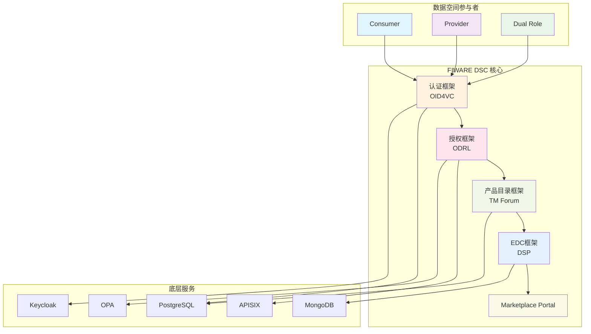

本文档为 FIWARE Data Space Connector (FIWARE DSC) 项目提供全面概述，旨在帮助开发者快速理解项目的核心定位、技术架构、功能特性和部署方式。作为数据空间连接器的参考实现，FIWARE DSC 通过集成多个开源组件，为组织提供标准化的数据空间接入能力。

## 项目定位与核心价值

FIWARE Data Space Connector 是一个**数据空间连接器**，源于 [FIWARE Dataspace Components (FDC)](https://github.com/FIWARE) 和 [Eclipse Dataspace Components (EDC)](https://eclipse-edc.github.io/docs/) 的深度集成。每个参与数据空间的组织都可以部署此连接器，以扮演数据（处理）服务提供者、数据（处理）服务消费者或双重角色。

**核心价值主张**：
- **标准化接入**：基于 W3C DID、Verifiable Credentials 等国际标准
- **协议兼容性**：同时支持 FIWARE 和 Eclipse 数据空间协议
- **角色灵活性**：支持 Provider、Consumer 或双重角色部署
- **生产就绪**：完整的身份验证、授权和合同管理框架

Sources: [README.md](README.md#L1-L20)

## 核心功能框架

FIWARE DSC 当前集成了五大核心框架，每个框架专注于数据空间的不同功能层面：

### 1. 基于 OID4VC 的认证框架

采用基于去中心化身份管理的认证机制，支持 W3C 标准（DID、可验证凭证）和 OID4VC 协议族。该框架允许持有必需可验证凭证的组织或用户对连接器进行身份验证，并获取有效的 JWT 令牌。

**关键组件**：
- **VCVerifier**：实现凭证验证功能，使用 OID4VP 协议与用户侧系统交互
- **credentials-config-service**：维护每个产品/服务所需的 VC 配置
- **trusted-issuers-list**：维护受信任的凭证颁发者注册表，提供 EBSI Trusted Issuers Registry 兼容 API

**消费端凭证颁发者**：Keycloak 26.6.2（通过 CloudPirates Helm Chart 部署），遵循 OID4VCI Draft 15 规范。

### 2. 授权框架

实现基于属性的访问控制（ABAC）架构，基于 W3C ODRL 标准定义的策略进行授权决策。

**组件职责**：
- **Apache APISIX**：实现策略执行点（PEP）功能
- **OPA (Open Policy Agent)**：实现策略决策点（PDP）功能，解释和应用 ODRL 策略
- **ODRL-PAP**：实现策略管理点（PAP/PRP）功能，允许配置 OPA 可解释的 ODRL 策略

### 3. 产品目录与合同管理框架

基于 TM Forum Open APIs 管理产品规格目录、产品报价、产品协商和订购过程以及产品库存。

**核心组件**：
- **TMForum-API**：实现 TM Forum Open APIs 的标准访问
- **Contract-Management**：订阅 tmforum-api 组件的通知，实现与其他框架的集成

### 4. EDC 框架（数据空间协议）

集成 Eclipse 数据空间组件，支持数据空间协议（DSP），包括目录访问、产品合同协商和传输过程控制。

**支持的功能**：
- Catalog Protocol：通过 DCAT 发现目录中的产品
- Contract Negotiation Protocol：状态化的数据集使用合同协商
- Transfer Process Protocol：在有效协议存在后编排数据访问（拉取/推送）
- 双重认证协议：OID4VC 和 Eclipse DCP

### 5. Marketplace Portal

基于 FIWARE BAE Marketplace 的图形化 Web 界面，允许管理用户管理产品规格、报价、合同和库存。

Sources: [README.md](README.md#L40-L180)

## 技术架构概览

FIWARE DSC 采用**模块化、可扩展的架构设计**，通过 Helm Umbrella Chart 将所有子组件及其依赖项打包为一个可部署的单元。

### 架构分层



### 组件依赖关系

FIWARE DSC 的 Helm Chart 依赖关系展示了模块化的设计思路：

| 主要组件 | 子组件 | 功能描述 | 版本 |
|---------|--------|---------|------|
| decentralized-iam | vc-authentication, odrl-authorization | 身份和授权管理 | 2.0.15 |
| scorpio-broker-aaio | - | 上下文代理（NGSI-LD） | 0.4.12 |
| keycloak | - | 凭证颁发（OID4VCI） | 0.21.7 |
| tm-forum-api | - | TM Forum API 实现 | 0.16.10 |
| contract-management | - | 合同管理通知监听器 | 3.5.28 |
| business-api-ecosystem | - | Marketplace 门户 | 0.11.32 |
| fdsc-edc | - | 数据空间协议实现 | 0.2.9 |
| vault | - | 密钥管理 | 0.29.1 |
| cert-manager | - | 证书管理 | 1.20.0 |
| opentelemetry-collector | - | 分布式追踪 | 0.152.0 |

Sources: [charts/data-space-connector/Chart.yaml](charts/data-space-connector/Chart.yaml#L1-L92)

## 部署模式与配置

FIWARE DSC 支持多种部署模式，适应不同的使用场景和环境需求。

### 部署模式比较

| 部署模式 | 适用场景 | 复杂度 | 资源需求 | 配置示例 |
|---------|---------|--------|----------|----------|
| **本地开发部署** | 学习、开发、测试 | 低 | 16GB+ RAM | `mvn clean deploy -Plocal` |
| **角色化部署** | 生产环境 | 中-高 | 可变 | `helm install dsc/data-space-connector` |
| **双角色部署** | 大多数生产场景 | 高 | 高 | 自定义 values.yaml |
| **Operator 部署** | 数据空间治理 | 最高 | 最高 | 专用配置 |

### 配置管理

所有配置通过 `values.yaml` 文件管理，采用分层配置结构：

```yaml
# 核心功能开关
decentralizedIam:
  enabled: true
  vcAuthentication:
    managedPostgres:
      enabled: true

# 认证组件配置
keycloak:
  enabled: true
  image:
    tag: "26.6.2"

# 授权组件配置  
odrl-authorization:
  apsisix:
    enabled: true
  opa:
    enabled: true

# 数据空间协议配置
fdsc-edc:
  enabled: true
  authenticationProtocol: "oid4vc"  # 或 "dcp"
```

**配置特点**：
- **模块化开关**：每个组件都可通过 `<component>.enabled` 独立控制
- **分层覆盖**：子图表配置可通过父图表 values.yaml 覆盖
- **文档化注释**：所有配置项都包含 `# --` 注释，支持 helm-docs 自动生成文档
- **环境感知**：支持开发、测试、生产等多环境配置

Sources: [charts/data-space-connector/values.yaml](charts/data-space-connector/values.yaml#L1-L100), [CLAUDE.md](CLAUDE.md#L20-L50)

## 数据交换支持

FIWARE DSC 在数据交换和服务调用层准备好管理任何基于 HTTP 的接口访问。

### 支持的数据交换格式

| 数据格式/协议 | 支持状态 | 使用场景 | 配置示例 |
|--------------|---------|---------|---------|
| **ETSI NGSI-LD** | 内置支持 | 物联网、智慧城市 | 默认数据交换 API |
| **NGSIv2** | 支持 | 传统 FIWARE 集成 | 通过适配器 |
| **S3** | 支持 | 大文件存储 | 数据平面配置 |
| **Web Portal** | 支持 | 用户界面 | Marketplace 集成 |
| **A2A/MCP** | 支持 | AI 代理功能 | 智能代理集成 |
| **自定义 REST API** | 支持 | 任意 HTTP 服务 | 通过 APISIX 路由 |

### 服务调用流程

FIWARE DSC 支持两种主要的服务调用模式：

**H2M（人对机）流程**：
1. 用户通过 Web 应用访问受保护服务
2. 重定向到 VCVerifier 进行身份验证
3. 用户使用数字钱包扫描二维码并提供凭证
4. 验证成功后获取 JWT 令牌
5. 使用令牌访问后端服务

**M2M（机对机）流程**：
1. 应用程序向 VCVerifier 请求身份验证
2. 提供必需的可验证凭证
3. 验证成功后获取 JWT 令牌
4. 使用令牌调用服务

两种流程都支持一次性认证、多次服务调用，认证过程只需执行一次。

Sources: [README.md](README.md#L200-L350), [doc/flows/service-interaction-m2m/README.md](doc/flows/service-interaction-m2m/README.md#L1-L100)

## 安全与信任机制

FIWARE DSC 实现了多层安全机制，确保数据空间的可信交互。

### 信任框架集成

| 信任框架 | 支持状态 | 集成方式 | 配置文件 |
|---------|---------|---------|---------|
| **EBSI** | 完全支持 | Trusted Issuers Registry API | 默认信任锚 |
| **Gaia-X** | 支持 | Digital Clearing House 集成 | `gaia-x` profile |
| **i4Trust** | 支持 | 去中心化 IAM 框架 | 授权策略 |

### 数字钱包兼容性

| 钱包 | 平台 | 测试版本 | OIDC 要求 | 推荐用途 |
|------|------|----------|----------|----------|
| Lissi ID Wallet | iOS | 3.1.3 | PKCE S256 | **生产环境** |
| Lissi ID Wallet | Android | 3.1.1 | PKCE S256 | **生产环境** |
| EUDI Reference Wallet (forked) | iOS | - | PAR + DPoP + PKCE S256 | 开发/测试 |

### 安全配置最佳实践

- **Pod 安全上下文**：严格设置 `runAsNonRoot`、`readOnlyRootFilesystem`，移除所有能力
- **证书管理**：通过 cert-manager 自动管理 TLS 证书
- **密钥存储**：使用 HashiCorp Vault 或 Kubernetes Secrets
- **网络策略**：通过 APISIX 实现细粒度的访问控制

Sources: [README.md](README.md#L260-L300), [doc/GAIA_X.MD](doc/GAIA_X.MD#L1-L50)

## 可观测性与监控

FIWARE DSC 集成了完整的可观测性栈，支持分布式追踪、指标收集和日志管理。

### OpenTelemetry 集成

**配置结构**：
```yaml
tracing:
  enabled: true
  exporter:
    otlp:
      endpoint: "http://otel-collector:4317"
      protocol: "grpc"
      insecure: true
  sampler: "parentbased_traceidratio"
  samplerArg: "1.0"
  propagators: "tracecontext,baggage"
  resourceAttributes:
    environment: "production"
    team: "data-platform"
```

**支持组件**：
- **OpenTelemetry Collector**：分布式追踪数据收集
- **Grafana Tempo**：追踪数据存储后端
- **Jaeger**：可选追踪可视化
- **Honeycomb**：可选追踪分析平台

### 监控配置

| 组件 | 默认端口 | 协议 | 功能 |
|------|---------|------|------|
| OTEL Collector | 4317 | gRPC | 追踪数据收集 |
| Prometheus | 9090 | HTTP | 指标存储 |
| Grafana | 3000 | HTTP | 可视化仪表板 |
| APISIX Dashboard | 9000 | HTTP | API 网关管理 |

Sources: [charts/data-space-connector/templates/_helpers.tpl](charts/data-space-connector/templates/_helpers.tpl#L50-L150), [doc/deployment-integration/observability/README.md](doc/deployment-integration/observability/README.md)

## 版本演进与发布策略

FIWARE DSC 采用语义化版本控制（Semantic Versioning 2.0.0），持续集成流程确保每次合并到主分支都会触发新版本发布。

### 主要版本历史

| 版本 | 发布日期 | 主要变更 | 破坏性变更 |
|------|---------|---------|-----------|
| **8.x.x** | 2023 | 基础版本 | 无 |
| **9.x.x** | 2024 | OTEL 追踪集成 | **是** |
| **10.x.x** | 2025 | Keycloak 迁移与 OID4VCI 重写 | **是** |

### 版本升级策略

**破坏性变更处理**：
- 主版本号变更表示破坏性变更
- 提供详细的迁移指南（如 [doc/release-notes/9-x.md](doc/release-notes/9-x.md)）
- 提供兼容性矩阵和配置转换工具

**依赖管理**：
- 子图表版本通过 Chart.yaml 管理
- 使用条件部署 (`condition:` 字段) 控制组件启用
- 支持版本覆盖和固定

Sources: [README.md](README.md#L180-L200), [doc/release-notes/10-x.md](doc/release-notes/10-x.md)

## 项目结构与开发环境

### 核心目录结构

```
data-space-connector/
├── charts/
│   ├── data-space-connector/          # 主 Umbrella Chart
│   │   ├── Chart.yaml                 # 依赖定义
│   │   ├── values.yaml                # 完整配置（~3000 行）
│   │   ├── templates/                 # 自定义模板
│   │   └── tests/                     # Helm 单元测试
│   └── trust-anchor/                  # 信任锚 Chart
├── doc/                               # 文档目录
│   ├── deployment-integration/        # 部署指南
│   ├── flows/                         # 交互流程图
│   └── release-notes/                 # 版本说明
├── it/                                # 集成测试
├── k3s/                               # K3s 本地部署配置
├── helpers/                           # 辅助工具
├── pom.xml                            # Maven 构建文件
└── .github/workflows/                 # CI/CD 流程
```

### 开发工具链

| 工具 | 用途 | 配置文件 |
|------|------|---------|
| **Helm 3** | 包管理和部署 | Chart.yaml |
| **Maven** | 构建和集成测试 | pom.xml |
| **Docker** | 容器化 | Dockerfile |
| **K3s** | 本地 Kubernetes | k3s/ |
| **kubectl** | 集群管理 | KUBECONFIG |
| **curl/jq** | API 测试 | 脚本 |

### 构建与测试命令

```bash
# 依赖更新
helm dependency update charts/data-space-connector

# 代码检查
helm lint charts/data-space-connector

# 模板渲染
helm template test charts/data-space-connector -f values.yaml

# 单元测试
helm unittest charts/data-space-connector

# 本地集成测试
mvn clean deploy -Plocal

# 完整集成测试
mvn clean integration-test -Ptest
```

Sources: [CLAUDE.md](CLAUDE.md#L1-L50), [pom.xml](pom.xml#L1-L100)

## 适用场景与最佳实践

### 典型使用场景

1. **数据提供者**：希望安全地向其他组织提供数据或服务
2. **数据消费者**：希望从数据空间中获取标准化数据
3. **双重角色参与者**：同时提供和消费数据（最常见场景）
4. **数据空间运营商**：管理数据空间的基础设施和信任框架

### 部署最佳实践

**生产环境部署建议**：
1. **资源规划**：为每个组件分配足够的 CPU 和内存资源
2. **高可用性**：使用多副本部署和负载均衡
3. **备份策略**：定期备份数据库和配置
4. **监控告警**：设置关键指标的监控和告警
5. **安全加固**：遵循最小权限原则配置网络策略

**开发环境建议**：
1. **使用本地部署**：快速启动完整的数据空间环境
2. **模块化测试**：独立测试每个组件的功能
3. **配置管理**：使用版本控制管理 values.yaml 文件
4. **日志收集**：配置集中式日志收集以便调试

Sources: [doc/deployment-integration/local-deployment/LOCAL.MD](doc/deployment-integration/local-deployment/LOCAL.MD#L1-L50), [README.md](README.md#L400-L450)

## 下一步阅读建议

基于您的角色和需求，建议按以下顺序深入阅读相关文档：

### 快速入门路径
1. **[快速部署指南](2-kuai-su-bu-shu-zhi-nan)** - 快速启动数据空间环境
2. **[Consumer 角色部署](3-consumer-jiao-se-bu-shu)** - 数据消费者部署
3. **[Provider 角色部署](4-provider-jiao-se-bu-shu)** - 数据提供者部署

### 架构深入路径
1. **[组件总览与模块职责](7-zu-jian-zong-lan-yu-mo-kuai-zhi-ze)** - 详细了解每个组件
2. **[Helm Umbrella Chart 依赖图谱](8-helm-umbrella-chart-yi-lai-tu-pu)** - 理解依赖关系
3. **[OID4VC 认证框架](9-oid4vc-ren-zheng-kuang-jia-vcverifier-trusted-issuers-list)** - 深入认证机制

### 配置定制路径
1. **[values.yaml 全局配置参考](16-values-yaml-quan-ju-pei-zhi-can-kao)** - 完整配置选项
2. **[Keycloak 与 OID4VCI 凭证签发配置](17-keycloak-yu-oid4vci-ping-zheng-qian-fa-pei-zhi)** - 凭证管理
3. **[数字钱包兼容性与集成](18-shu-zi-qian-bao-jian-rong-xing-yu-ji-cheng)** - 钱包集成

### 集成开发路径
1. **[Gaia-X 信任框架集成](20-gaia-x-xin-ren-kuang-jia-ji-cheng)** - 欧洲数据空间标准
2. **[Marketplace Portal 集成](21-marketplace-portal-bae-ji-cheng)** - 用户界面集成
3. **[OpenTelemetry 分布式追踪架构](24-opentelemetry-fen-bu-shi-zhui-zong-jia-gou)** - 可观测性

**下一步行动**：根据您的具体角色选择对应的部署指南，开始搭建您的数据空间连接器实例。如需深入了解特定组件，请参考对应的架构文档。