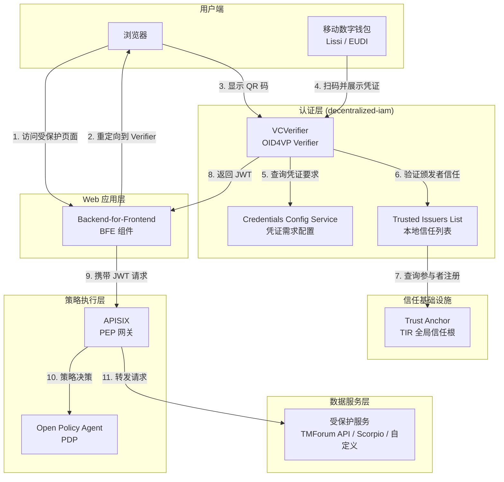
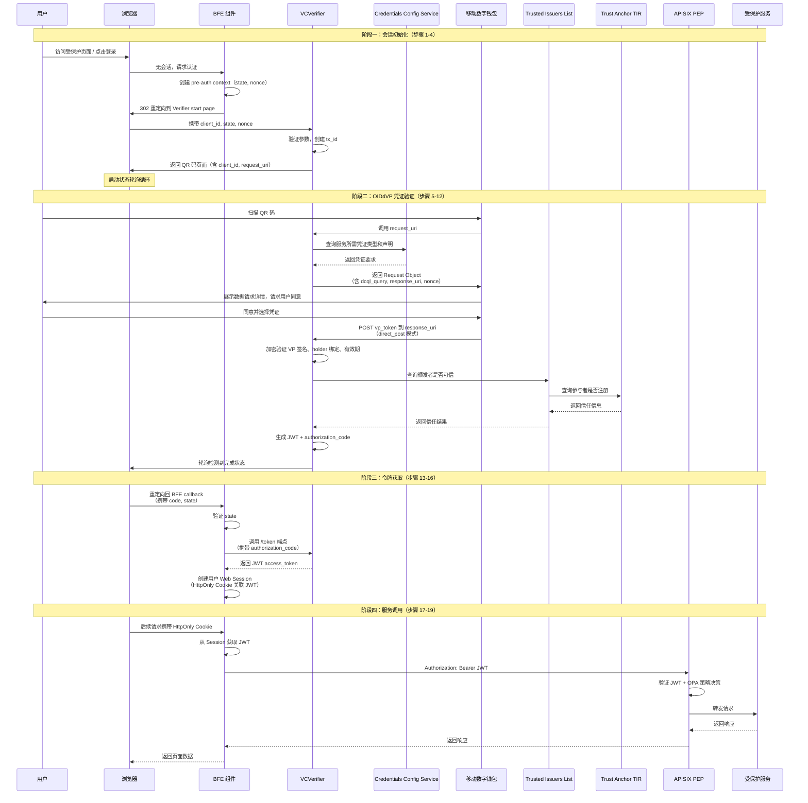
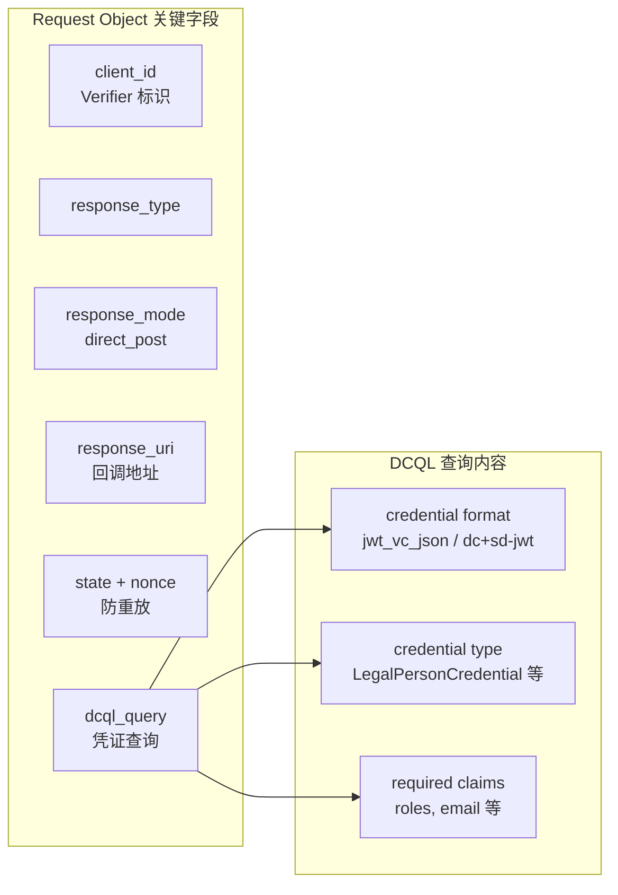
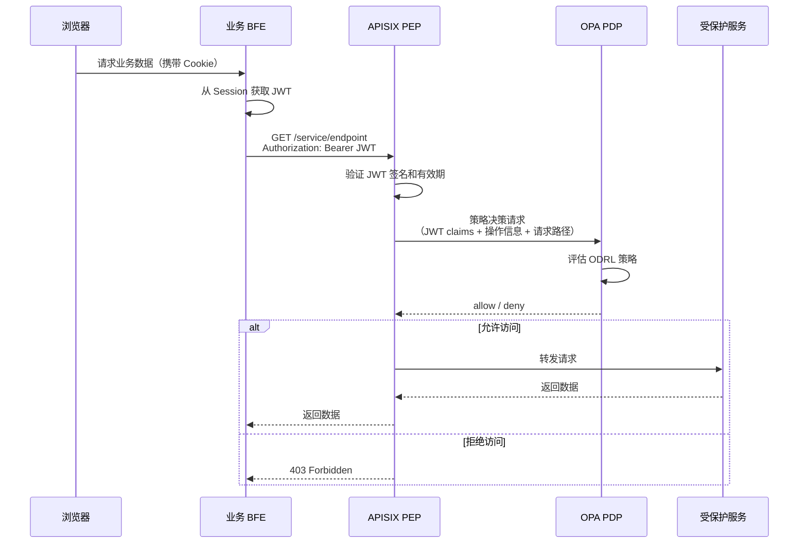

H2M（Human-to-Machine，人对机器）服务调用流程是 FIWARE Data Space Connector 中面向最终用户的核心认证交互模式。当人类用户通过数字钱包持有可验证凭证（Verifiable Credentials），需要访问受保护的 Web 应用或数据服务时，H2M 流程将启动并完成从凭证展示到 JWT 令牌交换的完整认证链路。本文档详细剖析 H2M 流程的架构设计、协议交互步骤、组件职责以及配置方法。

## 流程概述与架构定位

H2M 流程的核心思想是**让用户通过移动数字钱包展示其持有的可验证凭证，经 Provider 侧的 VCVerifier 验证后获得 JWT 访问令牌，从而访问受保护的服务资源**。与 [M2M 服务调用流程](11-m2m-fu-wu-diao-yong-liu-cheng) 的关键区别在于：H2M 涉及用户交互环节（QR 码扫描、凭证选择确认），而 M2M 完全是软件代理之间的自动化认证。

H2M 流程基于以下协议族构建：

| 协议 | 角色 | 说明 |
|------|------|------|
| **OID4VP**（OpenID for Verifiable Presentations） | 凭证验证 | 定义钱包向 Verifier 展示凭证的标准流程 |
| **DCQL**（Digital Credentials Query Language） | 凭证查询 | 描述期望的凭证格式和声明要求 |
| **SIOPv2**（Self-Issued OpenID Provider v2） | 身份绑定 | 可选的 id_token 用于 holder 绑定 |
| **EBSI Token Endpoint** | 令牌交换 | 符合 EBSI 规范的 vp_token 到 JWT 交换 |

H2M 流程在数据空间架构中的定位如下图所示：



**Sources**: [README.md](README.md#L256-L286), [doc/deployment-integration/roles/provider/README.md](doc/deployment-integration/roles/provider/README.md#L37-L43)

## 完整交互序列

H2M 流程共包含 19 个步骤，可分为四个阶段：**会话初始化**、**OID4VP 凭证验证**、**令牌获取**、**服务调用**。



**Sources**: [README.md](README.md#L265-L285)

## 各步骤详解

### 阶段一：会话初始化（步骤 1-4）

**步骤 1：用户发起访问请求。** 用户尝试访问与受保护服务关联的 Web 页面，或在尚未建立已认证会话时点击登录按钮。此时浏览器尚无有效的会话标识。

**步骤 2：BFE 组件检测无会话并发起登录。** Backend-for-Frontend 组件检测到无会话状态，确定要访问的资源范围（scope），创建预认证上下文（包含 state 和 nonce 用于防 CSRF），然后通过 HTTP 302 重定向将浏览器引导至 Verifier 的起始页面，同时传递 `client_id`、`state` 和 `nonce` 参数。

**步骤 3：Verifier 初始化认证事务。** 浏览器导航到 Verifier 的起始页面。Verifier 验证输入参数的有效性，创建事务标识符（`tx_id`），并生成协议关联的状态数据（`state`、`nonce`、过期时间）。

**步骤 4：Verifier 展示 QR 码。** Verifier 返回自身的 HTML 页面，显示一个 QR 码。QR 码编码了最小请求信息，包含 Verifier 的 `client_id` 和 `request_uri`。同时，Verifier 页面启动一个状态轮询循环，用于检测认证何时完成。

**Sources**: [README.md](README.md#L267-L270)

### 阶段二：OID4VP 凭证验证（步骤 5-12）

**步骤 5-6：钱包扫码并请求认证详情。** 用户使用移动数字钱包扫描 QR 码。钱包提取 `request_uri` 并识别目标 Verifier。钱包调用 Verifier 的 `request_uri` 端点。

**步骤 7：Verifier 查询凭证需求配置。** Verifier 查询 Credentials Config Service（CCS），确定当有人尝试针对由 `client_id`（BFE 标识）和 `scope` 标识的服务进行认证时，需要哪些 VC 以及哪些 claims/roles。

**步骤 8：Verifier 返回 Request Object。** Verifier 生成一个 Request Object 并返回给钱包。该对象包含 `client_id`、`response_type`、`response_mode=direct_post`、`response_uri`、`state`、`nonce` 以及 `dcql_query`——后者精确描述了必须请求的 VC 类型和声明/角色。



**Sources**: [README.md](README.md#L273-L274), [k3s/provider.yaml](k3s/provider.yaml#L173-L201)

**步骤 9：用户确认凭证共享。** 钱包向用户展示哪个组织请求哪些数据以及目的。如果用户同意，钱包选择所需的凭证并生成 OID4VP 响应。

**步骤 10：钱包提交 vp_token。** 钱包使用 `direct_post` 模式将 OID4VP 响应发送到 Verifier 的 `response_uri`，响应包含 `vp_token`（签名的可验证展示），以及可选的 SIOPv2 `id_token`。

**步骤 11：Verifier 执行全面验证。** Verifier 对展示进行密码学验证（签名验证、holder 绑定、过期检查、吊销检查），并确认所有请求的 VC 都已包含、指定的 claims/roles 存在，以及这些 VC 是否由数据空间的可信参与者签名。验证过程涉及两层信任检查：

| 验证步骤 | 数据源 | 检查内容 |
|----------|--------|----------|
| VC 签名验证 | DID Document | 凭证签名是否由合法 DID 控制者签署 |
| 颁发者信任（本地） | Trusted Issuers List | 颁发者是否被授权签发此类凭证 |
| 参与者注册（全局） | Trust Anchor TIR | 颁发者组织是否为数据空间注册参与者 |
| 凭证完整性 | CCS 配置 | 所需凭证类型和声明是否全部满足 |

**步骤 12：Verifier 生成令牌。** 验证成功后，Verifier 生成 JWT 并创建与事务关联的授权码（`authorization_code`）。状态端点向 QR 码页面返回"完成"条件。

**Sources**: [README.md](README.md#L277-L278), [doc/flows/service-interaction-m2m/README.md](doc/flows/service-interaction-m2m/README.md#L172-L196)

### 阶段三：令牌获取（步骤 13-16）

**步骤 13：浏览器回调重定向。** QR 码页面检测到认证完成后，将浏览器重定向到 BFE 的回调地址，携带 `authorization_code` 和 `state`。

**步骤 14：BFE 交换令牌。** BFE 验证 `state` 的有效性（防 CSRF），然后调用 Verifier 的 `/token` 端点，传递 `authorization_code`。

**步骤 15：Verifier 返回 JWT。** Verifier 验证事务已完成且授权码有效，返回 JWT 访问令牌。该 JWT 包含用户提交的 VC 信息，供后续策略决策使用。

**步骤 16：BFE 建立用户会话。** BFE 创建用户的 Web 会话（例如通过 HttpOnly Cookie 引用的服务端会话），并将 JWT 访问令牌关联到该会话。**此后浏览器仅与 BFE 端点交互，通过 HttpOnly Cookie 发送请求。浏览器不会直接看到或管理 JWT。**

**Sources**: [README.md](README.md#L279-L283)

### 阶段四：服务调用（步骤 17-19）

**步骤 17：浏览器通过会话访问。** 浏览器的所有后续请求仅针对 BFE 端点，通过 HttpOnly Cookie 进行身份标识。这种设计确保 JWT 不暴露给前端 JavaScript，提升了安全性。

**步骤 18：BFE 获取 JWT。** 当页面需要业务数据时，浏览器调用业务 BFE 组件。BFE 从关联的会话中检索 JWT 访问令牌。

**步骤 19：BFE 携带 JWT 调用后端 API。** 业务 BFE 组件在 `Authorization` 头中携带 JWT 调用后端 API：`Bearer <JWT>`。请求经过 APISIX 网关时，APISIX 作为 PEP 执行 JWT 验证并将 JWT 信息传递给 OPA 进行策略决策。如果 JWT 过期，BFE 从 Verifier 获取新的 JWT，或根据策略要求重新启动验证流程（step-up 认证）。



**Sources**: [README.md](README.md#L284-L285), [README.md](README.md#L332-L347)

## 关键组件配置

### VCVerifier 的 H2M 配置

VCVerifier 是 H2M 流程的核心引擎，通过 Helm values 中的 `decentralizedIam.vcAuthentication.vcverifier` 节点配置。对于 H2M 场景，最关键的是服务注册中的 `authorizationType` 字段：

| authorizationType | 场景 | 认证交互方式 |
|-------------------|------|-------------|
| **`FRONTEND_V2`** | H2M | 通过浏览器前端交互，QR 码扫描完成认证 |
| `DEEPLINK` | M2M | 通过深度链接直接完成机器间认证 |

H2M 服务注册的典型配置如下：

```yaml
# 在 credentials-config-service 的 registration.services 中
- id: bae                                      # 服务标识符
  defaultOidcScope: "openid learcredential"    # 默认 OIDC Scope
  authorizationType: "FRONTEND_V2"             # H2M 模式
  oidcScopes:
    "openid learcredential":
      credentials:
        - type: LegalPersonCredential          # 所需凭证类型
          trustedParticipantsLists:
            - https://tir.127.0.0.1.nip.io     # 可信参与者列表（TIR）
          trustedIssuersLists:
            - http://trusted-issuers-list:8080  # 可信颁发者列表（TIL）
          jwtInclusion:
            enabled: true
            fullInclusion: true                # 完整包含 VC 到 JWT
      dcql:                                    # DCQL 凭证查询
        credentials:
          - id: legal-person-query
            format: "dc+sd-jwt"                # SD-JWT 格式
            multiple: false
            claims:
              - id: name-claim
                path: [firstName]
              - id: roles-claim
                path: [roles]
            meta:
              vct_values:
                - LegalPersonCredential
```

**Sources**: [k3s/provider.yaml](k3s/provider.yaml#L173-L201), [charts/data-space-connector/values.yaml](charts/data-space-connector/values.yaml#L76-L94)

### Marketplace Portal 的 H2M 集成

Marketplace Portal（BAE）是 H2M 流程最典型的使用场景。用户通过 Marketplace 浏览和订购产品，认证通过 SIOP 协议集成 VCVerifier：

```yaml
# Marketplace 的 SIOP 配置
marketplace:
  enabled: true
  siop:
    verifier:
      host: https://verifier.mp-operations.org   # VCVerifier 地址
    allowedRoles:                                  # 允许的角色
      - seller
      - customer
      - admin
      - REPRESENTATIVE
      - READER
      - OPERATOR
  externalUrl: https://marketplace.127.0.0.1.nip.io
  bizEcosystemLogicProxy:
    additionalEnvVars:
      - name: BAE_LP_SIOP_IS_REDIRECTION
        value: "true"                              # 启用 SIOP 重定向
      - name: BAE_LP_SIOP_CLIENT_ID
        value: did:web:mp-operations.org           # Verifier 的 client_id
```

**Sources**: [k3s/provider.yaml](k3s/provider.yaml#L828-L931)

### APISIX 路由的 OIDC 保护

所有受保护的服务通过 APISIX 路由配置 `openid-connect` 插件，该插件与 VCVerifier 的 `.well-known/openid-configuration` 端点集成：

```yaml
# APISIX 路由示例：Marketplace 的 TMForum API
- uri: /*
  host: mp-tmf-api.127.0.0.1.nip.io
  upstream:
    nodes:
      tm-forum-api-svc:8080: 1
  plugins:
    openid-connect:
      bearer_only: true
      use_jwks: true
      client_id: contract-management
      client_secret: unused
      ssl_verify: false
      discovery: https://verifier.mp-operations.org/services/tmf-api/.well-known/openid-configuration
    opa:
      host: http://localhost:8181
      policy: policy/main
      with_body: true
```

每个受保护服务域名的 `/.well-known/openid-configuration` 端点被代理到 VCVerifier，使客户端能够自动发现认证端点：

```yaml
# Well-known 端点代理
- uri: /.well-known/openid-configuration
  host: mp-tmf-api.127.0.0.1.nip.io
  upstream:
    nodes:
      verifier:3000: 1
  plugins:
    proxy-rewrite:
      uri: /services/tmf-api/.well-known/openid-configuration
```

**Sources**: [k3s/provider.yaml](k3s/provider.yaml#L474-L541)

## H2M 与 M2M 流程对比

| 维度 | H2M（人对机器） | M2M（机器对机器） |
|------|----------------|------------------|
| **用户参与** | 有，需扫码和确认 | 无，完全自动化 |
| **认证类型** | `FRONTEND_V2` | `DEEPLINK` |
| **交互界面** | 浏览器 + QR 码 + 钱包 UI | 直接 API 调用 |
| **凭证来源** | 用户移动钱包 | 应用本地存储的凭证 |
| **JWT 管理** | BFE 通过 Session 管理 | 客户端应用直接管理 |
| **会话模型** | 服务端 Session + HttpOnly Cookie | 无状态，直接携带 JWT |
| **适用场景** | Web 门户、Marketplace 浏览 | 系统间 API 互调、设备通信 |
| **核心协议** | OID4VP + SIOPv2 + DCQL | OID4VP + vp_token |
| **步骤数量** | 19 步 | 8 步 |
| **令牌获取** | 授权码模式（authorization_code） | 直接 vp_token 交换 |

**Sources**: [README.md](README.md#L256-L303), [doc/flows/service-interaction-m2m/README.md](doc/flows/service-interaction-m2m/README.md#L1-L201)

## 凭证格式支持

VCVerifier 在 H2M 流程中支持两种凭证格式，它们通过 DCQL 查询中的 `format` 字段区分：

| 格式 | DCQL 标识符 | 特性 | H2M 场景适用性 |
|------|-------------|------|---------------|
| **JWT-VC** | `jwt_vc_json` | 完整声明暴露，传统兼容 | 通用场景，角色信息展示 |
| **SD-JWT-VC** | `dc+sd-jwt` | 选择性披露，支持声明隐藏 | 隐私敏感场景，最小化数据暴露 |

在 DCQL 查询中，通过 `meta.vct_values` 或 `meta.type_values` 指定接受的凭证类型。例如，Marketplace 的 H2M 认证使用 SD-JWT 格式的 `LegalPersonCredential`：

```yaml
dcql:
  credentials:
    - id: legal-person-query
      format: "dc+sd-jwt"
      multiple: false
      claims:
        - id: name-claim
          path: [firstName]          # 选择性披露：仅展示 firstName
        - id: roles-claim
          path: [roles]
      meta:
        vct_values:
          - LegalPersonCredential
```

**Sources**: [k3s/provider.yaml](k3s/provider.yaml#L187-L201), [.zread/wiki/drafts/9-oid4vc-ren-zheng-kuang-jia-vcverifier-trusted-issuers-list.md](.zread/wiki/drafts/9-oid4vc-ren-zheng-kuang-jia-vcverifier-trusted-issuers-list.md#L88-L115)

## 令牌生命周期管理

H2M 流程中的令牌生命周期由 BFE 组件管理，涉及以下关键行为：

| 阶段 | 处理方 | 行为 |
|------|--------|------|
| **首次获取** | BFE → Verifier | 通过 authorization_code 换取 JWT |
| **会话绑定** | BFE | JWT 关联到 HttpOnly Cookie 会话 |
| **服务调用** | BFE → APISIX | 每次请求从 Session 提取 JWT 放入 Authorization 头 |
| **令牌续期** | BFE | JWT 过期时从 Verifier 获取新令牌 |
| **Step-up 认证** | BFE | 策略要求时重新启动完整 OID4VP 流程 |
| **会话终止** | BFE | 用户登出或会话超时时清除 Session |

**Sources**: [README.md](README.md#L284-L285)

## 部署前提与组件依赖

H2M 流程要求 Provider 侧部署以下组件：

| 组件 | 必要性 | 职责 |
|------|--------|------|
| **VCVerifier** | 必需 | OID4VP 验证引擎，处理 vp_token 验证和 JWT 签发 |
| **Credentials Config Service** | 必需 | 维护每个服务的凭证需求配置 |
| **Trusted Issuers List** | 必需 | 本地信任列表，配合 TIR 进行颁发者信任决策 |
| **Trust Anchor TIR** | 必需 | 全局信任根，由 Operator 管理 |
| **APISIX + OPA + ODRL-PAP** | 必需 | 策略执行和决策 |
| **Keycloak** | Consumer 侧必需 | 签发用户持有的可验证凭证 |
| **数字钱包** | 用户侧必需 | 存储和展示 VC（如 Lissi Wallet） |
| **Marketplace（BAE）** | 可选 | Web 门户，H2M 的典型使用场景 |

**Sources**: [doc/deployment-integration/roles/README.md](doc/deployment-integration/roles/README.md#L36-L84), [doc/deployment-integration/roles/provider/README.md](doc/deployment-integration/roles/provider/README.md#L37-L51)

## 下一步阅读

- **[OID4VC 认证框架](9-oid4vc-ren-zheng-kuang-jia-vcverifier-trusted-issuers-list)**：深入了解 VCVerifier 和 Trusted Issuers List 的架构设计
- **[M2M 服务调用流程](11-m2m-fu-wu-diao-yong-liu-cheng)**：对比理解机器对机器的认证流程
- **[ODRL 授权框架](12-odrl-shou-quan-kuang-jia-apisix-opa-odrl-pap)**：了解 JWT 获取后的策略执行机制
- **[Keycloak 与 OID4VCI 凭证签发配置](17-keycloak-yu-oid4vci-ping-zheng-qian-fa-pei-zhi)**：配置 Consumer 侧的凭证签发
- **[数字钱包兼容性与集成](18-shu-zi-qian-bao-jian-rong-xing-yu-ji-cheng)**：支持的钱包列表和集成说明