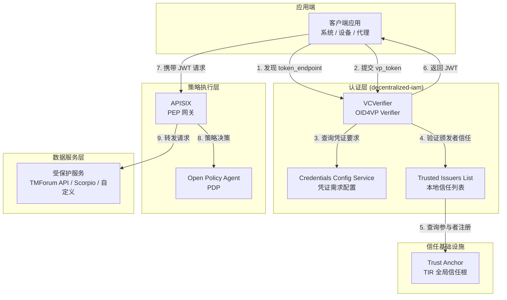
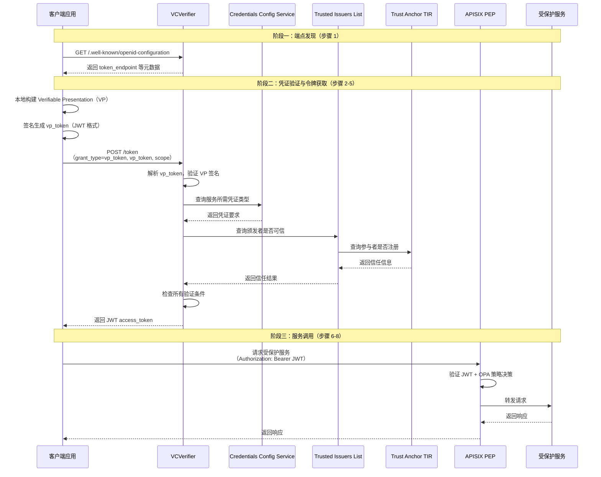
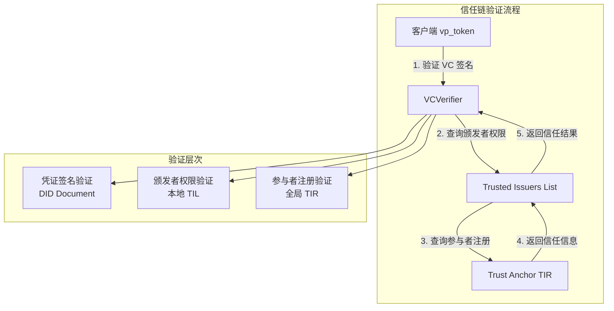

M2M（Machine-to-Machine，机器对机器）服务调用流程是 FIWARE Data Space Connector 中面向自动化系统的核心认证模式。当软件代理、微服务或设备需要访问受保护的 API 服务时，M2M 流程通过**直接交换可验证凭证（VC）获取 JWT 访问令牌**，实现完全自动化的端到端认证，无需任何用户交互环节。

## 流程概述与架构定位

M2M 流程的核心思想是**客户端应用使用预先持有的可验证凭证（VC），构建 Verifiable Presentation（VP）直接提交给 Provider 侧的 VCVerifier，验证通过后获得 JWT 访问令牌**。与 [H2M 服务调用流程](10-h2m-fu-wu-diao-yong-liu-cheng) 的关键区别在于：M2M 是纯粹的软件代理间自动化认证，不涉及 QR 码扫描或用户确认等交互环节。

M2M 流程基于以下协议构建：

| 协议 | 角色 | 说明 |
|------|------|------|
| **OID4VP**（OpenID for Verifiable Presentations） | 凭证验证 | 定义凭证持有者向验证者展示凭证的标准流程 |
| **EBSI Token Endpoint** | 令牌交换 | 符合 EBSI 规范的 vp_token 到 JWT 令牌交换 |
| **EBSI Well-Known Metadata** | 端点发现 | 标准化的 OpenID Provider 配置发现端点 |

M2M 流程在数据空间架构中的定位如下图所示：



**Sources**: [README.md](README.md#L295-L303), [doc/flows/service-interaction-m2m/README.md](doc/flows/service-interaction-m2m/README.md#L1-L20)

## 完整交互序列

M2M 流程共包含 8 个步骤，可分为三个阶段：**端点发现**、**凭证验证与令牌获取**、**服务调用**。



**Sources**: [README.md](README.md#L295-L303), [doc/flows/service-interaction-m2m/README.md](doc/flows/service-interaction-m2m/README.md#L13-L50)

## 客户端实现详解

### 步骤 1：端点发现

客户端应用首先需要获取服务提供商的认证端点地址。通过调用服务提供商的 **Well-Known OpenID Provider Metadata** 端点，客户端可以自动发现 `token_endpoint`：

```shell
curl -X GET https://<SERVICE_HOST>/.well-known/openid-configuration
```

响应的 JSON 对象至少包含以下内容：

```json
{
  "grant_types_supported": ["vp_token"],
  "token_endpoint": "https://<SERVICE_TOKEN_HOST>/path/to/token",
  "scopes_supported": ["openid"]
}
```

在 FIWARE DSC 的实际部署中，每个受保护服务域名的 `/.well-known/openid-configuration` 端点通过 APISIX 路由代理到 VCVerifier，使客户端能够使用服务域名进行端点发现：

```yaml
# APISIX 路由：Well-Known 端点代理
- uri: /.well-known/openid-configuration
  host: mp-tmf-api.127.0.0.1.nip.io
  upstream:
    nodes:
      verifier:3000: 1
  plugins:
    proxy-rewrite:
      uri: /services/tmf-api/.well-known/openid-configuration
```

**Sources**: [doc/flows/service-interaction-m2m/README.md](doc/flows/service-interaction-m2m/README.md#L17-L36), [k3s/provider.yaml](k3s/provider.yaml#L474-L500)

### 步骤 2-3：构建 Verifiable Presentation

客户端需要将持有的可验证凭证（VC）包装在 Verifiable Presentation（VP）中。VP 是一个 JWT 格式的容器，包含客户端的 VC 和持有者身份信息。

**VP 结构示例**：

```json
{
  "@context": ["https://www.w3.org/2018/credentials/v1"],
  "type": ["VerifiablePresentation"],
  "holder": "did:web:client-participant.example.com",
  "verifiableCredential": ["eyJ0eX....aEhOOXcifQ.eyJpj....J9fX0.9Drky3pj....lzTK3_-Q"]
}
```

**vp_token JWT 结构**：

Header：
```json
{
  "typ": "JWT",
  "alg": "ES256",
  "kid": "did:web:client-participant.example.com#key-1"
}
```

Payload：
```json
{
  "iss": "did:web:client-participant.example.com",
  "sub": "did:web:client-participant.example.com",
  "aud": "https://verifier.provider.example.com/token",
  "iat": 1589699260,
  "exp": 1589699860,
  "nonce": "FgkeErf91kfl",
  "vp": {
    "@context": ["https://www.w3.org/2018/credentials/v1"],
    "type": ["VerifiablePresentation"],
    "holder": "did:web:client-participant.example.com",
    "verifiableCredential": ["eyJ0eX....aEhOOXcifQ"]
  }
}
```

**编码要求**：vp_token 必须使用 Base64URL 编码且不带填充（padding），符合 RFC 7515 附录 C 的规范。

**Sources**: [doc/flows/service-interaction-m2m/README.md](doc/flows/service-interaction-m2m/README.md#L43-L80), [doc/scripts/get_access_token_oid4vp.sh](doc/scripts/get_access_token_oid4vp.sh#L1-L50)

### 步骤 4-5：提交 vp_token 获取令牌

客户端将构建的 vp_token 提交到 VCVerifier 的 `/token` 端点，请求格式遵循 EBSI Token Endpoint 规范：

```shell
curl -X POST 'https://<SERVICE_TOKEN_HOST>/token' \
  -H 'Content-Type: application/x-www-form-urlencoded' \
  -H 'Accept: application/json' \
  -d "vp_token=<SIGNED_VP_TOKEN>&grant_type=vp_token&scope=<SCOPE>"
```

**请求参数说明**：

| 参数 | 必需 | 说明 |
|------|------|------|
| `vp_token` | 是 | 签名的 Verifiable Presentation（JWT 格式） |
| `grant_type` | 是 | 必须为 `vp_token` |
| `scope` | 视服务而定 | 请求的访问范围，如 `openid`、`operator` 等 |
| `presentation_submission` | 否 | 可留空，用于描述凭证到查询的映射关系 |

**成功响应**：

```json
{
  "access_token": "<JWT_ACCESS_TOKEN>",
  "token_type": "Bearer",
  "expires_in": 7200,
  "scope": "openid"
}
```

**Sources**: [doc/flows/service-interaction-m2m/README.md](doc/flows/service-interaction-m2m/README.md#L82-L103), [doc/scripts/get_access_token_oid4vp.sh](doc/scripts/get_access_token_oid4vp.sh#L35-L50)

### 步骤 6-8：调用受保护服务

获得 JWT 访问令牌后，客户端可以在后续请求中携带该令牌访问受保护的服务资源：

```shell
curl -X GET https://<SERVICE_HOST>/<SERVICE_ENDPOINT> \
  -H 'Authorization: Bearer <JWT_ACCESS_TOKEN>'
```

**重要提示**：认证过程（步骤 1-5）只需执行一次。一旦获得访问令牌，服务可被多次调用。仅当访问令牌过期时才需要重复认证过程。

**Sources**: [doc/flows/service-interaction-m2m/README.md](doc/flows/service-interaction-m2m/README.md#L105-L115), [README.md](README.md#L305-L310)

## 服务端实现详解

服务提供商需要实现以下两个端点以支持 M2M 流程：

### 端点一：Well-Known OpenID Provider Metadata

服务提供商需要实现符合 EBSI 规范的 [OpenID Provider Metadata 端点](https://hub.ebsi.eu/apis/pilot/authorisation/v3/get-well-known-openid-config)，使客户端能够自动发现 `token_endpoint` 地址。

**端点地址**：`https://<SERVICE_HOST>/.well-known/openid-configuration`

**响应格式**：

```json
{
  "issuer": "https://<SERVICE_HOST>",
  "token_endpoint": "https://<SERVICE_TOKEN_HOST>/token",
  "grant_types_supported": ["vp_token"],
  "scopes_supported": ["openid", "operator"],
  "response_types_supported": ["token"],
  "token_endpoint_auth_methods_supported": ["vp_token"]
}
```

**VCVerifier 实现**：当使用 VCVerifier 组件时，该端点已内置实现。VCVerifier 提供服务特定的 OpenID 配置，端点地址格式为：

```
https://<VERIFIER_HOST>/services/<SERVICE_IDENTIFIER>/.well-known/openid-configuration
```

其中 `<SERVICE_IDENTIFIER>` 是在 Credentials Config Service 中注册的服务标识符。

**Sources**: [doc/flows/service-interaction-m2m/README.md](doc/flows/service-interaction-m2m/README.md#L120-L140)

### 端点二：EBSI Token Endpoint

服务提供商需要实现符合 EBSI 规范的 [Token 端点](https://hub.ebsi.eu/apis/pilot/authorisation/v3/post-token)，用于验证客户端提交的 vp_token 并签发 JWT 访问令牌。

**端点地址**：由 `token_endpoint` 字段指定（通常为 `/token`）

**处理流程**：

1. **凭证类型检查**：验证 vp_token 中包含的 VC 是否符合请求的 scope 所要求的凭证类型
2. **签名验证**：验证每个必需 VC 的签名（取决于 DID 方法）
3. **颁发者信任检查（全局）**：通过查询数据空间的 Verifiable Data Registry（TIR），确认 VC 颁发者是数据空间的可信参与者
4. **颁发者信任检查（本地）**：通过查询服务提供商的 Trusted Issuers List（TIL），确认颁发者被授权签发此类凭证
5. **签发令牌**：所有验证通过后，签发包含必要信息的 JWT 访问令牌

**VCVerifier 实现**：VCVerifier 组件已内置实现上述所有验证步骤。验证成功后，VCVerifier 签发 JWT 令牌，其中包含客户端在 vp_token 中提供的 VC 信息。这使得 PDP（OPA）在执行授权策略时能够提取所有必要信息。

**关键特性**：VCVerifier 的 `/token` 端点同时支持 H2M 和 M2M 两种流程，通过 `grant_type` 参数区分：
- `grant_type=vp_token`：M2M 流程
- `grant_type=authorization_code`：H2M 流程

**Sources**: [doc/flows/service-interaction-m2m/README.md](doc/flows/service-interaction-m2m/README.md#L142-L196)

## 配置示例

### Provider 侧 VCVerifier 配置

以下是在 Kubernetes 部署中配置 VCVerifier 支持 M2M 流程的示例：

```yaml
# k3s/provider.yaml 中的 VCVerifier 配置
decentralizedIam:
  vcAuthentication:
    vcverifier:
      deployment:
        verifier:
          tirAddress: https://tir.127.0.0.1.nip.io/
          did: did:web:mp-operations.org
          supportedModes: ["byValue", "byReference"]
          clientIdentification:
            keyPath: /signing-key/tls.key
            certificatePath: /signing-key/tls.crt
            requestKeyAlgorithm: ES256
            id: x509_san_dns:verifier.mp-operations.org
        server:
          host: https://verifier.mp-operations.org
```

**Sources**: [k3s/provider.yaml](k3s/provider.yaml#L60-L85)

### M2M 服务注册配置

在 VCVerifier 的 `registration` 配置中，通过设置 `authorizationType: "DEEPLINK"` 来标识 M2M 服务：

```yaml
registration:
  enabled: true
  services:
    - id: tpp-service
      defaultOidcScope: "operator"
      authorizationType: "DEEPLINK"  # M2M 流程标识
      oidcScopes:
        "operator":
          credentials:
            - type: OperatorCredential
              trustedParticipantsLists:
                - https://tir.127.0.0.1.nip.io
              trustedIssuersLists:
                - http://trusted-issuers-list:8080
              jwtInclusion:
                enabled: true
                fullInclusion: true
    - id: data-service
      defaultOidcScope: "default"
      authorizationType: "DEEPLINK"  # M2M 流程标识
      oidcScopes:
        "default":
          credentials:
            - type: UserCredential
              trustedParticipantsLists:
                - https://tir.127.0.0.1.nip.io
              trustedIssuersLists:
                - http://trusted-issuers-list:8080
              jwtInclusion:
                enabled: true
                fullInclusion: true
```

**Sources**: [k3s/provider.yaml](k3s/provider.yaml#L150-L210)

### Consumer 侧 M2M 配置

Consumer 侧的 VCVerifier 配置与 Provider 类似，用于在 DSP 集成等场景中进行 M2M 认证：

```yaml
# k3s/consumer-auth.yaml 中的 M2M 服务配置
registration:
  enabled: true
  services:
    - id: tm-forum
      defaultOidcScope: "default"
      authorizationType: "DEEPLINK"  # M2M 流程
      oidcScopes:
        "default":
          credentials:
            - type: LegalPersonCredential
              trustedParticipantsLists:
                - https://tir.127.0.0.1.nip.io
              trustedIssuersLists: "*"
              jwtInclusion:
                enabled: true
                fullInclusion: true
    - id: dsp
      defaultOidcScope: "openid"
      authorizationType: "DEEPLINK"  # M2M 流程
      oidcScopes:
        "openid":
          credentials:
            - type: MembershipCredential
              trustedParticipantsLists:
                - https://tir.127.0.0.1.nip.io
              trustedIssuersLists: "*"
              jwtInclusion:
                enabled: true
                fullInclusion: true
```

**Sources**: [k3s/consumer-auth.yaml](k3s/consumer-auth.yaml#L150-L200)

## H2M 与 M2M 流程对比

| 维度 | H2M（人对机器） | M2M（机器对机器） |
|------|----------------|------------------|
| **用户参与** | 有，需扫码和确认 | 无，完全自动化 |
| **认证类型** | `FRONTEND_V2` | `DEEPLINK` |
| **交互界面** | 浏览器 + QR 码 + 钱包 UI | 直接 API 调用 |
| **凭证来源** | 用户移动钱包 | 应用本地存储的凭证 |
| **JWT 管理** | BFE 通过 Session 管理 | 客户端应用直接管理 |
| **会话模型** | 服务端 Session + HttpOnly Cookie | 无状态，直接携带 JWT |
| **适用场景** | Web 门户、Marketplace 浏览 | 系统间 API 互调、设备通信 |
| **核心协议** | OID4VP + SIOPv2 + DCQL | OID4VP + vp_token |
| **步骤数量** | 19 步 | 8 步 |
| **令牌获取** | 授权码模式（authorization_code） | 直接 vp_token 交换 |
| **客户端复杂度** | 低（BFE 处理） | 中（需本地凭证管理） |
| **安全模型** | 用户确认 + 浏览器隔离 | 凭证持有证明 + TLS 客户端认证 |

**Sources**: [README.md](README.md#L256-L310), [doc/flows/service-interaction-m2m/README.md](doc/flows/service-interaction-m2m/README.md#L1-L201)

## 凭证格式与验证策略

M2M 流程支持两种凭证格式，VCVerifier 根据服务配置进行验证：

| 格式 | DCQL 标识符 | 特性 | M2M 场景适用性 |
|------|-------------|------|---------------|
| **JWT-VC** | `jwt_vc_json` | 完整声明暴露，传统兼容 | 通用场景，角色信息验证 |
| **SD-JWT-VC** | `dc+sd-jwt` | 选择性披露，支持声明隐藏 | 隐私敏感场景，最小化数据暴露 |

**验证策略配置示例**：

```yaml
oidcScopes:
  "operator":
    credentials:
      - type: OperatorCredential
        trustedParticipantsLists:
          - https://tir.127.0.0.1.nip.io
        trustedIssuersLists:
          - http://trusted-issuers-list:8080
        jwtInclusion:
          enabled: true      # 将 VC 内容包含在 JWT 中
          fullInclusion: true # 包含完整 VC 信息
```

**Sources**: [k3s/provider.yaml](k3s/provider.yaml#L155-L175), [.zread/wiki/drafts/9-oid4vc-ren-zheng-kuang-jia-vcverifier-trusted-issuers-list.md](.zread/wiki/drafts/9-oid4vc-ren-zheng-kuang-jia-vcverifier-trusted-issuers-list.md#L88-L115)

## 客户端脚本示例

以下是一个完整的 M2M 认证脚本示例，展示如何使用 vp_token 获取访问令牌：

```bash
#!/bin/bash
# 获取服务端点
token_endpoint=$(curl -s -k -X GET "$1/.well-known/openid-configuration" | jq -r '.token_endpoint')

# 读取客户端 DID
holder_did=$(cat cert/did.json | jq '.id' -r)

# 构建 Verifiable Presentation
verifiable_presentation="{
  \"@context\": [\"https://www.w3.org/2018/credentials/v1\"],
  \"type\": [\"VerifiablePresentation\"],
  \"verifiableCredential\": [\"$2\"],
  \"holder\": \"${holder_did}\"
}"

# 构建 JWT Header 和 Payload
header="{\"alg\":\"ES256\", \"typ\":\"JWT\", \"kid\":\"${holder_did}\"}"
payload="{\"iss\": \"${holder_did}\", \"sub\": \"${holder_did}\", \"vp\": ${verifiable_presentation}}"

# Base64URL 编码（无填充）
base64url_encode() {
  openssl base64 -A | tr '+/' '-_' | tr -d '='
}

# 编码 Header 和 Payload
header_b64=$(printf "%s" "$header" | base64url_encode)
payload_b64=$(printf "%s" "$payload" | base64url_encode)

# 签名
signing_input="${header_b64}.${payload_b64}"
signature_b64=$(printf "%s" "$signing_input" \
  | openssl dgst -sha256 -binary -sign cert/private-key.pem \
  | convert_ec \
  | base64url_encode)

# 组装 vp_token
jwt="${signing_input}.${signature_b64}"

# 提交 vp_token 获取访问令牌
access_token=$(curl -s -k -X POST $token_endpoint \
  --header 'Content-Type: application/x-www-form-urlencoded' \
  --data grant_type=vp_token \
  --data vp_token=${jwt} \
  --data scope=$3 | jq '.access_token' -r)

echo $access_token
```

**Sources**: [doc/scripts/get_access_token_oid4vp.sh](doc/scripts/get_access_token_oid4vp.sh#L1-L50)

## 信任链验证详解

M2M 流程中的信任链验证是确保数据空间安全性的关键环节，包含以下层次：



**验证步骤详解**：

1. **凭证签名验证**：通过 DID Document 验证 VC 的签名是否由合法的 DID 控制者签署
2. **颁发者权限验证（本地）**：查询本地 Trusted Issuers List，确认颁发者被授权签发此类凭证
3. **参与者注册验证（全局）**：查询全局 Trust Anchor 的 TIR，确认颁发者组织是数据空间的注册参与者

**Sources**: [doc/flows/service-interaction-m2m/README.md](doc/flows/service-interaction-m2m/README.md#L170-L196), [.zread/wiki/drafts/9-oid4vc-ren-zheng-kuang-jia-vcverifier-trusted-issuers-list.md](.zread/wiki/drafts/9-oid4vc-ren-zheng-kuang-jia-vcverifier-trusted-issuers-list.md#L200-L250)

## 错误处理与故障排除

M2M 流程中常见的错误场景及处理建议：

| 错误场景 | 可能原因 | 解决方案 |
|----------|----------|----------|
| `401 Unauthorized` | 未提供有效的访问令牌 | 确保请求包含 `Authorization: Bearer <token>` 头 |
| `400 Bad Request` | vp_token 格式错误或参数缺失 | 检查 vp_token 的 Base64URL 编码（无填充）和必需参数 |
| `403 Forbidden` | 凭证验证失败 | 检查 VC 是否过期、签名是否有效、颁发者是否可信 |
| `token_endpoint` 未发现 | Well-Known 端点未正确配置 | 检查 APISIX 路由配置和 VCVerifier 服务注册 |
| JWT 过期 | 访问令牌已过期 | 重新执行 M2M 认证流程获取新的访问令牌 |

**Sources**: [doc/flows/service-interaction-m2m/README.md](doc/flows/service-interaction-m2m/README.md#L172-L196)

## 最佳实践

### 凭证管理

1. **安全存储**：客户端应安全存储持有的 VC，避免明文存储在代码或配置文件中
2. **轮换机制**：实现凭证轮换机制，在 VC 过期前自动更新
3. **最小权限**：仅请求必要的凭证类型和声明，遵循最小权限原则

### 性能优化

1. **令牌缓存**：缓存 JWT 访问令牌直到过期，避免重复认证
2. **连接复用**：复用 HTTP 连接池，减少 TLS 握手开销
3. **批量操作**：在可能的情况下批量调用服务，减少认证次数

### 安全考虑

1. **TLS 客户端认证**：在生产环境中启用 TLS 客户端证书认证
2. **速率限制**：实施请求速率限制，防止令牌端点被滥用
3. **审计日志**：记录所有认证事件，用于安全审计和故障排查

**Sources**: [README.md](README.md#L305-L310), [doc/flows/service-interaction-m2m/README.md](doc/flows/service-interaction-m2m/README.md#L195-L201)