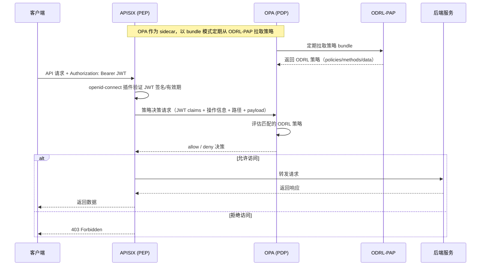
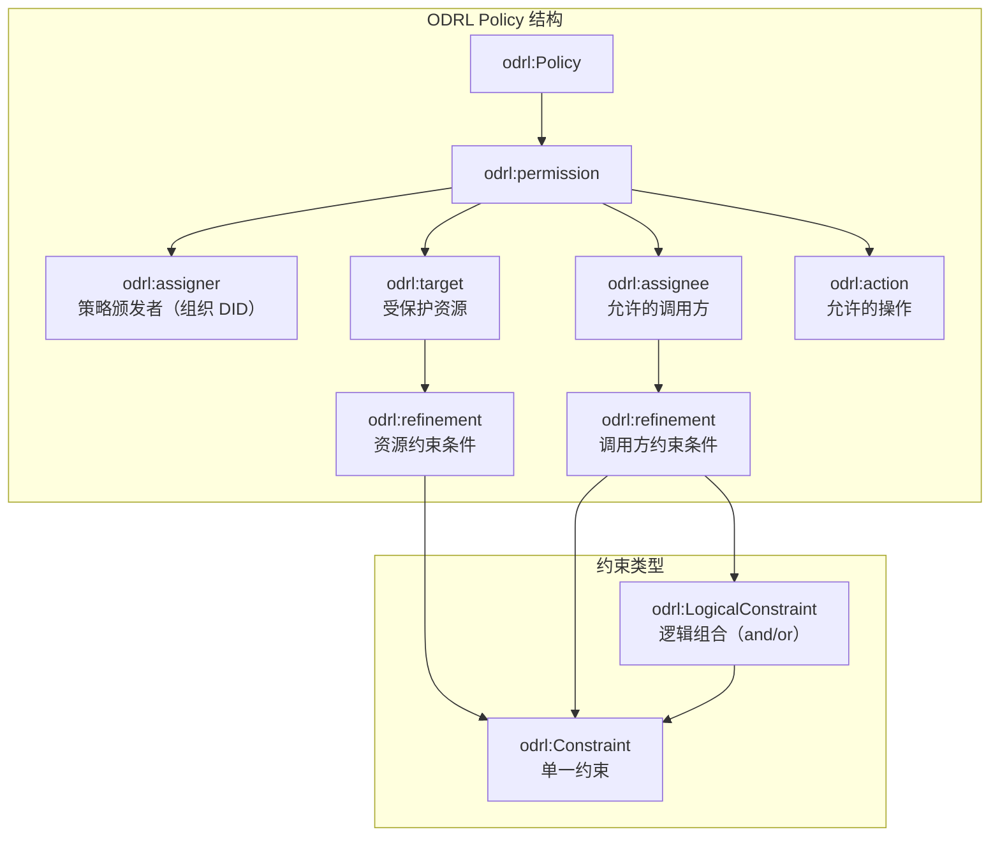

ODRL 授权框架是 FIWARE Data Space Connector 中负责**策略执行与访问控制**的核心子系统。它在 [OID4VC 认证框架](9-oid4vc-ren-zheng-kuang-jia-vcverifier-trusted-issuers-list) 完成身份验证并签发 JWT 令牌之后接管流量，通过**三个协同组件**——Apache APISIX（策略执行点 PEP）、Open Policy Agent OPA（策略决策点 PDP）和 ODRL-PAP（策略管理点 PAP/PRP）——实现基于 W3C ODRL 标准的 ABAC（基于属性的访问控制）。无论 H2M 还是 M2M 场景，所有对受保护服务的请求都必须通过该框架的策略评估后才能到达后端。

## 架构总览：ABAC 模型与组件职责

FIWARE DSC 的授权框架采用标准的 **XACML/ABAC 四点架构**，但使用 W3C ODRL 语言替代传统的 XACML 策略表达，并将 OPA 作为策略决策引擎。下表说明各组件在该架构中的角色映射：

| XACML 角色 | FIWARE DSC 组件 | 职责描述 |
|---|---|---|
| **PEP**（策略执行点） | Apache APISIX | 接收所有入站 HTTP 请求，提取并验证 JWT，调用 OPA 获取决策，根据结果放行或拒绝请求 |
| **PDP**（策略决策点） | Open Policy Agent (OPA) | 作为 APISIX 的 **sidecar** 运行，解析 JWT 中的 VC 声明、请求操作、路径和 payload，基于 ODRL 策略做出 allow/deny 决策 |
| **PAP/PRP**（策略管理/检索点） | ODRL-PAP | 提供 REST API 管理 ODRL 策略，将策略持久化到 PostgreSQL，并以 OPA bundle 格式暴露给 OPA 定期拉取 |
| **PIP**（策略信息点） | APISIX 插件集成 | APISIX 的 `openid-connect` 插件负责 JWT 验证和声明提取，充当 PIP 角色向 PDP 提供请求上下文信息 |

**Sources**: [README.md](README.md#L309-L348), [charts/data-space-connector/values.yaml](charts/data-space-connector/values.yaml#L134-L197)

### 请求处理时序

下图展示了当一个携带 JWT 的 API 请求到达 APISIX 网关时，三个组件的协作过程：



**Sources**: [README.md](README.md#L332-L347), [doc/img/authorization_framework.png](doc/img/authorization_framework.png)

## 组件详解

### Apache APISIX：策略执行点（PEP）

Apache APISIX 是一个高性能的云原生 API 网关，在 FIWARE DSC 中充当**策略执行点**。它通过两个核心插件协同工作：

1. **`openid-connect` 插件**：验证请求中的 JWT 令牌，通过 VCVerifier 的 well-known 端点获取 JWKS 进行签名验证，提取 JWT 中的 VC 声明信息
2. **`opa` 插件**：将提取的 JWT 声明、HTTP 方法、请求路径和请求体传递给 OPA sidecar 进行策略决策

APISIX 路由配置通过 Helm values 的 `decentralizedIam.odrlAuthorization.apisix.routes` 节点定义。每个受保护的服务端点需要同时配置 `openid-connect` 和 `opa` 插件：

```yaml
# 典型的 APISIX 路由配置（Provider 侧）
routes:
  - uri: /*
    host: mp-tmf-api.127.0.0.1.nip.io
    upstream:
      nodes:
        tm-forum-api-svc:8080: 1
    plugins:
      openid-connect:
        bearer_only: true
        use_jwks: true
        client_id: contract-management
        ssl_verify: false
        discovery: https://verifier.mp-operations.org/services/tmf-api/.well-known/openid-configuration
      opa:
        host: http://localhost:8181
        policy: policy/main
        with_body: true
```

APISIX 的管理 API 默认监听 9180 端口，通过 `X-API-KEY` 头认证。Prometheus 指标默认暴露在 9091 端口的 `/apisix/prometheus/metrics` 路径。

**Sources**: [k3s/provider.yaml](k3s/provider.yaml#L395-L480), [charts/data-space-connector/values.yaml](charts/data-space-connector/values.yaml#L134-L153)

### Open Policy Agent：策略决策点（PDP）

OPA 作为 APISIX 的 **sidecar 容器**部署在同一个 Pod 中，监听 `localhost:8181`。它通过 **bundle 模式** 从 ODRL-PAP 拉取三种类型的策略数据：

| Bundle 类型 | 用途 | 默认拉取间隔 |
|---|---|---|
| **policies** | ODRL 策略规则 | 2-4 秒 |
| **methods** | 允许的操作方法定义 | 1-3 秒 |
| **data** | 上下文数据（如环境参数） | 1-15 秒 |

OPA 的配置通过 `decentralizedIam.odrlAuthorization.opa` 节点管理：

```yaml
opa:
  enabled: true
  resourceUrl: http://odrl-pap:8080/bundles/service/v1
  port: 8181
  policies:
    minDelay: 2
    maxDelay: 4
  methods:
    minDelay: 1
    maxDelay: 3
  data:
    minDelay: 1
    maxDelay: 15
```

OPA 接收 APISIX 传递的信息后，执行以下决策逻辑：
- 从 JWT 中提取 VC 声明（角色、凭证类型等）
- 匹配请求的 HTTP 方法与 ODRL 策略中的 `odrl:action`
- 匹配请求路径/资源类型与策略中的 `odrl:target`
- 评估 `odrl:assignee` 中的约束条件（VC 角色、凭证类型）
- 对于 Gaia-X ODRL Profile，通过 `ovc:constraint` 评估 VC 中的特定声明值

**Sources**: [charts/data-space-connector/values.yaml](charts/data-space-connector/values.yaml#L167-L190), [k3s/provider.yaml](k3s/provider.yaml#L445-L470)

### ODRL-PAP：策略管理点（PAP/PRP）

ODRL-PAP 是一个 Java 微服务，提供 REST API 用于管理基于 W3C ODRL 标准的授权策略。它将策略持久化到 PostgreSQL 数据库，并以 OPA 兼容的 bundle 格式暴露给 OPA 拉取。

ODRL-PAP 的核心端点包括：

| 端点 | 方法 | 用途 |
|---|---|---|
| `/policy` | POST | 创建新的 ODRL 策略 |
| `/policy` | GET | 列出所有已注册的策略 |
| `/policy/{id}` | GET | 按 ID 查询单个策略 |
| `/policy/{id}` | DELETE | 删除指定策略 |
| `/bundles/service/v1` | GET | OPA bundle 拉取端点 |

ODRL-PAP 的配置通过 `decentralizedIam.odrlAuthorization.odrl-pap` 节点管理：

```yaml
odrl-pap:
  enabled: true
  fullnameOverride: odrl-pap
  database:
    url: jdbc:postgresql://postgres:5432/papdb
    username: postgres
    existingSecret:
      enabled: true
      name: postgres.postgres.credentials.postgresql.acid.zalan.do
      key: password
```

此外，ODRL-PAP 支持通过环境变量 `GENERAL_ORGANIZATION_DID` 配置当前组织的 DID 标识。

**Sources**: [charts/data-space-connector/values.yaml](charts/data-space-connector/values.yaml#L155-L165), [k3s/provider.yaml](k3s/provider.yaml#L595-L610)

## ODRL 策略模型详解

FIWARE DSC 中的授权策略遵循 **W3C ODRL 2.2 规范**，每个策略包含以下核心元素：



### 策略元素说明

| 元素 | 说明 | 示例 |
|---|---|---|
| `@id` / `odrl:uid` | 策略唯一标识符（URI 格式） | `https://mp-operation.org/policy/common/catalogRead` |
| `odrl:assigner` | 策略颁发者，通常是组织 DID | `https://www.mp-operation.org/` |
| `odrl:target` | 受保护资源，通过 `odrl:refinement` 约束 | 资源类型、HTTP 路径、NGSI-LD 实体类型 |
| `odrl:assignee` | 允许的调用方，可以是 `vc:any` 或带约束的集合 | 凭证类型、角色要求 |
| `odrl:action` | 允许的操作 | `odrl:read`、`odrl:use`、`tmf:create` |
| `odrl:refinement` | 对 target 或 assignee 的附加约束 | 路径匹配、资源类型匹配、角色匹配 |

**Sources**: [it/src/test/resources/policies/](it/src/test/resources/policies/), [README.md](README.md#L309-L331)

### 常用操作（Action）

ODRL 策略中使用的操作类型及其对应关系：

| ODRL Action | 含义 | 典型 HTTP 方法映射 |
|---|---|---|
| `odrl:read` | 读取/查询操作 | GET |
| `odrl:use` | 使用/执行操作 | GET、POST、PUT |
| `tmf:create` | TM Forum 资源创建 | POST |

### 资源约束（Target Refinement）模式

策略中对目标资源的约束遵循以下模式：

| 约束左操作数 | 说明 | 使用场景 |
|---|---|---|
| `http:path` 配合 `http:isInPath` | HTTP 路径匹配 | 按 API 路径控制访问 |
| `tmf:resource` 配合 `odrl:eq` | TM Forum 资源类型精确匹配 | 按 TM Forum 资源类型控制 |
| `ngsi-ld:entityType` 配合 `odrl:eq` | NGSI-LD 实体类型精确匹配 | 按数据实体类型控制 |

### 调用方约束（Assignee Refinement）模式

策略中对调用方身份的约束遵循以下模式：

| 约束模式 | 说明 | 示例 |
|---|---|---|
| `vc:any` | 任何已认证的调用方均可 | 公开读取操作 |
| `vc:role` + `odrl:hasPart` | 要求 JWT 中包含指定角色 | `REPRESENTATIVE`、`OPERATOR` |
| `vc:type` + `odrl:hasPart` | 要求持有指定类型的凭证 | `UserCredential`、`OperatorCredential` |
| `odrl:LogicalConstraint` + `odrl:and` | 多条件 AND 组合 | 同时要求角色和凭证类型 |

**Sources**: [it/src/test/resources/policies/transferRequest.json](it/src/test/resources/policies/transferRequest.json#L1-L71), [it/src/test/resources/policies/allowProductOfferingCreation.json](it/src/test/resources/policies/allowProductOfferingCreation.json#L1-L53)

## 策略配置实践

### 通过 REST API 创建策略

策略通过 ODRL-PAP 的 REST API 创建。以下命令展示了创建一条允许任何已认证用户读取 ProductOffering 资源的策略：

```bash
curl -k -X 'POST' https://pap-provider.127.0.0.1.nip.io/policy \
    -H 'Content-Type: application/json' \
    -d '{
      "@context": {
        "odrl": "http://www.w3.org/ns/odrl/2/",
        "rdfs": "http://www.w3.org/2000/01/rdf-schema#"
      },
      "@id": "https://mp-operation.org/policy/common/offering",
      "odrl:uid": "https://mp-operation.org/policy/common/offering",
      "@type": "odrl:Policy",
      "odrl:permission": {
        "odrl:assigner": {
          "@id": "https://www.mp-operation.org/"
        },
        "odrl:target": {
          "@type": "odrl:AssetCollection",
          "odrl:source": "urn:asset",
          "odrl:refinement": [{
            "@type": "odrl:Constraint",
            "odrl:leftOperand": "tmf:resource",
            "odrl:operator": { "@id": "odrl:eq" },
            "odrl:rightOperand": "productOffering"
          }]
        },
        "odrl:assignee": { "@id": "vc:any" },
        "odrl:action": { "@id": "odrl:read" }
      }
    }'
```

**Sources**: [doc/scripts/prepare-policies.sh](doc/scripts/prepare-policies.sh#L4-L23), [it/src/test/resources/policies/allowProductOffering.json](it/src/test/resources/policies/allowProductOffering.json#L1-L39)

### 策略模式分类

项目中预定义的策略覆盖了以下典型场景：

| 策略名称 | 目标资源 | 操作 | 调用方要求 | 用途 |
|---|---|---|---|---|
| `allowCatalogRead` | HTTP 路径 `/api/v1/catalogs` | `odrl:read` | `vc:any` | 公开产品目录查询 |
| `allowProductOffering` | TMF 资源 `productOffering` | `odrl:read` | `vc:any` | 公开产品报价查询 |
| `allowSelfRegistration` | TMF 资源 `organization` | `tmf:create` | `vc:any` | 允许组织自注册 |
| `allowSelfRegistrationLegalPerson` | TMF 资源 `organization` | `tmf:create` | `vc:role=REPRESENTATIVE` | 仅代表人可注册组织 |
| `allowProductOrder` | TMF 资源 `productOrder` | `odrl:use` | `vc:any` | 允许下单 |
| `allowProductOfferingCreation` | TMF 资源 `productOffering` | `odrl:use` | `vc:role=REPRESENTATIVE` | 仅代表人可创建报价 |
| `allowProductSpec` | TMF 资源 `productSpecification` | `odrl:use` | `vc:role=REPRESENTATIVE` | 仅代表人可创建产品规格 |
| `allowContractManagement` | HTTP 路径 `/order` | `odrl:use` | `vc:type=MarketplaceCredential` | 外部市场集成 |
| `allowAgreementRead` | HTTP 路径 `/agreements` | `odrl:read` | `vc:any` | 公开协议查询 |
| `allowTMFAgreementRead` | TMF 资源 `agreement` | `odrl:read` | `vc:any` | 公开 TMF 协议查询 |
| `uptimeReport` | NGSI-LD 实体 `UptimeReport` | `odrl:read` | `vc:any` | 公开可用性报告查询 |
| `energyReport` | NGSI-LD 实体 `EnergyReport` | `odrl:read` | `vc:any` | 公开能源报告查询 |
| `transferRequest` | HTTP 路径 `/transfers` | `odrl:use` | `vc:role=OPERATOR` + `vc:type=OperatorCredential` | 仅运营者可请求数据传输 |
| `clusterCreate` | NGSI-LD 实体 `K8SCluster` | `odrl:use` | `vc:role=OPERATOR` + `vc:type=OperatorCredential` | 仅运营者可创建集群资源 |

**Sources**: [it/src/test/resources/policies/](it/src/test/resources/policies/), [doc/scripts/prepare-policies.sh](doc/scripts/prepare-policies.sh#L1-L190)

### 批量策略初始化脚本

项目提供了三个策略初始化脚本，用于在部署后快速配置基线策略：

| 脚本 | 目标 PAP | 用途 |
|---|---|---|
| `doc/scripts/prepare-policies.sh` | Provider PAP | 配置 Provider 侧的基础策略（目录读取、组织自注册、产品下单） |
| `doc/scripts/prepare-dsp-policies.sh` | Provider PAP | 配置 DSP 场景策略（目录读取、自注册、下单、运行报告、传输请求、协议读取） |
| `doc/scripts/prepare-central-market-policies.sh` | Consumer PAP | 配置 Central Marketplace 场景策略（自注册、下单、报价创建/读取、产品规格创建） |

所有脚本通过 Squid 代理（`localhost:8888`）访问 PAP 端点，适用于本地 k3s 部署环境。

**Sources**: [doc/scripts/prepare-policies.sh](doc/scripts/prepare-policies.sh#L1-L190), [doc/scripts/prepare-dsp-policies.sh](doc/scripts/prepare-dsp-policies.sh#L1-L34), [doc/scripts/prepare-central-market-policies.sh](doc/scripts/prepare-central-market-policies.sh#L1-L27)

## Gaia-X ODRL Profile 扩展

FIWARE DSC 完整支持 [Gaia-X ODRL VC Profile](https://gitlab.com/gaia-x/lab/policy-reasoning/odrl-vc-profile)，该扩展允许在 ODRL 策略中**直接引用 Verifiable Credential 中的声明字段**。

### ovc:Constraint

`ovc:Constraint` 是 `odrl:Constraint` 的子类型，增加了对 VC 声明的直接引用能力。它要求必须包含 `ovc:leftOperand` 和 `ovc:credentialSubjectType`。

### ovc:leftOperand

使用 **JSONPath** 语法引用 VC 中的声明字段。当前不支持数组索引访问：

```json
// 支持的写法
"ovc:leftOperand": "$.credentialSubject.gx:legalAddress.gx:countrySubdivisionCode"

// 不支持的写法
"ovc:leftOperand": "$.credentialSubject.my.claim[0]"
```

### ovc:credentialSubjectType

指定约束条件适用的 VC 类型，例如 `gx:LegalParticipant`。

### Gaia-X 策略示例

以下策略允许持有 `gx:LegalParticipant` 类型 VC、且其法律地址的国家细分代码为 `FR-HDF` 或 `BE-BRU` 的调用方读取受保护资源：

```json
{
  "@context": {
    "odrl": "http://www.w3.org/ns/odrl/2/",
    "ovc": "https://w3id.org/gaia-x/ovc/1/",
    "rdfs": "http://www.w3.org/2000/01/rdf-schema#"
  },
  "@id": "urn:uuid:some-uuid",
  "@type": "odrl:Policy",
  "odrl:permission": {
    "odrl:assigner": { "@id": "https://www.mp-operation.org/" },
    "odrl:target": "my-secured-object",
    "odrl:assignee": { "@id": "vc:any" },
    "odrl:action": { "@id": "odrl:read" },
    "ovc:constraint": [{
      "ovc:leftOperand": "$.credentialSubject.gx:legalAddress.gx:countrySubdivisionCode",
      "odrl:operator": "odrl:anyOf",
      "odrl:rightOperand": ["FR-HDF", "BE-BRU"],
      "ovc:credentialSubjectType": "gx:LegalParticipant"
    }]
  }
}
```

**Sources**: [doc/GAIA_X.MD](doc/GAIA_X.MD#L71-L142)

## APISIX 路由与 OPA 策略绑定

APISIX 路由中的 `opa` 插件通过 `policy` 参数指定 OPA 中的策略入口点。FIWARE DSC 中使用两种策略入口：

| OPA Policy 入口 | 用途 | `with_body` 配置 |
|---|---|---|
| `policy/main` | 通用 ODRL 策略评估 | `true`（需要解析请求体中的资源信息） |
| `tpp` | 传输过程协议（Transfer Process Protocol）专用 | 无 |

典型的 Provider 侧 APISIX 路由配置将不同主机的流量路由到不同的后端服务，并绑定对应的 OPA 策略：

| 主机名 | 后端服务 | OPA 策略入口 | 说明 |
|---|---|---|---|
| `mp-data-service.*` | Scorpio Broker (9090) | `policy/main` | 数据服务（NGSI-LD） |
| `mp-tmf-api.*` | TMForum API (8080) | `policy/main` | TM Forum 产品目录 API |
| `contract-management.*` | Contract Management (8080) | `policy/main` | 合同管理服务 |
| `tpp-data-service.*` | Scorpio Broker (9090) | `tpp` | 传输过程保护的数据服务 |
| `dsp-mp-operations.*` | FDSC-EDC OID4VC (8080) | 无（仅 openid-connect） | DSP 协议端点 |

**Sources**: [k3s/provider.yaml](k3s/provider.yaml#L395-L590)

## 按角色部署的授权组件

授权框架组件仅在 **Provider** 和 **Consumer + Provider** 角色中是必需的：

| 组件 | Consumer | Provider | Consumer + Provider | Operator |
|---|---|---|---|---|
| APISIX | - | ✅ 必需 | ✅ 必需 | - |
| OPA | - | ✅ 必需 | ✅ 必需 | - |
| ODRL-PAP | - | ✅ 必需 | ✅ 必需 | - |

Consumer 角色不需要部署授权组件，因为它不对外暴露受保护的服务。Operator 角色专注于信任基础设施治理，同样不需要授权组件。

**Sources**: [doc/deployment-integration/roles/README.md](doc/deployment-integration/roles/README.md#L30-L65)

## Helm 配置参考

授权框架的所有配置项位于 `values.yaml` 的 `decentralizedIam.odrlAuthorization` 节点下：

```yaml
decentralizedIam:
  enabled: true
  odrlAuthorization:
    # APISIX 配置
    apisix:
      ingress-controller:
        enabled: false
      podAnnotations:
        prometheus.io/scrape: "true"
        prometheus.io/path: /apisix/prometheus/metrics
        prometheus.io/port: "9091"
      apisix:
        prometheus:
          enabled: true

    # ODRL-PAP 配置
    odrl-pap:
      enabled: true
      fullnameOverride: odrl-pap
      database:
        url: jdbc:postgresql://postgres:5432/papdb
        username: postgres
        existingSecret:
          enabled: true
          name: postgres.postgres.credentials.postgresql.acid.zalan.do
          key: password

    # OPA 配置
    opa:
      enabled: true
      resourceUrl: http://odrl-pap:8080/bundles/service/v1
      port: 8181
      policies:
        minDelay: 2
        maxDelay: 4
      methods:
        minDelay: 1
        maxDelay: 3
      data:
        minDelay: 1
        maxDelay: 15

    # 传输过程协议集成
    tpp:
      enabled: false
      transfers:
        host: ""
        path: /transfers
```

关键配置项说明：

| 配置项 | 说明 | 默认值 |
|---|---|---|
| `opa.enabled` | 是否部署 OPA sidecar | `true` |
| `opa.resourceUrl` | ODRL-PAP 的 bundle 端点 | `http://odrl-pap:8080/bundles/service/v1` |
| `opa.port` | OPA 监听端口 | `8181` |
| `opa.policies.minDelay/maxDelay` | 策略 bundle 拉取间隔范围（秒） | `2/4` |
| `odrl-pap.enabled` | 是否部署 ODRL-PAP | `true` |
| `odrl-pap.database.url` | PAP 数据库连接 URL | `jdbc:postgresql://postgres:5432/papdb` |
| `tpp.enabled` | 是否启用传输过程协议检查 | `false` |
| `tpp.transfers.host` | 传输过程检查端点主机 | `""` |

**Sources**: [charts/data-space-connector/values.yaml](charts/data-space-connector/values.yaml#L134-L197), [k3s/provider.yaml](k3s/provider.yaml#L280-L620)

## 合同管理与策略自动配置

当 `contract-management` 组件启用时，ODRL-PAP 会被自动集成到合同管理流程中。具体机制如下：

1. 用户通过 TMForum API 创建 `ProductOrder`
2. APISIX 根据 ODRL 策略验证用户是否有权创建订单
3. 订单完成后，`contract-management` 组件接收通知
4. `contract-management` 向 ODRL-PAP 注册新的策略，将消费者组织的 DID 添加为可信颁发者
5. `contract-management` 向 Trusted Issuers List 注册消费者的 DID

这一自动化流程确保了**合同建立后，消费者的访问权限能够自动生效**。

在 `values.yaml` 中启用此集成需要配置：

```yaml
contract-management:
  enableOdrlPap: true
  services:
    odrl:
      url: http://odrl-pap:8080
```

**Sources**: [k3s/provider.yaml](k3s/provider.yaml#L720-L780), [README.md](README.md#L369-L382)

## 可观测性

授权框架支持通过 Prometheus 和 Grafana 进行监控：

- **APISIX 指标**：通过 `podAnnotations` 自动暴露 Prometheus 指标，项目提供了预配置的 Grafana Dashboard 模板（`charts/data-space-connector/dashboards/apisix-routes.json`）
- **APISIX 路由仪表板**：通过 `grafana-dashboard-apisix` ConfigMap 自动注册到 Grafana，可视化展示路由流量、延迟和错误率
- **OpenTelemetry 分布式追踪**：通过 Helm hook 注册 APISIX 全局规则启用 `opentelemetry` 插件，实现请求级端到端追踪

**Sources**: [charts/data-space-connector/values.yaml](charts/data-space-connector/values.yaml#L142-L153), [charts/data-space-connector/templates/apisix-otel-global-rule-job.yaml](charts/data-space-connector/templates/apisix-otel-global-rule-job.yaml#L1-L91)

## 版本演进要点

授权框架在版本演进中的关键变更：

| 版本 | 变更内容 |
|---|---|
| **8.x** | ODRL-PAP 更新至 1.0.2，策略必须包含 `odrl:uid` 字段以符合 ODRL 规范 |
| **9.x** | 所有 IAM/授权组件整合到 `decentralized-iam` umbrella chart 下；顶层 `apisix.*`、`odrl-pap.*`、`opa.*` 配置键废弃，迁移至 `decentralizedIam.odrlAuthorization.*`；数据库从独立 PostgreSQL 迁移至 Zalando postgres-operator 统一管理，ODRL-PAP 数据库从 `pap` 重命名为 `papdb` |
| **10.x** | 授权框架无直接变更，但 Keycloak 迁移影响了 JWT 中的 VC 声明结构 |

**Sources**: [doc/release-notes/8-x.md](doc/release-notes/8-x.md#L42-L55), [doc/release-notes/9-x.md](doc/release-notes/9-x.md#L1-L55)

## 下一步阅读

- 完成认证流程理解后，可阅读 [H2M 服务调用流程](10-h2m-fu-wu-diao-yong-liu-cheng) 和 [M2M 服务调用流程](11-m2m-fu-wu-diao-yong-liu-cheng) 了解认证层如何与授权层协同工作
- 了解产品目录与合同管理如何驱动策略自动配置：[TM Forum Open APIs 合同管理流程](13-tm-forum-open-apis-he-tong-guan-li-liu-cheng)
- 了解 DSP 协议集成中的授权策略配置：[DSP 与 EDC 集成架构](14-dsp-yu-edc-ji-cheng-jia-gou)
- 查看完整的 Helm 配置选项：[values.yaml 全局配置参考](16-values-yaml-quan-ju-pei-zhi-can-kao)
- 了解 Gaia-X 信任框架集成中的 ODRL Profile 扩展：[Gaia-X 信任框架集成](20-gaia-x-xin-ren-kuang-jia-ji-cheng)