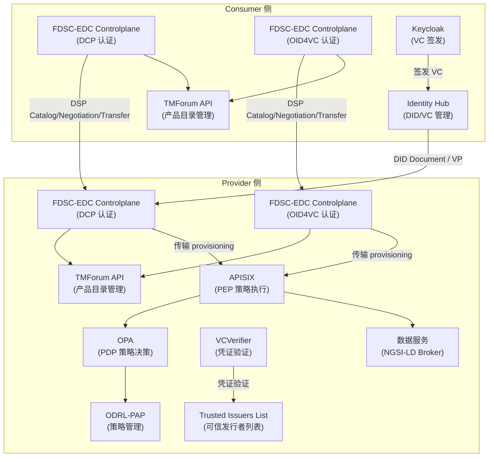
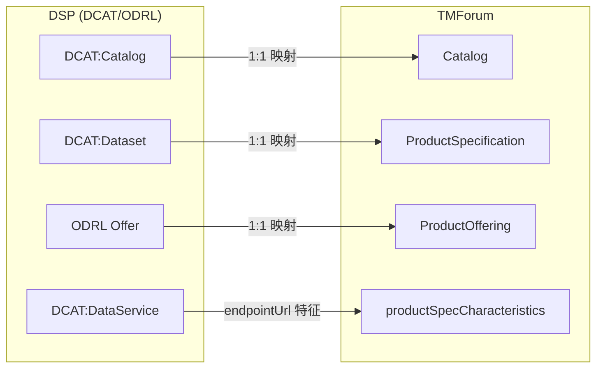
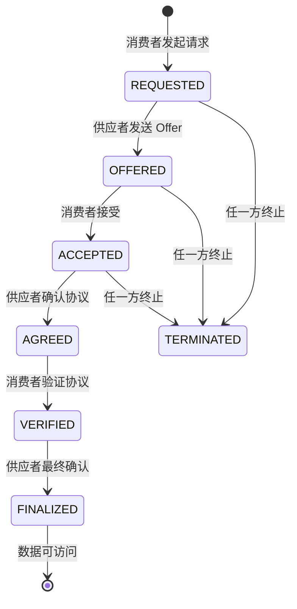
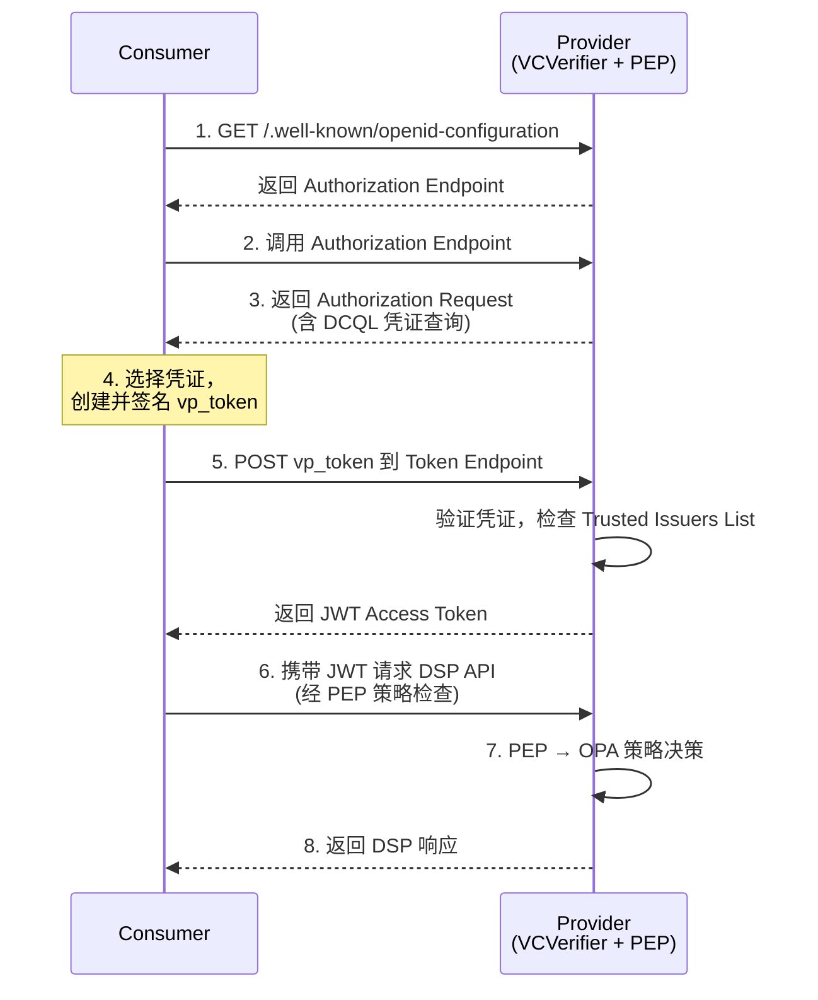
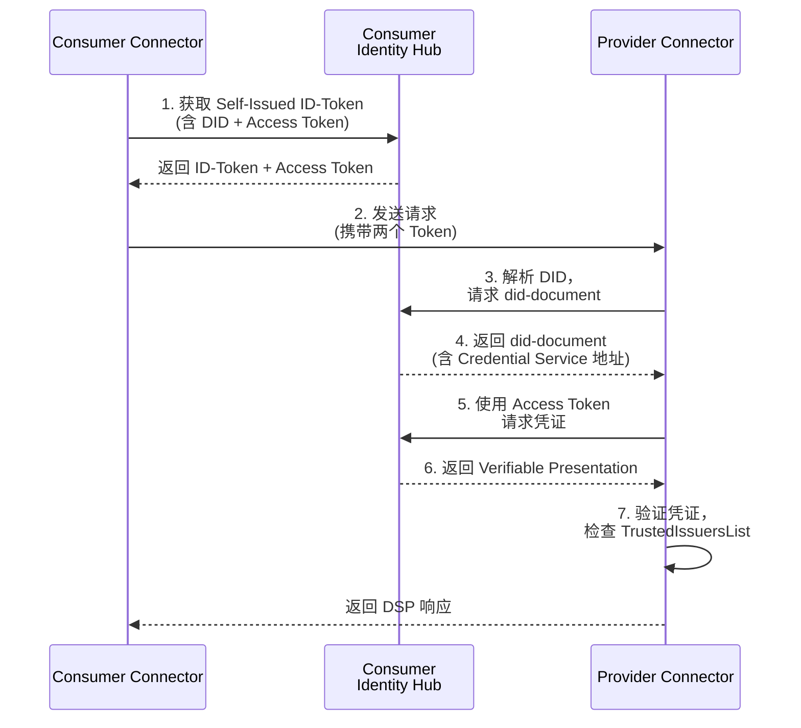

本页面详细阐述 FIWARE 数据空间连接器中 **数据空间协议（DSP）** 与 **Eclipse 数据空间组件（EDC）** 的集成架构。DSP 定义了数据空间中参与者之间的标准化交互协议，而 FDSC-EDC 作为其具体实现，将 DSP 的三大子协议（Catalog、Contract Negotiation、Transfer Process）与 FIWARE DSC 的身份认证、授权策略及数据平面能力深度融合，实现了跨连接器的互操作性。

## 架构总览

FDSC-EDC 采用**双控制面 + 统一数据面**的设计模式。控制面负责协议消息的处理与状态管理，数据面则由 FIWARE DSC 本身的组件（APISIX、VCVerifier、ODRL-PAP 等）承担实际的数据传输与策略执行。TMForum API 作为存储后端，将 DSP 的 DCAT/ODRL 概念映射到 TM Forum 信息模型，使得产品目录、合同协商与传输流程可以在统一的数据模型下管理。



Sources: [DSP_INTEGRATION.md](doc/DSP_INTEGRATION.md#L1-L22), [README.md](README.md#L384-L398)

## FDSC-EDC 核心组件

FDSC-EDC 是基于 [Eclipse Data Space Components](https://eclipse-edc.github.io/docs/) 的实现，专为 FIWARE 数据空间连接器定制。它提供三大 DSP 子协议的 API 端点，并支持两种认证模式以适应不同的互操作场景。

| 组件 | 职责 | 关键特性 |
|------|------|----------|
| **FDSC-EDC Controlplane (DCP)** | 处理基于 DCP 认证的 DSP 请求 | 使用 Eclipse DCP 进行连接器间认证，依赖 Identity Hub 进行 DID 解析与凭证获取 |
| **FDSC-EDC Controlplane (OID4VC)** | 处理基于 OID4VC 认证的 DSP 请求 | 使用 OID4VP 进行认证，支持 EUDI Wallet 兼容，适合人机交互场景 |
| **TMForum API** | 产品目录存储后端 | 将 DCAT:Catalog 映射到 TMForum:Catalog，DCAT:Dataset 映射到 ProductSpecification |
| **Identity Hub** | DID 文档与可验证凭证管理 | 实现 EDC-Identity Services，基于 Tractus-X IdentityHub，提供 STS/DID/Credential 服务 |

两种认证模式的对比：

| 特性 | DCP 模式 | OID4VC 模式 |
|------|----------|-------------|
| **认证协议** | Eclipse Decentralized Claims Protocol | OpenID for Verifiable Credentials (OID4VP) |
| **身份管理** | Identity Hub (STS + DID Service + Credential Service) | VCVerifier + Credentials Config Service |
| **凭证交换** | 通过 Identity Hub 的 Credential Service 获取 VP | 通过 OID4VP 流程直接呈现 VP |
| **适用场景** | 连接器对连接器（M2M）的自动化交互 | 支持 EUDI Wallet，适合人机交互（H2M）和 M2M |
| **依赖组件** | Identity Hub（必需） | VCVerifier、Credentials Config Service、Trusted Issuers List |
| **传输端点** | 返回端点 URL + JWT | 返回端点 URL（认证通过 OID4VP 流程） |

Sources: [DSP_INTEGRATION.md](doc/DSP_INTEGRATION.md#L10-L22), [k3s/dsp-consumer.yaml](k3s/dsp-consumer.yaml#L1-L20), [k3s/dsp-provider.yaml](k3s/dsp-provider.yaml#L1-L30)

## DSP 子协议与 TMForum 映射

DSP 采用 W3C 标准词汇（DCAT、ODRL）描述数据目录与使用条款，而 FIWARE DSC 的产品管理基于 TM Forum Open APIs。FDSC-EDC 通过映射层将两个模型统一，使得通过 TMForum API 创建的产品自动暴露为 DSP 兼容的 Catalog 条目。

### Catalog 协议映射



| DSP 实体 | TMForum 实体 | 映射说明 |
|----------|--------------|----------|
| `DCAT:Catalog` | `Catalog` | 直接映射，`participantId` 对应 RelatedParty 的 Provider 角色 |
| `DCAT:Dataset` | `ProductSpecification` | 数据集元数据映射到 `productSpecCharacteristics` |
| `ODRL Offer` | `ProductOffering` | 使用条款作为策略嵌入 ProductOffering 的 `productOfferingTerm` |
| `DCAT:DataService` | `productSpecCharacteristic[endpointUrl]` | 服务端点 URL 存储为产品规格特征值 |
| `DCAT:DataService[endpointDescription]` | `productSpecCharacteristic[endpointDescription]` | 服务描述信息 |

产品规格中关键的特征值定义了 DSP 交互所需的端点信息：

| 特征 ID | 用途 | 示例值 |
|---------|------|--------|
| `dcp` | DCP 认证模式的 DSP 端点 | `https://dcp-mp-operations.127.0.0.1.nip.io/api/dsp/2025-1` |
| `oid4vc` | OID4VC 认证模式的 DSP 端点 | `https://dsp-mp-operations.127.0.0.1.nip.io/api/dsp/2025-1` |
| `upstreamAddress` | 上游数据服务地址 | `data-service-scorpio:9090` |
| `endpointDescription` | 服务端点描述 | `The Demo Service` |
| `targetSpecification` | ODRL 目标资产规约 | AssetCollection + refinement（如路径约束） |
| `serviceConfiguration` | OID4VC 凭证配置服务所需配置 | 包含 OIDC scopes、DCQL 查询等 |
| `credentialsConfig` | 凭证类型与声明要求 | 指定 `credentialsType` 和 `claims` 路径 |
| `policyConfig` | 访问策略（ODRL） | 定义权限、约束条件 |

Sources: [DSP_INTEGRATION.md](doc/DSP_INTEGRATION.md#L246-L470), [README.md](README.md#L418-L431)

### Contract Negotiation 映射

DSP 的合同协商是一个有状态的交互过程，FDSC-EDC 将其状态机映射到 TMForum 的 Quote 对象模型：

| DSP 实体/状态 | TMForum 实体 | 说明 |
|---------------|--------------|------|
| `ContractNegotiation` | `Quote` | 协商会话对应报价单 |
| `Offer`（协商中） | `QuoteItem` | 消费者或供应者提出的条款对应报价项 |
| 协商达到 Verified 状态 | `ProductOrder` | 验证通过后创建产品订单 |
| 协商达到 Finalized 状态 | `Product + Agreement` | 最终化后创建产品实例和协议 |

协商流程的状态流转：



Sources: [README.md](README.md#L434-L456), [CONTRACT_NEGOTIATION.md](doc/CONTRACT_NEGOTIATION.md#L1-L35)

### Transfer Process

传输流程在协议达成后启动，Consumer 请求数据访问，Provider 通过 provisioning 机制创建实际的数据传输通道。FDSC-EDC 不包含独立的数据面实现，而是将 FIWARE DSC 本身作为数据面，通过 APISIX 路由管理实现数据访问控制。

| 传输类型 | 描述 | 认证方式 |
|----------|------|----------|
| **HttpData-PULL** | Consumer 主动拉取数据 | 端点 URL + 访问令牌 |
| **HttpProxy** | 通过代理访问数据 | 端点 URL + OID4VP 认证 |

Sources: [README.md](README.md#L458-L476), [DSP_INTEGRATION.md](doc/DSP_INTEGRATION.md#L60-L82)

## 认证流程详解

FDSC-EDC 支持两种连接器间认证流程，分别适用于不同的互操作场景。两种流程均要求双方参与者预先完成身份注册与凭证配置。

### OID4VP 认证流程

OID4VP 流程基于 OpenID for Verifiable Presentations 协议，支持与 EUDI Wallet ARF 兼容的钱包集成，适合人机交互场景。双方均需部署完整的 IAM 框架（包括 Verifier 和 PEP）。



**凭证准备要求**：FDSC-EDC 需要以文件形式访问可验证凭证，凭证存储在挂载到容器的目录中，JWT 格式使用 `.jwt` 扩展名。

Sources: [DSP_INTEGRATION.md](doc/DSP_INTEGRATION.md#L23-L44), [README.md](README.md#L256-L306)

### DCP 认证流程

DCP（Decentralized Claims Protocol）流程基于 Eclipse DCP 规范，通过 Identity Hub 实现连接器间的去中心化身份验证，适合纯机器对机器的自动化交互场景。



**关键依赖**：DCP 流程要求双方均部署 Identity Hub 实例（基于 Tractus-X IdentityHub），提供 STS（Security Token Service）、DID Service 和 Credential Service 三个核心端点。

Sources: [DSP_INTEGRATION.md](doc/DSP_INTEGRATION.md#L45-L58), [README.md](README.md#L401-L414)

## 传输 Provisioning 机制

当合同协商完成后，Consumer 可通过 Transfer Process Protocol 请求数据传输。FDSC-EDC 的 provisioning 过程根据认证模式的不同而有所差异，但核心目标一致：在 APISIX 上创建路由，将数据请求转发到实际的数据服务。

### OID4VP 模式 Provisioning

| 步骤 | 操作 | 说明 |
|------|------|------|
| 1 | 添加 AccessPolicies 到 PAP | 将传输相关的访问策略注入 OPA |
| 2 | 添加凭证配置到 Credentials-Config-Service | 配置所需凭证类型与验证参数 |
| 3 | 创建 `<TRANSFER_PROCESS_ID>/.well-known/openid-configuration` 路由 | 在 APISIX 上创建 OID4VP 认证端点 |
| 4 | 创建 `<TRANSFER_PROCESS_ID>/` 路由 | 指向实际数据服务的路由 |
| 5 | 返回创建的路由端点 | Consumer 可通过该端点访问数据 |

### DCP 模式 Provisioning

| 步骤 | 操作 | 说明 |
|------|------|------|
| 1 | 强制执行 AccessPolicies | 验证传输请求的策略合规性 |
| 2 | 创建 `<TRANSFER_PROCESS_ID>/` 路由 | 指向实际数据服务的路由 |
| 3 | 生成 JWT | 包含 transfer-process-id 作为 scope，使用控制面密钥签名 |
| 4 | 返回路由端点和 JWT | Consumer 使用 JWT 作为访问令牌 |

Sources: [DSP_INTEGRATION.md](doc/DSP_INTEGRATION.md#L60-L82), [k3s/dsp-provider.yaml](k3s/dsp-provider.yaml#L186-L204)

## 部署配置

FDSC-EDC 的部署通过 Helm values 配置，Consumer 和 Provider 分别需要独立的配置文件。以下为关键配置项的说明：

### Consumer 侧配置

Consumer 侧的 FDSC-EDC 配置定义在 `k3s/dsp-consumer.yaml` 中，核心配置包括双控制面部署、身份标识和认证模式选择：

| 配置路径 | 用途 | 示例值 |
|----------|------|--------|
| `fdsc-edc.deployment.dcp.config.edc.hostname` | DCP 控制面主机名 | `dcp-fancy-marketplace.127.0.0.1.nip.io` |
| `fdsc-edc.deployment.oid4vc.config.edc.hostname` | OID4VC 控制面主机名 | `dsp-fancy-marketplace.127.0.0.1.nip.io` |
| `fdsc-edc.common.config.edc.participant.id` | 参与者 DID | `did:web:fancy-marketplace.biz` |
| `fdsc-edc.common.config.dcp.enabled` | 启用 DCP 认证 | `true` |
| `fdsc-edc.common.config.oid4vp.enabled` | 启用 OID4VP 认证 | `true` |
| `fdsc-edc.common.config.dcp.scopes` | DCP 操作所需凭证 scope | `org.eclipse.tractusx.vc.type:MembershipCredential:read` |
| `identityhub.enabled` | 启用 Identity Hub | `true` |
| `fdsc-edc.common.config.fdscTransfer.enabled` | 启用传输扩展 | `false`（Consumer 侧） |

### Provider 侧配置

Provider 侧的配置额外包含传输扩展（fdscTransfer）和 APISIX 管理端点：

| 配置路径 | 用途 | 示例值 |
|----------|------|--------|
| `fdsc-edc.common.config.fdscTransfer.enabled` | 启用传输扩展 | `true`（Provider 侧） |
| `fdsc-edc.common.config.fdscTransfer.apisix.address` | APISIX 管理 API 地址 | `http://provider-apisix-admin.provider.svc.cluster.local:9180` |
| `fdsc-edc.common.config.fdscTransfer.apisix.token` | APISIX 管理 API 令牌 | `admin` |
| `fdsc-edc.common.config.fdscTransfer.transferHost` | 传输主机名 | `mp-data-service.127.0.0.1.nip.io` |
| `fdsc-edc.common.config.fdscTransfer.odrlPapHost` | ODRL-PAP 地址 | `http://odrl-pap.provider.svc.cluster.local:8080` |
| `fdsc-edc.common.config.fdscTransfer.verifierHost` | VCVerifier 外部地址 | `https://verifier.mp-operations.org` |

Sources: [k3s/dsp-consumer.yaml](k3s/dsp-consumer.yaml#L1-L200), [k3s/dsp-provider.yaml](k3s/dsp-provider.yaml#L1-L204)

## 使用流程示例

完整的 DSP 交互流程涵盖参与者身份准备、凭证签发、产品创建、合同协商和数据访问五个阶段。以下为使用本地部署环境的操作概要：

### 阶段一：参与者身份准备

Consumer 和 Provider 均需在 Identity Hub 中注册身份信息，包括 DID 文档和签名密钥：

1. **获取签名密钥**：从 cert-manager 管理的 TLS 证书中提取私钥并转换为 JWK 格式
2. **存入 Vault**：将私钥存储到 HashiCorp Vault 供 Identity Hub 的 STS 使用
3. **注册参与者**：通过 Identity Hub Management API 创建参与者记录，关联 DID 和公钥
4. **验证 DID 文档**：确认 `/.well-known/did.json` 端点可访问

```shell
# Consumer 身份注册示例
export CONSUMER_JWK=$(./doc/scripts/get-private-jwk-from-k8s-secret.sh consumer fancy-marketplace.biz-tls)
export CONSUMER_PARTICIPANT=$(./doc/scripts/get-participant-create.sh "${CONSUMER_JWK}" did:web:fancy-marketplace.biz "https://identityhub-fancy-marketplace.127.0.0.1.nip.io" "key-1")
curl -k -X POST 'https://identityhub-management-fancy-marketplace.127.0.0.1.nip.io/api/identity/v1alpha/participants' \
  --header 'x-api-key: c3VwZXItdXNlcg==.random' \
  --header 'Content-Type: application/json' \
  --data "${CONSUMER_PARTICIPANT}"
```

### 阶段二：凭证签发与注册

DCP 流程需要 MembershipCredential 存储在 Identity Hub 中。凭证通过 Keycloak 签发，然后注入到 Identity Hub 的凭证存储：

```shell
# 获取凭证并注册到 Identity Hub
export CONSUMER_CREDENTIAL=$(./doc/scripts/get_credential.sh https://keycloak-consumer.127.0.0.1.nip.io membership-credential employee)
curl -k -X POST \
  'https://identityhub-management-fancy-marketplace.127.0.0.1.nip.io/api/identity/v1alpha/participants/ZGlkOndlYjpmYW5jeS1tYXJrZXRwbGFjZS5iaXo/credentials' \
  --header 'x-api-key: c3VwZXItdXNlcg==.random' \
  --header 'Content-Type: application/json' \
  --data-raw "{ \"id\": \"membership-credential\", \"verifiableCredentialContainer\": { \"rawVc\": \"${CONSUMER_CREDENTIAL}\", \"format\": \"VC1_0_JWT\" } }"
```

### 阶段三：产品创建

通过 TMForum API 创建产品目录、规格和 Offering，其中 `productSpecCharacteristic` 定义了 DSP 交互所需的端点和策略信息。关键步骤包括创建 Category、Catalog、ProductSpecification 和 ProductOffering，其中 ProductSpecification 需包含 `dcp`、`oid4vc`、`upstreamAddress` 等特征值。

### 阶段四：合同协商（DSP）

以 DCP 模式为例的协商流程：

1. **读取目录**：向 Provider 的 Catalog API 发送请求，获取可用产品列表
2. **发起协商**：选择 Offer，创建 ContractNegotiation
3. **等待完成**：轮询协商状态，直到达到 `finalized` 状态
4. **获取协议 ID**：提取 `contractAgreementId` 用于后续传输

### 阶段五：数据访问

1. **启动传输**：使用 `contractAgreementId` 发起 Transfer Process 请求
2. **获取端点**：从 EDR（Endpoint Data Reference）获取访问端点和令牌
3. **访问数据**：携带令牌请求数据服务

Sources: [DSP_INTEGRATION.md](doc/DSP_INTEGRATION.md#L94-L200), [DSP_INTEGRATION.md](doc/DSP_INTEGRATION.md#L627-L847)

## 与其他架构页面的关系

DSP 与 EDC 集成架构并非孤立存在，它与 FIWARE DSC 的其他核心框架紧密协作：

- **身份与信任框架**（[OID4VC 认证框架](9-oid4vc-ren-zheng-kuang-jia-vcverifier-trusted-issuers-list)）：FDSC-EDC 的 OID4VC 模式依赖 VCVerifier 和 Trusted Issuers List 进行凭证验证
- **授权与策略框架**（[ODRL 授权框架](12-odrl-shou-quan-kuang-jia-apisix-opa-odrl-pap)）：传输 provisioning 过程中创建的 APISIX 路由受 OPA 策略控制
- **产品目录与合同管理**（[TM Forum Open APIs 合同管理流程](13-tm-forum-open-apis-he-tong-guan-li-liu-cheng)）：TMForum API 作为 FDSC-EDC 的存储后端，是 DSP 操作的数据基础
- **Catalog / 合同协商 / 传输流程协议**（[Catalog / 合同协商 / 传输流程协议](15-catalog-he-tong-xie-shang-chuan-shu-liu-cheng-xie-yi)）：DSP 子协议的详细消息格式与状态机定义