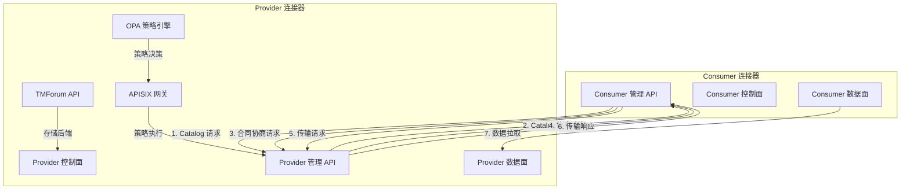
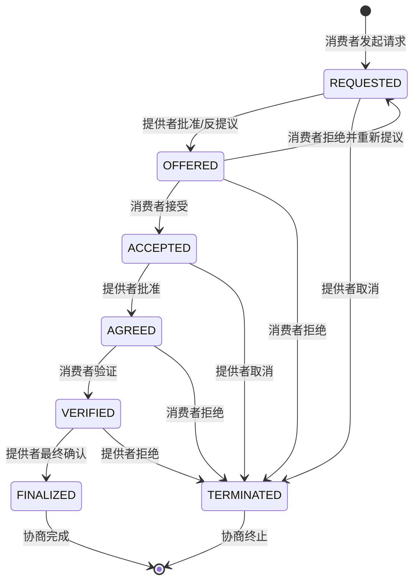
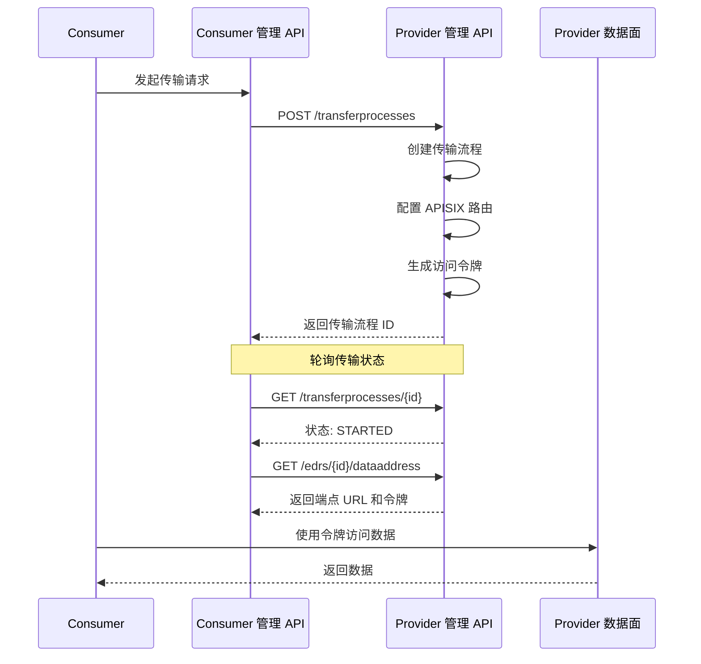
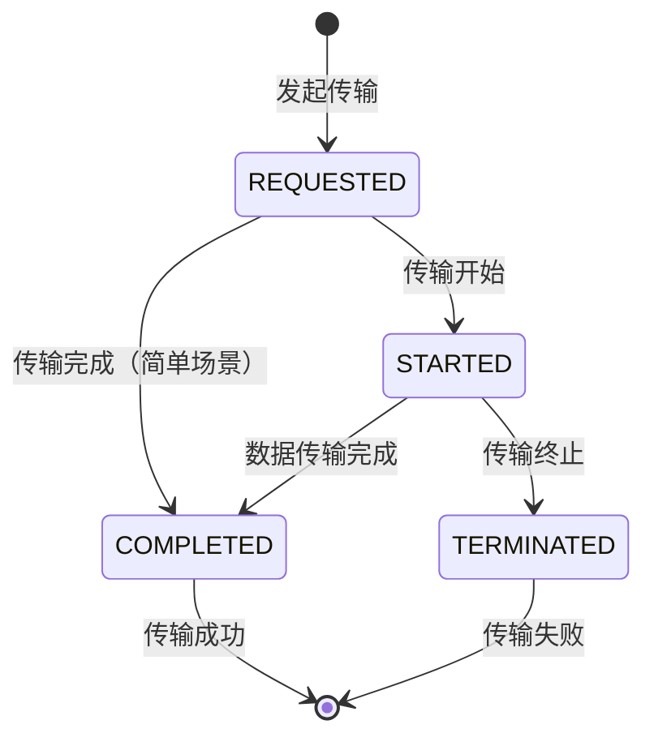
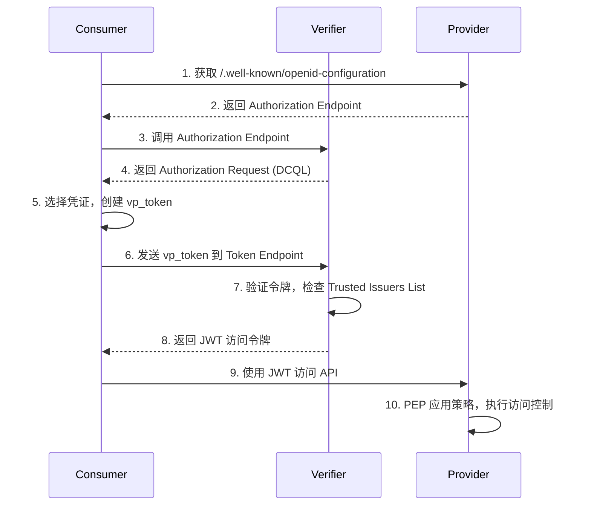
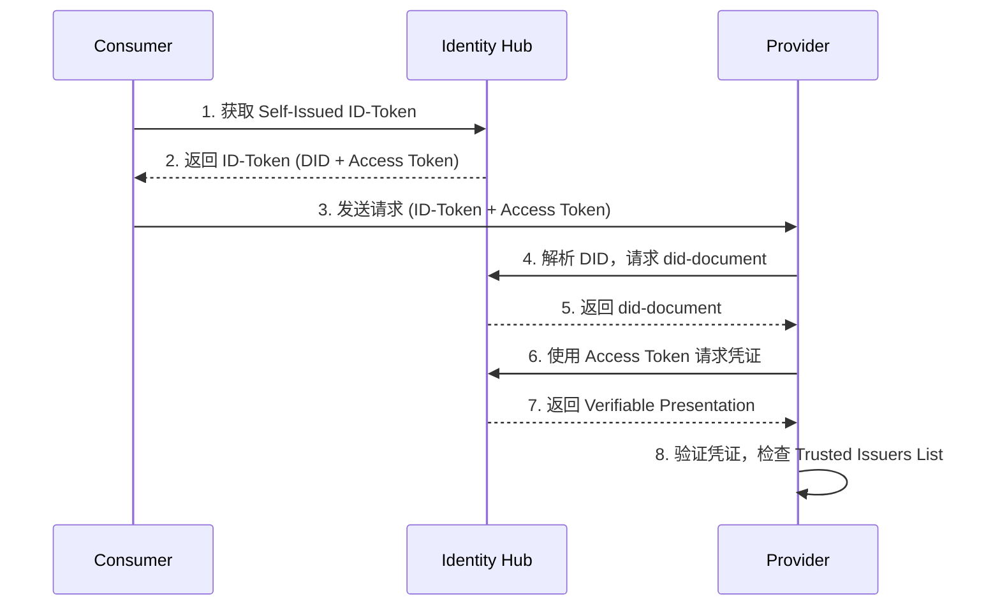
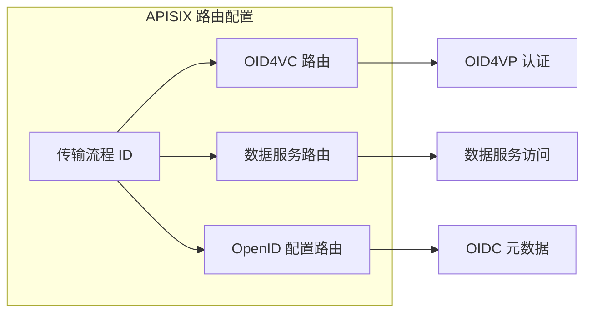

本文档详细介绍了 FIWARE 数据空间连接器中 Catalog、合同协商和传输流程协议的架构设计与实现机制。这些协议基于 Eclipse Dataspace Protocol (DSP) 标准，通过 FDSC-EDC 组件提供完整的数据空间互操作性支持。

## 协议架构概览

FIWARE 数据空间连接器通过 FDSC-EDC 组件实现了完整的 DSP 协议栈，支持三种核心协议：Catalog 协议、合同协商协议和传输流程协议。这些协议共同构成了数据空间中数据共享的完整生命周期管理。



Sources: [DSP_INTEGRATION.md](doc/DSP_INTEGRATION.md#L1-L50), [FDSC_EDC_Arch.jpg](doc/img/FDSC_EDC_Arch.jpg)

## Catalog 协议

Catalog 协议定义了消费者如何发现数据提供者提供的可用数据资产和服务。在 FIWARE 数据空间连接器中，Catalog 通过 DSP 管理 API 进行访问，底层由 TMForum API 存储和管理。

### Catalog 请求流程

Catalog 请求遵循 DSP 规范，通过 HTTP POST 请求发送到管理 API 的 `/api/v1/management/v3/catalog/request` 端点。请求体包含以下关键字段：

| 字段 | 类型 | 描述 |
|------|------|------|
| `@context` | Array | JSON-LD 上下文，通常为 `["https://w3id.org/edc/connector/management/v0.0.1"]` |
| `@type` | String | 消息类型，固定为 `"CatalogRequestMessage"` |
| `protocol` | String | DSP 协议版本，如 `"dataspace-protocol-http:2025-1"` |
| `counterPartyId` | String | 提供者的 DID，如 `"did:web:mp-operations.org"` |
| `counterPartyAddress` | String | 提供者的 DSP 端点地址 |
| `querySpec` | Object | 查询规范，空对象表示无过滤条件 |

```java
// Catalog 请求模型定义
public class CatalogRequestMessage {
    @JsonProperty("@context")
    private List<String> context = Collections.singletonList("https://w3id.org/edc/connector/management/v0.0.1");
    
    @JsonProperty("@type")
    private String type = "CatalogRequestMessage";
    
    private String protocol = "dataspace-protocol-http:2025-1";
    private String counterPartyId;
    private String counterPartyAddress;
    private Map<String, Object> querySpec = Collections.emptyMap();
}
```

Sources: [CatalogRequestMessage.java](it/src/test/java/org/fiware/dataspace/it/components/model/CatalogRequestMessage.java#L1-L43), [DSP_INTEGRATION.md](doc/DSP_INTEGRATION.md#L600-L700)

### Catalog 响应结构

Catalog 响应遵循 DCAT 规范，包含数据服务列表。每个服务提供端点描述和访问 URL：

```java
// Catalog 响应模型
public class DcatCatalog {
    @JsonProperty("@type")
    private String type;
    
    @JsonProperty("@id")
    private String id;
    
    @JsonProperty("dcat:service")
    private List<DcatService> service = new ArrayList<>();
}

public class DcatService {
    @JsonProperty("dcat:endpointDescription")
    private String endpointDescription;
    
    @JsonProperty("dcat:endpointURL")
    private String endpointUrl;
}
```

Catalog 响应中的服务条目与 TMForum API 中的 ProductOffering 相对应，通过 `externalId` 字段进行关联。

Sources: [DcatCatalog.java](it/src/test/java/org/fiware/dataspace/it/components/model/DcatCatalog.java#L1-L28), [DcatService.java](it/src/test/java/org/fiware/dataspace/it/components/model/DcatService.java#L1-L25)

## 合同协商协议

合同协商协议是数据空间中最关键的交互流程，它定义了消费者和提供者之间如何就数据访问条件达成一致。FIWARE 数据空间连接器实现了完整的 IDSA 合同协商状态机。

### 状态机设计

合同协商遵循严格的生命周期状态转换，确保双方在每个阶段都有明确的确认机制：



### 状态定义与含义

| 状态 | TMForum 对应状态 | 描述 | 允许的操作 |
|------|------------------|------|-----------|
| **REQUESTED** | Quote `inProgress` | 消费者基于 Offer 发起请求，提供者已发送 ACK | 提供者可批准、取消或反提议 |
| **OFFERED** | Quote `inProgress` | 提供者发送 Offer，消费者已发送 ACK | 消费者可接受、拒绝或重新提议 |
| **ACCEPTED** | Quote `accepted` | 消费者接受最新 Offer，提供者已发送 ACK | 提供者可批准或取消 |
| **AGREED** | Quote `approved` | 提供者接受 Offer 并发送 Agreement | 消费者可验证或拒绝 |
| **VERIFIED** | ProductOrder `acknowledged` | 消费者验证 Agreement | 提供者可最终确认或拒绝 |
| **FINALIZED** | ProductOrder `completed` | 提供者发送最终确认，数据可访问 | 协商完成 |
| **TERMINATED** | Quote/ProductOrder `cancelled`/`rejected` | 任一方终止协商 | 终止状态，不可逆转 |

Sources: [CONTRACT_NEGOTIATION.md](doc/CONTRACT_NEGOTIATION.md#L1-L100), [idsa-contract-negotiation.png](doc/img/idsa-contract-negotiation.png), [tmf-state-machine.png](doc/img/tmf-state-machine.png)

### 协商请求结构

合同协商通过 DSP 管理 API 的 `/api/v1/management/v3/contractnegotiations` 端点发起。请求体包含 ODRL 策略，定义了数据访问的权限和约束：

```java
// 合同协商请求模型
public class ContractRequest {
    @JsonProperty("@context")
    private List<String> context = Collections.singletonList("https://w3id.org/edc/connector/management/v0.0.1");
    
    @JsonProperty("@type")
    private String type = "ContractRequest";
    
    private String counterPartyAddress;
    private String counterPartyId;
    private String protocol = "dataspace-protocol-http:2025-1";
    private Object policy; // ODRL 策略对象
}
```

### ODRL 策略结构

合同协商的核心是 ODRL (Open Digital Rights Language) 策略，它精确定义了数据访问的条件：

```json
{
  "@context": "http://www.w3.org/ns/odrl.jsonld",
  "@type": "Offer",
  "@id": "OFFER-1:ASSET-1:123",
  "assigner": "did:web:mp-operations.org",
  "target": "ASSET-1",
  "permission": [{
    "action": "use",
    "constraint": {
      "leftOperand": "odrl:dayOfWeek",
      "operator": "lt",
      "rightOperand": {
        "@value": 6,
        "@type": "xsd:integer"
      }
    }
  }]
}
```

策略中的约束条件支持多种操作符，包括时间限制（`odrl:dateTime`）、星期限制（`odrl:dayOfWeek`）和自定义约束。

Sources: [ContractRequest.java](it/src/test/java/org/fiware/dataspace/it/components/model/ContractRequest.java#L1-L42), [DSP_INTEGRATION.md](doc/DSP_INTEGRATION.md#L600-L650)

### 协商状态查询与监控

协商状态通过轮询机制进行监控。管理 API 提供了专门的端点用于查询当前协商状态：

```java
// 协商状态查询
public static List<ContractNegotiation> getNegotiations(String managementApiAddress) throws Exception {
    String url = managementApiAddress + "/api/v1/management/v3/contractnegotiations/request";
    // ... 发送请求并解析响应
}

// 等待协商完成
public static String waitForNegotiationFinalized(String managementApiAddress, String negotiationId) throws Exception {
    Awaitility.await()
        .atMost(Duration.ofSeconds(DEFAULT_POLL_TIMEOUT_SECONDS))
        .pollInterval(Duration.ofSeconds(DEFAULT_POLL_INTERVAL_SECONDS))
        .untilAsserted(() -> {
            ContractNegotiation negotiation = getNegotiation(managementApiAddress, negotiationId);
            assertTrue(negotiation.getState().equalsIgnoreCase("FINALIZED"));
            agreementId[0] = negotiation.getContractAgreementId();
        });
    return agreementId[0];
}
```

协商响应模型包含协商 ID、当前状态和协议 ID（协商完成后）：

```java
public class ContractNegotiation {
    @JsonProperty("@id")
    private String atId;
    
    private String id;
    private String state; // "requested", "finalized" 等
    private String contractAgreementId; // 协商完成后的协议 ID
}
```

Sources: [DSPManagementHelper.java](it/src/test/java/org/fiware/dataspace/it/components/DSPManagementHelper.java#L250-L350), [ContractNegotiation.java](it/src/test/java/org/fiware/dataspace/it/components/model/ContractNegotiation.java#L1-L32)

## 传输流程协议

传输流程协议定义了协商完成后如何实际访问数据。它管理数据传输的生命周期，包括端点配置、访问令牌生成和数据面路由。

### 传输流程生命周期



### 传输请求结构

传输请求通过 DSP 管理 API 的 `/api/v1/management/v3/transferprocesses` 端点发起：

```java
// 传输请求结构
{
    "@context": ["https://w3id.org/edc/connector/management/v0.0.1"],
    "assetId": "ASSET-1",
    "counterPartyId": "did:web:mp-operations.org",
    "counterPartyAddress": "https://dcp-mp-operations.127.0.0.1.nip.io/api/dsp/2025-1",
    "connectorId": "did:web:mp-operations.org",
    "contractId": "${AGREEMENT_ID}",
    "protocol": "dataspace-protocol-http:2025-1",
    "transferType": "HttpData-PULL"
}
```

| 字段 | 描述 |
|------|------|
| `assetId` | 要传输的资产 ID |
| `counterPartyId` | 提供者的 DID |
| `counterPartyAddress` | 提供者的 DSP 端点地址 |
| `connectorId` | 连接器标识符（通常与 counterPartyId 相同） |
| `contractId` | 协商完成后的协议 ID |
| `protocol` | DSP 协议版本 |
| `transferType` | 传输类型，通常为 `"HttpData-PULL"` |

Sources: [DSPManagementHelper.java](it/src/test/java/org/fiware/dataspace/it/components/DSPManagementHelper.java#L350-L450), [DSP_INTEGRATION.md](doc/DSP_INTEGRATION.md#L700-L800)

### 传输状态管理

传输流程通过状态机进行管理，支持以下状态转换：



传输状态查询与协商状态查询类似，使用轮询机制：

```java
// 传输状态查询
public static List<TransferProcess> getTransferProcesses(String managementApiAddress) throws Exception {
    String url = managementApiAddress + "/api/v1/management/v3/transferprocesses/request";
    // ... 发送请求并解析响应
}

// 等待传输开始
public static String waitForTransferStarted(String managementApiAddress, String transferId) throws Exception {
    Awaitility.await()
        .atMost(Duration.ofSeconds(DEFAULT_POLL_TIMEOUT_SECONDS))
        .pollInterval(Duration.ofSeconds(DEFAULT_POLL_INTERVAL_SECONDS))
        .untilAsserted(() -> {
            TransferProcess transfer = getTransferProcess(managementApiAddress, transferId);
            assertTrue("STARTED".equalsIgnoreCase(transfer.getState()));
            transferIds[0] = transfer.getAtId();
        });
    return transferIds[0];
}
```

传输流程响应模型：

```java
public class TransferProcess {
    @JsonProperty("@id")
    private String atId;
    
    private String id;
    private String state; // "requested", "started", "completed" 等
}
```

Sources: [TransferProcess.java](it/src/test/java/org/fiware/dataspace/it/components/model/TransferProcess.java#L1-L29), [DSPManagementHelper.java](it/src/test/java/org/fiware/dataspace/it/components/DSPManagementHelper.java#L500-L600)

### EDR（Endpoint Data Reference）获取

传输开始后，Consumer 可以获取 EDR（Endpoint Data Reference），其中包含访问数据服务所需的端点 URL 和访问令牌：

```java
// EDR 数据地址模型
public class DataAddress {
    private String endpoint; // 数据服务端点 URL
    private String token;    // 访问令牌
}

// 获取 EDR
public static DataAddress getDataAddress(String managementApiAddress, String transferId) throws Exception {
    String url = managementApiAddress + "/api/v1/management/v3/edrs/" + transferId + "/dataaddress";
    // ... 发送请求并解析响应
}
```

EDR 的获取过程包含自动重试机制，确保在传输流程完全启动后才返回有效的端点信息。

Sources: [DataAddress.java](it/src/test/java/org/fiware/dataspace/it/components/model/DataAddress.java#L1-L24), [DSPManagementHelper.java](it/src/test/java/org/fiware/dataspace/it/components/DSPManagementHelper.java#L550-L600)

## 认证机制对比

FIWARE 数据空间连接器支持两种主要的认证机制，用于连接器之间的互认证：

### OID4VC 认证

OID4VC（OpenID for Verifiable Credentials）认证机制基于 OpenID for Verifiable Presentations 规范，特别适合支持 EUDI Wallet ARF 兼容的钱包和人机交互场景。



### DCP 认证

DCP（Decentralized Claims Protocol）认证机制基于 DID 和 Identity Hub，提供去中心化的身份验证。



### 认证机制对比表

| 特性 | OID4VC | DCP |
|------|--------|-----|
| **身份基础** | Verifiable Credentials | DID + Identity Hub |
| **钱包支持** | EUDI Wallet ARF 兼容 | Tractus-X IdentityHub |
| **适用场景** | 人机交互、钱包集成 | 机器对机器、去中心化 |
| **凭证存储** | 文件系统 | Identity Hub |
| **端点发现** | `.well-known/openid-configuration` | DID Document |
| **令牌格式** | JWT | JWT + DID |

Sources: [DSP_INTEGRATION.md](doc/DSP_INTEGRATION.md#L100-L200), [OID4VP-FIWARE-DSC-EDC-Detail.png](doc/img/OID4VP-FIWARE-DSC-EDC-Detail.png), [DCP-FIWARE-DSC-EDC-Detail.png](doc/img/DCP-FIWARE-DSC-EDC-Detail.png)

## 数据面配置与路由

传输流程协议的核心是数据面的配置和路由管理。当传输流程启动时，Provider 会自动配置 APISIX 路由，将数据服务暴露给 Consumer。

### OID4VC 数据面配置

对于 OID4VC 认证方式，数据面配置包括以下步骤：

1. **添加访问策略到 PAP**：创建访问控制策略，强制执行传输访问
2. **配置 Credentials-Config-Service**：如果配置了 OID4VC，添加凭证配置
3. **创建 OpenID 配置路由**：在 APISIX 中创建 `<TRANSFER_PROCESS_ID>/.well-known/openid-configuration` 路由
4. **创建数据服务路由**：在 APISIX 中创建 `<TRANSFER_PROCESS_ID>/` 路由到数据服务
5. **返回端点地址**：将创建的路由端点返回给对端

### DCP 数据面配置

对于 DCP 认证方式，数据面配置相对简化：

1. **强制访问策略**：验证并应用访问控制策略
2. **创建数据服务路由**：在 APISIX 中创建 `<TRANSFER_PROCESS_ID>/` 路由到数据服务
3. **生成 JWT 令牌**：生成包含传输流程 ID 作为 scope 的 JWT，使用控制面密钥签名
4. **返回端点和令牌**：将路由端点和 JWT 返回给对端



Sources: [DSP_INTEGRATION.md](doc/DSP_INTEGRATION.md#L300-L400), [Provisioning-FIWARE-DSC-EDC.png](doc/img/Provisioning-FIWARE-DSC-EDC.png)

## 策略管理与执行

策略管理是数据空间安全的核心，通过 ODRL 策略语言定义访问控制规则，并由 PAP（Policy Administration Point）和 PEP（Policy Enforcement Point）协同执行。

### 策略类型

| 策略类型 | 描述 | 示例 |
|----------|------|------|
| **访问策略** | 控制谁可以访问特定资源 | 允许具有 OperatorCredential 的 OPERATOR 角色访问 |
| **合同策略** | 定义合同协商中的权限和约束 | 允许使用数据，但限制在工作日 |
| **目录策略** | 控制目录 API 的访问权限 | 允许所有已验证用户读取目录 |
| **传输策略** | 控制传输流程的访问权限 | 允许具有特定凭证的用户发起传输 |

### 策略示例

```json
{
  "@id": "https://mp-operation.org/policy/common/uptimeReport",
  "odrl:uid": "https://mp-operation.org/policy/common/uptimeReport",
  "@type": "odrl:Policy",
  "odrl:permission": {
    "odrl:assigner": {
      "@id": "https://www.mp-operation.org/"
    },
    "odrl:target": {
      "@type": "odrl:AssetCollection",
      "odrl:source": "urn:asset",
      "odrl:refinement": [
        {
          "@type": "odrl:Constraint",
          "odrl:leftOperand": "ngsi-ld:entityType",
          "odrl:operator": { "@id": "odrl:eq" },
          "odrl:rightOperand": "UptimeReport"
        }
      ]
    },
    "odrl:assignee": { "@id": "vc:any" },
    "odrl:action": { "@id": "odrl:read" }
  }
}
```

Sources: [uptimeReport.json](it/src/test/resources/policies/uptimeReport.json#L1-L39), [transferRequest.json](it/src/test/resources/policies/transferRequest.json#L1-L71), [CONTRACT_NEGOTIATION.md](doc/CONTRACT_NEGOTIATION.md#L50-L100)

## 完整交互流程示例

以下示例展示了从 Catalog 发现到数据访问的完整流程，使用 DCP 认证机制：

### 1. 发现 Catalog

```bash
# 请求 Catalog
curl -X POST 'https://dsp-dcp-management.127.0.0.1.nip.io/api/v1/management/v3/catalog/request' \
  --header 'Content-Type: application/json' \
  --data-raw '{
    "@context": ["https://w3id.org/edc/connector/management/v0.0.1"],
    "@type": "CatalogRequestMessage",
    "protocol": "dataspace-protocol-http:2025-1",
    "counterPartyId": "did:web:mp-operations.org",
    "counterPartyAddress": "https://dcp-mp-operations.127.0.0.1.nip.io/api/dsp/2025-1",
    "querySpec": {}
  }'
```

### 2. 发起合同协商

```bash
# 发起协商请求
curl -X POST 'https://dsp-dcp-management.127.0.0.1.nip.io/api/v1/management/v3/contractnegotiations' \
  --header 'Content-Type: application/json' \
  --data-raw '{
    "@context": ["https://w3id.org/edc/connector/management/v0.0.1"],
    "@type": "ContractRequest",
    "counterPartyAddress": "https://dcp-mp-operations.127.0.0.1.nip.io/api/dsp/2025-1",
    "counterPartyId": "did:web:mp-operations.org",
    "protocol": "dataspace-protocol-http:2025-1",
    "policy": {
      "@context": "http://www.w3.org/ns/odrl.jsonld",
      "@type": "Offer",
      "@id": "OFFER-1:ASSET-1:123",
      "assigner": "did:web:mp-operations.org",
      "permission": [{
        "action": "use",
        "constraint": {
          "leftOperand": "odrl:dayOfWeek",
          "operator": "lt",
          "rightOperand": { "@value": 6, "@type": "xsd:integer" }
        }
      }],
      "target": "ASSET-1"
    }
  }'
```

### 3. 等待协商完成并获取协议 ID

```bash
# 查询协商状态
curl -X POST 'https://dsp-dcp-management.127.0.0.1.nip.io/api/v1/management/v3/contractnegotiations/request' \
  --header 'Content-Type: application/json'

# 获取协议 ID
export AGREEMENT_ID=$(curl -X POST 'https://dsp-dcp-management.127.0.0.1.nip.io/api/v1/management/v3/contractnegotiations/request' \
  --header 'Content-Type: application/json' | jq -r '.[0].contractAgreementId')
```

### 4. 发起数据传输

```bash
# 发起传输请求
curl -X POST 'https://dsp-dcp-management.127.0.0.1.nip.io/api/v1/management/v3/transferprocesses' \
  --header 'Content-Type: application/json' \
  --data-raw "{
    \"@context\": [\"https://w3id.org/edc/connector/management/v0.0.1\"],
    \"assetId\": \"ASSET-1\",
    \"counterPartyId\": \"did:web:mp-operations.org\",
    \"counterPartyAddress\": \"https://dcp-mp-operations.127.0.0.1.nip.io/api/dsp/2025-1\",
    \"connectorId\": \"did:web:mp-operations.org\",
    \"contractId\": \"${AGREEMENT_ID}\",
    \"protocol\": \"dataspace-protocol-http:2025-1\",
    \"transferType\": \"HttpData-PULL\"
  }"
```

### 5. 获取 EDR 并访问数据

```bash
# 获取传输流程 ID
export TRANSFER_ID=$(curl -X POST 'https://dsp-dcp-management.127.0.0.1.nip.io/api/v1/management/v3/transferprocesses/request' \
  --header 'Content-Type: application/json' | jq -r '.[]."@id"')

# 获取端点和令牌
export ENDPOINT=$(curl -X GET "https://dsp-dcp-management.127.0.0.1.nip.io/api/v1/management/v3/edrs/${TRANSFER_ID}/dataaddress" | jq -r .endpoint)
export ACCESS_TOKEN=$(curl -X GET "https://dsp-dcp-management.127.0.0.1.nip.io/api/v1/management/v3/edrs/${TRANSFER_ID}/dataaddress" | jq -r .token)

# 访问数据服务
curl -L -X GET ${ENDPOINT}/ngsi-ld/v1/entities/urn:ngsi-ld:UptimeReport:fms-1 \
  --header 'Content-Type: application/json' \
  --header "Authorization: Bearer ${ACCESS_TOKEN}"
```

Sources: [DSP_INTEGRATION.md](doc/DSP_INTEGRATION.md#L700-L847), [CONTRACT_NEGOTIATION.md](doc/CONTRACT_NEGOTIATION.md#L400-L592)

## 最佳实践与注意事项

### 协商超时处理

合同协商和传输流程都支持超时配置，建议根据网络环境调整：

```java
// 默认超时配置
private static final long DEFAULT_POLL_TIMEOUT_SECONDS = 150; // 2.5 分钟
private static final long DEFAULT_POLL_INTERVAL_SECONDS = 3;  // 3 秒轮询间隔
```

### 策略传播延迟

策略更新需要时间传播到所有组件，建议在策略更新后等待：

```java
// 策略传播等待
private static final int POLICY_PROPAGATION_TIMEOUT_SECONDS = 15;
Thread.sleep(POLICY_PROPAGATION_TIMEOUT_SECONDS * 1000);
```

### 错误处理

协商和传输过程中可能遇到的常见错误：

| 错误场景 | 建议处理方式 |
|----------|-------------|
| 协商超时 | 增加轮询超时时间，检查网络连接 |
| 策略未生效 | 等待策略传播，检查 PAP 配置 |
| 端点不可达 | 检查 APISIX 路由配置，验证数据面状态 |
| 令牌无效 | 检查 Trusted Issuers List，验证凭证有效性 |

Sources: [DSPManagementHelper.java](it/src/test/java/org/fiware/dataspace/it/components/DSPManagementHelper.java#L100-L150), [DSPStepDefinitions.java](it/src/test/java/org/fiware/dataspace/it/components/DSPStepDefinitions.java#L100-L200)

## 相关文档

- [DSP 与 EDC 集成架构](14-dsp-yu-edc-ji-cheng-jia-gou) - 详细的架构设计和组件职责
- [TM Forum Open APIs 合同管理流程](13-tm-forum-open-apis-he-tong-guan-li-liu-cheng) - TMForum API 的使用指南
- [ODRL 授权框架（APISIX + OPA + ODRL-PAP）](12-odrl-shou-quan-kuang-jia-apisix-opa-odrl-pap) - 策略框架详解
- [OID4VC 认证框架（VCVerifier、Trusted Issuers List）](9-oid4vc-ren-zheng-kuang-jia-vcverifier-trusted-issuers-list) - 认证机制详解