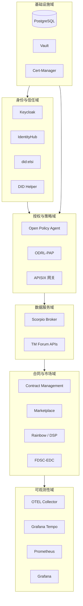
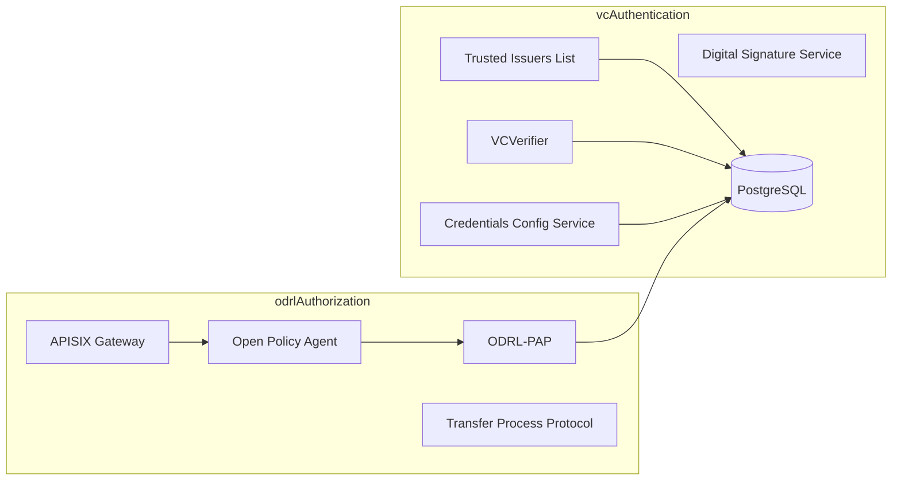
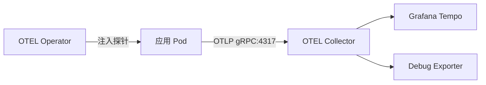

本文档是 `data-space-connector` Helm Umbrella Chart 的核心配置参考手册。该文件（3095 行）定义了数据空间连接器所有组件的部署参数，涵盖身份认证、授权策略、数据服务、合同管理、可观测性等完整功能域。理解 values.yaml 的结构是定制化部署的前提。

## 配置文件总体架构

`values.yaml` 采用分层嵌套结构，顶层键直接对应 Chart 的子依赖（subchart）。每个顶层键的 `enabled` 开关控制该组件是否参与渲染。下图展示了配置域与组件的逻辑关系：



Sources: [Chart.yaml](charts/data-space-connector/Chart.yaml#L1-L92), [values.yaml](charts/data-space-connector/values.yaml#L1-L3095)

## 顶层配置键速查表

以下表格汇总了 `values.yaml` 中所有顶层配置键及其默认状态和用途：

| 配置键 | 默认启用 | 用途说明 | 对应子 Chart |
|--------|---------|----------|--------------|
| `issuance` | — | 凭证签发组件的共享密码生成配置 | — |
| `decentralizedIam` | ✅ | 去中心化身份与访问管理（VC 认证、ODRL 授权） | `decentralized-iam` |
| `scorpio` | ✅ | NGSI-LD 上下文代理（数据服务） | `scorpio-broker-aaio` |
| `keycloak` | ✅ | 身份服务器（OID4VC 凭证签发） | `keycloak` |
| `elsi` | ❌ | did:elsi 凭证签发配置 | — |
| `tm-forum-api` | ✅ | TM Forum Open APIs（产品目录、协议、订单等） | `tm-forum-api` |
| `contract-management` | ✅ | 合同生命周期管理服务 | `contract-management` |
| `rainbow` | ❌ | Dataspace Protocol (DSP) 集成适配层 | — |
| `fdsc-edc` | — | Eclipse Dataspace Connector 控制面 | `fdsc-edc` |
| `marketplace` | ❌ | Business API Ecosystem 市场门户 | `business-api-ecosystem` |
| `identityhub` | ❌ | Tractus-X Identity Hub | `identityhub` (standalone) |
| `did` | ❌ | DID 文档生成辅助工具 | `did-helper` |
| `registration` | ❌ | TIL 预注册 Job | — |
| `dataSpaceConfig` | ❌ | `.well-known/data-space-configuration` 端点 | — |
| `vault` | ❌ | HashiCorp Vault 密钥管理 | `vault` |
| `cert-manager` | ❌ | TLS 证书自动管理 | `cert-manager` |
| `certManagerResources` | ❌ | ClusterIssuer 等证书基础设施资源 | — |
| `tracing` | ❌ | 全局分布式追踪开关与 OTLP 导出配置 | — |
| `opentelemetry-operator` | ❌ | OTEL Operator（自动注入探针） | `opentelemetry-operator` |
| `opentelemetry-collector` | ❌ | OTEL Collector（追踪收集与转发） | `opentelemetry-collector` |
| `tempo` | ❌ | Grafana Tempo 追踪存储后端 | `tempo` |
| `prometheus` | ❌ | Prometheus 监控 | `prometheus` |
| `grafana` | ❌ | Grafana 可视化面板 | `grafana` |
| `fdsc-dashboard` | ❌ | FIWARE DSC 操作仪表板 | `fdsc-dashboard` |
| `extraManifests` | — | 附加任意 Kubernetes 清单 | — |

Sources: [values.yaml](charts/data-space-connector/values.yaml#L1-L3095)

## issuance — 凭证签发共享配置

`issuance` 块控制凭证签发组件所需的数据库密码生成行为。当 `generatePasswords.enabled` 为 `true` 时，Helm 将在安装阶段生成随机密码并存入指定 Secret，供 Keycloak 和其他签发组件使用。

```yaml
issuance:
  generatePasswords:
    enabled: true          # 是否自动生成数据库密码
    secretName: issuance-secret  # 存储密码的 Secret 名称
```

**关键说明**：该 Secret 在 `helm install` 时创建，标注 `helm.sh/resource-policy: keep`，因此 `helm upgrade` 不会覆盖已有的密码值。生产环境建议手动管理此 Secret。

Sources: [values.yaml](charts/data-space-connector/values.yaml#L1-L7)

## decentralizedIam — 去中心化身份与授权

`decentralizedIam` 是身份信任框架的核心配置域，控制 VC 认证栈（Trusted Issuers List、VCVerifier、Credentials Config Service、DSS）和 ODRL 授权栈（APISIX、ODRL-PAP、OPA）的部署。



### vcAuthentication 子配置

**managedPostgres**：配置 Zalando Postgres Operator 管理的数据库实例。`teamId: "dsc"` 定义 Operator 中的团队标识，数据库实例规格（副本数、版本、存储）在此处声明。`users` 和 `databases` 字段定义自动创建的用户与数据库映射关系。

**trusted-issuers-list**：可信发行者列表服务，存储参与数据空间的凭证发行者 DID 与凭证类型。数据库连接指向 `tildb`。

**vcverifier**：VC 验证器，负责验证传入的可验证凭证和可验证演示文稿。数据库连接指向 `ccsdb`。

**credentials-config-service**：凭证配置服务（默认禁用），管理数据平面服务的凭证验证策略注册。

**dss**：数字签名服务（默认禁用），仅在需要 did:elsi 支持时启用，提供 EU Trust List 签名能力。

### odrlAuthorization 子配置

**apisix**：APISIX API 网关配置，包含 Prometheus 指标采集注解。`ingress-controller` 默认禁用（通常由外部 Ingress Controller 管理）。

**odrl-pap**：ODRL 策略管理点，存储和提供基于 ODRL 的访问控制策略。数据库连接指向 `papdb`。

**opa**：Open Policy Agent 作为 APISIX 的 sidecar 部署，充当策略决策点（PDP）。`resourceUrl` 指向 ODRL-PAP 的 bundle 端点，策略拉取延迟（`minDelay`/`maxDelay`）可调优以平衡实时性和负载。

**tpp**：传输过程协议检查（默认禁用），在授权决策中验证数据传输过程是否处于活跃状态。

Sources: [values.yaml](charts/data-space-connector/values.yaml#L9-L197)

## scorpio — NGSI-LD 上下文代理

Scorpio Broker 是数据空间的数据服务层，提供 NGSI-LD 标准的实体存储和查询能力。默认使用 `all-in-one-runner` 镜像（不含 Kafka，资源友好）。

**数据库连接**：指向 PostgreSQL，密码从 Zalando Operator 生成的 Secret 读取。

**CCS 注册**：`ccs.enabled` 控制是否自动向 Credentials Config Service 注册数据平面服务。注册信息通过 ConfigMap `scorpio-registration` 提供。

**分布式追踪**：Scorpio 是 Quarkus 应用，通过 `additionalEnvVars` 注入 `QUARKUS_OTEL_*` 环境变量。`tracing.enabled` 未设置时继承全局 `tracing.enabled` 值。

Sources: [values.yaml](charts/data-space-connector/values.yaml#L198-L303)

## keycloak — 身份服务器与 OID4VCI 凭证签发

Keycloak 是凭证签发的核心，负责管理领域（Realm）、用户、客户端以及 OID4VCI 凭证发行流程。配置结构极为详尽，涵盖镜像版本、数据库连接、领域导入、客户端定义、用户管理、可验证凭证类型声明等。

### 关键配置区域

**镜像**：使用 SEAMWARE 发布的 Keycloak 26.6.2 镜像，包含 OID4VCI QR 生成端点的修复补丁。

**数据库**：禁用内嵌 PostgreSQL，连接外部 Zalando 管理的数据库（`keycloakdb`）。

**领域（realm）**：支持完整的领域导入，包括：
- **defaultClientScopes**：基础、角色、邮箱、电话、地址、个人资料、Web Origins、ACR 等标准 OIDC scope
- **clientRoles**：预定义 `${DID}` 客户端的 ADMIN 角色
- **users**：默认管理员用户 `admin-user`
- **clients**：`${DID}` 客户端（启用 `oid4vci.enabled`）
- **verifiableCredentials**：可验证凭证类型声明（当前为空，需按需配置）

**Wallet 预设**：`wallets` 块提供 Lissi 和 EUDI Reference Wallet 的 OIDC 客户端预配置。`issueCredentialsToUsers` 可自动为用户签发所有已声明的凭证类型。

**资源限制**：Keycloak 默认请求 500Mi 内存（防止 Linux 6.14+ 内核 OOM），限制 2Gi。

**分布式追踪**：通过 `extraEnvVarsCM` 注入 Keycloak 原生 OTEL 环境变量。

Sources: [values.yaml](charts/data-space-connector/values.yaml#L325-L1273)

## tm-forum-api — TM Forum Open APIs

TM Forum API 提供数据空间的产品目录、协议管理、订单处理等标准 API。支持两种部署模式：`allInOne`（单体，适合开发）和分布式（每个 API 独立部署）。

**默认 API 列表**：

| API 名称 | 基础路径 |
|----------|----------|
| party-catalog | `/tmf-api/party/v4` |
| customer-bill-management | `/tmf-api/customerBillManagement/v4` |
| customer-management | `/tmf-api/customerManagement/v4` |
| product-catalog | `/tmf-api/productCatalogManagement/v4` |
| product-inventory | `/tmf-api/productInventory/v4` |
| product-ordering-management | `/tmf-api/productOrderingManagement/v4` |
| resource-catalog | `/tmf-api/resourceCatalog/v4` |
| resource-function-activation | `/tmf-api/resourceFunctionActivation/v4` |
| resource-inventory | `/tmf-api/resourceInventoryManagement/v4` |
| service-catalog | `/tmf-api/serviceCatalogManagement/v4` |
| agreement | `/tmf-api/agreementManagement/v4` |
| usage-management | `/tmf-api/usageManagement/v4` |
| quote | `/tmf-api/quote/v4` |
| account | `/tmf-api/accountManagement/v4` |

**数据服务连接**：`defaultConfig.ngsiLd.url` 指向 Scorpio Broker。

**CCS 注册**：`registration.ccs` 配置向 Credentials Config Service 的注册参数，包括默认 OIDC scope 和可信参与者/发行者列表地址。

Sources: [values.yaml](charts/data-space-connector/values.yaml#L1275-L1457)

## contract-management — 合同生命周期管理

合同管理服务协调 TM Forum API、Trusted Issuers List、ODRL-PAP 和 Rainbow 等组件，实现从产品发现到合同协商的完整流程。

**服务依赖映射**：`services` 块定义了合同管理服务与上游服务的连接 URL，包括 TIL、Product Order、Party、Product Catalog、Service Catalog、Agreement、Quote、Rainbow 和 ODRL-PAP。

**TIL 凭证类型**：`til.credentialType: OperatorCredential` 定义合同管理服务注册到 TIL 时使用的凭证类型。

Sources: [values.yaml](charts/data-space-connector/values.yaml#L1510-L1607)

## rainbow — Dataspace Protocol 集成

Rainbow 提供 Dataspace Protocol (DSP) 的适配层，将 DSP 协议转换为内部服务调用。默认禁用，仅在需要 DSP 集成时启用。

**数据库连接**：`db` 块配置 PostgreSQL 连接参数。

**CCS 注册**：`ccs` 块配置向 Credentials Config Service 的注册，`id: tpp-service` 标识该服务为传输过程协议服务。

Sources: [values.yaml](charts/data-space-connector/values.yaml#L1458-L1509)

## fdsc-edc — Eclipse Dataspace Connector

FDSC-EDC 是基于 Eclipse Dataspace Connector 的控制面实现，支持 DSP 协议、OID4VP 认证、TM Forum 扩展等。配置结构复杂，涵盖服务端口、部署策略、环境变量、卷挂载等。

### 端口架构

| 端口 | 用途 |
|------|------|
| 8080 | DSP 协议端点 |
| 8081 | 默认 API / 健康检查 |
| 8082 | 控制 API |
| 8083 | Catalog API |
| 8084 | 版本 API |
| 8085 | 管理 API |

### 扩展配置

**OID4VP 扩展**：`config.oid4vp` 配置可验证演示文稿认证，包括持有者密钥、凭证文件夹、信任锚点等。

**TM Forum 扩展**：`config.tmfExtension` 将 EDC 的 Catalog、Negotiation、Transfer 端点与 TM Forum API 集成。

**FDSC Transfer 扩展**：`config.fdscTransfer` 配置数据传输过程，支持 DCP 和 OID4VC 两种认证模式，以及 APISIX 网关路由管理。

**Vault 集成**：`config.vault.hashicorp` 配置 HashiCorp Vault 连接，用于密钥管理。

### 初始化容器

FDSC-EDC 部署包含两个关键 init 容器：
1. **convert-signing-key**：将 cert-manager 生成的 SEC1 格式 EC 私钥转换为 PKCS#8 格式
2. **otel-agent-init**：复制 OpenTelemetry Java 自动注入代理 JAR

Sources: [values.yaml](charts/data-space-connector/values.yaml#L1886-L2373)

## marketplace — Business API Ecosystem 市场门户

Marketplace 提供数据产品的展示、订购和计费界面。默认禁用，启用时需要 MongoDB 支持。

**核心子组件**：
- **bizEcosystemChargingBackend**：计费后端，管理订单和支付
- **bizEcosystemLogicProxy**：逻辑代理，处理前端请求路由
- **siop**：基于 VC 的身份认证集成

**数据库连接**：计费后端和逻辑代理分别使用 `charging_db` 和 `belp_db`，密码从独立 Secret 读取。

Sources: [values.yaml](charts/data-space-connector/values.yaml#L1669-L1885)

## identityhub — Tractus-X Identity Hub

Identity Hub 是 Tractus-X 生态的身份管理组件，提供 DID 文档管理、凭证存储和 STS 令牌服务。配置结构独立于其他组件。

**端点定义**：

| 端点 | 端口 | 路径 | 用途 |
|------|------|------|------|
| default | 8081 | /api | 健康检查 |
| identity | 8082 | /api/identity | 身份管理 API |
| credentials | 8083 | /api/credentials | DCP 凭证 API |
| did | 8084 | / | DID 文档解析 |
| accounts | 8085 | /api/accounts | STS 账户管理 |
| version | 8086 | /.well-known/api | 版本信息 |
| sts | 8087 | /api/sts | STS 令牌签发 |

**安全配置**：Pod 和容器安全上下文均配置为非 root 运行，只读根文件系统，禁用特权提升。

Sources: [values.yaml](charts/data-space-connector/values.yaml#L2401-L2684)

## 可观测性配置（tracing / OTEL / Tempo）

分布式追踪配置采用全局 + 组件覆盖的两层架构。`tracing` 全局块定义默认值，各组件的 `tracing.enabled` 可独立覆盖。



### tracing 全局配置

| 参数 | 默认值 | 说明 |
|------|--------|------|
| `tracing.enabled` | `false` | 全局追踪开关 |
| `tracing.exporter.otlp.endpoint` | `""` | OTLP 导出端点（空 = 禁用） |
| `tracing.exporter.otlp.protocol` | `grpc` | OTLP 协议（`grpc` / `http/protobuf`） |
| `tracing.sampler` | `parentbased_traceidratio` | 采样策略 |
| `tracing.samplerArg` | `1.0` | 采样率（0.0-1.0） |
| `tracing.propagators` | `tracecontext,baggage` | 上下文传播器 |

### opentelemetry-collector 配置

Collector 默认禁用，启用后部署为 `deployment` 模式（单副本）。配置包含：
- **receivers**：OTLP gRPC (4317) 和 HTTP (4318)
- **processors**：batch（批量导出）、filter/healthcheck（过滤健康检查 spans）、memory_limiter（内存保护）、resource（注入部署属性）
- **exporters**：debug（默认，输出到 stdout）

### tempo 配置

Tempo 提供本地文件系统追踪存储，保留期 48 小时。仅接收 OTLP 协议，Jaeger 和 OpenCensus 接收器已禁用以减小攻击面。

**各组件 OTEL 环境变量统一模式**：每个支持追踪的子 Chart 都通过 `additionalEnvVars` 或 `extraEnvVars` 注入标准 `OTEL_*` 环境变量，默认 `OTEL_SDK_DISABLED=true`。启用追踪时需同步翻转全局 `tracing.enabled` 和组件级 `tracing.enabled`。

Sources: [values.yaml](charts/data-space-connector/values.yaml#L2749-L3095)

## 基础设施组件配置

### vault — HashiCorp Vault

默认禁用。开发模式下使用 `dev.enabled: true` 和固定 root token。生产环境应通过 `server.postStart` 配置外部初始化脚本。

### cert-manager — 证书管理

默认禁用。`certManagerResources` 块支持两种证书签发模式：
- **selfsigned**：本地自签名 CA（适合开发/内部实验室）
- **prod**：Let's Encrypt 生产签发（真实受信 SSL）

### dataSpaceConfig — 数据空间配置端点

提供 `.well-known/data-space-configuration` 端点，声明连接器支持的数据模型、协议和认证方式。

Sources: [values.yaml](charts/data-space-connector/values.yaml#L2685-L2738), [values.yaml](charts/data-space-connector/values.yaml#L1636-L1653)

## 密码与 Secret 管理策略

values.yaml 中多处引用外部 Secret，统一遵循以下模式：

| Secret 引用 | 来源 | 用途 |
|-------------|------|------|
| `issuance-secret` | Helm 自动生成 | Keycloak admin 密码 |
| `postgres.postgres.credentials.postgresql.acid.zalan.do` | Zalando Operator 自动生成 | PostgreSQL 连接密码 |
| `mongodb-charging-password` | 手动或 marketplace 自动生成 | MongoDB 计费数据库密码 |
| `mongodb-belp-password` | 手动或 marketplace 自动生成 | MongoDB 逻辑代理数据库密码 |
| `signing-key` | cert-manager 生成 | TLS 签名密钥 |
| `root-ca` | cert-manager 生成 | 根 CA 证书 |

**生产建议**：所有 `existingSecret` 引用应指向外部管理的 Secret（如 External Secrets Operator、Sealed Secrets），避免依赖 Helm 自动生成。

Sources: [values.yaml](charts/data-space-connector/values.yaml#L1-L7), [values.yaml](charts/data-space-connector/values.yaml#L386-L399)

## 典型部署场景配置示例

### 最小 Consumer 部署

```yaml
# 禁用不需要的组件
scorpio:
  enabled: false
tm-forum-api:
  enabled: false
contract-management:
  enabled: false

# 启用 DSP 集成
fdsc-edc:
  enabled: true
  config:
    edc:
      participant:
        id: "did:web:consumer.example.org"
```

### 完整 Provider 部署

```yaml
# 保持所有默认组件启用
decentralizedIam:
  enabled: true
scorpio:
  enabled: true
keycloak:
  enabled: true
tm-forum-api:
  enabled: true
contract-management:
  enabled: true

# 启用追踪
tracing:
  enabled: true
opentelemetry-collector:
  enabled: true
tempo:
  enabled: true
```

Sources: [values.yaml](charts/data-space-connector/values.yaml#L1-L3095)

## 下一步阅读

- 了解 Keycloak 领域和 OID4VCI 凭证签发的详细配置，请参阅 [Keycloak 与 OID4VCI 凭证签发配置](17-keycloak-yu-oid4vci-ping-zheng-qian-fa-pei-zhi)
- 了解 Secret 管理和生产环境安全最佳实践，请参阅 [Secret 管理与生产环境安全](19-secret-guan-li-yu-sheng-chan-huan-jing-an-quan)
- 了解分布式追踪架构的完整设计，请参阅 [OpenTelemetry 分布式追踪架构](24-opentelemetry-fen-bu-shi-zhui-zong-jia-gou)
- 了解 Helm Chart 的依赖关系图谱，请参阅 [Helm Umbrella Chart 依赖图谱](8-helm-umbrella-chart-yi-lai-tu-pu)
- 了解各组件的模块职责，请参阅 [组件总览与模块职责](7-zu-jian-zong-lan-yu-mo-kuai-zhi-ze)