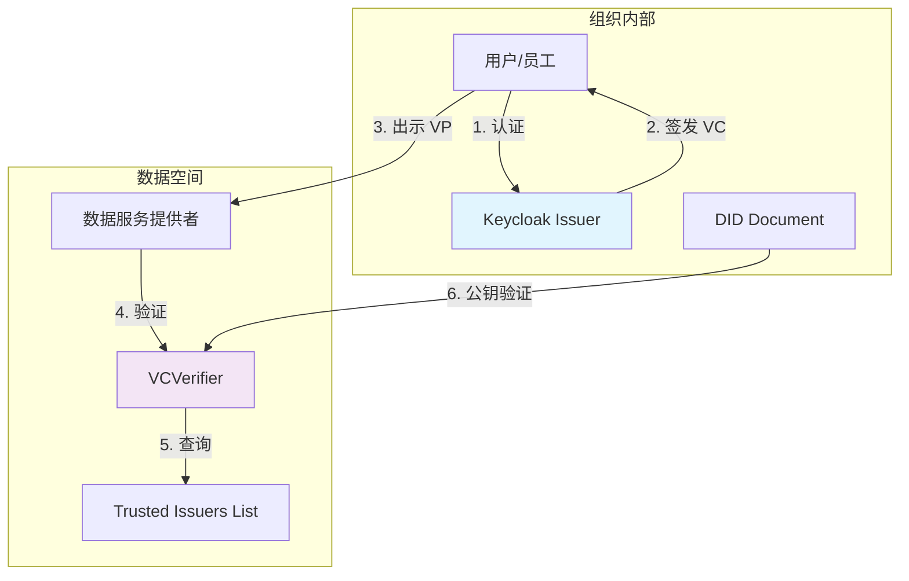
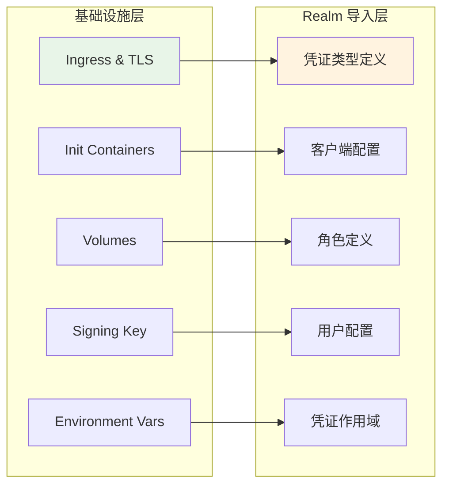

本文档详细说明了 FIWARE Data Space Connector 中 Keycloak 作为可验证凭证签发者的配置方法，特别是 OID4VCI（OpenID for Verifiable Credential Issuance）协议的集成配置。Keycloak 负责组织用户的身份验证和可验证凭证签发，是数据空间信任框架的核心组件。

## 架构概述：Keycloak 在数据空间中的角色

Keycloak 在 FIWARE 数据空间中扮演 **可验证凭证签发者（Verifiable Credential Issuer）** 的角色，通过 OID4VCI 协议向组织用户签发符合 W3C 标准的可验证凭证（VC）。这些凭证编码了用户的角色和属性，用户随后可以向数据服务提供者出示这些凭证以获取访问权限。



Keycloak 的核心职责包括：
- **用户认证**：管理组织的用户身份和凭证
- **VC 签发**：通过 OID4VCI 协议签发可验证凭证
- **Realm 管理**：维护用户、角色和凭证配置的领域模型

每个组织的 Keycloak 实例可以签发多种类型的凭证，包括法律人员凭证、会员凭证、操作员凭证等，具体取决于组织在数据空间中的角色和需求。

Sources: [KEYCLOAK.md](doc/deployment-integration/roles/KEYCLOAK.md#L1-L10), [consumer.yaml](k3s/consumer.yaml#L93-L111)

## 配置架构：两层配置模型

Keycloak 的配置采用两层结构，基础设施层和 Realm 导入层，这种设计确保了配置的清晰性和可维护性。



**基础设施层**负责 Keycloak 服务的运行环境配置，包括网络暴露、TLS 终止、存储卷挂载和签名密钥准备。**Realm 导入层**定义了 Keycloak 的身份模型，包括凭证类型、客户端、角色和用户。

在 Helm values.yaml 中，Keycloak 配置位于 `keycloak:` 部分，结构如下：

```yaml
keycloak:
  enabled: true
  ingress: ...                  # 1. Ingress & TLS
  extraInitContainers: ...      # 2. 密钥库准备
  extraVolumes: ...             # 3. 卷配置
  extraVolumeMounts: ...
  issuerDid: ...               # 4. 签发者 DID
  signingKey: ...               # 5. VC 签名密钥
  extraEnvVars: ...             # 6. 环境变量
  realm:
    frontendUrl: ...
    import: true
    name: ...
    attributes: ...             # 7. Realm 属性
    clientRoles: ...             # 8. 客户端角色
    users: ...                  # 9. 用户配置
    verifiableCredentials: ...  # 10. VC 定义
    clients: ...                # 11. 客户端配置
```

Sources: [KEYCLOAK.md](doc/deployment-integration/roles/KEYCLOAK.md#L70-L100), [values.yaml](charts/data-space-connector/values.yaml#L325-L435)

## 签名密钥配置：DID 与密钥的对应关系

**签名密钥配置是数据空间信任模型的基础**。Keycloak 用于签发可验证凭证的私钥必须与组织 DID 文档中发布的公钥对应。这是验证流程的核心要求：

1. Keycloak 使用 PKCS12 密钥库中的私钥签发每个 VC
2. 验证者接收到 VC 后，解析签发者的 DID 以获取 DID 文档中的公钥
3. 验证者使用该公钥验证 VC 签名

如果密钥库包含的密钥对与 DID 文档中引用的密钥对不同，**签名验证将失败**，签发的凭证将被数据空间中的其他参与者拒绝。

### Init 容器：密钥库准备

Keycloak 需要 PKCS12 密钥库来签发可验证凭证。Init 容器在 Keycloak 启动前将 DID TLS 证书（PEM 格式）转换为所需的密钥库格式：

```yaml
initContainers:
  - name: prepare-keystore
    image: alpine/openssl:3.5.5
    command: ["/bin/sh", "-c"]
    args:
      - |
        openssl pkcs12 -export \
          -in /certs-did/tls.crt \
          -inkey /certs-did/tls.key \
          -certfile /certs-did/ca.crt \
          -out /did-material/cert.pfx \
          -name "didPrivateKey" \
          -passout env:STORE_PASS
        chmod 644 /did-material/cert.pfx
    env:
    - name: "STORE_PASS"
      valueFrom:
        secretKeyRef:
          name: keystore-password
          key: password
    volumeMounts:
      - name: did-material
        mountPath: /did-material
      - name: did-priv-key
        mountPath: /certs-did
```

此配置从 TLS Secret 读取 DID 私钥和证书，并在共享的 `did-material` 卷中生成 `cert.pfx` 密钥库。

### 签名密钥配置

签名密钥配置告诉 Keycloak 在哪里找到密钥库以及使用哪个密钥来签发 VC：

```yaml
issuerDid: did:web:fancy-marketplace.biz              # 必须与 DID 文档中的 DID 匹配
signingKey:
  storePath: /did-material/cert.pfx       # PKCS12 密钥库路径（来自 init 容器）
  storePassword: "${STORE_PASS}"          # 密码（运行时从环境变量解析）
  keyAlias: didPrivateKey                 # 创建密钥库时设置的别名
  keyPassword: "${STORE_PASS}"
  did: did:web:fancy-marketplace.biz      # 组织的 DID
  keyAlgorithm: ES256                     # 使用 P-256 曲线的 ECDSA
```

`did` 和 `issuerDid` 必须与组织注册的 DID 匹配。**ES256 是推荐的算法**。

Sources: [KEYCLOAK.md](doc/deployment-integration/roles/KEYCLOAK.md#L102-L205), [consumer.yaml](k3s/consumer.yaml#L75-L82)

## 凭证类型定义：verifiableCredentials 配置

**凭证类型定义是 OID4VCI 配置的核心**。每个条目定义了一种可验证凭证的类型及其属性。在 Keycloak 26.4+ 中，每个凭证类型对应一个 ClientScope（协议为 "oid4vc"）。

### 基本结构

```yaml
realm:
  verifiableCredentials:
    user-credential:                    # ClientScope 名称（凭证配置 ID）
      attributes:
        format: "jwt_vc_json"           # 凭证格式
        verifiable_credential_type: "UserCredential"  # VC 类型
        credential_signing_alg: "ES256"  # 签名算法
        credential_build_config.token_jws_type: "JWT"  # JWS 类型
        binding_required: "true"         # 是否需要持有者绑定
        binding_required_proof_types: "jwt"  # 允许的证明类型
      protocolMappers: []                # 协议映射器列表
```

### 关键属性说明

| 属性 | 描述 | 示例值 |
|------|------|--------|
| `format` | 凭证格式 | `jwt_vc_json`（JWT-VC JSON）、`dc+sd-jwt`（SD-JWT VC） |
| `verifiable_credential_type` | 可验证凭证类型。映射到 SD-JWT 的 `vct` 声明和签发者元数据的 `vct` 字段。图表会从此值自动推导 `vc.supported_credential_types`（驱动 JWT-VC JSON 凭证的 `type` 数组），除非您显式设置它。 |
| `credential_signing_alg` | 签名算法 | `ES256` |
| `credential_build_config.token_jws_type` | JWS 头部的 `typ` | `JWT`、`vc+sd-jwt`、`dc+sd-jwt` |
| `binding_required` | 持有者是否必须提供密钥绑定证明 | `true`、`false` |
| `binding_required_proof_types` | 允许的证明类型（CSV） | `jwt` |
| `credential_build_config.sd_jwt.visible_claims` | （仅 SD-JWT）保持明文的声明列表。**必须包含 KC 红名单声明** `iss,iat,nbf,exp,cnf,vct,status`，如果覆盖此列表，否则签发会失败。 | `iss,iat,nbf,exp,cnf,vct,status,roles,email` |
| `sd_jwt.number_of_decoys` | （仅 SD-JWT）包含的诱饵摘要数量 | `0`、`3` |

### 自动推导的属性

DSC Helm 模板会自动填充两个 ClientScope 属性：

1. **`vc.issuer_did`**：从 `elsi.did`（如果 `elsi.enabled: true`）或 `keycloak.issuerDid` 推导，否则为 `${DID}`。设置每个签发 JWT VC 的 `iss` 声明。
2. **`vc.supported_credential_types`**：默认为 `vc.verifiable_credential_type` 的值。驱动 JWT-VC JSON 凭证的 `type` 数组和元数据的 `credential_definition.type`。如果需要不同的值，请在 `attributes` 下显式设置。

### SD-JWT 红名单

Keycloak 26.4+ 强制执行 SD-JWT VC 中**不能**保持未披露的标准声明"红名单"：`iss`、`iat`、`nbf`、`exp`、`cnf`、`vct`、`status`。

如果覆盖 `verifiableCredentials.<name>.attributes.credential_build_config.sd_jwt.visible_claims`，请包含这七个名称以及您的领域特定名称，否则签发会失败并显示 `IllegalArgumentException: UndisclosedClaims contains red listed claim names`。

```yaml
keycloak:
  realm:
    verifiableCredentials:
      user-sd:
        attributes:
          format: "dc+sd-jwt"
          verifiable_credential_type: "LegalPersonCredential"
          credential_build_config.sd_jwt.visible_claims: "iss,iat,nbf,exp,cnf,vct,status,roles,email"
```

Sources: [10-x.md](doc/release-notes/10-x.md#L91-L183), [consumer.yaml](k3s/consumer.yaml#L111-L196), [KEYCLOAK.md](doc/deployment-integration/roles/KEYCLOAK.md#L232-L278)

## 协议映射器：OID4VC 协议映射器详解

协议映射器定义了如何将 Keycloak 用户属性映射到可验证凭证的 `credentialSubject` 中。每个凭证类型都有自己的 `protocolMappers` 列表，映射器通过结构化方式与凭证关联。

### 映射器类型总览

| 映射器类型 | `protocolMapper` 值 | 用途 | 关键配置字段 |
|------------|---------------------|------|--------------|
| 上下文映射器 | `oid4vc-context-mapper` | 设置凭证的 JSON-LD `@context` | `context` |
| 用户属性映射器 | `oid4vc-user-attribute-mapper` | 将 Keycloak 用户属性映射到 VC 声明 | `claim.name`、`userAttribute` |
| 静态声明映射器 | `oid4vc-static-claim-mapper` | 向 VC 添加固定值的声明 | `claim.name`、`staticValue` |
| 目标角色映射器 | `oid4vc-target-role-mapper` | 将特定目标（DID）的客户端角色映射到 VC | `claim.name`、`clientId` |
| 主题 ID 映射器 | `oid4vc-subject-id-mapper` | 基于用户属性设置 `credentialSubject` 的 `id` | `claim.name`、`userAttribute` |
| 生成 ID 映射器 | `oid4vc-generated-id-mapper` | 生成随机 ID 作为主题标识符 | `claim.name` |
| 签发时间映射器 | `oid4vc-issued-at-time-claim-mapper` | 设置凭证的签发时间声明 | `claim.name`、`valueSource`、`truncateToTimeUnit` |

### 映射器配置示例

以下是一个完整的凭证类型定义，包含多种映射器：

```yaml
verifiableCredentials:
  user-credential:
    attributes:
      format: "jwt_vc_json"
      verifiable_credential_type: "UserCredential"
      credential_signing_alg: "ES256"
      credential_build_config.token_jws_type: "JWT"
    protocolMappers:
      - name: context-mapper-uc
        protocol: oid4vc
        protocolMapper: oid4vc-context-mapper
        config:
          context: https://www.w3.org/2018/credentials/v1
      - name: email-mapper-uc
        protocol: oid4vc
        protocolMapper: oid4vc-user-attribute-mapper
        config:
          claim.name: email
          userAttribute: email
      - name: firstName-mapper-uc
        protocol: oid4vc
        protocolMapper: oid4vc-user-attribute-mapper
        config:
          claim.name: firstName
          userAttribute: firstName
      - name: lastName-mapper-uc
        protocol: oid4vc
        protocolMapper: oid4vc-user-attribute-mapper
        config:
          claim.name: lastName
          userAttribute: lastName
      - name: role-mapper-uc
        protocol: oid4vc
        protocolMapper: oid4vc-target-role-mapper
        config:
          claim.name: roles
          clientId: did:web:provider.example.org
```

### 关键注意事项

1. **映射器名称必须唯一**：在单个 VC 的 `protocolMappers` 列表中，映射器的 `name` 必须唯一。建议使用后缀约定（`-uc`、`-oc`、`-mc` 等）。
2. **结构化关联**：从 KC 26.4+ 开始，每个 ClientScope 对应一个凭证。映射器在特定 VC 条目中的成员资格取代了旧的 `supportedCredentialTypes` CSV。
3. **目标角色映射器限制**：KC 26.4+ 不允许在同一作用域中有两个具有相同 `claim.name` 的 `oid4vc-target-role-mapper` 映射器。每个 VC 选择一个目标，或使用不同的声明名称。
4. **可用的用户属性**：`username`、`locale`、`firstName`、`lastName`、`disabledReason`、`email`、`emailVerified`。

Sources: [oid4vc-protocol-mappers.md](doc/keycloak/oid4vc-protocol-mappers.md#L1-L402), [consumer.yaml](k3s/consumer.yaml#L125-L196), [KEYCLOAK.md](doc/deployment-integration/roles/KEYCLOAK.md#L340-L391)

## 钱包集成配置

Keycloak 支持与数字钱包的集成，包括 Lissi 钱包和 EUDI 参考钱包。钱包配置通过 `wallets` 部分控制，提供预设的客户端配置。

### 钱包预设配置

```yaml
keycloak:
  realm:
    wallets:
      # 主开关。为 true 时，图表添加 Lissi + EUDI 公共 OIDC 客户端
      enabled: false
      # 全局标志。为 true 时，未声明自己的 verifiableCredentials 的用户
      # 会自动获得 realm.verifiableCredentials 中每个条目的名称列表
      issueCredentialsToUsers: false
      # Lissi 默认配置
      lissi:
        clientId: 9c481dc3-2ad0-4fe0-881d-c32ad02fe0fc
        name: "Lissi ID Wallet"
        description: "Lissi ID Wallet (iOS/Android) 期望的硬编码 clientId"
        redirectUri: https://oob.lissi.io/vci-cb
        attributes:
          oid4vci.enabled: "true"
          post.logout.redirect.uris: "+"
          pkce.code.challenge.method: "S256"
      # EUDI 参考钱包默认配置
      eudi:
        clientId: wallet-dev
        name: "EUDI Reference Wallet (dev)"
        description: "EUDI Reference Wallet (.DEV 变体) 使用的公共客户端。PKCE + PAR + DPoP 绑定访问令牌。"
        redirectUri: eu.europa.ec.euidi://authorization
        attributes:
          oid4vci.enabled: "true"
```

### account-console 客户端的 OID4VCI 启用

KC 26.4+ 拒绝对 `/protocol/oid4vc/create-credential-offer` 的调用，如果承载令牌是为没有 `oid4vci.enabled=true` 的客户端签发的。许多钱包流程通过内置的 `account-console` 客户端对用户进行身份验证；因此，图表默认在该客户端上声明此属性：

```yaml
keycloak:
  realm:
    defaultClients:
      account-console:
        attributes:
          oid4vci.enabled: "true"
```

如果覆盖 `defaultClients`，请保留此属性。

Sources: [values.yaml](charts/data-space-connector/values.yaml#L1209-L1254), [10-x.md](doc/release-notes/10-x.md#L76-L89)

## 功能标志配置

Keycloak 26.4+ 将原始的实验性 OID4VCI 功能标志拆分为一个基础标志和两个子功能。**必须启用所有三个**才能使 DSC 的签发流程工作：

```yaml
keycloak:
  features:
    enabled:
      - oid4vc-vci
      - oid4vc-vci-preauth-code        # KC 26.4+: 控制 pre-authorized_code 授权
      - oid4vc-vci-rest-credential-offer  # KC main / SEAMWARE 26.6.2: 控制 /create-credential-offer REST 端点
```

没有 `oid4vc-vci-rest-credential-offer`，Keycloak 会对 `/create-credential-offer` 的任何调用返回 `403 invalid_client: "REST credential offer functionality is not enabled"`。

**注意**：SEAMWARE 发布的 Keycloak 镜像（26.6.2）包含上游 main 分支中恢复 OID4VCI QR 生成端点的补丁。原版 26.6.2 镜像缺少此修复。

Sources: [10-x.md](doc/release-notes/10-x.md#L185-L200), [values.yaml](charts/data-space-connector/values.yaml#L356-L368)

## 配置示例：完整 Consumer 部署

以下是一个完整的 Consumer 部署配置示例，展示了多种凭证类型的定义：

```yaml
keycloak:
  enabled: true
  # ... 基础设施配置 ...
  realm:
    frontendUrl: https://keycloak-consumer.127.0.0.1.nip.io
    import: true
    name: test-realm
    wallets:
      issueCredentialsToUsers: true
    attributes:
      issuerDid: "did:web:fancy-marketplace.biz"
    verifiableCredentials:
      user-sd:
        attributes:
          format: "dc+sd-jwt"
          verifiable_credential_type: "LegalPersonCredential"
          credential_signing_alg: "ES256"
          credential_build_config.token_jws_type: "dc+sd-jwt"
          credential_build_config.sd_jwt.visible_claims: "iss,iat,nbf,exp,cnf,vct,status,roles,email"
          sd_jwt.number_of_decoys: "0"
          binding_required: "true"
          binding_required_proof_types: "jwt"
        protocolMappers:
          - name: context-mapper-usd
            protocol: oid4vc
            protocolMapper: oid4vc-context-mapper
            config:
              context: https://www.w3.org/2018/credentials/v1
          - name: email-mapper-usd
            protocol: oid4vc
            protocolMapper: oid4vc-user-attribute-mapper
            config:
              claim.name: email
              userAttribute: email
          - name: role-mapper-marketplace-usd
            protocol: oid4vc
            protocolMapper: oid4vc-target-role-mapper
            config:
              claim.name: roles
              clientId: did:web:fancy-marketplace.biz
      
      legal-person-credential:
        attributes:
          format: "jwt_vc_json"
          verifiable_credential_type: "LegalPersonCredential"
          credential_signing_alg: "ES256"
          credential_build_config.token_jws_type: "JWT"
          binding_required: "true"
          binding_required_proof_types: "jwt"
        protocolMappers:
          - name: context-mapper-lpc
            protocol: oid4vc
            protocolMapper: oid4vc-context-mapper
            config:
              context: https://www.w3.org/2018/credentials/v1
          - name: subject-mapper-lpc
            protocol: oid4vc
            protocolMapper: oid4vc-static-claim-mapper
            config:
              claim.name: subject
              staticValue: did:key:zDnaeiVpxCT7ARwqLndbWiCeGG2YZXvLfWFs1cGPgKUe8GPLe
          # ... 更多静态声明映射器 ...
```

此配置定义了两种凭证类型：使用 SD-JWT 格式的 `user-sd` 和使用 JWT-VC JSON 格式的 `legal-person-credential`。每种类型都有自己的协议映射器来设置上下文、用户属性和角色。

Sources: [consumer.yaml](k3s/consumer.yaml#L93-L276)

## 迁移指南：从 9.x 到 10.x

Keycloak 10.x 版本包含两个重大变更：Keycloak Helm 图表迁移和 OID4VCI Realm 模型重写。

### Keycloak 图表迁移：Bitnami → CloudPirates

| 移除（9.x） | 新增（10.x） |
|-------------|-------------|
| Chart `oci://registry-1.docker.io/bitnamicharts/keycloak 25.2.0` | Chart `oci://registry-1.docker.io/cloudpirates/keycloak 0.21.4` |
| 镜像 `bitnamilegacy/keycloak` | 镜像 `quay.io/keycloak/keycloak:26.6.2`（上游 Quarkus） |
| Realm 导入路径 `/opt/bitnami/keycloak/data/import` | Realm 导入路径 `/opt/keycloak/data/import` |
| Bitnami 辅助环境变量（`KEYCLOAK_EXTRA_ARGS`，…） | 原生 CLI 标志通过 `keycloak.extraArgs` 和功能标志 |

### 必需的 values 重命名

| 移除（9.x） | 新位置（10.x） |
|-------------|---------------|
| `keycloak.auth.adminUser` | `keycloak.keycloak.adminUser` |
| `keycloak.auth.existingSecret` | `keycloak.keycloak.existingSecret` |
| `keycloak.auth.passwordSecretKey` | `keycloak.keycloak.secretKeys.adminPasswordKey` |
| `keycloak.proxyHeaders` | `keycloak.keycloak.proxyHeaders` |
| `keycloak.service.ports.http` | `keycloak.service.httpPort` |
| `keycloak.postgresql.enabled` | `keycloak.postgres.enabled` |
| `keycloak.externalDatabase.host` | `keycloak.database.host` |
| `keycloak.externalDatabase.database` | `keycloak.database.name` |
| `keycloak.externalDatabase.user` | `keycloak.database.username` |
| `keycloak.externalDatabase.existingSecret` | `keycloak.database.existingSecret` |
| `keycloak.externalDatabase.existingSecretPasswordKey` | `keycloak.database.secretKeys.passwordKey` |
| `keycloak.initContainers` | `keycloak.extraInitContainers` |

### OID4VCI Realm 模型重写

Realm 属性方案 `vc.<name>.*` 和 `components.CredentialBuilder` 块不再被 KC 26.4+ 识别。每个凭证配置现在在 `realm.verifiableCredentials.<name>` 中声明一次；DSC 图表为每个条目渲染一个 `ClientScope`（`protocol: "oid4vc"`）。

**之前（9.x）**：
```yaml
keycloak:
  realm:
    attributes: |
      "vc.user-credential.format": "jwt_vc",
      "vc.user-credential.scope": "UserCredential",
      "vc.user-credential.vct": "UserCredential",
      "vc.user-credential.credential_signing_alg_values_supported": "ES256"
    credentialBuilder:
      jwt-vc-builder:
        id: jwt-vc-builder
        name: jwt_vc
```

**之后（10.x）**：
```yaml
keycloak:
  realm:
    verifiableCredentials:
      user-credential:
        attributes:
          format: "jwt_vc_json"
          verifiable_credential_type: "UserCredential"
          credential_signing_alg: "ES256"
          credential_build_config.token_jws_type: "JWT"
        protocolMappers:
          - name: context-mapper
            protocol: oid4vc
            protocolMapper: oid4vc-context-mapper
            config:
              context: https://www.w3.org/2018/credentials/v1
```

### 格式字符串重命名

| 格式 | 9.x 值 | 10.x 值 |
|------|--------|---------|
| SD-JWT VC | `vc+sd-jwt` | `dc+sd-jwt` |
| JWT-VC JSON | `jwt_vc` | `jwt_vc_json` |

### 映射器配置重命名

| 映射器 | 旧键（9.x） | 新键（10.x） |
|--------|------------|-------------|
| 所有映射器 | `supportedCredentialTypes` | （已移除；映射器成员资格是结构性的） |
| `oid4vc-user-attribute-mapper`、`oid4vc-target-role-mapper`、`oid4vc-static-claim-mapper`、`oid4vc-generated-id-mapper`、`oid4vc-issued-at-time-claim-mapper` | `subjectProperty` | `claim.name` |
| `oid4vc-subject-id-mapper` | `subjectIdProperty` | `claim.name`（加上 `userAttribute`） |
| `oid4vc-vc-type-mapper` | （整个映射器） | 已弃用；改为设置作用域属性 `vc.verifiable_credential_type` |

Sources: [10-x.md](doc/release-notes/10-x.md#L1-L165)

## 最佳实践

### 1. 安全配置
- **不要硬编码密码**：使用 Kubernetes Secrets 或外部身份提供者进行用户管理
- **使用强密钥算法**：推荐 ES256（ECDSA with P-256 曲线）
- **定期轮换密钥**：实施密钥轮换策略

### 2. 凭证设计
- **遵循最小权限原则**：只包含必要的声明
- **考虑隐私保护**：使用 SD-JWT 的选择性披露功能
- **合理设置有效期**：根据安全需求设置凭证过期时间

### 3. 性能优化
- **调整 JVM 堆大小**：根据资源限制设置 `KC_HEAP_SIZE`
- **监控资源使用**：设置适当的资源请求和限制
- **优化探针配置**：调整 `failureThreshold` 防止崩溃循环

### 4. 高可用性
- **使用外部数据库**：配置 PostgreSQL 集群
- **启用健康检查**：配置活跃性和就绪性探针
- **实施备份策略**：定期备份 Realm 配置

Sources: [KEYCLOAK.md](doc/deployment-integration/roles/KEYCLOAK.md#L336-L338), [values.yaml](charts/data-space-connector/values.yaml#L370-L384)

## 故障排除

### 常见问题

1. **签发失败："UndisclosedClaims contains red listed claim names"**
   - 原因：SD-JWT 的 `visible_claims` 未包含红名单声明
   - 解决：确保包含 `iss,iat,nbf,exp,cnf,vct,status`

2. **签发失败："REST credential offer functionality is not enabled"**
   - 原因：缺少 `oid4vc-vci-rest-credential-offer` 功能标志
   - 解决：在 `keycloak.features.enabled` 中添加该标志

3. **签名验证失败**
   - 原因：密钥库中的密钥与 DID 文档中的公钥不匹配
   - 解决：确保使用相同的密钥材料

4. **映射器配置错误**
   - 原因：在同一作用域中有重复的 `claim.name`
   - 解决：为每个 VC 使用唯一的映射器名称

### 验证脚本

使用提供的脚本测试凭证签发：

```bash
# 获取访问令牌
access_token=$(curl -s -k -X POST "$KEYCLOAK_URL/realms/test-realm/protocol/openid-connect/token" \
  --header 'Content-Type: application/x-www-form-urlencoded' \
  --data grant_type=password \
  --data client_id=account-console \
  --data username=$USERNAME \
  --data scope=openid \
  --data password=$PASSWORD | jq '.access_token' -r)

# 创建凭证提供
offer_uri=$(curl -s -k -X GET "$KEYCLOAK_URL/realms/test-realm/protocol/oid4vc/create-credential-offer?credential_configuration_id=$CREDENTIAL_TYPE&pre_authorized=true" \
  --header "Authorization: Bearer ${access_token}" | jq '"\(.issuer)/\(.nonce)"' -r)

# 获取预授权码
pre_authorized_code=$(curl -s -k -X GET ${offer_uri} \
  --header "Authorization: Bearer ${access_token}" | jq '.grants."urn:ietf:params:oauth:grant-type:pre-authorized_code"."pre-authorized_code"' -r)

# 获取凭证访问令牌
credential_access_token=$(curl -s -k -X POST "$KEYCLOAK_URL/realms/test-realm/protocol/openid-connect/token" \
  --header 'Content-Type: application/x-www-form-urlencoded' \
  --data grant_type=urn:ietf:params:oauth:grant-type:pre-authorized_code \
  --data pre-authorized_code=${pre_authorized_code} | jq '.access_token' -r)

# 获取凭证
curl -s -k -X POST "$KEYCLOAK_URL/realms/test-realm/protocol/oid4vc/credential" \
  --header 'Content-Type: application/json' \
  --header "Authorization: Bearer ${credential_access_token}" \
  --data "{\"credential_configuration_id\":\"$CREDENTIAL_TYPE\"}" | jq '.credentials[0].credential' -r
```

Sources: [get_credential.sh](doc/scripts/get_credential.sh#L1-L31)

## 相关资源

- **OID4VC 协议映射器参考**：[oid4vc-protocol-mappers.md](doc/keycloak/oid4vc-protocol-mappers.md)
- **10.x 版本迁移指南**：[10-x.md](doc/release-notes/10-x.md)
- **Consumer 部署示例**：[k3s/consumer.yaml](k3s/consumer.yaml)
- **Keycloak 配置指南**：[KEYCLOAK.md](doc/deployment-integration/roles/KEYCLOAK.md)
- **数字钱包集成**：[数字钱包兼容性与集成](18-shu-zi-qian-bao-jian-rong-xing-yu-ji-cheng)
- **Helm values 参考**：[values.yaml 全局配置参考](16-values-yaml-quan-ju-pei-zhi-can-kao)