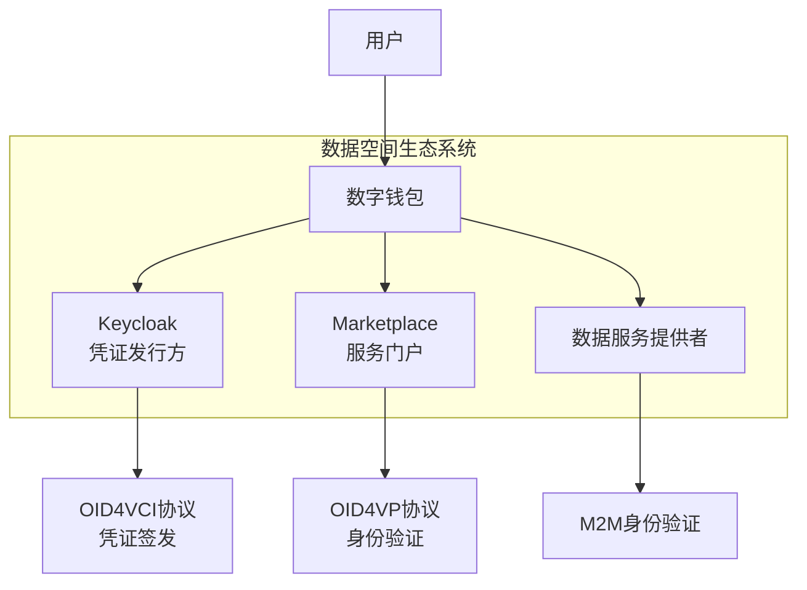
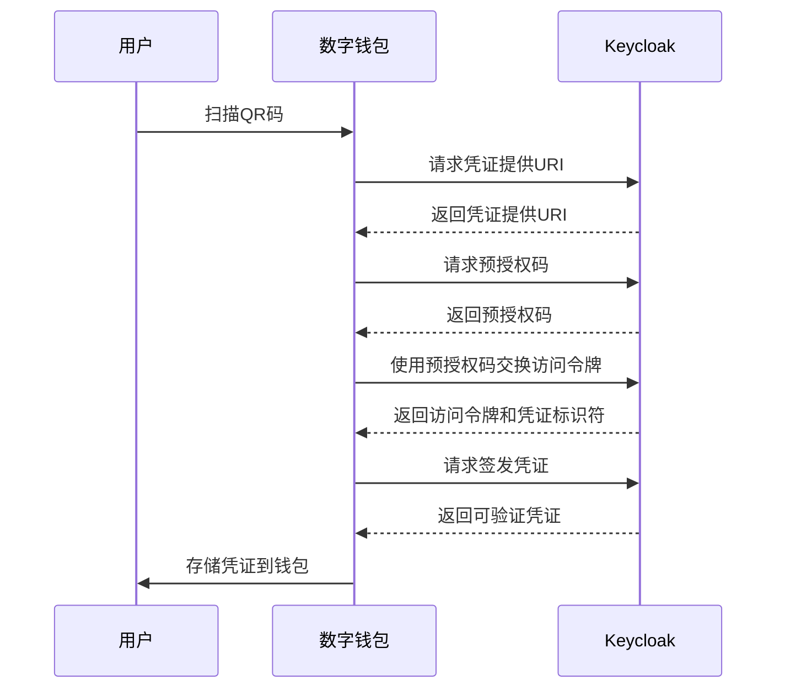
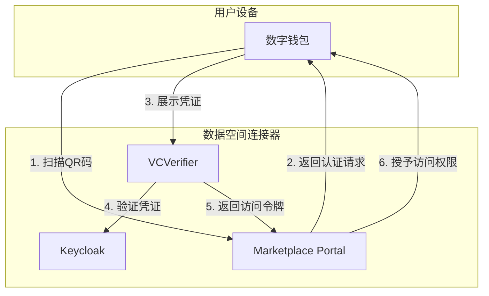

本文档详细介绍了FIWARE数据空间连接器中数字钱包的兼容性、配置和集成方法。数字钱包是数据空间生态系统中的关键组件，用于存储、管理和展示可验证凭证（VCs），实现用户身份验证和授权访问。

## 数字钱包在数据空间中的作用

数字钱包在数据空间中扮演着核心角色，主要功能包括：

1. **存储可验证凭证**：用户从Keycloak等发行方获取的VCs存储在钱包中
2. **身份验证**：通过OID4VP协议向服务提供者展示凭证
3. **授权访问**：基于凭证中的角色和属性获取数据服务访问权限
4. **机器对机器（M2M）通信**：支持自动化服务间的身份验证流程



## 支持的钱包类型

FIWARE数据空间连接器经过测试和验证，支持以下数字钱包：

| 钱包名称 | 平台 | 测试版本 | 默认clientId | OIDC要求 | 推荐用途 |
|---------|------|---------|-------------|---------|---------|
| [Lissi ID Wallet](https://lissi.id/) | iOS | 3.1.3 | `9c481dc3-2ad0-4fe0-881d-c32ad02fe0fc` | PKCE S256 | **生产环境** |
| [Lissi ID Wallet](https://lissi.id/) | Android | 3.1.1 | `9c481dc3-2ad0-4fe0-881d-c32ad02fe0fc` | PKCE S256 | **生产环境** |
| EUDI Reference Wallet (forked .DEV build) | iOS | — | `wallet-dev` | PAR + DPoP + PKCE S256 | 开发/本地测试 |

### 钱包选择建议

- **生产环境**：推荐使用**Lissi ID Wallet**，它支持PKCE S256安全机制，经过充分测试和验证
- **开发测试环境**：可以使用EUDI Reference Wallet的fork版本，但**不建议在生产环境中使用**，因为它支持自签名证书，降低了安全信任模型
- **自定义钱包**：任何支持OID4VCI Draft 15并符合PKCE S256或PAR+DPoP+PKCE S256要求的钱包都可以集成

Sources: [10-x.md](doc/release-notes/10-x.md#L250-L300)

## 钱包预设配置

FIWARE数据空间连接器提供了预配置的钱包设置，通过`values.yaml`中的`wallets`部分进行管理。

### 启用钱包预设

```yaml
keycloak:
  realm:
    wallets:
      enabled: true
      # 可选：自动为每个用户签发所有已声明的凭证类型
      issueCredentialsToUsers: false
```

### 配置详解

| 配置项 | 说明 | 默认值 |
|-------|------|-------|
| `enabled` | 主开关，启用Lissi和EUDI公共OIDC客户端 | `false` |
| `issueCredentialsToUsers` | 全局标志，为未声明凭证的用户自动签发所有已声明的凭证类型 | `false` |
| `lissi.clientId` | Lissi钱包的客户端ID | `9c481dc3-2ad0-4fe0-881d-c32ad02fe0fc` |
| `lissi.redirectUri` | Lissi钱包的重定向URI | `https://oob.lissi.io/vci-cb` |
| `eudi.clientId` | EUDI钱包的客户端ID | `wallet-dev` |
| `eudi.redirectUri` | EUDI钱包的重定向URI | `eu.europa.ec.euidi://authorization` |

### 钱包客户端属性

钱包客户端需要特定的OIDC属性才能正常工作：

```yaml
lissi:
  attributes:
    oid4vci.enabled: "true"
    post.logout.redirect.uris: "+"
    pkce.code.challenge.method: "S256"

eudi:
  attributes:
    oid4vci.enabled: "true"
    post.logout.redirect.uris: "+"
    pkce.code.challenge.method: "S256"
    require.pushed.authorization.requests: "true"
    dpop.bound.access.tokens: "true"
```

### 自定义钱包配置

如果需要覆盖默认配置，只需指定需要修改的字段：

```yaml
keycloak:
  realm:
    wallets:
      enabled: true
      lissi:
        clientId: <your-rotated-lissi-id>
```

Sources: [values.yaml](charts/data-space-connector/values.yaml#L1219-L1260)

## 凭证签发流程

数字钱包通过OID4VCI协议从Keycloak获取可验证凭证。以下是完整的签发流程：

### 1. 功能特性配置

Keycloak需要启用特定的功能特性才能支持OID4VCI：

```yaml
keycloak:
  features:
    enabled:
      - oid4vc-vci
      - oid4vc-vci-preauth-code
      - oid4vc-vci-rest-credential-offer
```

### 2. 凭证类型定义

在Keycloak realm中定义凭证类型：

```yaml
keycloak:
  realm:
    verifiableCredentials:
      user-credential:
        attributes:
          format: "jwt_vc_json"
          verifiable_credential_type: "UserCredential"
          credential_signing_alg: "ES256"
          credential_build_config.token_jws_type: "JWT"
          binding_required: "true"
          binding_required_proof_types: "jwt"
        protocolMappers:
          - name: context-mapper-uc
            protocol: oid4vc
            protocolMapper: oid4vc-context-mapper
            config:
              context: https://www.w3.org/2018/credentials/v1
          - name: email-mapper-uc
            protocol: oid4vc
            protocolMapper: oid4vc-user-attribute-mapper
            config:
              claim.name: email
              userAttribute: email
```

### 3. 凭证签发流程



### 4. 端点变更（Keycloak 26.4+）

| 步骤 | 旧版本 (KC 26.3) | 新版本 (KC 26.4+) |
|-----|----------------|------------------|
| 请求提供URI | `GET /protocol/oid4vc/credential-offer-uri?credential_configuration_id=X` | `GET /protocol/oid4vc/create-credential-offer?credential_configuration_id=X&pre_authorized=true` |
| 构建提供URL | `${issuer}${nonce}` | `${issuer}/${nonce}` |
| `/credential` 请求体 | `{"credential_identifier":"X","format":"jwt_vc"}` | `{"credential_configuration_id":"X"}` |
| `/credential` 响应 | `{"credential":"<jwt>"}` | `{"credentials":[{"credential":"<jwt>"}]}` |

Sources: [10-x.md](doc/release-notes/10-x.md#L100-L150)

## 与Marketplace的集成

数字钱包与Marketplace的集成基于OID4VP协议，实现用户身份验证和凭证展示。

### 集成架构



### 配置步骤

1. **启用Marketplace**：
```yaml
marketplace:
  enabled: true
```

2. **配置代理**（本地开发环境）：
```yaml
squid:
  enabled: true
```

3. **配置浏览器代理**：
   - 安装FoxyProxy插件
   - 配置HTTP代理：`127.0.0.1:8888`

### 使用流程

1. **获取凭证**：
```shell
# 获取操作员凭证
export OPERATOR_CREDENTIAL=$(./doc/scripts/get_credential.sh https://keycloak-consumer.127.0.0.1.nip.io operator-credential operator)
```

2. **登录Marketplace**：
   - 打开钱包，扫描Marketplace登录QR码
   - 选择要分享的凭证
   - 完成身份验证

3. **购买服务**：
   - 浏览服务目录
   - 将服务添加到购物车
   - 完成购买流程

4. **访问服务**：
```shell
# 获取访问令牌
./doc/scripts/get_access_token_oid4vp.sh http://mp-data-service.127.0.0.1.nip.io:8080 $OPERATOR_CREDENTIAL operator
```

Sources: [MARKETPLACE_INTEGRATION.md](doc/MARKETPLACE_INTEGRATION.md#L100-L200)

## 自定义钱包集成指南

如果需要集成自定义钱包，请遵循以下指南：

### 1. OID4VCI Draft 15合规性

确保钱包支持OID4VCI Draft 15规范：
- 使用`credential_configuration_id`而不是`credential_identifier`
- 支持预授权码流程
- 处理`authorization_details`中的`credential_identifiers`

### 2. 安全要求

| 要求 | 说明 |
|-----|------|
| PKCE S256 | 必需，防止授权码拦截攻击 |
| PAR + DPoP | 可选，增强安全性 |
| 自签名证书支持 | 仅限开发环境，生产环境必须使用有效证书 |

### 3. 客户端配置

在Keycloak中手动创建客户端：

```yaml
keycloak:
  realm:
    clients: |
      {
        "clientId": "your-custom-wallet",
        "enabled": true,
        "publicClient": true,
        "attributes": {
          "oid4vci.enabled": "true",
          "pkce.code.challenge.method": "S256",
          "post.logout.redirect.uris": "your-app://callback"
        }
      }
```

### 4. 凭证格式支持

支持以下凭证格式：
- **JWT-VC JSON**：`jwt_vc_json`
- **SD-JWT**：`dc+sd-jwt`

### 5. 测试和调试

使用提供的脚本测试凭证签发：

```shell
# 测试凭证签发
./doc/scripts/get_credential.sh <keycloak-url> <credential-type> <username>
```

## 故障排除

### 常见问题

| 问题 | 原因 | 解决方案 |
|-----|------|---------|
| 403 invalid_client | 客户端未启用OID4VCI | 设置`oid4vci.enabled: "true"` |
| 400 invalid_credential_offer_request | 用户缺少凭证权限 | 启用`issueCredentialsToUsers: true`或手动分配凭证 |
| 凭证验证失败 | 签名密钥不匹配 | 确保Keycloak签名密钥与DID文档中的公钥匹配 |
| 钱包无法连接 | 证书问题 | 检查TLS证书配置，开发环境可使用自签名证书 |

### 调试命令

```shell
# 检查Keycloak日志
kubectl logs -f deployment/keycloak -n consumer

# 测试凭证签发端点
curl -k -X GET "https://keycloak-consumer.127.0.0.1.nip.io/realms/test-realm/.well-known/openid-configuration"

# 验证钱包配置
helm template charts/data-space-connector -f your-values.yaml
```

### 日志分析

启用调试日志：

```yaml
keycloak:
  extraEnvVars:
    - name: KC_LOG_LEVEL
      value: DEBUG
```

## 最佳实践

### 生产环境建议

1. **使用Lissi钱包**：生产环境推荐使用Lissi ID Wallet
2. **配置有效证书**：避免使用自签名证书
3. **启用安全特性**：
   - PKCE S256
   - PAR（Pushed Authorization Requests）
   - DPoP（Demonstration of Proof-of-Possession）
4. **定期轮换密钥**：定期更新签名密钥和证书
5. **监控和审计**：启用Keycloak审计日志

### 开发环境建议

1. **使用EUDI钱包fork版本**：便于本地测试
2. **启用自动凭证签发**：设置`issueCredentialsToUsers: true`
3. **配置代理**：使用Squid代理处理本地DNS解析
4. **使用Android模拟器**：便于测试和调试

## 相关文档

- [Keycloak与OID4VCI凭证签发配置](17-keycloak-yu-oid4vci-ping-zheng-qian-fa-pei-zhi)：详细的Keycloak配置说明
- [OID4VC认证框架](9-oid4vc-ren-zheng-kuang-jia-vcverifier-trusted-issuers-list)：OID4VC协议详解
- [Marketplace Portal集成](21-marketplace-portal-bae-ji-cheng)：Marketplace集成指南
- [H2M服务调用流程](10-h2m-fu-wu-diao-yong-liu-cheng)：人机交互流程
- [M2M服务调用流程](11-m2m-fu-wu-diao-yong-liu-cheng)：机器对机器流程