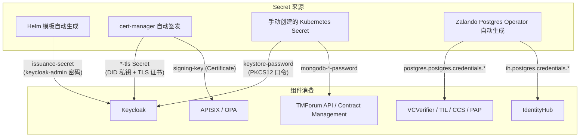
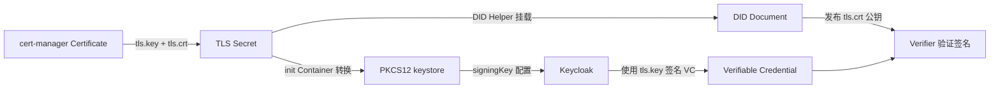
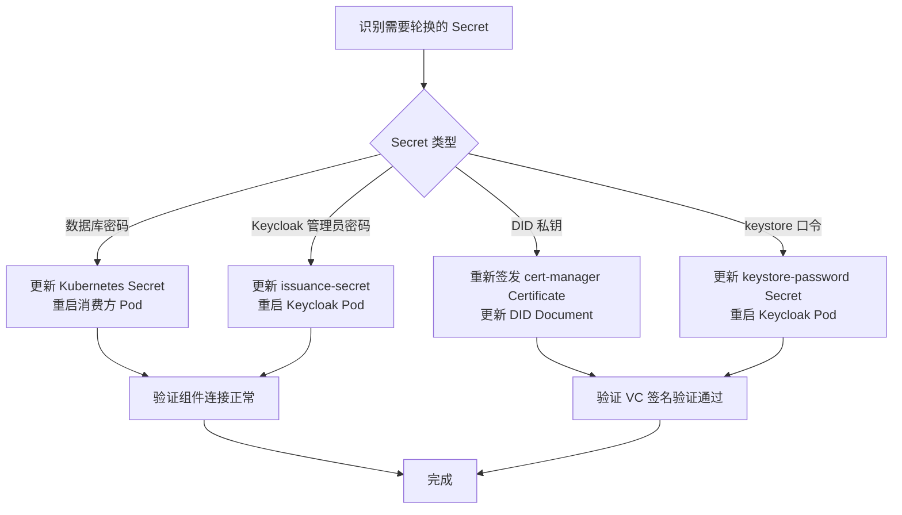

本页面系统梳理 FIWARE Data Space Connector 中涉及的所有 Secret 类型、生命周期管理机制以及生产环境加固策略。数据空间连接器的 Secret 横跨三层：**数据库凭证**（PostgreSQL、MongoDB）、**密钥材料**（DID 签名私钥、TLS 证书、PKCS12 keystore）和**应用凭证**（Keycloak 管理员密码、IdentityHub 超级用户 API Key）。理解它们的生成方式、引用路径和轮换策略，是将集群从开发环境安全提升至生产级别的关键一步。

---

## 1. Secret 全景总览

下图展示了连接器中各组件如何引用 Secret，以及 Secret 的来源分类：



Sources: [values.yaml](charts/data-space-connector/values.yaml#L1-L10), [issuance-secrets.yaml](charts/data-space-connector/templates/issuance-secrets.yaml#L1-L18)

---

## 2. 数据库凭证 Secret

连接器中所有需要持久化存储的组件均依赖 PostgreSQL（核心 IAM 栈）或 MongoDB（Marketplace 充值后端）。数据库凭证的管理模式分为两类：**Zalando Postgres Operator 自动生成**和**手动创建**。

### 2.1 PostgreSQL：Zalando Operator 自动生成模式

当 `managedPostgres.enabled: true` 时，Zalando Postgres Operator 会为每个 `Postgresql` CR 自动创建一组格式固定的 Secret：

| Secret 名称格式 | 内容 Key | 说明 |
|---|---|---|
| `postgres.postgres.credentials.postgresql.acid.zalan.do` | `username`, `password` | 主数据库管理员凭证 |
| `<user>.<team>.credentials.postgresql.acid.zalan.do` | `username`, `password` | 每个 `users` 中声明的用户 |
| `til.postgres.credentials.postgresql.acid.zalan.do` | `username`, `password` | TIL 数据库用户 |
| `ih.postgres.credentials.postgresql.acid.zalan.do` | `username`, `password` | IdentityHub 数据库用户 |

各组件通过 `existingSecret` 字段引用这些 Secret，而非在 values.yaml 中明文书写密码：

```yaml
# 典型引用模式 — 以 trusted-issuers-list 为例
trusted-issuers-list:
  database:
    existingSecret:
      enabled: true
      name: postgres.postgres.credentials.postgresql.acid.zalan.do
      key: password
```

这种模式确保了**密码由 Operator 管理生命周期**，Helm chart 仅持有引用路径。Keycloak 数据库、VCVerifier 数据库、ODRL-PAP 数据库均遵循相同模式。

Sources: [values.yaml](charts/data-space-connector/values.yaml#L64-L68), [values.yaml](charts/data-space-connector/values.yaml#L91-L94), [values.yaml](charts/data-space-connector/values.yaml#L389-L399)

### 2.2 IdentityHub 数据库凭证

IdentityHub 使用独立的 PostgreSQL 数据库，其凭证引用模式略有不同：

```yaml
identityhub:
  postgresql:
    auth:
      username: ih
      existingSecret: ih.postgres.credentials.postgresql.acid.zalan.do
      existingSecretPasswordKey: password
```

在 Deployment 模板中，密码通过 `secretKeyRef` 注入环境变量 `EDC_DATASOURCE_PARTICIPANTCONTEXT_PASSWORD`、`EDC_DATASOURCE_DIDRESOURCE_PASSWORD` 等多个数据源。超级用户 API Key 同样支持外部 Secret 引用：

```yaml
identityhub:
  superuser:
    existingSecret: <secret-name>
    existingSecretKeyKey: <key-in-secret>
    key: <plain-key-ignored-if-existingSecret-set>
```

Sources: [values.yaml](charts/data-space-connector/values.yaml#L2414-L2418), [values.yaml](charts/data-space-connector/values.yaml#L2644-L2648), [identityhub-deployment.yaml](charts/data-space-connector/templates/identityhub-deployment.yaml#L200-L225)

### 2.3 MongoDB 凭证（Marketplace 场景）

当启用 Marketplace（BAE）时，Charging Backend 和 Logic Proxy 各需要一个 MongoDB 数据库密码 Secret：

| Secret 名称 | 用途 | values.yaml 引用路径 |
|---|---|---|
| `mongodb-charging-password` | Charging Backend 数据库密码 | `marketplace.bizEcosystemChargingBackend.existingSecret` |
| `mongodb-belp-password` | Logic Proxy 数据库密码 | `marketplace.bizEcosystemLogicProxy.existingSecret` |

这两个 Secret **不会由 chart 自动生成**，必须在部署前手动创建。密码 key 的名称在各自的 `db.secretKey` 中配置（默认为 `password`）。

Sources: [values.yaml](charts/data-space-connector/values.yaml#L1727), [values.yaml](charts/data-space-connector/values.yaml#L1819)

---

## 3. Keycloak 管理员密码与 issuance-secret

Keycloak 管理员密码是连接器中最核心的应用级 Secret 之一。Chart 提供了一个**可选的自动生成功能**：

```yaml
issuance:
  generatePasswords:
    enabled: true        # 开启自动生成
    secretName: issuance-secret
```

当 `enabled: true` 时，Helm 模板 [issuance-secrets.yaml](charts/data-space-connector/templates/issuance-secrets.yaml) 会创建一个 Secret，其中包含一个随机生成的 30 字符字母数字密码，key 为 `keycloak-admin`。模板使用 `lookup` 函数检查集群中是否已存在该 Secret——如果已存在则复用现有值，避免密码在 `helm upgrade` 时被轮换：

```yaml
{{- $existing := lookup "v1" "Secret" $.Release.Namespace .Values.issuance.generatePasswords.secretName }}
# ... 如果 $existing 存在，保留其 keycloak-admin 值；否则 randAlphaNum 30 生成新密码
```

Keycloak 通过以下配置消费此 Secret：

```yaml
keycloak:
  keycloak:
    adminUser: keycloak-admin
    existingSecret: issuance-secret
    secretKeys:
      adminPasswordKey: keycloak-admin
```

Sources: [values.yaml](charts/data-space-connector/values.yaml#L1-L10), [values.yaml](charts/data-space-connector/values.yaml#L331-L335), [issuance-secrets.yaml](charts/data-space-connector/templates/issuance-secrets.yaml#L1-L18)

---

## 4. DID 签名密钥与 TLS 证书

DID（Decentralized Identifier）是数据空间中每个组织的身份基石。其私钥的管理直接决定了组织身份的安全性。

### 4.1 证书签发：cert-manager Certificate

每个参与者的 DID 签名密钥通常由 cert-manager 以 `Certificate` 资源形式签发，存储为 Kubernetes TLS Secret：

```yaml
apiVersion: cert-manager.io/v1
kind: Certificate
metadata:
  name: signing-key
  namespace: consumer
spec:
  secretName: signing-key          # 生成的 TLS Secret 名称
  issuerRef:
    name: selfsigned-issuer
    kind: ClusterIssuer
  privateKey:
    algorithm: ECDSA
    size: 256
    encoding: PKCS8
  dnsNames:
    - fancy-marketplace.biz
```

生成的 Secret 包含 `tls.crt`、`tls.key` 和 `ca.crt` 三个 key。生产环境应使用 `prod` 类型的 ClusterIssuer（Let's Encrypt）而非 `selfsigned-issuer`。

Sources: [k3s/consumer/signing-key-cert.yaml](k3s/consumer/signing-key-cert.yaml#L1-L18), [k3s/provider/signing-key-cert.yaml](k3s/provider/signing-key-cert.yaml#L1-L18)

### 4.2 PKCS12 Keystore 准备：init Container

Keycloak 签发 Verifiable Credentials 时需要 PKCS12 格式的 keystore，而非 PEM 格式。Chart 通过 init Container 在 Pod 启动前自动完成格式转换：

```yaml
extraInitContainers:
  - name: prepare-keystore
    image: alpine/openssl:3.5.5
    command: ["/bin/sh", "-c"]
    args:
      - |
        openssl pkcs12 -export \
          -in /certs-did/tls.crt \
          -inkey /certs-did/tls.key \
          -certfile /certs-did/ca.crt \
          -out /did-material/cert.pfx \
          -name "didPrivateKey" \
          -passout env:STORE_PASS
        chmod 644 /did-material/cert.pfx
    env:
    - name: "STORE_PASS"
      valueFrom:
        secretKeyRef:
          name: keystore-password
          key: password
    volumeMounts:
      - name: did-material
        mountPath: /did-material
      - name: did-priv-key
        mountPath: /certs-did
```

**`keystore-password` Secret 必须在部署前手动创建**。示例（Base64 编码的明文密码）：

```yaml
apiVersion: v1
kind: Secret
metadata:
  name: keystore-password
  namespace: consumer
type: Opaque
data:
  password: ZHNjLWNvbnN1bWVyLWtleXN0b3JlLTIwMjYh   # base64("dsc-consumer-keystore-2026!")
```

该密码通过环境变量 `STORE_PASS` 传递给 init Container，同时通过 Keycloak 的 `extraEnvVars` 传递给主容器，供 realm 签名配置中的 `${STORE_PASS}` 占位符解析：

```yaml
signingKey:
  storePath: /did-material/cert.pfx
  storePassword: "${STORE_PASS}"
  keyAlias: didPrivateKey
  keyPassword: "${STORE_PASS}"
```

Sources: [k3s/consumer.yaml](k3s/consumer.yaml#L29-L57), [k3s/consumer/keystore-password.yaml](k3s/consumer/keystore-password.yaml#L1-L9), [k3s/provider/keystore-password.yaml](k3s/provider/keystore-password.yaml#L1-L9)

### 4.3 DID 私钥与签名密钥的关系

**核心约束**：Keycloak 用于签名 Verifiable Credentials 的私钥，**必须**与组织 DID Document 中发布的公钥来自同一密钥对。如果 keystore 包含的密钥对与 DID Document 不匹配，所有签名验证将失败，发出的凭证将被数据空间中其他参与者拒绝。



Sources: [doc/deployment-integration/roles/KEYCLOAK.md](doc/deployment-integration/roles/KEYCLOAK.md#L90-L100)

---

## 5. ELSI Keystore Secret（可选）

当使用 `did:elsi` 进行凭证签发时，chart 支持通过 `elsi.keystore` 值注入一个包含 PKCS12 文件的 Secret：

```yaml
elsi:
  enabled: true
  keystore:
    store.p12: <BASE64_ENCODED_CONTENT>
```

模板 [elsi-secret.yaml](charts/data-space-connector/templates/elsi-secret.yaml) 将其渲染为名为 `elsi-secret` 的 Kubernetes Secret。此功能仅在需要 EBSI/ELSI 合规的场景下启用。

Sources: [values.yaml](charts/data-space-connector/values.yaml#L309-L323), [elsi-secret.yaml](charts/data-space-connector/templates/elsi-secret.yaml#L1-L11)

---

## 6. IdentityHub API Key Secret

IdentityHub 的超级用户 API Key 格式为 `base64(<username>).<random-string>`。Chart 支持两种配置方式：

| 方式 | 配置 | 安全性 |
|---|---|---|
| **外部 Secret 引用**（推荐） | `existingSecret` + `existingSecretKeyKey` | 密码不出现在 values 文件中 |
| **明文写入**（仅限开发） | `key: <plain-text-value>` | 密码暴露在 values 文件和 Helm release 中 |

生产环境必须使用外部 Secret 引用方式。Secret 的创建和轮换由运维团队自行管理。

Sources: [values.yaml](charts/data-space-connector/values.yaml#L2414-L2418)

---

## 7. HashiCorp Vault 集成（可选）

Chart 内置了对 HashiCorp Vault 的可选支持，但默认禁用：

```yaml
vault:
  enabled: false
  injector:
    enabled: false
  server:
    dev:
      enabled: true
      devRootToken: "root"
  hashicorp:
    url: "http://{{ .Release.Name }}-vault:8200"
    token: "root"
```

> **注意**：当前 Vault 集成配置中包含 `devRootToken: "root"` 和 `token: "root"` 等开发默认值。生产环境如需启用 Vault，必须替换所有默认 token 并配置适当的认证后端（如 Kubernetes Auth）。Vault Injector 可以将 Secret 注入到 Pod 的环境变量或文件中，替代直接创建 Kubernetes Secret。

Sources: [values.yaml](charts/data-space-connector/values.yaml#L2690-L2705)

---

## 8. 生产环境安全加固清单

### 8.1 Secret 创建清单

以下是部署到生产环境前必须手动创建的所有 Secret：

| Secret 名称 | 所在命名空间 | 内容 | 创建方式 |
|---|---|---|---|
| `keystore-password` | consumer / provider | PKCS12 keystore 口令 | `kubectl create secret generic` |
| `mongodb-charging-password` | marketplace 命名空间 | MongoDB 密码（如启用 Marketplace） | `kubectl create secret generic` |
| `mongodb-belp-password` | marketplace 命名空间 | MongoDB 密码（如启用 Marketplace） | `kubectl create secret generic` |
| IdentityHub superuser secret | 部署命名空间 | API Key | `kubectl create secret generic` |
| Rainbow DB secret | 部署命名空间 | 数据库密码（如启用 Rainbow/DSP） | `kubectl create secret generic` |

以下 Secret 由基础设施自动管理，**无需也不应**手动创建：

| Secret 名称 | 来源 | 管理者 |
|---|---|---|
| `issuance-secret` | Helm 模板自动生成 | Helm（首次安装时生成，upgrade 时保留） |
| `postgres.postgres.credentials.*` | Zalando Postgres Operator | Postgres Operator |
| `*-tls` | cert-manager Certificate | cert-manager |
| `signing-key` | cert-manager Certificate | cert-manager |

### 8.2 加固措施

| 措施 | 说明 | 优先级 |
|---|---|---|
| **替换自签名证书** | 将 `certManagerResources.type` 设为 `"prod"`，使用 Let's Encrypt 签发真实 TLS 证书 | 必须 |
| **保护 DID 私钥** | DID 私钥是组织身份的根基。一旦泄露，攻击者可以冒充组织签发凭证 | 必须 |
| **限制 TIL 管理 API** | Trusted Issuers List 的 `/issuer` 管理端点必须严格限制访问，仅允许授权运维人员调用 | 必须 |
| **更换 APISIX 管理凭证** | 将 APISIX 的默认 `admin` 凭证替换为强密码 | 必须 |
| **使用外部 PostgreSQL** | 生产环境应使用具有备份和高可用能力的外部 PostgreSQL 实例，而非内置的 managed PostgreSQL | 推荐 |
| **密码轮换策略** | 为 Keycloak 管理员密码、数据库密码、keystore 口令制定定期轮换计划 | 推荐 |
| **启用 Vault** | 使用 HashiCorp Vault 管理所有 Secret，替代静态 Kubernetes Secret | 推荐 |
| **RBAC 限制** | 对 Secret 所在命名空间实施严格的 RBAC 策略，限制 `get`/`list` Secret 的权限 | 必须 |
| **审计日志** | 启用 Kubernetes 审计日志，记录所有 Secret 访问操作 | 推荐 |
| **etcd 加密** | 配置 Kubernetes etcd 加密静态数据（EncryptionConfiguration），确保 Secret 在磁盘上不可明文读取 | 推荐 |

Sources: [doc/deployment-integration/roles/provider/README.md](doc/deployment-integration/roles/provider/README.md#L478-L542), [doc/deployment-integration/roles/operator/README.md](doc/deployment-integration/roles/operator/README.md#L270-L317)

### 8.3 Secret 轮换流程



> **关于 issuance-secret 的自动保留**：Helm 模板中使用 `lookup` 函数检查 Secret 是否已存在，如已存在则复用现有值。这意味着 `helm upgrade` 不会意外覆盖 Keycloak 管理员密码。但如果需要主动轮换，必须先手动删除该 Secret 或使用 `kubectl` 直接更新其值。

Sources: [issuance-secrets.yaml](charts/data-space-connector/templates/issuance-secrets.yaml#L1-L18)

---

## 9. Secret 与组件引用关系速查表

| 组件 | Secret 名称 | 引用方式 | values.yaml 路径 |
|---|---|---|---|
| **Keycloak** admin 密码 | `issuance-secret` | `existingSecret` | `keycloak.keycloak.existingSecret` |
| **Keycloak** 数据库密码 | `postgres.postgres.credentials.postgresql.acid.zalan.do` | `database.existingSecret` | `keycloak.database.existingSecret` |
| **Keycloak** keystore 口令 | `keystore-password` | `secretKeyRef` (env) | `keycloak.extraEnvVars[].valueFrom.secretKeyRef` |
| **Keycloak** DID 私钥 | `<domain>-tls` | volume mount | `keycloak.extraVolumes[].secret.secretName` |
| **TIL** 数据库密码 | `postgres.postgres.credentials.postgresql.acid.zalan.do` | `existingSecret` | `decentralizedIam.vcAuthentication.trusted-issuers-list.database.existingSecret` |
| **VCVerifier** 数据库密码 | `postgres.postgres.credentials.postgresql.acid.zalan.do` | `existingSecret` | `decentralizedIam.vcAuthentication.vcverifier.deployment.database.existingSecret` |
| **ODRL-PAP** 数据库密码 | `postgres.postgres.credentials.postgresql.acid.zalan.do` | `existingSecret` | `decentralizedIam.odrlAuthorization.odrl-pap.db.existingSecret` |
| **TMForum API** 数据库密码 | `postgres.postgres.credentials.postgresql.acid.zalan.do` | `existingSecret` | `tm-forum-api.db.existingSecret` |
| **IdentityHub** 数据库密码 | `ih.postgres.credentials.postgresql.acid.zalan.do` | `existingSecret` | `identityhub.postgresql.auth.existingSecret` |
| **IdentityHub** 超级用户 Key | 用户自定义 | `existingSecret` | `identityhub.superuser.existingSecret` |
| **Marketplace** Charging DB | `mongodb-charging-password` | `existingSecret` | `marketplace.bizEcosystemChargingBackend.existingSecret` |
| **Marketplace** Logic Proxy DB | `mongodb-belp-password` | `existingSecret` | `marketplace.bizEcosystemLogicProxy.existingSecret` |
| **Rainbow** 数据库密码 | 用户自定义 | `existingSecret` | `rainbow.db.existingSecret` |

---

## 下一步阅读

- 如需了解如何为不同角色（Consumer / Provider / Operator）配置完整的 Helm values，请参阅 [values.yaml 全局配置参考](16-values-yaml-quan-ju-pei-zhi-can-kao)
- 如需了解 Keycloak 凭证签发的详细配置（verifiableCredentials、protocolMappers、签名密钥），请参阅 [Keycloak 与 OID4VCI 凭证签发配置](17-keycloak-yu-oid4vci-ping-zheng-qian-fa-pei-zhi)
- 如需了解各部署角色的组件需求和部署步骤，请参阅 [Consumer 角色部署](3-consumer-jiao-se-bu-shu)、[Provider 角色部署](4-provider-jiao-se-bu-shu) 或 [Consumer + Provider 双角色部署](5-consumer-provider-shuang-jiao-se-bu-shu)
- 如需了解 Operator 如何管理数据空间信任基础设施的 Secret，请参阅 [Operator（数据空间治理）部署](6-operator-shu-ju-kong-jian-zhi-li-bu-shu)