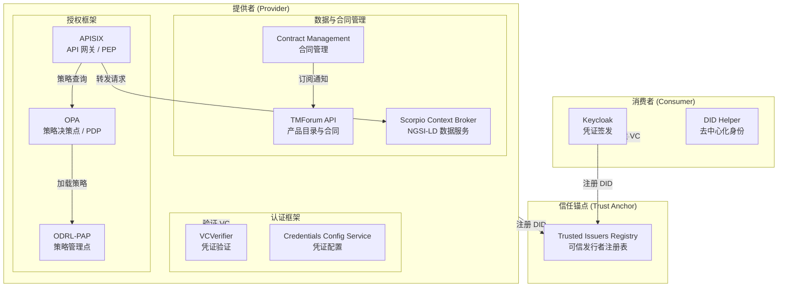
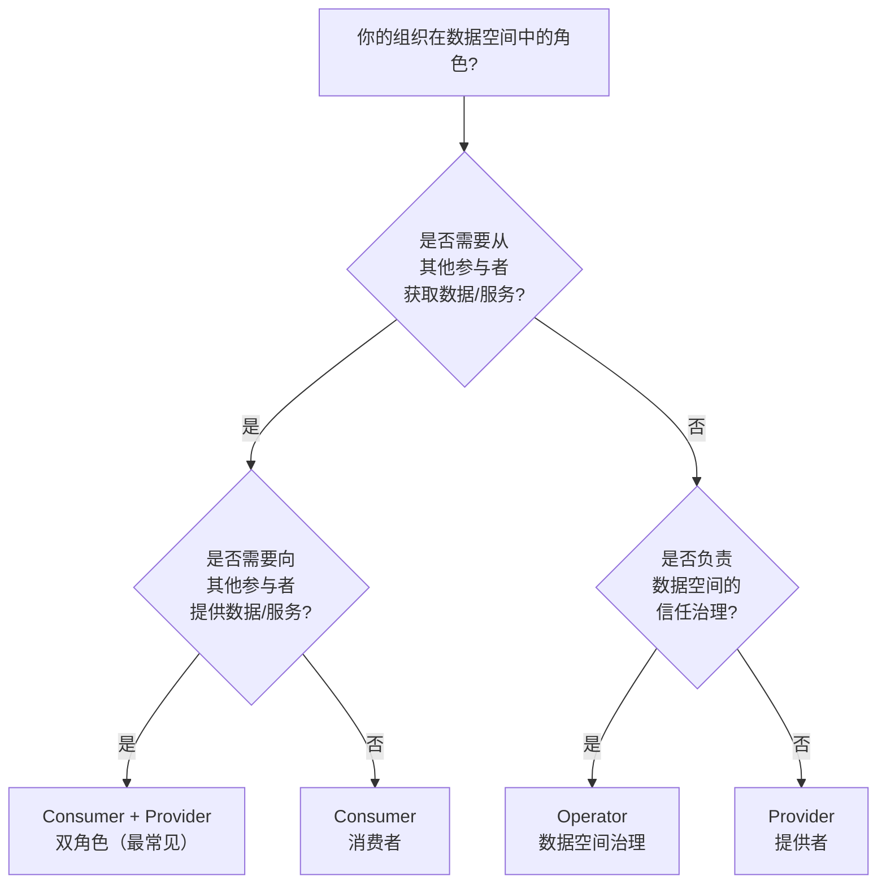

本指南帮助你在最短时间内启动一个可用的 FIWARE Data Space Connector（FIWARE DSC）实例，理解数据空间中各组件的交互关系。指南涵盖**本地学习环境部署**和**按角色生产部署**两种路径，你可根据自身需求选择合适的入口。

---

## 部署路径总览

FIWARE DSC 提供两种截然不同的部署方式，分别面向不同的使用场景：

| 部署方式 | 适用场景 | 启动命令 | 耗时 | 底层技术 |
|---------|---------|---------|------|---------|
| **本地快速部署**（Maven） | 学习、开发、端到端演示 | `mvn clean deploy -Plocal` | 5–10 分钟 | k3s (Docker 容器内) |
| **Helm Chart 部署** | 生产环境、按角色定制 | `helm install` + `values.yaml` | 视配置而定 | Kubernetes 集群 |

> **重要提示**：本地部署将一次性启动完整的数据空间（包括 2 个参与者和 1 个信任锚点），仅用于**学习和开发目的**。生产环境部署请参考[按角色部署](#按角色部署生产环境)章节。

Sources: [README.md](README.md#L442-L452), [LOCAL.MD](doc/deployment-integration/local-deployment/LOCAL.MD#L1-L10)

---

## 本地快速部署（学习与开发）

### 架构概览

本地部署会自动构建一个"最小可行数据空间"（Minimum Viable Dataspace），包含两个参与者（Consumer 和 Provider）以及一个 Trust Anchor，完整展示数据空间的核心交互流程。



Sources: [LOCAL.MD](doc/deployment-integration/local-deployment/LOCAL.MD#L55-L88), [README.md](README.md#L88-L115)

### 环境准备

#### 硬件要求

本地部署在一个 Docker 容器中运行 k3s Kubernetes 集群，同时部署 2 个连接器实例和 1 个信任锚点，对系统资源有一定要求：

| 资源 | 最低要求 | 推荐配置 |
|------|---------|---------|
| 内存 | 16 GB | **≥ 24 GB** |
| 操作系统 | Linux / macOS | Ubuntu（主要测试平台） |
| 磁盘空间 | 约 10 GB | SSD 优先 |

#### 必需工具

在开始之前，请确保以下工具已正确安装：

| 工具 | 最低版本 | 用途 | 安装链接 |
|------|---------|------|---------|
| [Maven](https://maven.apache.org/) | 3.6.3 | 构建与部署编排 | [安装指南](https://maven.apache.org/install.html) |
| Java JDK | 17 | 运行环境 | 需配置 `JAVA_HOME` |
| [Docker](https://www.docker.com/) | 27.0.0 | 运行 k3s 集群容器 | [安装指南](https://docs.docker.com/get-docker/) |

#### 可选工具（推荐安装）

以下工具不参与部署过程，但对后续交互调试和验证至关重要：

| 工具 | 用途 | 安装链接 |
|------|------|---------|
| [kubectl](https://kubernetes.io/docs/tasks/tools/install-kubectl/) | 管理 Kubernetes 资源 | [安装指南](https://kubernetes.io/docs/tasks/tools/install-kubectl/) |
| [curl](https://curl.se/download.html) | 发送 HTTP 请求 | [安装指南](https://curl.se/download.html) |
| [jq](https://stedolan.github.io/jq/download/) | 解析 JSON 响应 | [下载](https://stedolan.github.io/jq/download/) |
| [yq](https://mikefarah.gitbook.io/yq/) | 处理 YAML 配置 | [安装指南](https://mikefarah.gitbook.io/yq/) |

项目提供了一个自动化检测脚本，可快速验证所有工具是否满足要求：

```shell
./doc/deployment-integration/local-deployment/checkRequirements.sh
```

Sources: [LOCAL.MD](doc/deployment-integration/local-deployment/LOCAL.MD#L12-L35), [checkRequirements.sh](doc/deployment-integration/local-deployment/checkRequirements.sh#L1-L60)

#### Linux 系统特殊配置

在当前的 Linux 发行版中，`br_netfilter` 内核模块默认处于禁用状态，这会导致 k3s 集群内部出现网络问题，阻止连接器正常启动。在部署前务必手动启用：

```shell
sudo modprobe br_netfilter
```

Sources: [LOCAL.MD](doc/deployment-integration/local-deployment/LOCAL.MD#L41-L45)

### 一键启动

完成环境准备后，执行以下命令即可启动完整的数据空间：

```shell
mvn clean deploy -Plocal
```

该命令执行后，Maven 会依次完成以下操作：

1. **复制 Helm Chart**：将 `charts/` 目录中的图表复制到 `target/charts`
2. **复制基础设施资源**：将 `k3s/infra` 和 `k3s/namespaces` 复制到 `target/k3s`
3. **模板渲染**：对每个参与者（[trust-anchor](k3s/trust-anchor.yaml)、[provider](k3s/provider.yaml)、[consumer](k3s/consumer.yaml)）执行 `helm template`，生成 Kubernetes 清单
4. **启动 k3s 集群**：通过 [k3s-maven-plugin](https://github.com/kokuwaio/k3s-maven-plugin) 在 Docker 容器内启动 k3s
5. **部署基础设施**：通过 `kubectl apply` 部署命名空间、Traefik Ingress Controller、CoreDNS 配置等
6. **部署应用组件**：通过 `kubectl apply` 部署渲染后的 Helm Chart

整个过程约需 5–10 分钟（取决于机器性能）。

Sources: [LOCAL.MD](doc/deployment-integration/local-deployment/LOCAL.MD#L46-L55), [LOCAL.MD](doc/deployment-integration/local-deployment/LOCAL.MD#L1490-L1500)

### 连接到集群

部署完成后，通过以下命令连接到运行中的 k3s 集群：

```shell
# 设置 kubeconfig
export KUBECONFIG=$(pwd)/target/k3s.yaml

# 查看所有已部署资源
kubectl get all --all-namespaces
```

### 可用服务端点

本地部署会自动创建一套 Ingress 路由，通过 `*.127.0.0.1.nip.io` 域名访问各组件。所有外部交互均通过 Traefik Ingress Controller 进行，并配合 CoreDNS 确保集群内外解析一致。

| 服务端点 | 组件 | 所属角色 | 说明 |
|---------|------|---------|------|
| `https://tir.127.0.0.1.nip.io:8443/` | Trusted Issuers Registry | Trust Anchor | 可信发行者注册表查询 |
| `https://keycloak-consumer.127.0.0.1.nip.io:8443/` | Keycloak | Consumer | 凭证签发管理控制台 |
| `https://provider-verifier.127.0.0.1.nip.io:8443/` | VCVerifier | Provider | OID4VP 认证端点 |
| `https://mp-data-service.127.0.0.1.nip.io:8443/` | APISIX | Provider | API 网关入口（所有受保护服务的统一入口） |
| `http://scorpio-provider.127.0.0.1.nip.io:8080/` | Scorpio Context Broker | Provider | NGSI-LD 数据服务（仅供演示） |
| `http://pap-provider.127.0.0.1.nip.io:8080/` | ODRL-PAP | Provider | 策略管理端点（仅供演示） |
| `https://marketplace.127.0.0.1.nip.io:8443/` | BAE Marketplace | Provider | 市场门户（如已启用） |

> **安全提示**：带"仅供演示"标注的端点在生产环境中绝不应公开暴露，必须置于认证/授权框架之后。

Sources: [LOCAL.MD](doc/deployment-integration/local-deployment/LOCAL.MD#L1380-L1430)

### Maven 部署配置文件（Profile）

Maven 本地部署支持多个 Profile，用于启用不同的功能集。可通过组合使用：

```shell
# 默认本地部署
mvn clean deploy -Plocal

# 启用 Gaia-X 信任框架集成
mvn clean deploy -Plocal,gaia-x

# 启用数据空间协议（DSP）支持
mvn clean deploy -Plocal,dsp

# 启用 eIDAS / did:elsi 合规
mvn clean deploy -Plocal,elsi

# 启用 TM Forum API 支持
mvn clean deploy -Plocal,tmf
```

各 Profile 对应的配置覆盖文件位于 `k3s/` 目录：

| Profile | Consumer 覆盖 | Provider 覆盖 | 说明 |
|---------|--------------|--------------|------|
| `local`（默认） | [consumer.yaml](k3s/consumer.yaml) | [provider.yaml](k3s/provider.yaml) | 基础本地部署 |
| `gaia-x` | [consumer-gaia-x.yaml](k3s/consumer-gaia-x.yaml) | [provider-gaia-x.yaml](k3s/provider-gaia-x.yaml) | Gaia-X 合规配置 |
| `dsp` | [dsp-consumer.yaml](k3s/dsp-consumer.yaml) | [dsp-provider.yaml](k3s/dsp-provider.yaml) | 数据空间协议 |
| `elsi` | [consumer-elsi.yaml](k3s/consumer-elsi.yaml) | [provider-elsi.yaml](k3s/provider-elsi.yaml) | eIDAS/did:elsi |
| `tmf` | [consumer-tmf.yaml](k3s/consumer-tmf.yaml) | — | TM Forum API |

Sources: [README.md](README.md#L456-L460), [LOCAL.MD](doc/deployment-integration/local-deployment/LOCAL.MD#L1500-L1563)

---

## 按角色部署（生产环境）

生产环境中，每个组织根据其在数据空间中的角色，只需部署所需的组件子集。FIWARE DSC 提供了一套 Helm Chart，通过 `values.yaml` 控制各组件的启用/禁用。

### 角色选择指南



四种角色的组件需求对比：

| 组件 | Consumer | Provider | Consumer + Provider | Operator |
|------|:--------:|:--------:|:-------------------:|:--------:|
| **Keycloak**（凭证签发） | ✅ 必需 | ✅ 必需 | ✅ 必需 | — |
| **DID Helper**（去中心化身份） | ✅ 必需 | ✅ 必需 | ✅ 必需 | — |
| **VCVerifier**（凭证验证） | — | ✅ 必需 | ✅ 必需 | — |
| **Credentials Config Service** | — | ✅ 必需 | ✅ 必需 | — |
| **Trusted Issuers List** | — | ✅ 必需 | ✅ 必需 | — |
| **APISIX**（API 网关） | — | ✅ 必需 | ✅ 必需 | — |
| **OPA**（策略决策） | — | ✅ 必需 | ✅ 必需 | — |
| **ODRL-PAP**（策略管理） | — | ✅ 必需 | ✅ 必需 | — |
| **PostgreSQL** | ✅ 必需 | ✅ 必需 | ✅ 必需 | ✅ 必需 |
| **TMForum API** | — | 🔶 可选 | 🔶 可选 | — |
| **Contract Management** | — | 🔶 可选 | 🔶 可选 | — |
| **FDSC-EDC**（数据空间协议） | 🔶 可选 | 🔶 可选 | 🔶 可选 | — |
| **Trusted Issuers Registry** | — | — | — | ✅ 必需 |

> **图例**：✅ 必需 = 必须部署才能正常工作；🔶 可选 = 增强功能，非基础角色所必需；— = 与该角色无关。

Sources: [roles/README.md](doc/deployment-integration/roles/README.md#L1-L172)

### 部署步骤

#### 1. 添加 Helm 仓库

```shell
helm repo add dsc https://fiware.github.io/data-space-connector/
helm repo update
```

#### 2. 创建 values.yaml

根据你的角色选择合适的 `values.yaml` 配置。基础配置示例可参考 `k3s/` 目录下的文件：

- **Consumer**：参考 [k3s/consumer.yaml](k3s/consumer.yaml)
- **Provider**：参考 [k3s/provider.yaml](k3s/provider.yaml)
- **Trust Anchor（Operator）**：参考 [k3s/trust-anchor.yaml](k3s/trust-anchor.yaml)

`values.yaml` 的结构遵循 Helm Umbrella Chart 模式——顶层 `values.yaml` 通过别名（alias）控制所有子 Chart 的配置。例如，修改 Keycloak 镜像版本：

```yaml
keycloak:
  image:
    tag: 26.6.2
```

Sources: [README.md](README.md#L432-L440), [Chart.yaml](charts/data-space-connector/Chart.yaml#L1-L92), [consumer/README.md](doc/deployment-integration/roles/consumer/README.md#L90-L110)

#### 3. 执行部署

```shell
helm install <部署名称> dsc/data-space-connector \
  -n <命名空间> \
  --create-namespace \
  -f values.yaml
```

### Consumer 角色部署要点

Consumer 仅需 **Keycloak**（凭证签发）和 **DID Helper**（去中心化身份），不需要部署完整的 FIWARE DSC。核心配置要点：

1. **DID 选择**：生产环境推荐 `did:web`（依赖组织控制的域名），测试环境可用 `did:key`
2. **Keycloak 领域配置**：需声明可签发的凭证类型（`verifiableCredentials`）及其属性映射
3. **前置条件**：部署前需联系数据空间 Operator 完成组织入驻，获取 Trust Anchor 的 TIR 端点 URL

Sources: [consumer/README.md](doc/deployment-integration/roles/consumer/README.md#L1-L200)

### Provider 角色部署要点

Provider 包含 Consumer 的全部组件，外加**认证框架**（VCVerifier、Credentials Config Service、Trusted Issuers List）和**授权框架**（APISIX、OPA、ODRL-PAP）。关键配置：

1. **凭证配置注册**：通过 `credentials-config-service` 的 `registration` 功能，声明每项服务接受的凭证类型及其可信发行者
2. **ODRL 策略**：通过 ODRL-PAP 定义基于属性的访问控制策略，OPA 自动拉取并执行
3. **可选组件**：TMForum API + Contract Management 用于产品目录和自动化合同管理

Sources: [provider/README.md](doc/deployment-integration/roles/provider/README.md#L1-L200)

### Consumer + Provider 双角色部署

这是最常见的生产场景。核心原则：

- **单一 DID**：一个组织在数据空间中只有一个去中心化身份，不应为 Consumer 和 Provider 功能分别创建 DID
- **单一 Keycloak 实例**：同一个 Keycloak 领域同时处理向其他提供者出示的凭证（Consumer 功能）和本组织员工/服务的凭证（Provider 功能）
- **共享组件风险**：PostgreSQL 和 Keycloak 为 Consumer 与 Provider 功能共享，建议采用高可用部署

Sources: [consumer-provider/README.md](doc/deployment-integration/roles/consumer-provider/README.md#L1-L30)

### Operator 角色部署

Operator 是数据空间的中立治理机构，负责运营共享信任基础设施。核心职责：

1. **运营 Trust Anchor**：维护可信发行者注册表（TIR），提供标准化的 EBSI Trusted Issuers Registry API
2. **组织入驻**：验证新组织身份、注册 DID、分配可签发的凭证类型
3. **可选：Central Marketplace**：运营共享市场，发布和交易数据产品

> **关键约束**：Trust Anchor 必须拥有**独立的数据库实例**，与任何参与者的基础设施完全隔离，以维护中立性。

Sources: [operator/README.md](doc/deployment-integration/roles/operator/README.md#L1-L200)

---

## Helm Chart 结构详解

FIWARE DSC 以 [Helm Umbrella Chart](https://helm.sh/docs/howto/charts_tips_and_tricks/#complex-charts-with-many-dependencies) 形式组织，所有子 Chart 及其依赖关系均可通过顶层 `values.yaml` 统一管理。

```mermaid
graph TD
    DSC["data-space-connector<br/>Umbrella Chart"]

    subgraph IAM["身份与访问管理"]
        DIAM["decentralized-iam"]
        TIL["trusted-issuers-list"]
        VCV["VCVerifier"]
        CCS["credentials-config-service"]
        PAP["odrl-pap"]
        OPA["OPA"]
        APISIX["APISIX"]
    end

    subgraph DataSvc["数据服务"]
        SCORPIO["scorpio-broker-aaio"]
    end

    subgraph Issuance["凭证签发"]
        KC["Keycloak<br/>(CloudPirates)"]
    end

    subgraph Contract["合同管理"]
        TMAPI["tm-forum-api"]
        CM["contract-management"]
    end

    subgraph Marketplace["市场"]
        BAE["business-api-ecosystem<br/>(BAE Marketplace)"]
        MONGO["MongoDB Operator"]
    end

    subgraph DSP["数据空间协议"]
        EDC["fdsc-edc"]
        VAULT["Vault"]
    end

    subgraph Infra["基础设施"]
        PG["PostgreSQL Operator"]
        CM_CERT["cert-manager"]
        PROM["Prometheus"]
        GRAFANA["Grafana"]
        OTEL_OP["OpenTelemetry Operator"]
        OTEL_COL["OpenTelemetry Collector"]
        TEMPO["Grafana Tempo"]
        DID["did-helper"]
        DASH["fdsc-dashboard"]
    end

    DSC --> DIAM
    DSC --> SCORPIO
    DSC --> KC
    DSC --> TMAPI
    DSC --> CM
    DSC --> BAE
    DSC --> MONGO
    DSC --> EDC
    DSC --> VAULT
    DSC --> DASH
    DSC --> DID
    DSC --> CM_CERT
    DSC --> PROM
    DSC --> GRAFANA
    DSC --> OTEL_OP
    DSC --> OTEL_COL
    DSC --> TEMPO
    DIAM --> TIL
    DIAM --> VCV
    DIAM --> CCS
    DIAM --> PAP
    DIAM --> OPA
    DIAM --> APISIX
```



各子 Chart 均支持独立启用/禁用，通过 `values.yaml` 中的 `<alias>.enabled` 控制。例如仅部署 Consumer 所需组件：

```yaml
# 仅启用 Consumer 所需组件
decentralizedIam:
  enabled: true
  vcAuthentication:
    vcverifier:
      enabled: false
    credentials-config-service:
      enabled: false
    trusted-issuers-list:
      enabled: false
  odrlAuthorization:
    enabled: false

keycloak:
  enabled: true

did:
  enabled: true

scorpio:
  enabled: false

tm-forum-api:
  enabled: false

contract-management:
  enabled: false

fdsc-edc:
  enabled: false

marketplace:
  enabled: false
```

Sources: [Chart.yaml](charts/data-space-connector/Chart.yaml#L1-L92), [values.yaml](charts/data-space-connector/values.yaml#L1-L100), [consumer/README.md](doc/deployment-integration/roles/consumer/README.md#L90-L170)

---

## 常见问题排查

| 问题 | 可能原因 | 解决方案 |
|------|---------|---------|
| k3s 启动失败，网络不通 | `br_netfilter` 模块未启用 | 执行 `sudo modprobe br_netfilter` |
| 部署超时或组件 Pod CrashLoop | 内存不足 | 确保可用内存 ≥ 24 GB |
| Maven 命令找不到 | Java/Maven 未安装或未在 PATH 中 | 安装 JDK 17+ 和 Maven 3.6.3+ |
| `kubectl` 无法连接集群 | KUBECONFIG 未设置 | 执行 `export KUBECONFIG=$(pwd)/target/k3s.yaml` |
| 凭证签发失败 | Keycloak 领域配置错误 | 检查 `verifiableCredentials` 配置和 DID 设置 |
| VCVerifier 验证凭证返回 401 | 信任链未建立 | 确认 DID 已注册到 Trust Anchor 的 TIR |

Sources: [LOCAL.MD](doc/deployment-integration/local-deployment/LOCAL.MD#L41-L45), [checkRequirements.sh](doc/deployment-integration/local-deployment/checkRequirements.sh#L1-L60)

---

## 下一步

根据你当前的学习阶段，建议按以下顺序深入阅读：

1. **了解组件职责**：[组件总览与模块职责](7-zu-jian-zong-lan-yu-mo-kuai-zhi-ze) — 理解每个组件在数据空间中的角色
2. **深入 Helm 依赖关系**：[Helm Umbrella Chart 依赖图谱](8-helm-umbrella-chart-yi-lai-tu-pu) — 掌握 Chart 间的依赖与配置继承
3. **按角色细化部署**：
   - [Consumer 角色部署](3-consumer-jiao-se-bu-shu)
   - [Provider 角色部署](4-provider-jiao-se-bu-shu)
   - [Consumer + Provider 双角色部署](5-consumer-provider-shuang-jiao-se-bu-shu)
   - [Operator（数据空间治理）部署](6-operator-shu-ju-kong-jian-zhi-li-bu-shu)
4. **理解认证流程**：[OID4VC 认证框架（VCVerifier、Trusted Issuers List）](9-oid4vc-ren-zheng-kuang-jia-vcverifier-trusted-issuers-list)
5. **配置参考**：[values.yaml 全局配置参考](16-values-yaml-quan-ju-pei-zhi-can-kao) — 完整的配置项说明