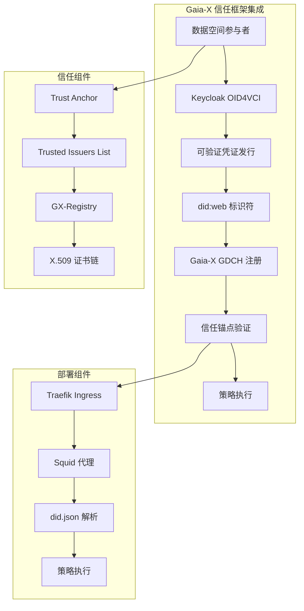
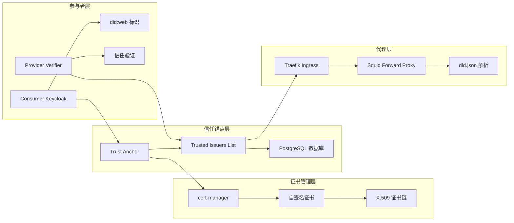
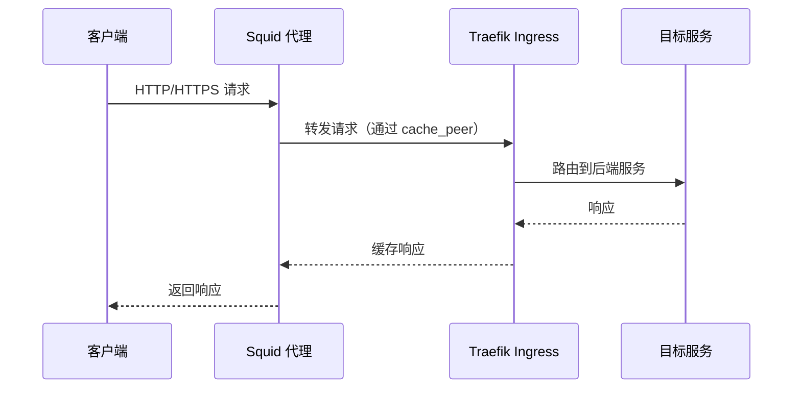
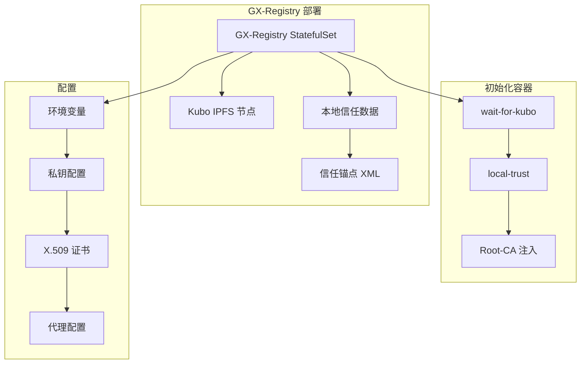
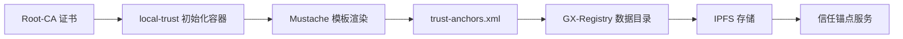
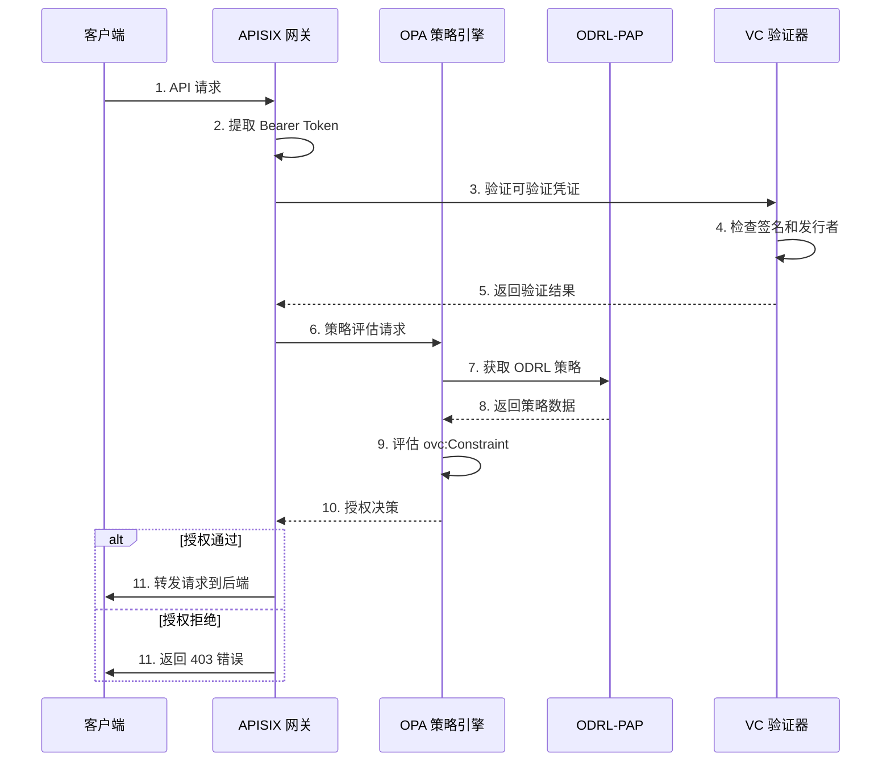

本文档详细说明如何在 FIWARE Data Space Connector 中集成 Gaia-X 信任框架，实现符合欧洲数据空间标准的身份验证和授权机制。Gaia-X 信任框架为数据空间参与者提供了标准化的信任锚点和凭证验证机制。

## 1. Gaia-X 信任框架概述

Gaia-X 信任框架定义了数据空间参与者之间建立信任的标准方法。FIWARE Data Space Connector 通过以下关键组件实现与 Gaia-X 的集成：

- **Gaia-X 数字清算所（GDCH）**：作为可信发行者注册表（Trusted Issuers Registry）
- **did:web 标识符**：用于可验证凭证的发行者标识
- **Gaia-X ODRL 配置文件**：基于可验证凭证声明的策略定义
- **信任锚点管理**：通过 X.509 证书链建立信任链



**Sources**: [doc/GAIA_X.MD](doc/GAIA_X.MD#L1-L50), [k3s/consumer-gaia-x.yaml](k3s/consumer-gaia-x.yaml#L1-L50)

## 2. 核心架构组件

### 2.1 Gaia-X 数字清算所（GDCH）集成

Gaia-X 数字清算所作为可信发行者注册表，为数据空间提供标准化的信任锚点管理。每个 GDCH 必须提供 Gaia-X 注册服务，存储被 Gaia-X 信任框架接受的信任锚点。

**关键特性：**
- 支持 EBSI 可信发行者注册表兼容服务
- 提供 did:web 作为凭证发行者标识
- 管理 X.509 证书链验证
- 支持多种 GDCH 提供商

| GDCH 提供商 | 注册服务端点 | 合规服务端点 | 公证服务端点 |
|------------|-------------|-------------|-------------|
| Gaia-X Lab | registry.lab.gaia-x.eu/v1 | compliance.lab.gaia-x.eu/v1 | registrationnumber.notary.lab.gaia-x.eu/v1 |
| AireNetworks | gx-registry.airenetworks.es/v1 | gx-compliance.airenetworks.es/v1 | gx-notary.airenetworks.es/v1 |
| Arsys | gx-registry.arsys.es/v1 | gx-compliance.arsys.es/v1 | gx-notary.arsys.es/v1 |
| Aruba | gx-registry.aruba.it/v1 | gx-compliance.aruba.it/v1 | gx-notary.aruba.it/v1 |
| Telekom | gx-registry.gxdch.dih.telekom.com/v1 | gx-compliance.gxdch.dih.telekom.com/v1 | gx-notary.gxdch.dih.telekom.com/v1 |
| DeltaDAO | www.delta-dao.com/registry/v1 | www.delta-dao.com/compliance/v1 | www.delta-dao.com/notary/v1 |

**Sources**: [helpers/gaiax-local-trust/data/development/trusted-gxdch.yaml](helpers/gaiax-local-trust/data/development/trusted-gxdch.yaml#L1-L44), [k3s/gaia-x-infra/gx-registry/deployment-registry.yaml](k3s/gaia-x-infra/gx-registry/deployment-registry.yaml#L1-L50)

### 2.2 did:web 标识符系统

Gaia-X 支持使用 `did:web` 作为凭证发行者的标识符方案。FIWARE Data Space Connector 通过以下机制支持 `did:web`：

1. **证书链生成**：创建 Root-CA、Intermediate-CA 和客户端证书
2. **did.json 文档发布**：在 `.well-known/did.json` 端点提供 DID 文档
3. **代理配置**：通过 Squid 代理解决本地环境的 DNS 解析问题

```json
{
  "@context": "https://www.w3.org/ns/did/v1",
  "id": "did:web:fancy-marketplace.biz",
  "verificationMethod": [
    {
      "id": "did:web:fancy-marketplace.biz",
      "type": "JsonWebKey2020",
      "controller": "did:web:fancy-marketplace.biz",
      "publicKeyJwk": {
        "kty": "RSA",
        "e": "AQAB",
        "n": "1j7tntXHTIoRR4zL80XmOaI5bxC1SpqiNKbCiIR_8y689libIV0P_J1pB_MyeCJHwhbih91MHRAu2Dg4pg9dskpWBSKUtrQxHcPxSubupzZc0HUunoe-6jX_4GW-2stZ3gyZCsBBLLBAKMHlZGOMPGjG1gKci2ieBG-Vgyk6uKKelMqyJAxDFqqeXvD0rtFXmkcTCUZhgJyXc0PRYQr0EDdNTZprMY9aVg2g46vveBU_ck9y7Fws6MEwR3ElPonaU2sMOOrAfTpJm0OMaYYSDb-Pi41WCv",
        "x5u": "http://fancy-marketplace.biz/.well-known/tls.crt"
      }
    }
  ]
}
```

**Sources**: [doc/GAIA_X.MD](doc/GAIA_X.MD#L50-L100), [k3s/consumer-gaia-x.yaml](k3s/consumer-gaia-x.yaml#L300-L380)

## 3. 信任锚点架构

### 3.1 信任锚点部署架构

信任锚点是数据空间中确保参与者之间信任的核心组件。FIWARE Data Space Connector 提供灵活的信任锚点配置选项：



**Sources**: [charts/trust-anchor/values.yaml](charts/trust-anchor/values.yaml#L1-L59), [k3s/trust-anchor.yaml](k3s/trust-anchor.yaml#L1-L35)

### 3.2 信任锚点配置选项

| 配置项 | 描述 | 默认值 | 适用场景 |
|-------|------|-------|---------|
| `postgres-operator.enabled` | 启用 PostgreSQL 操作符 | true | 生产环境 |
| `managedPostgres.enabled` | 启用托管 PostgreSQL | true | 开发/测试环境 |
| `trusted-issuers-list.enabled` | 启用可信发行者列表 | true | 所有环境 |
| `trusted-issuers-list.database.persistence` | 启用数据库持久化 | true | 生产环境 |
| `trusted-issuers-list.database.dialect` | 数据库方言 | POSTGRES | PostgreSQL 环境 |

**Sources**: [charts/trust-anchor/values.yaml](charts/trust-anchor/values.yaml#L1-L59), [charts/data-space-connector/values.yaml](charts/data-space-connector/values.yaml#L1-L100)

## 4. 本地部署集成指南

### 4.1 Gaia-X 本地信任环境

为了在本地环境中测试 Gaia-X 集成，FIWARE Data Space Connector 提供了本地信任环境配置：

```shell
# 启动包含 Gaia-X 配置的本地数据空间
mvn clean deploy -Plocal,gaia-x
```

**本地环境差异：**
1. **证书链生成**：使用 `helpers/certs/` 中的脚本生成完整的证书链
2. **代理配置**：部署 Squid 代理解决本地 DNS 解析问题
3. **信任锚点注入**：将 Root-CA 注入到 GX-Registry 的信任锚点列表

**证书链分发：**

| 组件 | 证书类型 | 用途 |
|------|---------|------|
| Consumer Keycloak | 客户端证书 + 密钥库 | 签发可验证凭证 |
| Traefik Ingress | TLS 证书 | HTTPS 端点 |
| GX-Registry | Root-CA 密钥对 | 信任锚点 |
| Provider | Root-CA | 信任存储验证 |
| Consumer | 证书链 | did.json 文档 |

**Sources**: [doc/GAIA_X.MD](doc/GAIA_X.MD#L50-L100), [helpers/gaiax-local-trust/README.md](helpers/gaiax-local-trust/README.md#L1-L8)

### 4.2 代理架构配置

本地环境中，为了解决 `did:web` 的 DNS 解析问题，采用以下代理架构：



**Squid 代理配置要点：**
- 监听端口：8888
- 缓存对等点：Traefik LoadBalancer
- 支持 HTTP 和 HTTPS 隧道
- 允许集群内部服务直接连接

**Sources**: [k3s/infra/squid/squid-cm.yaml](k3s/infra/squid/squid-cm.yaml#L1-L43), [doc/GAIA_X.MD](doc/GAIA_X.MD#L100-L142)

## 5. Gaia-X ODRL 配置文件集成

### 5.1 ODRL 策略扩展

Gaia-X ODRL 配置文件扩展了标准 ODRL 策略，支持在策略中引用可验证凭证的声明。FIWARE Data Space Connector 完整支持以下扩展组件：

**ovc:Constraint**：odrl:Constraint 的子类型，需要 `ovc:leftOperand` 和 `ovc:credentialSubjectType`。

**ovc:leftOperand**：使用 JSON 路径引用可验证凭证的声明：
- 支持：`$.credentialSubject.my.claim`
- 不支持：`$.credentialSubject.my.claim[0]`（数组索引）

**ovc:credentialSubjectType**：定义约束适用的可验证凭证类型。

### 5.2 策略示例

以下策略允许任何提供 `gx:LegalParticipant` 类型可验证凭证，且包含 `gx:legalAddress.gx:countrySubdivisionCode` 声明值为 `FR-HDF` 或 `BE-BRU` 的调用者读取资源：

```json
{
  "@context": {
    "odrl": "http://www.w3.org/ns/odrl/2/",
    "ovc": "https://w3id.org/gaia-x/ovc/1/",
    "rdfs": "http://www.w3.org/2000/01/rdf-schema#"
  },
  "@id": "urn:uuid:some-uuid",
  "@type": "odrl:Policy",
  "odrl:profile": "https://github.com/DOME-Marketplace/dome-odrl-profile/blob/main/dome-op.ttl",
  "odrl:permission": {
    "odrl:assigner": {
      "@id": "https://www.mp-operation.org/"
    },
    "odrl:target": "my-secured-object",
    "odrl:assignee": {
      "@id": "vc:any"
    },
    "odrl:action": {
      "@id": "odrl:read"
    },
    "ovc:constraint": [{
      "ovc:leftOperand": "$.credentialSubject.gx:legalAddress.gx:countrySubdivisionCode",
      "odrl:operator": "odrl:anyOf",
      "odrl:rightOperand": [
        "FR-HDF",
        "BE-BRU"
      ],
      "ovc:credentialSubjectType": "gx:LegalParticipant"
    }]
  }
}
```

**Sources**: [doc/GAIA_X.MD](doc/GAIA_X.MD#L100-L142), [charts/data-space-connector/values.yaml](charts/data-space-connector/values.yaml#L130-L180)

## 6. 部署配置详解

### 6.1 Consumer 配置（Gaia-X 配置文件）

Consumer 端的 Gaia-X 配置主要关注 `did:web` 标识符的建立和凭证签发：

**关键配置项：**

```yaml
# k3s/consumer-gaia-x.yaml 关键配置
decentralizedIam:
  enabled: true
  vcAuthentication:
    # 禁用默认组件，使用 Gaia-X 特定配置
    vcverifier: false
    credentials-config-service: false
    trusted-issuers-list: false

keycloak:
  signingKey:
    storePath: /did-material/cert.pfx
    storePassword: "${STORE_PASS}"
    keyAlias: didPrivateKey
    keyPassword: "${STORE_PASS}"
    did: did:web:fancy-marketplace.biz
    keyAlgorithm: ES256
```

**初始化容器流程：**
1. **prepare-keystore**：从证书生成 PKCS12 密钥库
2. **register-at-tir**：在信任发行者注册表中注册 DID
3. **register-at-til**：在信任发行者列表中注册凭证类型

**Sources**: [k3s/consumer-gaia-x.yaml](k3s/consumer-gaia-x.yaml#L1-L100), [k3s/consumer-gaia-x.yaml](k3s/consumer-gaia-x.yaml#L200-L380)

### 6.2 Provider 配置（Gaia-X 配置文件）

Provider 端的 Gaia-x 配置侧重于信任验证和策略执行：

**关键配置项：**

```yaml
# k3s/provider-gaia-x.yaml 关键配置
decentralizedIam:
  enabled: true
  vcAuthentication:
    vcverifier:
      deployment:
        verifier:
          tirAddress: https://tir.127.0.0.1.nip.io:8080/
          did: ${DID}
        additionalEnvVars:
          - name: HTTPS_PROXY
            value: "http://squid-proxy.infra.svc.cluster.local:8888"
          - name: HTTP_PROXY
            value: "http://squid-proxy.infra.svc.cluster.local:8888"
```

**信任验证流程：**
1. 从可信发行者注册表获取发行者列表
2. 验证可验证凭证的签名和发行者
3. 检查凭证是否被撤销
4. 执行基于 ODRL 策略的授权决策

**Sources**: [k3s/provider-gaia-x.yaml](k3s/provider-gaia-x.yaml#L1-L100), [k3s/provider-gaia-x.yaml](k3s/provider-gaia-x.yaml#L200-L398)

### 6.3 GX-Registry 部署

GX-Registry 是 Gaia-X 数字清算所的核心组件，负责存储和管理信任锚点：

**部署架构：**



**关键配置参数：**

| 环境变量 | 描述 | 默认值 |
|---------|------|-------|
| `PORT` | 服务端口 | 3000 |
| `BASE_URI` | 基础 URI | https://registry.127.0.0.1.nip.io/v2 |
| `KUBO_HOST` | IPFS 节点主机 | gx-registry-kubo |
| `ONTOLOGY_VERSION` | 本体版本 | development |
| `PRIVATE_KEY_ALGORITHM` | 私钥算法 | PS256 |
| `HTTPS_PROXY` | HTTPS 代理 | http://squid-proxy.infra.svc.cluster.local:8888 |

**Sources**: [k3s/gaia-x-infra/gx-registry/deployment-registry.yaml](k3s/gaia-x-infra/gx-registry/deployment-registry.yaml#L1-L128), [k3s/gaia-x-infra/gx-registry/signing-cert.yaml](k3s/gaia-x-infra/gx-registry/signing-cert.yaml#L1-L18)

## 7. 凭证管理与签发

### 7.1 可验证凭证类型

FIWARE Data Space Connector 支持多种 Gaia-X 兼容的可验证凭证类型：

| 凭证类型 | 用途 | 签发者 | 验证场景 |
|---------|------|-------|---------|
| `UserCredential` | 用户身份凭证 | Consumer Keycloak | 身份验证 |
| `OperatorCredential` | 操作员凭证 | Consumer Keycloak | 运维操作 |
| `VerifiableCredential` | 通用可验证凭证 | Consumer Keycloak | 通用验证 |
| `MembershipCredential` | 成员资格凭证 | 组织管理 | 组织验证 |
| `LegalPersonCredential` | 法人实体凭证 | GDCH | 法律实体验证 |

**Sources**: [k3s/consumer-gaia-x.yaml](k3s/consumer-gaia-x.yaml#L200-L380), [doc/scripts/get-membership-credential-content.sh](doc/scripts/get-membership-credential-content.sh#L1-L28)

### 7.2 凭证签发流程

```mermaid
sequenceDiagram
    participant User as 用户
    participant Keycloak as Keycloak
    participant Wallet as 数字钱包
    participant Verifier as 验证器
    participant TIR as 信任发行者注册表
    
    User->>Keycloak: 1. 获取访问令牌
    Keycloak-->>User: 访问令牌
    
    User->>Keycloak: 2. 请求凭证发行
    Keycloak->>Keycloak: 3. 生成凭证签名
    Keycloak-->>User: 可验证凭证 (JWT)
    
    User->>Wallet: 4. 存储凭证
    Wallet->>Verifier: 5. 提交凭证验证
    Verifier->>TIR: 6. 查询发行者信任状态
    TIR-->>Ver验证结果
    Verifier-->>Wallet: 7. 返回验证结果
```

**Sources**: [doc/deployment-integration/local-deployment/LOCAL.MD](doc/deployment-integration/local-deployment/LOCAL.MD#L100-L200), [doc/scripts/dcp-credentials-helper.sh](doc/scripts/dcp-credentials-helper.sh#L1-L36)

### 7.3 凭证内容示例

**MembershipCredential 示例：**

```json
{
  "@context": [
    "https://www.w3.org/2018/credentials/v1",
    "https://w3id.org/security/suites/jws-2020/v1",
    "https://www.w3.org/ns/did/v1"
  ],
  "id": "http://org.yourdataspace.com/credentials/2347",
  "type": ["MembershipCredential"],
  "issuer": "${DID}",
  "issuanceDate": "2023-08-18T00:00:00Z",
  "credentialSubject": {
    "id": "${DID}",
    "membership": {
      "membershipType": "${TYPE}",
      "since": "2023-01-01T00:00:00Z"
    }
  }
}
```

**Sources**: [doc/scripts/get-membership-credential-content.sh](doc/scripts/get-membership-credential-content.sh#L1-L28), [doc/scripts/create-membership-credential.sh](doc/scripts/create-membership-credential.sh#L1-L19)

## 8. 信任锚点管理

### 8.1 本地信任环境

本地信任环境通过 `helpers/gaiax-local-trust` 提供 Gaia-X 注册服务所需的信任锚点数据：

**数据结构：**
```
helpers/gaiax-local-trust/data/development/
├── dev-revoked-issuers.txt
├── linkml/linkml.yaml
├── owl/trustframework.ttl
├── revoked-issuers.txt
├── schemas/trustframework.json
├── shapes/trustframework.ttl
├── trust-anchors/trust-anchors.xml
├── trusted-gxdch.yaml
└── x509CertificateChain.pem
```

**信任锚点 XML 模板：**

信任锚点使用 Mustache 模板动态生成，包含以下关键元素：

```xml
<TrustServiceProvider>
    <TSPInformation>
        <TSPName>
            <Name xml:lang="en">Self Signed Root CA</Name>
        </TSPName>
    </TSPInformation>
    <TSPServices>
        <TSPService>
            <ServiceInformation>
                <ServiceDigitalIdentity>
                    <DigitalId>
                        <X509Certificate>{{selfSignedRoot}}</X509Certificate>
                    </DigitalId>
                </ServiceDigitalIdentity>
                <ServiceStatus>http://uri.etsi.org/TrstSvc/TrustedList/Svcstatus/granted</ServiceStatus>
            </ServiceInformation>
        </TSPService>
    </TSPServices>
</TrustServiceProvider>
```

**Sources**: [helpers/gaiax-local-trust/trust-anchors.xml.mustache](helpers/gaiax-local-trust/trust-anchors.xml.mustache#L1-L50), [helpers/gaiax-local-trust/entrypoint.sh](helpers/gaiax-local-trust/entrypoint.sh#L1-L3)

### 8.2 信任锚点注入流程



**注入步骤：**
1. 从 Kubernetes Secret 读取 Root-CA 证书
2. 使用 Mustache 模板生成 trust-anchors.xml
3. 将生成的信任锚点文件复制到 GX-Registry 数据目录
4. GX-Registry 启动时加载信任锚点数据

**Sources**: [k3s/gaia-x-infra/gx-registry/deployment-registry.yaml](k3s/gaia-x-infra/gx-registry/deployment-registry.yaml#L30-L80), [helpers/gaiax-local-trust/entrypoint.sh](helpers/gaiax-local-trust/entrypoint.sh#L1-L3)

## 9. 策略执行与授权

### 9.1 ODRL 策略执行流程

Gaia-X 集成的策略执行基于 ODRL 策略和可验证凭证的组合验证：



**Sources**: [charts/data-space-connector/values.yaml](charts/data-space-connector/values.yaml#L130-L180), [k3s/provider-gaia-x.yaml](k3s/provider-gaia-x.yaml#L150-L250)

### 9.2 策略配置示例

**基于地理位置的访问控制：**

```json
{
  "ovc:constraint": [{
    "ovc:leftOperand": "$.credentialSubject.gx:legalAddress.gx:countrySubdivisionCode",
    "odrl:operator": "odrl:anyOf",
    "odrl:rightOperand": ["FR-HDF", "BE-BRU"],
    "ovc:credentialSubjectType": "gx:LegalParticipant"
  }]
}
```

**基于成员资格的访问控制：**

```json
{
  "ovc:constraint": [{
    "ovc:leftOperand": "$.credentialSubject.membership.membershipType",
    "odrl:operator": "odrl:eq",
    "odrl:rightOperand": "operator",
    "ovc:credentialSubjectType": "MembershipCredential"
  }]
}
```

**Sources**: [doc/GAIA_X.MD](doc/GAIA_X.MD#L100-L142), [doc/scripts/prepare-policies.sh](doc/scripts/prepare-policies.sh#L1-L50)

## 10. 故障排除与调试

### 10.1 常见问题诊断

| 问题 | 可能原因 | 解决方案 |
|------|---------|---------|
| did:web 解析失败 | DNS 解析问题 | 检查 Squid 代理配置，确认 HTTPS_PROXY 环境变量 |
| 凭证签名验证失败 | 证书链不完整 | 检查 Root-CA 是否正确注入到信任存储 |
| 策略评估失败 | ODRL 策略格式错误 | 验证 ovc:Constraint 格式和 JSON 路径 |
| GX-Registry 启动失败 | IPFS 连接问题 | 检查 Kubo 节点状态和网络连接 |
| 信任锚点未加载 | 初始化容器失败 | 检查 local-trust 容器日志和证书路径 |

### 10.2 调试命令

**检查信任锚点状态：**

```shell
# 获取所有可信发行者
curl -k -x localhost:8888 -X GET https://tir.127.0.0.1.nip.io/v4/issuers | jq .

# 检查 GX-Registry 状态
kubectl get pods -n infra -l app.kubernetes.io/name=gx-registry

# 查看信任锚点数据
kubectl exec -n infra gx-registry-0 -- ls -la /data/ipfs/registry/
```

**验证 did:web 文档：**

```shell
# 通过代理访问 did.json 文档
curl --insecure -x http://localhost:8888 https://fancy-marketplace.biz/.well-known/did.json | jq .

# 检查 Keycloak 签名密钥
kubectl get secret -n consumer fancy-marketplace.biz-tls -o jsonpath='{.data.tls\.crt}' | base64 -d | openssl x509 -text
```

**策略调试：**

```shell
# 创建测试策略
curl -X 'POST' http://pap-provider.127.0.0.1.nip.io:8080/policy \
    -H 'Content-Type: application/json' \
    -d '{...}'

# 检查 OPA 策略加载
kubectl logs -n provider -l app.kubernetes.io/name=apisix -c opa
```

**Sources**: [doc/deployment-integration/local-deployment/LOCAL.MD](doc/deployment-integration/local-deployment/LOCAL.MD#L1-L100), [doc/GAIA_X.MD](doc/GAIA_X.MD#L1-L50)

## 11. 生产环境部署建议

### 11.1 安全配置

**证书管理：**
- 使用正式的 CA 签发证书，避免自签名证书
- 定期轮换证书和密钥
- 实施证书吊销检查

**网络安全：**
- 限制代理访问权限
- 配置网络策略隔离命名空间
- 启用 TLS 1.3 加密

**访问控制：**
- 实施最小权限原则
- 启用审计日志
- 定期审查信任锚点列表

### 11.2 性能优化

**信任验证优化：**
- 缓存信任锚点数据
- 使用连接池管理数据库连接
- 实施异步验证流程

**策略执行优化：**
- 预编译 ODRL 策略
- 缓存策略评估结果
- 批量处理验证请求

**Sources**: [charts/data-space-connector/values.yaml](charts/data-space-connector/values.yaml#L1-L100), [doc/deployment-integration/roles/provider/README.md](doc/deployment-integration/roles/provider/README.md#L1-L50)

## 12. 下一步

完成 Gaia-X 信任框架集成后，建议继续探索以下主题：

- **[OID4VC 认证框架](9-oid4vc-ren-zheng-kuang-jia-vcverifier-trusted-issuers-list)**：深入了解可验证凭证的发行和验证机制
- **[ODRL 授权框架](12-odrl-shou-quan-kuang-jia-apisix-opa-odrl-pap)**：学习基于 ODRL 策略的授权管理
- **[DSP 与 EDC 集成架构](14-dsp-yu-edc-ji-cheng-jia-gou)**：了解数据空间协议集成
- **[本地部署指南](2-kuai-su-bu-shu-zhi-nan)**：在本地环境中测试 Gaia-X 集成

**Sources**: [doc/GAIA_X.MD](doc/GAIA_X.MD#L1-L142), [README.md](README.md#L1-L50)