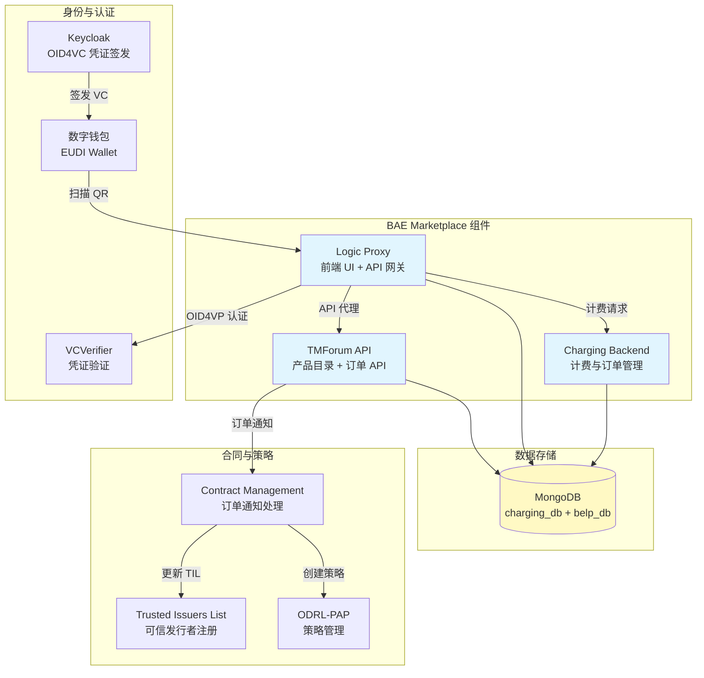
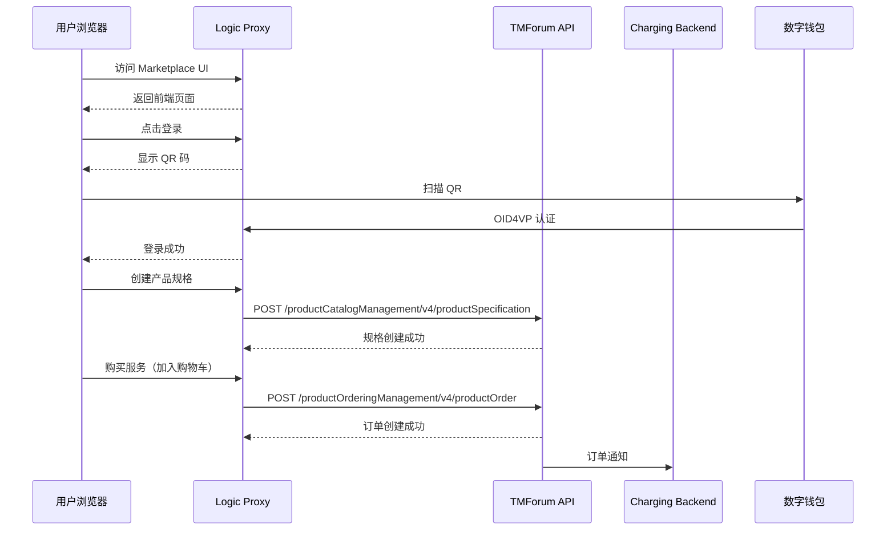
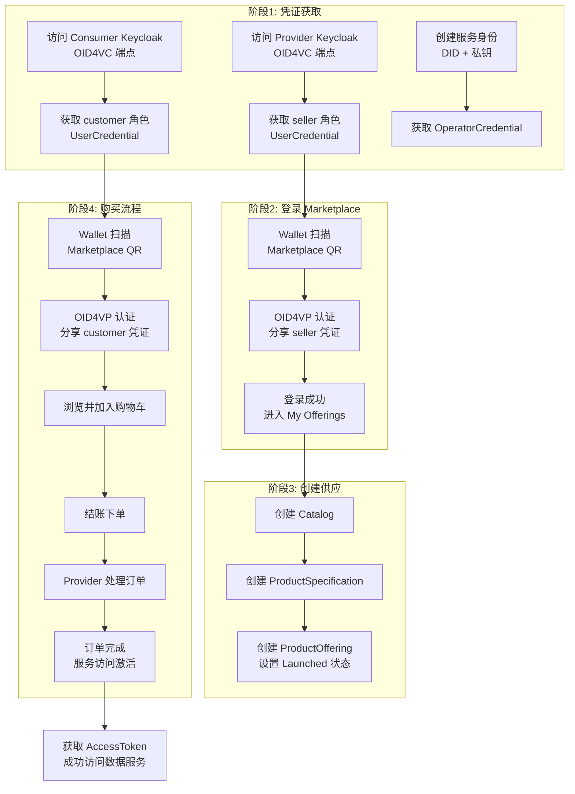
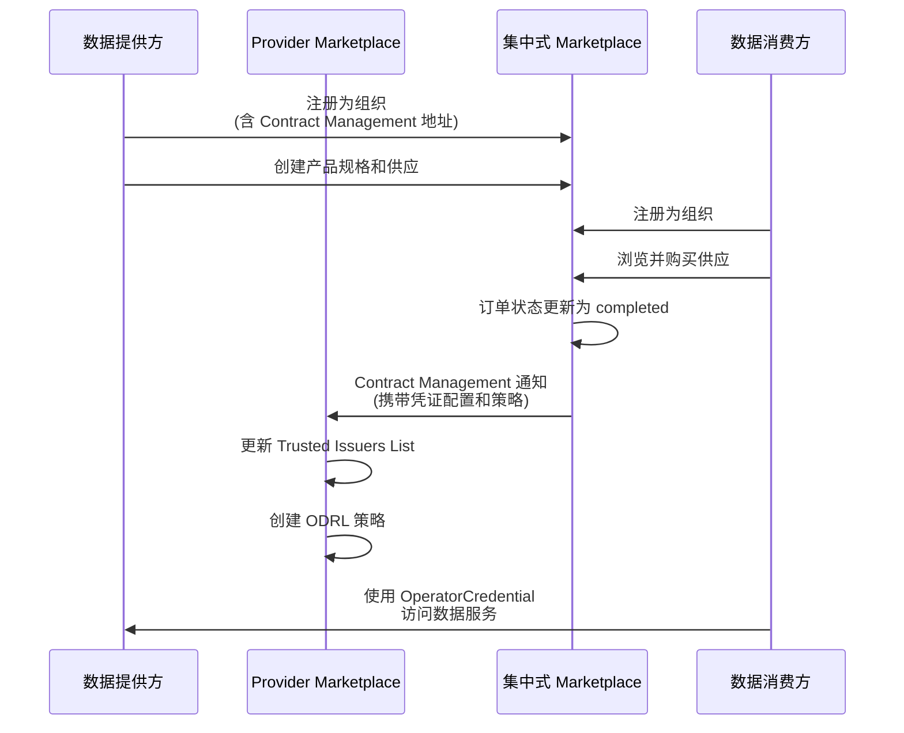

BAE（Business API Ecosystem）是 FIWARE 生态系统中的市场门户组件，为数据空间参与者提供数据产品和服务的发布、发现与交易能力。本文档详细说明如何在 FIWARE Data Space Connector 中启用、配置和使用 BAE Marketplace，涵盖本地部署场景与集中式市场场景的完整集成流程。

## BAE 架构概览

BAE Marketplace 作为 `business-api-ecosystem` Helm 子图集成到 Data Space Connector 的 umbrella chart 中，通过 `marketplace.enabled: true` 配置开关激活。其核心由三个组件构成：**Charging Backend**（计费后端，管理订单与账单）、**Logic Proxy**（逻辑代理，提供前端 UI 和 API 网关能力）以及 **TMForum API**（产品目录、订单管理、组织注册等标准 API 实现）。这三个组件共享 MongoDB 实例进行数据持久化，并通过 SIOP（Self-Issued OpenID Provider）协议集成 Verifiable Credential 认证机制。



Sources: [Chart.yaml](charts/data-space-connector/Chart.yaml#L32-L35), [values.yaml](charts/data-space-connector/values.yaml#L1669-L1700)

## Helm Chart 依赖与启用配置

BAE Marketplace 通过 umbrella chart 的依赖声明引入，默认处于禁用状态。在 `Chart.yaml` 中，`business-api-ecosystem` 子图以 `marketplace` 别名注册，版本为 `0.11.32`，来源于 FIWARE Helm Charts 仓库。

| 配置项 | 类型 | 默认值 | 说明 |
|--------|------|--------|------|
| `marketplace.enabled` | boolean | `false` | 是否启用 BAE Marketplace |
| `marketplace.generatePasswords` | boolean | `true` | 是否自动生成 MongoDB 密码（本地/演示环境推荐） |
| `marketplace.bizEcosystemApis.enabled` | boolean | `false` | 是否部署独立的 TMForum API（BAE 内置） |
| `marketplace.bizEcosystemRss` | boolean | `false` | 是否启用 Revenue Sharing System |
| `marketplace.siop.enabled` | boolean | `true` | 是否启用 VC 认证（SIOP） |
| `marketplace.siop.allowedRoles` | list | `[seller, customer, admin]` | 允许的市场角色列表 |

启用 Marketplace 的最小配置如下：

```yaml
marketplace:
  enabled: true
  generatePasswords: true  # 本地环境推荐，生产环境应设为 false 并通过外部方式提供密码
  siop:
    enabled: true
    verifier:
      qrCodePath: /api/v2/loginQR
      tokenPath: /token
      jwksPath: /.well-known/jwks
    allowedRoles:
      - seller
      - customer
      - admin
```

> **生产环境注意**：当 `generatePasswords: true` 时，Helm 会创建 `mongodb-admin-password`、`mongodb-charging-password` 和 `mongodb-belp-password` 三个 Secret，它们带有 `helm.sh/resource-policy: keep` 注解以防止被意外删除。生产环境应将此设为 `false`，并通过 External Secrets Operator、Sealed Secrets 或 SOPS 等方式外部管理密码。

Sources: [Chart.yaml](charts/data-space-connector/Chart.yaml#L32-L35), [values.yaml](charts/data-space-connector/values.yaml#L1669-L1710)

## Charging Backend 配置

Charging Backend 是 BAE 的计费核心，负责处理订单、账单和支付逻辑。它通过 `bizEcosystemChargingBackend` 配置块进行定制。

| 配置项 | 默认值 | 说明 |
|--------|--------|------|
| `bizEcosystemChargingBackend.existingSecret` | `mongodb-charging-password` | MongoDB 连接密码的 Secret 名称 |
| `bizEcosystemChargingBackend.maxUploadSize` | `5242880` | 最大上传文件大小（字节） |
| `bizEcosystemChargingBackend.deployment.image.tag` | `10.5.0` | 镜像版本标签 |
| `bizEcosystemChargingBackend.port` | `8006` | 服务监听端口 |
| `bizEcosystemChargingBackend.payment.method` | `None` | 支付方式（本地环境无需支付集成） |
| `bizEcosystemChargingBackend.plugins.enabled` | `false` | 是否启用插件支持 |

在本地部署的 Provider 配置中，Charging Backend 还需要配置与 TMForum Customer Bill API 的连接：

```yaml
marketplace:
  bizEcosystemChargingBackend:
    deployment:
      image:
        tag: 11.3.1
    extraEnvVars:
      - name: BAE_CB_CUSTOMER_BILL
        value: "http://tm-forum-api-svc:8080/tmf-api/customerBillManagement/v4"
```

Sources: [values.yaml](charts/data-space-connector/values.yaml#L1728-L1760), [provider.yaml](k3s/provider.yaml#L828-L840)

## Logic Proxy 配置

Logic Proxy 是 Marketplace 的前端入口和 API 代理层，负责将用户请求路由到相应的后端服务。它通过 `bizEcosystemLogicProxy` 配置块进行定制。



核心环境变量配置如下：

| 环境变量 | 说明 | 示例值 |
|----------|------|--------|
| `BAE_LP_SIOP_IS_REDIRECTION` | 启用 SIOP 重定向 | `true` |
| `BAE_LP_PURCHASE_ENABLED` | 启用购买功能 | `true` |
| `NODE_TLS_REJECT_UNAUTHORIZED` | 禁用 TLS 验证（仅本地环境） | `0` |
| `HTTPS_PROXY` | HTTP 代理地址 | `http://squid-proxy.infra.svc.cluster.local:8888` |
| `BAE_LP_SIOP_CLIENT_ID` | SIOP 客户端 DID | `did:web:mp-operations.org` |
| `BAE_LP_SIOP_PRIVATE_KEY_PEM` | SIOP 签名私钥路径 | `/certs-did/tls.key` |
| `DATASPACE_ENABLED` | 启用数据空间模式 | `true` |

本地部署中 Logic Proxy 的 Ingress 配置示例：

```yaml
marketplace:
  bizEcosystemLogicProxy:
    statefulset:
      image:
        tag: 11.11.1
    ingress:
      enabled: true
      annotations:
        traefik.ingress.kubernetes.io/router.tls: "true"
        cert-manager.io/cluster-issuer: "selfsigned-issuer"
        cert-manager.io/private-key-algorithm: "ECDSA"
        cert-manager.io/common-name: "marketplace.127.0.0.1.nip.io"
      hosts:
        - host: marketplace.127.0.0.1.nip.io
          paths:
            - "/"
```

Sources: [provider.yaml](k3s/provider.yaml#L896-L950), [values.yaml](charts/data-space-connector/values.yaml#L1800-L1870)

## TMForum API 集成

BAE Marketplace 通过 TMForum API 与数据空间的合同管理组件交互。TMForum API 提供了标准化的产品目录、订单管理和组织注册接口。在 `provider.yaml` 中，`bizEcosystemApis.tmForum` 配置块定义了各个 API 端点的连接信息。

| API 路径 | 用途 | 本地服务地址 |
|----------|------|--------------|
| `/tmf-api/productCatalogManagement/v4` | 产品目录管理 | `tm-forum-api-svc:8080` |
| `/tmf-api/productInventory/v4` | 产品库存管理 | `tm-forum-api-svc:8080` |
| `/tmf-api/productOrderingManagement/v4` | 产品订单管理 | `tm-forum-api-svc:8080` |
| `/tmf-api/party/v4` | 组织/参与方注册 | `tm-forum-api-svc:8080` |
| `/tmf-api/customerManagement/v4` | 客户管理 | `tm-forum-api-svc:8080` |
| `/tmf-api/accountManagement/v4` | 账户管理（计费） | `tm-forum-api-svc:8080` |
| `/tmf-api/serviceCatalogManagement/v4` | 服务目录管理 | `tm-forum-api-svc:8080` |

```yaml
marketplace:
  bizEcosystemApis:
    tmForum:
      catalog:
        host: tm-forum-api-svc
        port: 8080
        path: /tmf-api/productCatalogManagement/v4
      ordering:
        host: tm-forum-api-svc
        port: 8080
        path: /tmf-api/productOrderingManagement/v4
      party:
        host: tm-forum-api-svc
        port: 8080
        path: /tmf-api/party/v4
```

Sources: [provider.yaml](k3s/provider.yaml#L846-L895)

## 角色与凭证配置

BAE Marketplace 使用 Verifiable Credentials 进行身份认证和授权。通过 SIOP 协议，用户使用数字钱包扫描 QR 码完成登录。系统支持以下角色：

| 角色 | 凭证类型 | 权限范围 | 典型用户 |
|------|----------|----------|----------|
| `seller` | UserCredential (含 seller 角色) | 创建产品规格、产品供应、处理订单 | Provider 员工 |
| `customer` | UserCredential (含 customer 角色) | 浏览产品、下单购买 | Consumer 员工 |
| `admin` | UserCredential (含 admin 角色) | 系统管理 | 管理员 |
| `REPRESENTATIVE` | LegalPersonCredential | 组织注册、管理 | 组织代表 |

凭证通过 Keycloak 的 OID4VC 端点签发。在 `consumer.yaml` 中，`user-sd` 凭证配置包含了针对 Marketplace 的角色映射：

```yaml
# user-sd 凭证配置中的角色映射
- name: role-mapper-marketplace-usd
  protocol: oid4vc
  protocolMapper: oid4vc-target-role-mapper
  config:
    claim.name: roles
    clientId: did:web:fancy-marketplace.biz
```

Sources: [consumer.yaml](k3s/consumer.yaml#L151-L158), [values.yaml](charts/data-space-connector/values.yaml#L1712-L1726)

## 本地部署演示流程

本地部署（`mvn clean deploy -Plocal`）会同时部署 Provider 和 Consumer 两个参与者，其中 Consumer 同时作为 Marketplace 的运营方（`fancy-marketplace.biz`）。完整流程包括凭证获取、登录、创建供应和购买四个阶段。



### 凭证获取与 Wallet 配置

本地部署使用 [EUDI Android Wallet](https://github.com/eu-digital-identity-wallet/eudi-app-android-wallet-ui) 作为数字钱包。由于本地环境使用自签名证书，需要使用禁用证书验证的 APK 版本。Wallet 支持两种使用方式：

**物理手机方式**：需在手机上启用开发者模式，安装 Wallet APK，配置 WLAN 代理指向运行本地环境的机器 IP 地址（端口 8888）。

**Android 模拟器方式**：通过 Android Studio 创建虚拟设备（Android ≥ 13），使用 v4l2loopback 和 FFmpeg 将屏幕画面流式传输到虚拟摄像头，以便模拟器中的 Wallet 扫描 QR 码。

获取 seller 凭证的脚本命令：

```shell
# 获取 Provider 的 seller 角色凭证
export SELLER_CREDENTIAL=$(./doc/scripts/get_credential.sh \
  https://keycloak-provider.127.0.0.1.nip.io user-sd employee)
```

获取 customer 凭证的脚本命令：

```shell
# 获取 Consumer 的 customer 角色凭证
export CUSTOMER_CREDENTIAL=$(./doc/scripts/get_credential.sh \
  https://keycloak-consumer.127.0.0.1.nip.io user-sd employee)
```

Sources: [MARKETPLACE_INTEGRATION.md](doc/MARKETPLACE_INTEGRATION.md#L1-L100), [get_credential.sh](doc/scripts/get_credential.sh)

### Marketplace 浏览器代理配置

由于本地部署中的服务使用自签名证书且运行在 k3s 容器内，访问 Marketplace 前端需要配置浏览器代理。推荐使用 Chrome/Chromium 浏览器配合 FoxyProxy 插件：

1. 安装 FoxyProxy 插件
2. 在"选项"→"代理"中添加代理配置：
   - 类型：HTTP
   - 主机名：127.0.0.1
   - 端口：8888
3. 启用代理后，所有请求将通过本地环境中的 squid 代理路由

首次访问 Marketplace（`https://marketplace.127.0.0.1.nip.io/`）时，需为自签名证书添加例外。

Sources: [MARKETPLACE_INTEGRATION.md](doc/MARKETPLACE_INTEGRATION.md#L85-L95)

## 集中式 Marketplace 集成

除本地 Marketplace 外，Data Space Connector 还支持将参与者注册到集中式 Marketplace（Central Marketplace）。在这种模式下，Marketplace 运营方与数据提供方是不同的组织，通过 Contract Management 组件实现订单通知和权限同步。



### Provider 侧准备

在集中式 Marketplace 场景中，Provider 需要：

1. **注册 Marketplace 为可信凭证发行者**：允许 Marketplace 的 Contract Management 使用其凭证进行认证
2. **创建访问策略**：允许 Marketplace 向 Contract Management 发送订单通知
3. **在 Marketplace 注册组织**：提供 Contract Management 的访问地址和认证信息

```shell
# 允许 Contract Management 访问 Provider 侧
curl -k -x localhost:8888 -X 'POST' \
  https://pap-provider.127.0.0.1.nip.io/policy \
  -H 'Content-Type: application/json' \
  -d "$(cat ./it/src/test/resources/policies/allowContractManagement.json)"
```

注册 Provider 组织到集中式 Marketplace：

```shell
export PROVIDER_DID="did:web:mp-operations.org"
export ACCESS_TOKEN=$(./doc/scripts/get_access_token_oid4vp.sh \
  https://fancy-marketplace.127.0.0.1.nip.io $PROVIDER_USER_CREDENTIAL default)

# 在集中式 Marketplace 注册 Provider 组织
export MP_OPERATIONS_ID=$(curl -k -x localhost:8888 -X POST \
  https://fancy-marketplace.127.0.0.1.nip.io/tmf-api/party/v4/organization \
  -H 'Content-Type: application/json' \
  -H "Authorization: Bearer ${ACCESS_TOKEN}" \
  -d '{
    "name": "M&P Operations Org.",
    "partyCharacteristic": [
      {"name": "did", "value": "'"${PROVIDER_DID}"'"},
      {"name": "contractManagement", "value": {
        "address": "https://contract-management.127.0.0.1.nip.io:443",
        "clientId": "contract-management",
        "scope": ["external-marketplace"]
      }}
    ]
  }' | jq '.id' -r)
```

Sources: [CENTRAL_MARKETPLACE.md](doc/CENTRAL_MARKETPLACE.md#L1-L60), [prepare-central-market-policies.sh](doc/scripts/prepare-central-market-policies.sh)

### 产品供应创建与购买

在集中式 Marketplace 中创建产品供应时，需要在 Product Specification 中嵌入凭证配置和策略配置，以便 Contract Management 在订单完成后自动应用。

| Characteristic | 用途 | 值类型 |
|----------------|------|--------|
| `credentialsConfig` | 定义服务访问所需的凭证类型和角色 | `credentialsConfiguration` |
| `policyConfig` | 定义订单完成后应用的 ODRL 策略 | `authorizationPolicy` |

订单完成后，集中式 Marketplace 的 Contract Management 会向 Provider 的 Contract Management 发送通知，后者自动：
- 将 Consumer 添加到 Trusted Issuers List
- 根据订单创建对应的 ODRL 授权策略

Sources: [CENTRAL_MARKETPLACE.md](doc/CENTRAL_MARKETPLACE.md#L100-L260)

## 订单处理与服务激活

订单从创建到完成的生命周期涉及 Marketplace UI 中的多个步骤：

1. **Consumer 下单**：在 Marketplace 中选择服务、加入购物车、填写账单地址并结账
2. **订单状态变为 Unchecked**：等待 Provider 审核
3. **Provider 审核订单**：以 seller 凭证登录，进入 "Product Order" → "As Provider"
4. **推进订单状态**：通过 "Review" 按钮逐步推进订单至 "completed" 状态
5. **服务激活**：订单完成后，Contract Management 自动更新授权配置

订单完成后，Consumer 即可通过 M2M 流程获取 AccessToken 访问数据服务：

```shell
# 验证服务访问已激活
./doc/scripts/get_access_token_oid4vp.sh \
  http://mp-data-service.127.0.0.1.nip.io:8080 \
  $OPERATOR_CREDENTIAL operator
```

Sources: [MARKETPLACE_INTEGRATION.md](doc/MARKETPLACE_INTEGRATION.md#L190-L229)

## 分布式追踪配置

BAE Marketplace 支持 OpenTelemetry 分布式追踪。由于 `business-api-ecosystem` 是第三方子图，追踪功能通过子图的扩展点（`extraEnvVars` 和 `additionalEnvVars`）注入，默认以 `OTEL_SDK_DISABLED=true` 禁用。

启用追踪的配置方式：

```yaml
marketplace:
  tracing:
    enabled: true
    serviceName: marketplace  # 自定义服务名
  bizEcosystemChargingBackend:
    extraEnvVars:
      - name: OTEL_SDK_DISABLED
        value: "false"
      - name: OTEL_SERVICE_NAME
        value: "marketplace"
      - name: OTEL_EXPORTER_OTLP_ENDPOINT
        value: "http://<release>-opentelemetry-collector:4317"
      - name: OTEL_EXPORTER_OTLP_PROTOCOL
        value: "grpc"
```

| 环境变量 | 默认值 | 说明 |
|----------|--------|------|
| `OTEL_SDK_DISABLED` | `true` | 禁用 OpenTelemetry SDK |
| `OTEL_SERVICE_NAME` | `marketplace` | 追踪中的服务名称标识 |
| `OTEL_EXPORTER_OTLP_ENDPOINT` | `""` | OTLP 导出端点地址 |
| `OTEL_EXPORTER_OTLP_PROTOCOL` | `grpc` | OTLP 协议（`grpc` 或 `http/protobuf`） |
| `OTEL_TRACES_SAMPLER` | `parentbased_traceidratio` | 采样策略 |
| `OTEL_TRACES_SAMPLER_ARG` | `1.0` | 采样概率 |

Sources: [values.yaml](charts/data-space-connector/values.yaml#L1683-L1700), [values.yaml](charts/data-space-connector/values.yaml#L1770-L1820)

## BAE 辅助模板

umbrella chart 提供了两个 BAE 相关的辅助模板：

**bae-did.yaml**：创建 BAE DID 密钥 Secret，仅在 `marketplace.enabled` 时渲染。该 Secret 包含 BAE 组件的私钥材料。

**bae-prep-cm.yaml**：创建 Contract Management 准备脚本的 ConfigMap，仅在 `marketplace.enabled` 且 `marketplace.prep` 配置存在时渲染。

```yaml
# bae-did.yaml 生成的 Secret
apiVersion: v1
kind: Secret
type: Opaque
metadata:
  name: bae-did-secret
  namespace: <release-namespace>
data:
  privateKey: YjI0YzkwNmM5Y2Q2YTczOTE5MWQ3ZTQxN2U1MTk0YzRlNDM3OGEyYjFjOWY0Y2Y0ZDkzZTA0YzAyMGY2Mzc2OQ==
```

Sources: [bae-did.yaml](charts/data-space-connector/templates/bae-did.yaml), [bae-prep-cm.yaml](charts/data-space-connector/templates/bae-prep-cm.yaml)

## 生产环境部署建议

在生产环境中部署 BAE Marketplace 时，需注意以下事项：

| 配置项 | 本地/演示环境 | 生产环境 |
|--------|---------------|----------|
| `marketplace.generatePasswords` | `true` | `false`（外部管理密码） |
| `NODE_TLS_REJECT_UNAUTHORIZED` | `0` | 移除此变量 |
| `HTTPS_PROXY` | squid 代理 | 根据网络架构配置或移除 |
| `BAE_LP_SIOP_PRIVATE_KEY_PEM` | TLS 秘钥路径 | 使用独立的签名密钥 |
| `cert-manager.io/cluster-issuer` | `selfsigned-issuer` | 生产 CA 签发的证书 |
| Ingress 主机名 | `*.127.0.0.1.nip.io` | 实际域名 |