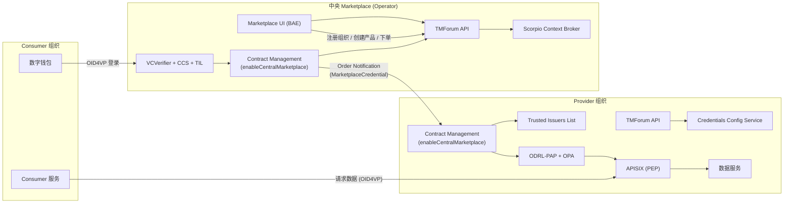
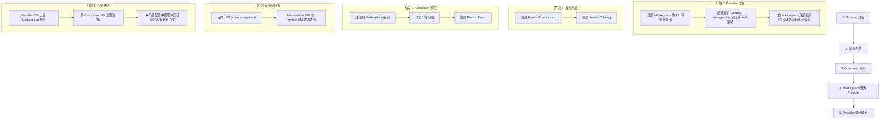

本页介绍如何将数据空间参与者（Provider）接入由 Operator 或第三方机构运营的 **中央 Marketplace**，实现跨组织的产品发布、订购和自动化访问授权。与每个 Provider 自建本地 Marketplace 不同，中央 Marketplace 为整个数据空间提供统一的目录浏览、订单管理和通知分发能力。

## 架构概览

中央 Marketplace 的核心思想是将**目录与交易**（Marketplace 职责）和**访问策略执行**（Provider 职责）解耦。Marketplace 本身不保护任何数据服务，它仅充当订单代理——当消费者完成购买后，Marketplace 的 Contract Management 组件通过 Verifiable Credential 认证，向 Provider 的 Contract Management 发送激活通知，由 Provider 侧完成 TIL 注册和策略下发。



与[本地 Marketplace 集成](MARKETPLACE_INTEGRATION.md)的关键差异在于：中央 Marketplace 是独立部署的共享基础设施，Provider 不需要自建 Marketplace，只需在自身 Connector 中启用 Contract Management 的中央模式并做好认证配置即可。

Sources: [CENTRAL_MARKETPLACE.md](doc/CENTRAL_MARKETPLACE.md#L1-L15), [operator/README.md](doc/deployment-integration/roles/operator/README.md#L70-L120)

## 参与者角色与组件职责

中央 Marketplace 涉及三方参与者，各自承担不同职责：

| 角色 | 组成组件 | 核心职责 |
|------|----------|----------|
| **Operator（Marketplace 运营方）** | Keycloak、DID、TMForum API、Scorpio、Contract Management、VCVerifier + CCS + TIL、Marketplace UI (BAE) | 提供统一目录和订购界面，订单完成后向 Provider 发送通知 |
| **Provider（数据服务提供方）** | 与普通 Provider 相同的全部组件 + Contract Management 中央模式 | 发布产品、接收订单通知、自动注册 TIL 和下发策略 |
| **Consumer（消费者）** | 数字钱包、可选 Contract Management | 浏览目录、下单购买、获取访问权限后使用数据服务 |

**Marketplace 侧不需要部署的组件**：ODRL-PAP、OPA、数据服务保护栈——Marketplace 不暴露受保护的数据服务，其唯一受保护的接口是 TMForum API（通过 APISIX + OID4VP 认证）。

Sources: [operator/README.md](doc/deployment-integration/roles/operator/README.md#L76-L114)

## 端到端集成流程

整个集成流程分为五个阶段，涵盖从 Provider 准备到 Consumer 获得访问权限的完整链路：



Sources: [CENTRAL_MARKETPLACE.md](doc/CENTRAL_MARKETPLACE.md#L16-L55)

### 阶段 1：Provider 准备

Provider 需要完成三项配置：将 Marketplace 注册为可信凭证签发者、设置 PAP 策略允许 Marketplace 通知访问、在 Marketplace 注册组织信息。

**1.1 配置 Marketplace Credential 的可信签发者**

Provider 的 Contract Management 在接收通知时，需要验证 Marketplace 提交的 `MarketplaceCredential`。Marketplace 的 DID 应被注册到 Trust Anchor 的 TIR 中：

```bash
curl -X 'POST' 'http://tir.trust-anchor.svc.cluster.local:8080/issuer' \
    -H 'Content-Type: application/json' \
    -d '{"did": "did:web:fancy-marketplace.biz", "credentials": []}'
```

在本地 demo 环境中，`k3s/consumer-auth.yaml` 中的 initContainer `register-at-tir` 会自动完成此步骤。

**1.2 注册 PAP 策略允许 Contract Management 访问**

Provider 必须在 PAP 中安装一条策略，允许持有 `MarketplaceCredential` 的请求访问 Contract Management 的 `/order` 端点：

```bash
curl -k -x localhost:8888 -X 'POST' \
    https://pap-provider.127.0.0.1.nip.io/policy \
    -H 'Content-Type: application/json' \
    -d "$(cat ./it/src/test/resources/policies/allowContractManagement.json)"
```

该策略的 ODRL 规则定义了：只有持有 `MarketplaceCredential` 类型凭证的用户，才能对 `/order` 路径执行 `odrl:use` 操作：

```json
{
  "odrl:permission": {
    "odrl:target": {
      "odrl:refinement": [
        {
          "odrl:leftOperand": "http:path",
          "odrl:operator": { "@id": "http:isInPath" },
          "odrl:rightOperand": "/order"
        }
      ]
    },
    "odrl:assignee": {
      "odrl:refinement": {
        "odrl:leftOperand": { "@id": "vc:type" },
        "odrl:operator": { "@id": "odrl:hasPart" },
        "odrl:rightOperand": { "@value": "MarketplaceCredential", "@type": "xsd:string" }
      }
    },
    "odrl:action": { "@id": "odrl:use" }
  }
}
```

**1.3 在 Marketplace 注册 Provider 组织**

Provider 需要在中央 Marketplace 的 Party API 中注册自身组织，提供 Contract Management 的访问地址和认证所需的 clientId/scope。注册可通过 TMForum API 或 Marketplace UI 完成。

**API 方式**：通过 `partyCharacteristic` 传递 Contract Management 信息：

```bash
curl -k -x localhost:8888 -X POST \
    https://fancy-marketplace.127.0.0.1.nip.io/tmf-api/party/v4/organization \
    -H 'Content-Type: application/json' \
    -H "Authorization: Bearer ${ACCESS_TOKEN}" \
    -d '{
      "name": "M&P Operations Org.",
      "partyCharacteristic": [
        { "name": "did", "value": "did:web:mp-operations.org" },
        { "name": "contractManagement", "value": {
            "address": "https://contract-management.127.0.0.1.nip.io:443",
            "clientId": "contract-management",
            "scope": ["external-marketplace"]
        }}
      ]
    }'
```

**UI 方式**：使用包含 `REPRESENTATIVE` 角色的 `LegalPersonCredential` 登录 Marketplace 后，在 **Profile** 页面填写以下字段：

| UI 字段 | 说明 | 示例值 |
|---------|------|--------|
| Contract Management Address | Provider 的 CM 外部地址 | `https://provider-cm.dev.seamware.io:443` |
| Contract Management Client ID | 认证用的 OIDC client | `contract-management` |
| Contract Management Scopes | 认证用的 OIDC scope | `external-marketplace` |

Sources: [CENTRAL_MARKETPLACE.md](doc/CENTRAL_MARKETPLACE.md#L17-L55), [provider/README.md](doc/deployment-integration/roles/provider/README.md#L100-L125)

### 阶段 2：发布产品

Provider 通过 TMForum API 创建 **ProductSpecification**（产品规格，包含凭证配置和 ODRL 策略模板）和 **ProductOffering**（产品上架）。

ProductSpecification 中需要定义两种核心特征：

| 特征类型 | `valueType` | 用途 |
|---------|-------------|------|
| `credentialsConfig` | `credentialsConfiguration` | 定义购买成功后注册到 TIL 的凭证类型和声明约束 |
| `policyConfig` | `authorizationPolicy` | 定义购买成功后安装到 PAP 的 ODRL 授权策略 |

例如，一个产品规格可以声明：购买者将在 TIL 中获得 `OperatorCredential` 注册，并获得对 `K8SCluster` 类型资产的 `odrl:use` 权限。

Sources: [CENTRAL_MARKETPLACE.md](doc/CENTRAL_MARKETPLACE.md#L64-L125)

### 阶段 3：Consumer 购买

Consumer 的购买流程与[本地 Marketplace 流程](MARKETPLACE_INTEGRATION.md)一致：

1. **注册组织**：Consumer 使用 `LegalPersonCredential` 登录 Marketplace，注册为 Organization
2. **浏览目录**：通过 Market UI 或 API 获取产品列表
3. **下单**：创建 `ProductOrder`（TMForum ProductOrderingManagement API）
4. **完成订单**：Provider 通过 `PATCH` 请求将订单状态更新为 `completed`

Sources: [CENTRAL_MARKETPLACE.md](doc/CENTRAL_MARKETPLACE.md#L127-L174)

### 阶段 4-5：通知分发与服务激活

订单完成后，Marketplace 的 Contract Management 执行以下操作：

1. 检查 `ProductSpecification` 的 `relatedParty` 确定 Provider 组织
2. 使用 Marketplace 自身签发的 `MarketplaceCredential` 向 Provider 的 Contract Management 发起认证
3. 发送订单通知到 Provider 的 Contract Management

Provider 的 Contract Management 收到通知后：

1. 通过 VCVerifier 验证 Marketplace 的 `MarketplaceCredential`
2. 根据产品规格中的 `credentialsConfig`，将 Consumer 的 DID 注册到本地 Trusted Issuers List
3. 根据产品规格中的 `policyConfig`，将 ODRL 策略安装到本地 ODRL-PAP

完成上述步骤后，Consumer 即可通过 OID4VP 向 Provider 的受保护数据服务发起请求。

Sources: [CENTRAL_MARKETPLACE.md](doc/CENTRAL_MARKETPLACE.md#L37-L55), [provider/README.md](doc/deployment-integration/roles/provider/README.md#L100-L108)

## Provider 侧 Helm 配置

Provider 参与中央 Marketplace 需要在 `values.yaml` 中完成以下配置。

### 1. 启用 Contract Management 中央模式

```yaml
contract-management:
  enabled: true
  enableCentralMarketplace: true          # 响应来自外部 Marketplace 的订单通知
  enableOdrlPap: true                     # 合同激活时向本地 PAP 写入 ODRL 策略
  did: <your-organization-DID>
  til:
    credentialType: <YourCredentialType>  # 例如 OperatorCredential
  services:
    odrl:
      url: http://odrl-pap:8080
    trusted-issuers-list:
      url: http://trusted-issuers-list:8080
    product-order:
      url: http://tm-forum-api-svc:8080
    party:
      url: http://tm-forum-api-svc:8080
    product-catalog:
      url: http://tm-forum-api-svc:8080
  notification:
    enabled: true
    host: contract-management
  deployment:
    image:
      tag: 3.3.8                          # 中央模式最低版本
```

关键配置项说明：

| 配置项 | 说明 | 默认值 |
|--------|------|--------|
| `enableCentralMarketplace` | 激活响应外部 Marketplace 通知的流程（而非仅本地订单） | `false` |
| `enableOdrlPap` | 合同激活时将 ODRL 策略写入本地 PAP | `true` |
| `til.credentialType` | 每笔购买完成后在 TIL 中为买方注册的凭证类型 | — |
| `notification.enabled` | 启用通知功能 | `true` |

Sources: [provider.yaml](k3s/provider.yaml#L710-L740), [provider/README.md](doc/deployment-integration/roles/provider/README.md#L110-L125)

### 2. 通过 APISIX 暴露 Contract Management

Marketplace 通过 HTTPS 向 Provider 的 Contract Management 发送通知，APISIX 必须为 Contract Management 配置专用路由并启用 OID4VP 保护：

```yaml
decentralizedIam:
  odrlAuthorization:
    apisix:
      routes:
        # Well-known 端点代理到 VCVerifier
        - uri: /*/.well-known/openid-configuration
          host: <your_contract_management_domain>
          upstream:
            nodes:
              verifier:3000: 1
          plugins:
            proxy-rewrite:
              uri: /services/contract-management/.well-known/openid-configuration
        # CM 的所有请求，受 VCVerifier + OPA 保护
        - uri: /*
          host: <your_contract_management_domain>
          upstream:
            nodes:
              contract-management:8080: 1
          plugins:
            openid-connect:
              bearer_only: true
              use_jwks: true
              client_id: contract-management
              client_secret: unused
              ssl_verify: false
              discovery: http://verifier:3000/services/contract-management/.well-known/openid-configuration
            opa:
              host: http://localhost:8181
              policy: policy/main
              with_body: true
```

Sources: [provider/README.md](doc/deployment-integration/roles/provider/README.md#L130-L160)

### 3. 在 Credentials Config Service 注册 Contract Management 服务

VCVerifier 需要知道在 Contract Management 端点上接受哪些凭证类型。注册一个专用 OIDC scope `external-marketplace`，接受 `MarketplaceCredential`：

```yaml
decentralizedIam:
  vcAuthentication:
    credentials-config-service:
      registration:
        enabled: true
        services:
          - id: contract-management
            defaultOidcScope: "external-marketplace"
            authorizationType: "DEEPLINK"
            oidcScopes:
              "external-marketplace":
                credentials:
                  - type: MarketplaceCredential
                    trustedParticipantsLists:
                      - <trust_anchor_tir_url>
                    trustedIssuersLists:
                      - "*"          # 信任决策委托给 Trust Anchor
                    jwtInclusion:
                      enabled: true
                      fullInclusion: true
```

`trustedIssuersLists: "*"` 是有意为之的——Marketplace 的凭证由其自身签发，信任决策完全委托给 Trust Anchor 的 TIR。

Sources: [provider/README.md](doc/deployment-integration/roles/provider/README.md#L162-L185), [provider.yaml](k3s/provider.yaml#L290-L310)

## Operator（Marketplace 运营方）Helm 配置

Operator 部署中央 Marketplace 使用同一 `fiware/data-space-connector` Helm chart，但启用的组件子集与 Provider 不同。关键区别：**不需要部署 ODRL-PAP、OPA 和数据服务保护栈**。

### 核心组件配置

**Contract Management（中央模式）**：

```yaml
contract-management:
  enabled: true
  did: <marketplace-DID>
  enableCentralMarketplace: true
  enableOdrlPap: false                    # Marketplace 不运行本地 PAP
  enableTrustedIssuersList: false          # Marketplace 不管理参与者 TIL
  organization:
    provider:
      role: seller                         # BAE 使用的 Provider 标签角色
  oid4vp:
    enabled: true
    credentialsFolder: /credential-repo
    holder:
      holderId: <marketplace-DID>
      keyType: EC
      keyPath: /signing-key/tls.key
      signatureAlgorithm: ECDH-ES
  services:
    product-order:     { url: http://tm-forum-api-svc:8080 }
    party:             { url: http://tm-forum-api-svc:8080 }
    product-catalog:   { url: http://tm-forum-api-svc:8080 }
  notification:
    enabled: true
    host: contract-management
  deployment:
    image:
      tag: 3.3.8
```

**TMForum API + Scorpio 后端**：

```yaml
tm-forum-api:
  enabled: true
  allInOne:
    enabled: true

scorpio:
  enabled: true
  ingress:
    enabled: false                         # NGSI-LD 后端不对外暴露
```

**Marketplace UI (BAE)（可选但推荐）**：

```yaml
marketplace:
  enabled: true
  externalUrl: https://<marketplace-domain>
  siop:
    clientId: <marketplace-DID>
    verifier:
      host: https://<verifier-domain>
    allowedRoles: [seller, customer, admin, REPRESENTATIVE]
  bizEcosystemApis:
    tmForum:
      catalog:   { host: tm-forum-api-svc, port: 8080, path: /tmf-api/productCatalogManagement/v4 }
      ordering:  { host: tm-forum-api-svc, port: 8080, path: /tmf-api/productOrderingManagement/v4 }
      party:     { host: tm-forum-api-svc, port: 8080, path: /tmf-api/party/v4 }
```

Marketplace UI 不是中央 Marketplace 运行的必要条件——纯 API 驱动的无头部署（仅 TMForum API + Contract Management）同样有效。但对于生产环境强烈建议部署 UI，为终端用户提供可用的交互界面。纯 M2M 场景下可以省略。

Sources: [operator/README.md](doc/deployment-integration/roles/operator/README.md#L130-L200), [consumer-tmf.yaml](k3s/consumer-tmf.yaml#L45-L120)

### Marketplace 认证凭证签发

Contract Management 使用 Marketplace 自身 Keycloak 签发的 Verifiable Credential 向 Provider 认证。默认使用 `MarketplaceCredential` 类型：

```yaml
credentials:
  enabled: true
  configurations:
    - id: marketplace-credential
      format: jwt_vc
      targetFile: marketplace-credential.jwt
```

`MarketplaceCredential` 类型不是强制要求——但**如果更改，必须在三个位置保持一致**：

| 位置 | 说明 |
|------|------|
| **Marketplace Keycloak** | 调整 `verifiableCredentials` 的 `scope` 和 `vct` 配置 |
| **Marketplace Contract Management** | 使用对应的凭证文件发送通知 |
| **每个 Provider 的 CCS + PAP** | CCS 注册中 `credentials-config-service` 的 `type` 字段和 PAP 策略中 `allowContractManagement.json` 的 `vc:type` 值 |

Sources: [operator/README.md](doc/deployment-integration/roles/operator/README.md#L210-L230)

### k3s 参考部署文件

本地 demo（`mvn clean deploy -Plocal,central`）通过叠加文件组合部署中央 Marketplace：

| 文件 | 用途 |
|------|------|
| [k3s/consumer.yaml](k3s/consumer.yaml) | Marketplace 组织基础配置（Keycloak、DID、数据库） |
| [k3s/consumer-auth.yaml](k3s/consumer-auth.yaml) | 认证栈（VCVerifier、CCS、TIL、APISIX 路由） |
| [k3s/consumer-tmf.yaml](k3s/consumer-tmf.yaml) | TMForum API、Scorpio、Contract Management 中央模式 |

```bash
helm install central-marketplace fiware/data-space-connector \
  -n central-marketplace \
  --create-namespace \
  -f k3s/consumer.yaml \
  -f k3s/consumer-auth.yaml \
  -f k3s/consumer-tmf.yaml
```

Sources: [operator/README.md](doc/deployment-integration/roles/operator/README.md#L232-L250)

## Marketplace UI 交互指南

除了通过 TMForum API 直接驱动所有流程外，也可以使用 Marketplace UI（BAE）完成相同操作。UI 流程与[本地 Marketplace 集成](MARKETPLACE_INTEGRATION.md)几乎一致，唯一区别在 Provider 的 Profile 配置处。

### Provider Profile 配置（UI 特有）

使用包含 `REPRESENTATIVE` 角色的 `LegalPersonCredential` 登录 Marketplace 后，打开用户菜单进入 **Profile**，在 Organization 表单中填写 Central Marketplace 特有的三个字段：

| 字段 | 说明 |
|------|------|
| **Contract Management Address** | Provider 的 Contract Management 外部 URL |
| **Contract Management Client ID** | 用于 CM 认证的 OIDC Client ID |
| **Contract Management Scopes** | 用于 CM 认证的 OIDC Scope 列表 |

这些字段等价于 API 方式中 `partyCharacteristic.contractManagement` 对象。

### 后续步骤

Profile 配置完成后，其余步骤与标准 Marketplace UI 流程完全一致：

- 通过 **My Offerings** 创建 Product Specification 和 Product Offering（参见 [Create the offering](MARKETPLACE_INTEGRATION.md#create-the-offering)）
- Consumer 使用 `UserCredential` 登录后通过购物车购买（参见 [Buy access](MARKETPLACE_INTEGRATION.md#buy-access)）
- Provider 在 **Product Order → As Provider → Review** 中处理订单（参见 [Process the order](MARKETPLACE_INTEGRATION.md#process-the-order)）

订单完成后，结果与 API 流程相同：中央 Marketplace 的 Contract Management 通知 Provider 的 Contract Management，后者根据产品配置更新 TIL 和 PAP 策略。

Sources: [CENTRAL_MARKETPLACE.md](doc/CENTRAL_MARKETPLACE.md#L188-L210)

## 本地 Demo 运行

本地 demo 提供完整的端到端演示，其中 Consumer 组织 `fancy-marketplace.biz` 同时充当中央 Marketplace 的运营方，而 Provider 组织 `mp-operations.org` 通过该 Marketplace 发布服务。

```bash
# 启动包含中央 Marketplace 的本地环境
mvn clean deploy -Plocal,central

# 准备 Marketplace 侧策略
./doc/scripts/prepare-central-market-policies.sh
```

demo 中的关键参与者：

| 组织 | DID | 角色 |
|------|-----|------|
| `fancy-marketplace.biz` | `did:web:fancy-marketplace.biz` | Consumer + Marketplace 运营方 |
| `mp-operations.org` | `did:web:mp-operations.org` | Provider |

Sources: [CENTRAL_MARKETPLACE.md](doc/CENTRAL_MARKETPLACE.md#L57-L62)

## 最低版本要求

| 组件 | 最低版本 |
|------|----------|
| `fiware/data-space-connector` Helm chart | **9.0.1** |
| `fiware/contract-management` Helm chart | **3.5.22** |
| `contract-management` 容器镜像 | **3.3.8** |

Sources: [provider/README.md](doc/deployment-integration/roles/provider/README.md#L105-L108)

## 下一步

- 若需了解 TMForum API 的合同管理流程细节，参见 [TM Forum Open APIs 合同管理流程](13-tm-forum-open-apis-he-tong-guan-li-liu-cheng)
- 若需了解本地 Marketplace（非中央模式）的集成方式，参见 [Marketplace Portal（BAE）集成](21-marketplace-portal-bae-ji-cheng)
- 若需了解 ODRL 授权框架的完整机制，参见 [ODRL 授权框架（APISIX + OPA + ODRL-PAP）](12-odrl-shou-quan-kuang-jia-apisix-opa-odrl-pap)
- 若需部署 Provider 角色的完整配置，参见 [Provider 角色部署](4-provider-jiao-se-bu-shu)
- 若需了解 Operator 角色的完整部署，参见 [Operator（数据空间治理）部署](6-operator-shu-ju-kong-jian-zhi-li-bu-shu)
- 若需了解 DSP 与 EDC 集成架构，参见 [DSP 与 EDC 集成架构](14-dsp-yu-edc-ji-cheng-jia-gou)