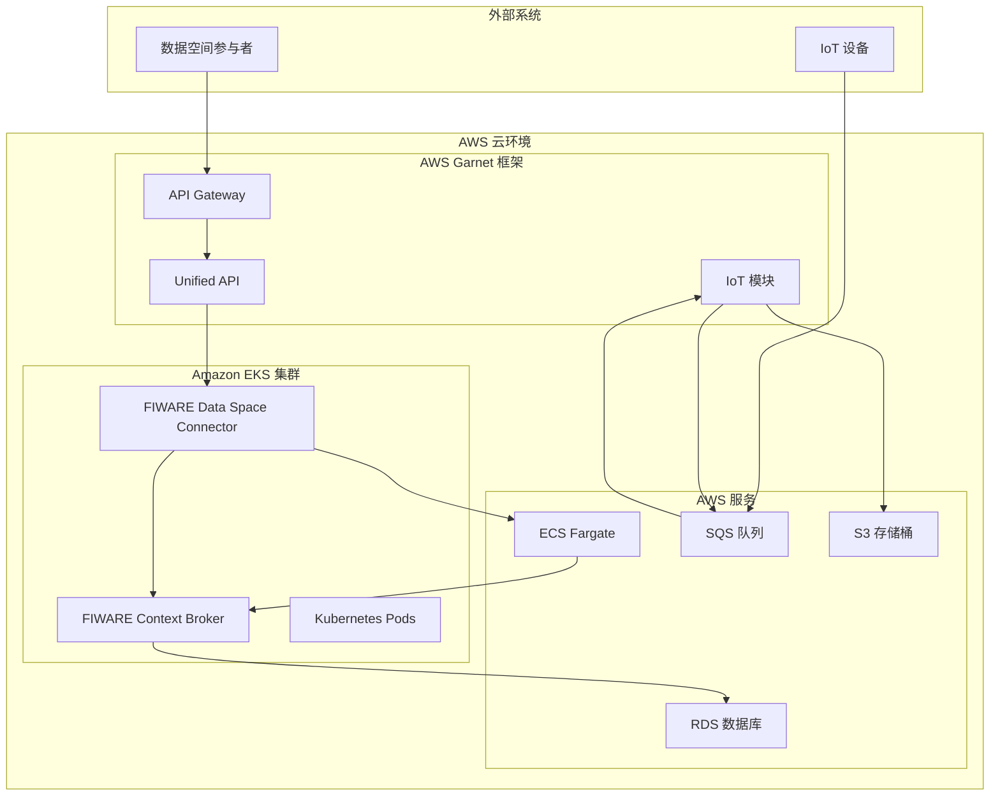
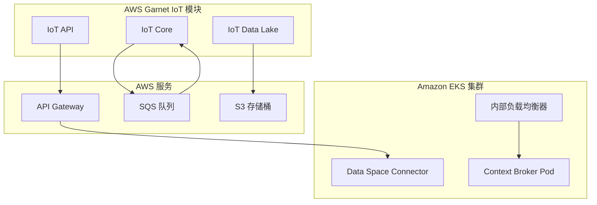
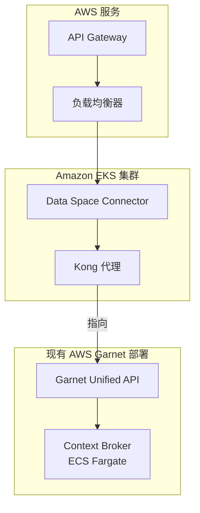
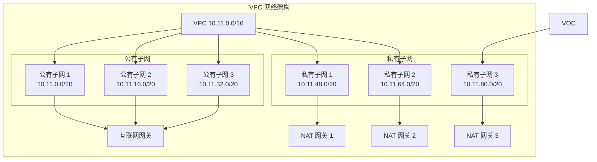
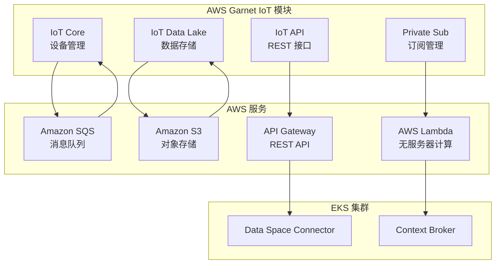

本页面详细介绍了如何将 FIWARE Data Space Connector 与 AWS Garnet 框架集成，以构建基于 AWS 云服务的可互操作数据空间解决方案。AWS Garnet 框架是一个开源框架，旨在简化跨多个领域（包括智能城市、能源、农业等）的可互操作平台的创建和运营，它通过集成 FIWARE Context Broker 和 NGSI-LD 开放标准来实现数据管理。

## 概述与架构原理

AWS Garnet 框架的核心是 **FIWARE Context Broker**，它提供了基于 NGSI-LD 标准的数据管理能力。当与 FIWARE Data Space Connector 集成时，Garnet 框架能够扩展其功能，以支持数据空间中的身份验证、授权、产品目录管理和合同协商等高级功能。

根据您现有的 AWS 基础设施情况，有两种主要的集成场景：

1. **场景一**：AWS 账户中没有现有的 AWS Garnet 框架部署
2. **场景二**：AWS 账户中已有 AWS Garnet 框架部署（Context Broker 运行在 AWS ECS Fargate 上）

这两种场景都要求在 Amazon EKS 集群上部署 Data Space Connector 的 Helm Chart，但配置和集成方式有所不同。



Sources: [doc/deployment-integration/aws-garnet/README.md](doc/deployment-integration/aws-garnet/README.md#L1-L151)

## 集成场景详解

### 场景一：全新部署（无现有 Garnet 框架）

此场景适用于在 AWS 账户中从零开始部署 AWS Garnet 框架与 Data Space Connector 的集成。在这种情况下，FIWARE Context Broker 将作为 Kubernetes 集群中的 Pod 运行，而 AWS Garnet 框架的集成将通过仅部署其 IoT 模块来实现。

**关键特性：**
- Context Broker 部署在 EKS 集群内部
- 需要部署 AWS Garnet IoT 模块
- 需要配置负载均衡器以连接 IoT 流水线



**部署步骤：**
1. 创建 Amazon EKS 集群
2. 部署 FIWARE Data Space Connector Helm Chart
3. 部署 AWS Garnet IoT 模块
4. 配置负载均衡器参数

Sources: [doc/deployment-integration/aws-garnet/scenario-1-deployment/README.md](doc/deployment-integration/aws-garnet/scenario-1-deployment/README.md#L1-L94)

### 场景二：扩展现有部署（已有 Garnet 框架）

此场景适用于在已有 AWS Garnet 框架部署的 AWS 账户中集成 Data Space Connector。在这种情况下，Context Broker 已经作为 ECS Fargate 任务运行，您只需部署修改后的 Helm Chart 来扩展其功能。

**关键特性：**
- Context Broker 已在 ECS Fargate 上运行
- 需要禁用 MongoDB 和 Context Broker 的部署
- 需要配置 Kong 代理指向 AWS Garnet 的 Unified API



**部署步骤：**
1. 创建 Amazon EKS 集群
2. 修改 Helm Chart 配置（禁用 MongoDB 和 Context Broker）
3. 配置 Kong 代理指向 Garnet Unified API
4. 部署修改后的 Helm Chart

Sources: [doc/deployment-integration/aws-garnet/scenario-2-deployment/README.md](doc/deployment-integration/aws-garnet/scenario-2-deployment/README.md#L1-L112)

## 基础设施要求与配置

### Amazon EKS 集群创建

无论选择哪种集成场景，都需要一个 Amazon EKS 集群来部署 Data Space Connector。如果您的 AWS 账户中已有可用的 EKS 集群，则可以重用该集群，无需创建新集群。

**推荐的集群配置：**
- **网络架构**：3 个可用区（AZ），每个 AZ 包含公有和私有子网
- **计算资源**：Fargate 配置文件，支持无服务器部署
- **安全配置**：OIDC 身份提供商集成，支持 IAM 角色用于服务账户



**集群创建步骤：**

1. **设置环境变量**：
   ```shell
   export AWS_REGION=eu-west-1
   export ekscluster_name="fiware-dsc-cluster"
   ```

2. **创建 VPC**：
   ```shell
   aws cloudformation deploy --stack-name "eks-vpc" --template-file "./yaml/eks-vpc-3az.yaml" --capabilities CAPABILITY_NAMED_IAM
   ```

3. **创建 EKS 集群**：
   ```shell
   eksctl create cluster --config-file=./yaml/eks-cluster-3az.yaml
   ```

4. **配置 OIDC 身份提供商**：
   ```shell
   eksctl utils associate-iam-oidc-provider --region ${AWS_REGION} --cluster fiware-dsc-cluster --approve
   ```

Sources: [doc/deployment-integration/aws-garnet/README.md](doc/deployment-integration/aws-garnet/README.md#L50-L151)

### 负载均衡器配置

为了将外部流量路由到 EKS 集群中的服务，需要配置负载均衡器。有两种主要选择：

**1. AWS Load Balancer Controller（推荐）**
- 自动管理 AWS ALB/NLB
- 与 Kubernetes Ingress 集成
- 提供高级路由功能

**2. nginx Ingress Controller**
- 使用 Network Load Balancer (NLB)
- 提供灵活的路由规则
- 适合复杂路由需求

**配置步骤：**

1. **创建 IAM 策略**：
   ```shell
   aws iam create-policy --policy-name AWSLoadBalancerControllerIAMPolicy --policy-document file://./policies/aws-lbc-iam_policy.json
   ```

2. **创建 IAM 角色和服务账户**：
   ```shell
   eksctl create iamserviceaccount --cluster=fiware-dsc-cluster --namespace=kube-system --name=ingress-nginx-controller --attach-policy-arn=arn:aws:iam::${ACCOUNT_ID}:policy/AWSLoadBalancerControllerIAMPolicy --override-existing-serviceaccounts --region ${AWS_REGION} --approve
   ```

3. **部署 nginx Ingress Controller**：
   ```shell
   kubectl apply -n kube-system -f ./yaml/nginx-ingress-controller.yaml
   ```

Sources: [doc/deployment-integration/aws-garnet/README.md](doc/deployment-integration/aws-garnet/README.md#L100-L151)

## Helm Chart 配置详解

### 场景一配置（全新部署）

在场景一中，需要部署完整的 Data Space Connector Helm Chart，包括 Context Broker。关键配置参数如下：

**Helm Chart 安装命令：**
```shell
helm repo add dsc https://fiware-ops.github.io/data-space-connector/
helm install -n ips -f ./yaml/values-dsc-aws-load-balancer-controller-scenario1.yaml ips-dsc dsc/data-space-connector
```

**主要配置组件：**

| 组件 | 配置说明 | 默认值 |
|------|----------|--------|
| activation-service | 激活服务配置 | 启用 |
| credentials-config-service | 凭证配置服务 | 启用 |
| trusted-issuers-list | 可信发行者列表 | 启用 |
| vcverifier | VC 验证器 | 启用 |
| mongodb | MongoDB 数据库 | 启用 |
| orion-ld | Context Broker | 启用 |
| kong | API 网关 | 启用 |

**关键配置示例：**
```yaml
# activation-service 配置
activation-service:
  deploymentEnabled: true
  activation-service:
    activationService:
      workers: 1
      maxHeaderSize: 32768
      logLevel: "debug"
    ingress:
      enabled: true
      annotations:
        cert-manager.io/cluster-issuer: letsencrypt-fiware-eks
        kubernetes.io/ingress.class: nginx
      hosts:
        - host: ips-as.dsba.aws.fiware.io
          paths:
            - /
```

Sources: [doc/deployment-integration/aws-garnet/scenario-1-deployment/yaml/values-dsc-aws-load-balancer-controller-scenario1.yaml](doc/deployment-integration/aws-garnet/scenario-1-deployment/yaml/values-dsc-aws-load-balancer-controller-scenario1.yaml#L1-L100)

### 场景二配置（扩展现有部署）

在场景二中，需要修改 Helm Chart 配置以禁用 MongoDB 和 Context Broker 的部署，并将 Kong 代理指向现有的 Garnet Unified API。

**关键配置变更：**

1. **禁用 MongoDB 部署**：
   ```yaml
   mongodb:
     deploymentEnabled: false
   ```

2. **禁用 Context Broker 部署**：
   ```yaml
   orion-ld:
     deploymentEnabled: false
   ```

3. **配置 Kong 代理指向 Garnet Unified API**：
   ```yaml
   kong:
     proxy:
       dblessConfig:
         config: |
           services:
             - host: "xxxxxxxxxx.execute-api.eu-west-1.amazonaws.com"
               name: "ips"
               port: 443
               protocol: http
   ```

**Helm Chart 安装命令：**
```shell
helm install -n ips -f ./yaml/values-dsc-aws-load-balancer-controller-scenario2.yaml ips-dsc dsc/data-space-connector
```

Sources: [doc/deployment-integration/aws-garnet/scenario-2-deployment/README.md](doc/deployment-integration/aws-garnet/scenario-2-deployment/README.md#L50-L112)

## AWS Garnet IoT 模块集成

AWS Garnet IoT 模块是 AWS Garnet 框架的核心组件之一，它提供了 IoT 设备管理、数据摄取和数据湖存储能力。在场景一中，需要部署此模块以连接 EKS 集群中的 Context Broker。

### IoT 模块架构



### IoT 模块部署步骤

1. **克隆 IoT 模块代码**：
   ```shell
   cd doc/deployment-integration/aws-garnet/scenario-1-deployment/aws-garnet-iot-module
   ```

2. **配置参数**：
   编辑 `parameters.ts` 文件，设置以下参数：
   ```typescript
   export const Parameters = {
       // FIWARE DATA SPACE CONNECTOR PARAMETERS
       amazon_eks_cluster_load_balancer_dns: "k8s-kubesyst-ingressn-XXXXXXXX.elb.eu-west-1.amazonaws.com",
       amazon_eks_cluster_load_balancer_listener_arn: "arn:aws:elasticloadbalancing:eu-west-1:XXXXXXXXX:listener/net/k8s-kubesyst-ingressn-XXXXXXXXXX/XXXXXXXXXXXXXXXX/XXXXXXXXXXXXXXXX",
       
       // GARNET PARAMETERS
       aws_region: "eu-west-1",
       garnet_broker: Broker.SCORPIO,
       garnet_bucket: `garnet-datalake-${Aws.REGION}-${Aws.ACCOUNT_ID}`,
       smart_data_model_url: 'https://raw.githubusercontent.com/awslabs/garnet-framework/main/context.jsonld',
       
       // FARGATE PARAMETERS
       garnet_fargate: {
           fargate_cpu: 1024,
           fargate_memory_limit: 4096,
           autoscale_requests_number: 200,
           autoscale_min_capacity: 2,
           autoscale_max_capacity: 10
       },
       
       // SCORPIO BROKER PARAMETERS
       garnet_scorpio: {
           image_context_broker: 'public.ecr.aws/garnet/scorpio:4.1.10',
           rds_instance_type: InstanceType.of(InstanceClass.BURSTABLE4_GRAVITON, InstanceSize.MEDIUM),
           rds_storage_type: StorageType.GP3,
           dbname: 'scorpio'
       }
   }
   ```

3. **部署 CDK 栈**：
   ```shell
   npm install
   cdk bootstrap
   cdk deploy
   ```

**关键输出参数：**
- `GarnetEndpoint`：Garnet Unified API 端点，用于访问 Context Broker 和 IoT 功能
- `GarnetPrivateSubEndpoint`：Garnet 私有订阅端点，用于安全订阅
- `GarnetIotQueueUrl`：Garnet IoT SQS 队列 URL，用于连接数据生产者

Sources: [doc/deployment-integration/aws-garnet/scenario-1-deployment/aws-garnet-iot-module/parameters.ts](doc/deployment-integration/aws-garnet/scenario-1-deployment/aws-garnet-iot-module/parameters.ts#L1-L31)

## 故障排除与监控

### 日志收集脚本

为了便于故障排除，提供了两个主要脚本：

**1. 保存 Pod 日志脚本**
```shell
#!/bin/bash

NAMESPACE="ips"

while true; do
    # 获取所有运行中的 Pod
    PODS=$(kubectl get pods -n $NAMESPACE -o jsonpath='{.items[*].metadata.name}')
    
    # 为每个 Pod 保存日志
    for POD in $PODS; do
        kubectl logs -n $NAMESPACE $POD > ./podLogs/${POD}_$(date +%Y%m%d_%H%M%S).log 2>&1
    done
    
    # 等待 3 秒后再次检查
    sleep 3
done
```

**2. 删除所有 Pod 脚本**
```shell
#!/bin/bash

namespace="ips"

# 删除指定命名空间中的所有 Pod
kubectl delete pods -n $namespace --all
```

### 常见问题排查

| 问题 | 可能原因 | 解决方案 |
|------|----------|----------|
| Helm Chart 安装失败 | 依赖项缺失 | 检查 Helm 仓库配置和依赖项 |
| Pod 启动失败 | 资源不足 | 检查 EKS 集群资源限制 |
| 网络连接问题 | 安全组配置错误 | 检查 VPC 和安全组规则 |
| IoT 模块无法连接 | 负载均衡器配置错误 | 验证 parameters.ts 中的配置 |
| Context Broker 无响应 | 数据库连接问题 | 检查 MongoDB 或 PostgreSQL 状态 |

**调试命令：**
```shell
# 检查 Pod 状态
kubectl get pods -n ips

# 查看 Pod 详细信息
kubectl describe pod <pod-name> -n ips

# 查看 Pod 日志
kubectl logs <pod-name> -n ips

# 检查服务状态
kubectl get svc -n ips

# 检查 Ingress 配置
kubectl get ingress -n ips
```

Sources: [doc/deployment-integration/aws-garnet/scripts/kubectlLogsFromNamespace.sh](doc/deployment-integration/aws-garnet/scripts/kubectlLogsFromNamespace.sh#L1-L20)

## 最佳实践与生产建议

### 安全配置

1. **IAM 角色最小权限原则**：为每个服务账户分配最小必要的 IAM 权限
2. **网络隔离**：使用私有子网部署 EKS 集群工作节点
3. **加密通信**：启用 TLS 加密所有服务间通信
4. **密钥管理**：使用 AWS Secrets Manager 或 Kubernetes Secrets 存储敏感信息

### 性能优化

1. **自动扩展配置**：根据负载配置 EKS 集群和 Fargate 的自动扩展
2. **资源限制**：为每个 Pod 设置适当的 CPU 和内存限制
3. **数据库优化**：根据工作负载选择适当的 RDS 实例类型
4. **缓存策略**：为频繁访问的数据实施缓存策略

### 监控与可观测性

1. **集成 OpenTelemetry**：配置分布式跟踪以监控请求流
2. **日志聚合**：使用 CloudWatch 或 ELK Stack 集中管理日志
3. **指标收集**：配置 Prometheus 和 Grafana 监控系统指标
4. **告警设置**：为关键指标设置告警通知

### 备份与灾难恢复

1. **定期备份**：配置 RDS 和 S3 的自动备份策略
2. **多区域部署**：考虑跨多个 AWS 区域部署以提高可用性
3. **灾难恢复计划**：制定并测试灾难恢复流程
4. **数据持久化**：确保关键数据存储在持久化存储中

## 下一步行动

根据您的具体需求和现有基础设施，选择适合的集成场景：

**场景一（全新部署）：**
1. 按照 [场景一部署指南](doc/deployment-integration/aws-garnet/scenario-1-deployment/README.md) 创建 EKS 集群
2. 部署 Data Space Connector Helm Chart
3. 部署 AWS Garnet IoT 模块
4. 配置负载均衡器和网络

**场景二（扩展现有部署）：**
1. 按照 [场景二部署指南](doc/deployment-integration/aws-garnet/scenario-2-deployment/README.md) 修改 Helm Chart 配置
2. 配置 Kong 代理指向现有 Garnet Unified API
3. 部署修改后的 Helm Chart
4. 验证集成是否正常工作

**通用建议：**
- 首先在测试环境中验证配置
- 逐步实施安全和监控策略
- 定期更新组件以获取安全补丁和功能改进
- 参考 AWS Garnet 框架官方文档获取最新信息