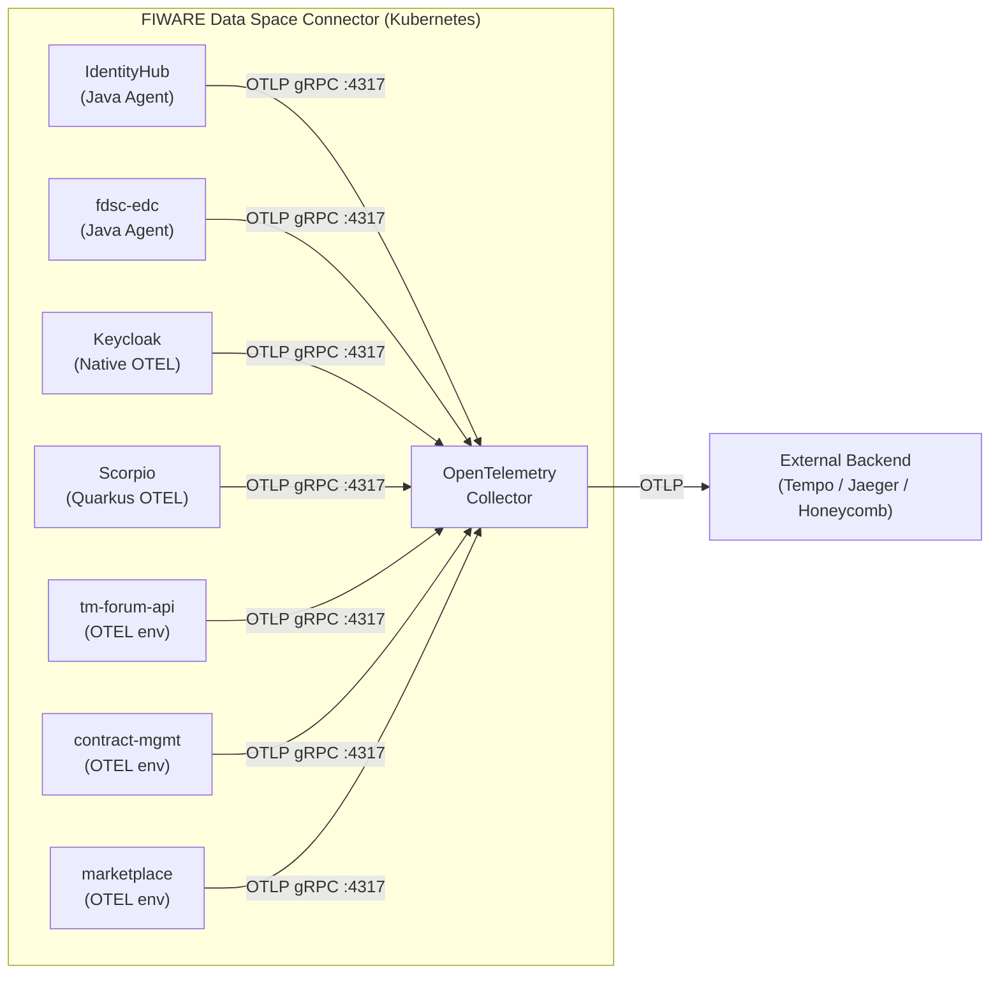
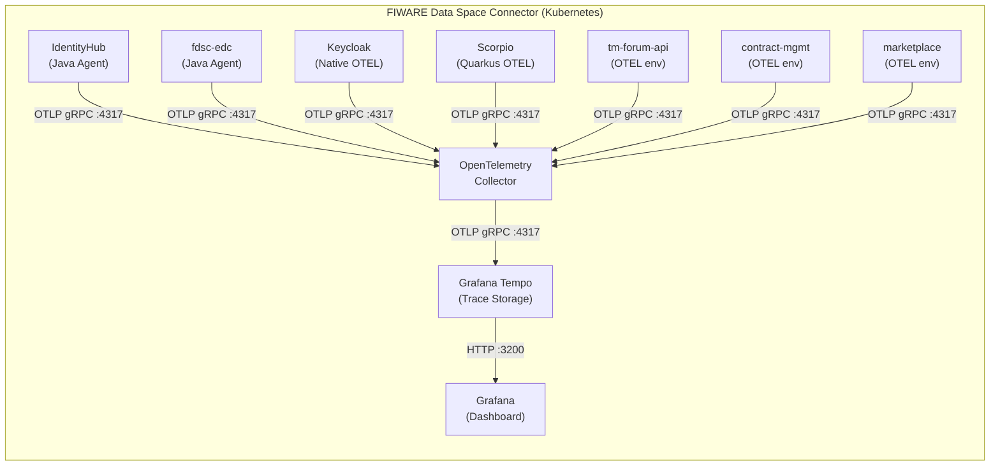

本页面详细介绍 FIWARE Data Space Connector 的 OpenTelemetry 分布式追踪架构，包括数据流设计、组件集成方式、配置方法和故障排除指南。追踪功能默认关闭，采用显式启用模式，启用后不会引入外部网络依赖。

## 架构概述

FIWARE Data Space Connector 采用 **Collector 中心化** 的分布式追踪架构。所有被检测的组件通过 OTLP 协议将追踪跨度（span）发送到集群内的 OpenTelemetry Collector，Collector 负责批量处理、上下文丰富和转发到配置的后端存储。



**关键设计点**：
- **传输协议**：所有组件通过 OTLP gRPC（端口 4317）或 OTLP HTTP（端口 4318）发送跨度到集群内的 Collector
- **批量处理**：Collector 批量处理、丰富和转发跨度到配置的后端导出器
- **默认行为**：默认情况下，Collector 仅写入 `debug` 导出器（标准输出日志），因此在添加后端之前**不会进行外部调用**
- **架构优势**：解耦了组件检测与后端存储，支持多种后端（Tempo、Jaeger、Honeycomb 等）的无缝切换

Sources: [doc/deployment-integration/observability/README.md](doc/deployment-integration/observability/README.md#L1-L50)

## 启用追踪

### 全局开关与最小化配置

追踪功能通过 `tracing.enabled` 全局开关控制。启用后，图表将：

1. 部署 OpenTelemetry Collector 作为 Release 内的 Deployment
2. 向所有被检测的组件注入 `OTEL_*` 环境变量
3. 为 IdentityHub 和 fdsc-edc 附加 Java 代理 init 容器
4. 将所有跨度路由到 Collector 的 `debug` 导出器（在 Collector Pod 日志中可见）

**最小化启用方式**：

```bash
helm upgrade --install my-dsc dsc/data-space-connector \
  --set tracing.enabled=true
```

或在 `values.yaml` 中配置：

```yaml
tracing:
  enabled: true
```

Sources: [doc/deployment-integration/observability/README.md](doc/deployment-integration/observability/README.md#L55-L80)

### 连接外部后端

要将跨度转发到外部 OTLP 兼容后端，需要覆盖 Collector 的导出器配置。`values.yaml` 中包含 Grafana Tempo、Jaeger 和 Honeycomb 的注释示例。

**Grafana Tempo 示例**：

```yaml
tracing:
  enabled: true

opentelemetry-collector:
  config:
    exporters:
      otlp/tempo:
        endpoint: "tempo.monitoring.svc.cluster.local:4317"
        tls:
          insecure: true
    service:
      pipelines:
        traces:
          exporters:
            - debug
            - otlp/tempo
```

**Jaeger 示例**（OTLP 原生，v1.35+）：

```yaml
tracing:
  enabled: true

opentelemetry-collector:
  config:
    exporters:
      otlp/jaeger:
        endpoint: "jaeger-collector.monitoring.svc.cluster.local:4317"
        tls:
          insecure: true
    service:
      pipelines:
        traces:
          exporters:
            - debug
            - otlp/jaeger
```

**Honeycomb SaaS 示例**：

```yaml
tracing:
  enabled: true

opentelemetry-collector:
  config:
    exporters:
      otlp/honeycomb:
        endpoint: "api.honeycomb.io:443"
        headers:
          x-honeycomb-team: "${env:HONEYCOMB_API_KEY}"
    service:
      pipelines:
        traces:
          exporters:
            - otlp/honeycomb
```

Sources: [doc/deployment-integration/observability/README.md](doc/deployment-integration/observability/README.md#L81-L130)

## Grafana Tempo 集群内后端

### 完整栈快速启动

图表包含可选的 **Grafana Tempo** 和 **Grafana** 子图表依赖，可在集群内部署完整的追踪存储和可视化堆栈。启用后，OpenTelemetry Collector 自动配置为向 Tempo 导出跨度，Grafana 自动配置 Tempo 作为数据源——无需手动配置。



**完整栈启用配置**：

```yaml
tracing:
  enabled: true

tempo:
  enabled: true

grafana:
  enabled: true
```

或通过 `--set` 标志：

```bash
helm upgrade --install my-dsc dsc/data-space-connector \
  --set tracing.enabled=true \
  --set tempo.enabled=true \
  --set grafana.enabled=true
```

此配置将：
1. 部署 OpenTelemetry Collector 并向所有组件注入 `OTEL_*` 环境变量
2. 部署 Grafana Tempo 作为集群内追踪后端
3. 自动配置 Collector 通过 `otlp/tempo` 导出器向 Tempo 发送跨度
4. 部署 Grafana 并启用数据源 sidecar
5. 自动配置指向 Tempo 的 Grafana 数据源，使追踪在 Grafana UI 中立即可见

Sources: [doc/deployment-integration/observability/README.md](doc/deployment-integration/observability/README.md#L140-L180)

### 自动连接机制

Collector、Tempo 和 Grafana 之间的集成由 umbrella 图表的模板自动处理：

- **Collector → Tempo**：当 `tempo.enabled=true` 时，图表渲染自定义 Collector ConfigMap（`otel-collector-config-cm.yaml`），将用户配置作为基础并注入 `otlp/tempo` 导出器
- **Tempo → Grafana**：当 `tempo.enabled=true` 且 `grafana.enabled=true` 时，图表渲染数据源 ConfigMap（`grafana-tempo-datasource-cm.yaml`），带 `grafana_datasource: "1"` 标签，Grafana sidecar 自动检测并配置 Tempo 作为数据源

**自动连接的实现机制**：

```yaml
# otel-collector-config-cm.yaml 中的关键逻辑
{{- if ((.Values.tempo).enabled) -}}
{{-   $tempoEndpoint := include "dsc.tempo.endpoint" . -}}
{{-   $tempoExporter := dict "endpoint" $tempoEndpoint "tls" (dict "insecure" true) -}}
{{-   $exporters := $config.exporters | default dict -}}
{{-   $_ := set $exporters "otlp/tempo" $tempoExporter -}}
{{-   // ... 自动添加到导出器列表 -}}
{{- end -}}
```

Sources: [charts/data-space-connector/templates/otel-collector-config-cm.yaml](charts/data-space-connector/templates/otel-collector-config-cm.yaml#L1-L61)

### 使用外部 Tempo 实例

如果已在集群外部（或在其他命名空间）运行 Tempo 实例，可以禁用捆绑的 Tempo 子图表并手动指向外部端点：

```yaml
tracing:
  enabled: true

# 不启用捆绑的 Tempo 子图表
tempo:
  enabled: false

# 将 Collector 指向外部 Tempo
opentelemetry-collector:
  config:
    exporters:
      otlp/tempo:
        endpoint: "tempo.monitoring.svc.cluster.local:4317"
        tls:
          insecure: true
    service:
      pipelines:
        traces:
          exporters:
            - debug
            - otlp/tempo
```

Sources: [doc/deployment-integration/observability/README.md](doc/deployment-integration/observability/README.md#L195-L220)

## 组件集成方式

每个组件根据其运行时和子图表扩展点，以不同方式集成 OpenTelemetry。

### 集成方式对比

| 组件 | 运行时 | 检测方法 | 配置方式 |
|------|--------|----------|----------|
| **IdentityHub** | Java | Java Agent（init 容器注入） | `identityhub.tracing.javaagent.enabled=true` |
| **fdsc-edc** | Java | Java Agent（init 容器注入） | `fdsc-edc.tracing.javaagent.enabled=true` |
| **Keycloak** | Quarkus (Java) | 原生 OTEL 支持 | `KC_TRACING_ENABLED=true` + 标准 `OTEL_*` 环境变量 |
| **Scorpio** | Quarkus (Java) | 静态环境变量 + 自动注入 | `scorpio.tracing.enabled=true` + OTel Operator 注解 |
| **tm-forum-api** | Micronaut (Java) | 静态环境变量 + 自动注入 | `tm-forum-api.tracing.serviceName` + OTel Operator 注解 |
| **contract-management** | Micronaut (Java) | 静态环境变量 + 自动注入 | `contract-management.tracing.serviceName` + OTel Operator 注解 |
| **marketplace** | Python/Node.js | 静态环境变量 + 自动注入 | `marketplace.tracing.serviceName` + OTel Operator 注解 |

Sources: [doc/deployment-integration/observability/README.md](doc/deployment-integration/observability/README.md#L340-L400)

### IdentityHub 和 fdsc-edc（Java Agent）

**检测方法**：OpenTelemetry Java 自动检测代理，通过 init 容器注入。

当 `tracing.enabled=true` 且 `identityhub.tracing.javaagent.enabled=true`（默认）时，init 容器将 Java 代理 JAR 复制到共享的 `emptyDir` 卷（`otel-agent`），该卷以只读方式挂载到 IdentityHub 容器。代理通过将 `-javaagent:/otel-agent/opentelemetry-javaagent.jar` 追加到 `JAVA_TOOL_OPTIONS` 来激活。

**组件级覆盖**：

```yaml
identityhub:
  tracing:
    serviceName: "identityhub"
    javaagent:
      enabled: true
      image: "ghcr.io/open-telemetry/opentelemetry-java-instrumentation/autoinstrumentation-java:2.11.0"
      pullPolicy: "IfNotPresent"

fdsc-edc:
  tracing:
    serviceName: "fdsc-edc"
    javaagent:
      enabled: true
      image: "ghcr.io/open-telemetry/opentelemetry-java-instrumentation/autoinstrumentation-java:2.11.0"
      pullPolicy: "IfNotPresent"
```

Sources: [doc/deployment-integration/observability/README.md](doc/deployment-integration/observability/README.md#L400-L430)

### Keycloak（原生 OTEL）

**检测方法**：Keycloak 25+ 具有内置的 OpenTelemetry 支持，通过设置 `KC_TRACING_ENABLED=true` 激活。

启用追踪时，umbrella 图表通过 Keycloak 子图表的 `extraEnvVarsCM` 钩子注入 `KC_TRACING_ENABLED` 和标准 `OTEL_*` 环境变量。图表渲染一个 ConfigMap（`keycloak-tracing-cm.yaml`），包含 Keycloak 和 Quarkus 运行时所需的所有 OTEL 环境变量。

**Keycloak 追踪 ConfigMap 结构**：

```yaml
apiVersion: v1
kind: ConfigMap
metadata:
  name: <release>-keycloak-tracing
data:
  KC_TRACING_ENABLED: "true"
  OTEL_SERVICE_NAME: "keycloak"
  OTEL_EXPORTER_OTLP_ENDPOINT: "http://<release>-opentelemetry-collector:4317"
  OTEL_EXPORTER_OTLP_PROTOCOL: "grpc"
  OTEL_EXPORTER_OTLP_INSECURE: "true"
  QUARKUS_OTEL_EXPORTER_OTLP_TRACES_ENDPOINT: "http://<release>-opentelemetry-collector:4317"
  QUARKUS_OTEL_EXPORTER_OTLP_TRACES_PROTOCOL: "grpc"
  OTEL_TRACES_SAMPLER: "parentbased_traceidratio"
  OTEL_TRACES_SAMPLER_ARG: "1.0"
  OTEL_PROPAGATORS: "tracecontext,baggage"
  OTEL_RESOURCE_ATTRIBUTES: "service.name=keycloak"
  OTEL_METRICS_EXPORTER: "none"
  OTEL_LOGS_EXPORTER: "none"
```

**组件级覆盖**：

```yaml
keycloak:
  tracing:
    serviceName: "keycloak"
```

Sources: [charts/data-space-connector/templates/keycloak-tracing-cm.yaml](charts/data-space-connector/templates/keycloak-tracing-cm.yaml#L1-L80)

### 自动检测（OpenTelemetry Operator）

图表包含可选的 **OpenTelemetry Operator** 子图表，启用 Kubernetes 原生自动检测。Operator 通过变更准入 Webhook 在 Pod 创建时注入语言特定代理（Java、Python、Node.js），无需应用程序镜像捆绑 OTEL SDK 或代理。

**为什么需要自动检测**：

| 子图表 | 运行时 | 限制 |
|--------|--------|------|
| **Scorpio** | Quarkus (Java) | 镜像不包含 `quarkus-opentelemetry` 扩展；`QUARKUS_OTEL_ENABLED=true` 被静默忽略 |
| **tm-forum-api** | Micronaut (Java) | 无 OTEL SDK 或 Java 代理；`OTEL_SDK_DISABLED=false` 无效 |
| **contract-management** | Micronaut (Java) | 同 tm-forum-api |
| **marketplace** (charging backend) | Python | 无捆绑 OTEL SDK |
| **marketplace** (logic proxy) | Node.js | 无捆绑 OTEL SDK |

**启用自动检测**：

```yaml
tracing:
  enabled: true
  autoInstrumentation:
    enabled: true

opentelemetry-operator:
  enabled: true
```

**Pod 注解配置**：

```yaml
# Java 工作负载
scorpio:
  podAnnotations:
    instrumentation.opentelemetry.io/inject-java: "true"

tm-forum-api:
  defaultConfig:
    additionalAnnotations:
      instrumentation.opentelemetry.io/inject-java: "true"

contract-management:
  deployment:
    additionalAnnotations:
      instrumentation.opentelemetry.io/inject-java: "true"

# Python 工作负载
marketplace:
  bizEcosystemChargingBackend:
    deployment:
      podAnnotations:
        instrumentation.opentelemetry.io/inject-python: "true"

# Node.js 工作负载
marketplace:
  bizEcosystemLogicProxy:
    statefulset:
      podAnnotations:
        instrumentation.opentelemetry.io/inject-nodejs: "true"
```

Sources: [doc/deployment-integration/observability/README.md](doc/deployment-integration/observability/README.md#L500-L580)

## 配置参考

### 全局追踪配置

这些值位于 `values.yaml` 中的 `tracing:` 键下，控制注入到每个被检测组件的 `OTEL_*` 环境变量。

| 配置项 | 默认值 | 说明 |
|--------|--------|------|
| `tracing.enabled` | `false` | 分布式追踪的全局开关 |
| `tracing.exporter.otlp.endpoint` | `""`（自动计算） | OTLP 端点 URL。为空时默认为 `http://<release>-opentelemetry-collector:4317` |
| `tracing.exporter.otlp.protocol` | `"grpc"` | OTLP 传输协议（`grpc` 或 `http/protobuf`） |
| `tracing.exporter.otlp.insecure` | `true` | 禁用 OTLP 导出器的 TLS 验证（集群内默认） |
| `tracing.sampler` | `"parentbased_traceidratio"` | 跟踪采样器策略 |
| `tracing.samplerArg` | `"1.0"` | 采样器参数（例如，`"0.1"` 表示 10% 采样） |
| `tracing.resourceAttributes` | `{}` | 添加到每个跨度的额外 OTEL 资源属性映射 |
| `tracing.propagators` | `"tracecontext,baggage"` | 上下文传播格式（默认为 W3C Trace Context + Baggage） |
| `tracing.autoInstrumentation.enabled` | `false` | 自动检测的主开关。为 `true` 时，图表渲染 `Instrumentation` CR |

Sources: [charts/data-space-connector/values.yaml](charts/data-space-connector/values.yaml#L2755-L2850)

### OpenTelemetry Collector 配置

这些值位于 `opentelemetry-collector:` 键下。完整的上游图表文档请参阅 [open-telemetry/opentelemetry-helm-charts](https://github.com/open-telemetry/opentelemetry-helm-charts/tree/main/charts/opentelemetry-collector)。

| 配置项 | 默认值 | 说明 |
|--------|--------|------|
| `opentelemetry-collector.enabled` | `false` | 部署捆绑的 Collector（当 `tracing.enabled=true` 时自动设置为 `true`） |
| `opentelemetry-collector.mode` | `"deployment"` | Collector 拓扑（`deployment`、`daemonset` 或 `statefulset`） |
| `opentelemetry-collector.replicaCount` | `1` | Collector 副本数 |
| `opentelemetry-collector.resources.requests.cpu` | `"100m"` | CPU 请求 |
| `opentelemetry-collector.resources.requests.memory` | `"128Mi"` | 内存请求 |
| `opentelemetry-collector.resources.limits.cpu` | `"500m"` | CPU 限制 |
| `opentelemetry-collector.resources.limits.memory` | `"512Mi"` | 内存限制 |

**默认处理管道**：`memory_limiter` → `resource` → `batch` → `debug` 导出器

Sources: [doc/deployment-integration/observability/README.md](doc/deployment-integration/observability/README.md#L440-L470)

### 自动检测配置

| 配置项 | 默认值 | 说明 |
|--------|--------|------|
| `tracing.autoInstrumentation.enabled` | `false` | `Instrumentation` CR 的主开关 |
| `tracing.autoInstrumentation.java.image` | `ghcr.io/.../autoinstrumentation-java:2.11.0` | Operator 注入的 Java 代理镜像 |
| `tracing.autoInstrumentation.python.image` | `ghcr.io/.../autoinstrumentation-python:0.54b0` | Operator 注入的 Python 代理镜像 |
| `tracing.autoInstrumentation.nodejs.image` | `ghcr.io/.../autoinstrumentation-nodejs:0.75.0` | Operator 注入的 Node.js 代理镜像 |
| `opentelemetry-operator.enabled` | `false` | 部署 OTel Operator 子图表 |
| `opentelemetry-operator.manager.resources` | 100m/128Mi req, 200m/256Mi lim | Operator 管理器 Pod 资源 |

Sources: [doc/deployment-integration/observability/README.md](doc/deployment-integration/observability/README.md#L590-L610)

## 生产环境考虑

### Tempo 存储后端

默认情况下，Tempo 在本地文件系统上存储追踪。对于生产环境，配置对象存储后端（S3、GCS 或 Azure Blob Storage）：

```yaml
tempo:
  enabled: true
  tempo:
    storage:
      trace:
        backend: s3
        s3:
          bucket: my-tempo-traces
          endpoint: s3.amazonaws.com
          region: eu-west-1
          access_key: "${S3_ACCESS_KEY}"
          secret_key: "${S3_SECRET_KEY}"
```

### Tempo 保留期

默认追踪保留期为 `48h`。根据合规性和成本要求调整：

```yaml
tempo:
  tempo:
    retention: 168h   # 7 天
```

### Grafana 持久化

为 Grafana 启用 PersistentVolumeClaim 以在 Pod 重启后保留仪表板和设置：

```yaml
grafana:
  persistence:
    enabled: true
    size: 1Gi
```

### 生产环境采样

对于高流量部署，减少采样以避免后端过载：

```yaml
tracing:
  samplerArg: "0.1"   # 采样 10% 的追踪
```

Sources: [doc/deployment-integration/observability/README.md](doc/deployment-integration/observability/README.md#L300-L340)

## 故障排除

### 验证 Collector 运行状态

```bash
kubectl get pods -l app.kubernetes.io/name=opentelemetry-collector
```

Collector Pod 应处于 `Running` 状态。检查其日志中的启动消息：

```bash
kubectl logs -l app.kubernetes.io/name=opentelemetry-collector --tail=50
```

查找：`"Everything is ready. Begin running and processing data."`

### 验证跨度接收

使用默认 `debug` 导出器时，跨度出现在 Collector 的标准输出中。增加详细程度以获取更多细节：

```yaml
opentelemetry-collector:
  config:
    exporters:
      debug:
        verbosity: "detailed"
```

### 常见问题排查

| 症状 | 可能原因 | 解决方案 |
|------|----------|----------|
| Collector 日志中无跨度 | 工作负载未发送到 Collector 端点 | 检查 Pod 上是否设置了 `OTEL_EXPORTER_OTLP_ENDPOINT`：`kubectl exec <pod> -- env \| grep OTEL` |
| 端口 4317 `connection refused` | Collector 未部署或 Service 名称错误 | 验证 `tracing.enabled=true` 且 Collector Service 存在：`kubectl get svc -l app.kubernetes.io/name=opentelemetry-collector` |
| Java 代理未加载 | init 容器镜像拉取失败 | 检查 init 容器状态：`kubectl describe pod <identityhub-pod>` 并验证镜像引用 |
| 跨度到达 Collector 但未到达后端 | 导出器配置错误 | 检查 Collector 日志中的导出错误。验证导出器端点、TLS 设置和认证头 |
| `QUARKUS_OTEL_ENABLED` 未生效 | Scorpio 镜像不包含 OTEL 扩展 | 确保 Scorpio 镜像版本包含 `quarkus-opentelemetry` 扩展 |
| Collector 内存使用率高 | 跨度过多，批量太大 | 调整 Collector 配置中的 `batch.send_batch_size` 和 `memory_limiter.limit_percentage` |
| 部分追踪（缺少跨度） | 采样率过低或传播不匹配 | 验证 `tracing.samplerArg`（设为 `"1.0"` 表示 100%）和 `tracing.propagators` 在所有组件中匹配 |

### 检查 Pod 上的 OTEL 环境变量

要验证特定工作负载是否具有正确的追踪配置：

```bash
# IdentityHub
kubectl exec deploy/<release>-identityhub -- env | grep OTEL

# Keycloak
kubectl exec sts/<release>-keycloak -- env | grep -E "OTEL|KC_TRACING"

# Scorpio
kubectl exec deploy/<release>-scorpio -- env | grep -E "OTEL|QUARKUS_OTEL"
```

### 验证 Grafana 中的追踪

部署完整栈后，按照以下步骤确认追踪端到端流动：

1. **检查 Tempo 就绪状态**：
   ```bash
   kubectl get pods -l app.kubernetes.io/name=tempo
   ```

2. **检查 Grafana 就绪状态**：
   ```bash
   kubectl get pods -l app.kubernetes.io/name=grafana
   ```

3. **端口转发到 Grafana**：
   ```bash
   kubectl port-forward svc/<release>-grafana 3000:80
   ```

4. **打开 Explore 视图**：在左侧边栏中导航到 **Explore**，从下拉菜单中选择 **Tempo** 数据源。

5. **搜索追踪**：使用 **Search** 选项卡按服务名称、持续时间或状态查找最近的追踪。

6. **如果未出现追踪**：
   - 验证 Collector 是否正在运行并接收跨度
   - 检查 Collector 日志中的导出错误：
     ```bash
     kubectl logs -l app.kubernetes.io/name=opentelemetry-collector --tail=50 | grep -i "error\|failed"
     ```
   - 验证 Tempo Pod 是否健康：
     ```bash
     kubectl logs -l app.kubernetes.io/name=tempo --tail=50
     ```
   - 确认 Grafana 数据源已自动配置：
     ```bash
     kubectl get configmap -l grafana_datasource=1
     ```

Sources: [doc/deployment-integration/observability/README.md](doc/deployment-integration/observability/README.md#L700-L879)

## 不包含的组件

以下组件**不包含**在此追踪集成中：

| 组件 | 原因 |
|------|------|
| **Rainbow** | 计划在未来版本中移除 |
| **注册作业**（participant-registration、tmf-registration、dataplane-registration、rainbow-registration） | 短生命周期批处理作业，不需要持续追踪 |
| **MongoDB** | 数据库级追踪由应用程序驱动程序处理，而不是服务器 |
| **HashiCorp Vault** | 基础设施组件；如需要可独立配置追踪 |
| **cert-manager** | 集群级 operator；超出应用程序追踪范围 |

Sources: [doc/deployment-integration/observability/README.md](doc/deployment-integration/observability/README.md#L650-L670)

## 下一步阅读

- [Grafana Tempo 集群内部追踪后端](25-grafana-tempo-ji-qun-nei-bu-zhui-zong-hou-duan) - 深入了解 Tempo 集群内部署和配置
- [各组件 OTEL 接入说明](26-ge-zu-jian-otel-jie-ru-shuo-ming) - 每个组件的详细 OTEL 集成指南
- [Helm Umbrella Chart 依赖图谱](8-helm-umbrella-chart-yi-lai-tu-pu) - 了解整体图表依赖关系
- [values.yaml 全局配置参考](16-values-yaml-quan-ju-pei-zhi-can-kao) - 完整配置选项参考