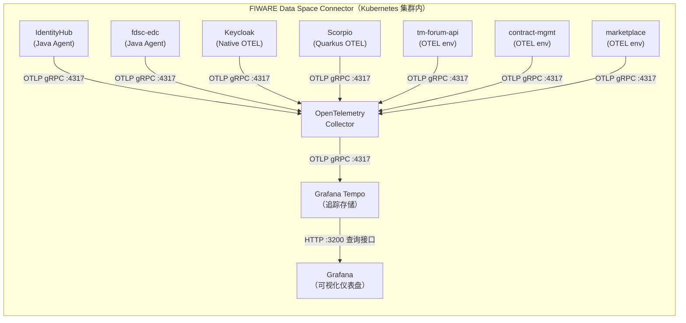
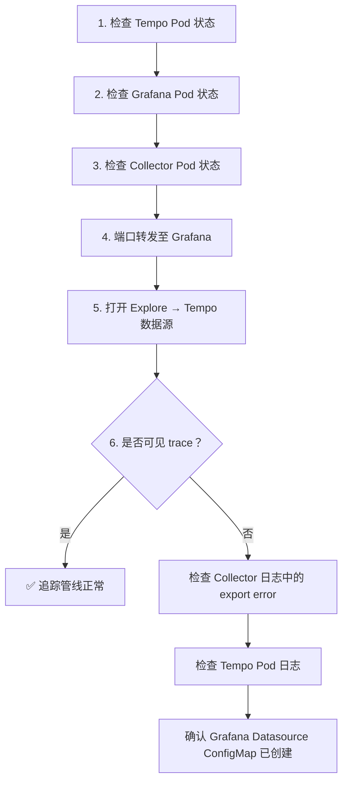

本页面聚焦于 FIWARE Data Space Connector 中 **Grafana Tempo** 作为集群内部分布式追踪存储后端的角色、自动接线机制和生产配置策略。Tempo 是一个高扩展性的开源追踪存储引擎，与 OpenTelemetry Collector 和 Grafana 通过 Helm 模板的自动化编排形成了开箱即用的全链路可观测闭环。本文档的内容边界限定在 Tempo 子图本身的架构职责，不涉及 Collector 的管线配置细节（参见 [OpenTelemetry 分布式追踪架构](24-opentelemetry-fen-bu-shi-zhui-zong-jia-gou)）或各组件的 OTEL 接入方式（参见 [各组件 OTEL 接入说明](26-ge-zu-jian-otel-jie-ru-shuo-ming)）。

## Tempo 在可观测栈中的定位

Data Space Connector 的可观测性架构遵循三层分离原则：**采集层**（各工作负载通过 OTLP 协议上报 span）、**管道层**（OpenTelemetry Collector 负责批处理、过滤和转发）、**存储层**（追踪后端持久化并提供查询接口）。Tempo 处于存储层的核心位置，承担两项职责：**接收** Collector 转发的 OTLP trace 数据，以及**响应** Grafana 发起的 TraceQL 查询请求。

与 Jaeger 或 Honeycomb 等替代后端相比，Tempo 的独特优势在于它作为 Grafana Labs 生态的原生组件，与 Grafana 的集成无需任何额外插件配置——当两者同时启用时，umbrella chart 会自动渲染一个标注了 `grafana_datasource: "1"` 的 ConfigMap，Grafana 的 sidecar 容器在启动时自动探测该 ConfigMap 并完成数据源注册。



**关键数据流方向：** 所有工作负载的 span 经由 OTLP gRPC（端口 4317）汇聚至 Collector，Collector 通过 `otlp/tempo` exporter 将 span 批量写入 Tempo 的 OTLP gRPC receiver（端口 4317），Grafana 则通过 Tempo 的 HTTP 查询接口（端口 3200）执行 TraceQL 检索。

Sources: [observability README](doc/deployment-integration/observability/README.md#L225-L259), [values.yaml](charts/data-space-connector/values.yaml#L3040-L3095)

## Helm 依赖与子图结构

Tempo 作为 `grafana/tempo` 上游 Helm chart 的子图依赖声明在 umbrella chart 的 `Chart.yaml` 中。它的启用条件为 `tempo.enabled=true`，与其他可观测性组件（Collector、Operator、Grafana）采用相同的 opt-in 模式——默认全部关闭，确保既有部署不受影响。

| 子图 | Chart 版本 | Repository | 启用条件 |
|---|---|---|---|
| `tempo` | 1.24.4 | `https://grafana.github.io/helm-charts` | `tempo.enabled` |
| `grafana` | 12.1.1 | `https://grafana-community.github.io/helm-charts` | `grafana.enabled` |
| `opentelemetry-collector` | 0.152.0 | `https://open-telemetry.github.io/opentelemetry-helm-charts` | `opentelemetry-collector.enabled` |

**全栈快速启动**只需三个值即可激活完整的追踪管线：

```yaml
tracing:
  enabled: true

tempo:
  enabled: true

grafana:
  enabled: true
```

这将触发以下自动化行为：部署 Collector 并注入 `OTEL_*` 环境变量至所有工作负载；部署 Tempo 单实例（single-binary 模式）作为追踪存储；自动配置 Collector 的 `otlp/tempo` exporter；部署 Grafana 并自动注册 Tempo 数据源。

Sources: [Chart.yaml](charts/data-space-connector/Chart.yaml#L88-L92), [observability README](doc/deployment-integration/observability/README.md#L261-L293)

## 自动接线机制：Collector → Tempo → Grafana

Data Space Connector 的最大设计特色之一是**零手动配置的追踪管线集成**。当 `tempo.enabled=true` 时，umbrella chart 的模板系统在两个关键节点自动完成接线。

### Collector → Tempo：自动注入 exporter

当 `tempo.enabled=true` 时，`otel-collector-config-cm.yaml` 模板会在渲染 Collector 的管线配置时，自动向 `exporters` 字典注入一个名为 `otlp/tempo` 的 exporter，其 endpoint 指向 `http://<release>-tempo:4317`，同时将 `"otlp/tempo"` 追加到 `service.pipelines.traces.exporters` 列表。用户在 `opentelemetry-collector.config` 中定义的所有原有 exporter（包括默认的 `debug` exporter）均被保留。

这一逻辑的核心实现位于模板的条件分支中：

```go
{{- if ((.Values.tempo).enabled) -}}
  {{- $tempoEndpoint := include "dsc.tempo.endpoint" . -}}
  {{- $tempoExporter := dict "endpoint" $tempoEndpoint "tls" (dict "insecure" true) -}}
  {{- $exporters := $config.exporters | default dict -}}
  {{- $_ := set $exporters "otlp/tempo" $tempoExporter -}}
  {{- ... -}}
  {{- $_ := set $traces "exporters" (append $currentExporters "otlp/tempo") -}}
{{- end -}}
```

endpoint 的计算由 `dsc.tempo.endpoint` 辅助模板完成，输出格式为 `http://<release>-tempo:4317`——遵循上游 Tempo chart 的 Service 命名约定 `<release>-tempo`。

Sources: [otel-collector-config-cm.yaml](charts/data-space-connector/templates/otel-collector-config-cm.yaml#L1-L30), [_helpers.tpl](charts/data-space-connector/templates/_helpers.tpl#L396-L407)

### Tempo → Grafana：自动注册数据源

当 `tempo.enabled=true` 且 `grafana.enabled=true` 同时满足时，`grafana-tempo-datasource-cm.yaml` 模板会渲染一个 ConfigMap，内容为 Grafana 数据源定义，URL 指向 Tempo 的 HTTP 查询接口 `http://<release>-tempo:3200`。该 ConfigMap 被标记了 `grafana_datasource: "1"` label，而 Grafana 子图的 sidecar 容器配置为监控带有此 label 的 ConfigMap（参见 `k3s/monitoring.yaml` 中的 `grafana.sidecar.datasources` 配置）。

这意味着运维人员**无需手动登录 Grafana 添加数据源**——Tempo 数据源在 Grafana 启动时即被自动发现和注册。

查询端点的计算由 `dsc.tempo.queryEndpoint` 辅助模板完成，输出格式为 `http://<release>-tempo:3200`——端口 3200 是 Tempo 的 HTTP API 默认端口，供 Grafana 执行 TraceQL 查询。

Sources: [grafana-tempo-datasource-cm.yaml](charts/data-space-connector/templates/grafana-tempo-datasource-cm.yaml#L1-L51), [_helpers.tpl](charts/data-space-connector/templates/_helpers.tpl#L422-L434), [k3s/monitoring.yaml](k3s/monitoring.yaml#L20-L38)

## Tempo 接收器配置

Tempo 子图的默认接收器配置**仅启用 OTLP 协议**，Jaeger 和 OpenCensus 接收器被显式禁用以最小化攻击面：

| 接收器 | 协议 | 端点 | 状态 |
|---|---|---|---|
| OTLP | gRPC | `0.0.0.0:4317` | ✅ 启用 |
| OTLP | HTTP | `0.0.0.0:4318` | ✅ 启用 |
| Jaeger | Thrift HTTP | — | ❌ 禁用 (`null`) |
| Jaeger | gRPC | — | ❌ 禁用 (`null`) |
| OpenCensus | — | — | ❌ 禁用 (`null`) |

这一设计选择体现了安全最小化原则：Data Space Connector 的所有组件均通过 OTLP 协议上报 span，无需保留遗留协议的接收器。如果确实需要与使用 Jaeger SDK 的遗留服务集成，可以通过覆盖 `tempo.tempo.receivers.jaeger` 值来重新启用。

Sources: [values.yaml](charts/data-space-connector/values.yaml#L3054-L3072)

## 存储后端：从开发到生产

Tempo 的默认存储配置使用**本地文件系统**（`backend: local`），trace 数据块写入 `/var/tempo/traces`，write-ahead log 写入 `/var/tempo/wal`。此配置适用于开发和测试环境，但不具备持久化保证——Pod 重启将丢失所有历史 trace 数据。

| 配置项 | 默认值 | 说明 |
|---|---|---|
| `tempo.tempo.storage.trace.backend` | `local` | 存储后端类型：`local`、`s3`、`gcs`、`azure` |
| `tempo.tempo.storage.trace.local.path` | `/var/tempo/traces` | 本地存储的 trace 数据块路径 |
| `tempo.tempo.storage.trace.wal.path` | `/var/tempo/wal` | write-ahead log 路径 |
| `tempo.tempo.retention` | `48h` | trace 保留周期，超过此时间的数据自动清理 |

**生产环境**应替换为对象存储后端。以 S3 为例：

```yaml
tempo:
  enabled: true
  tempo:
    storage:
      trace:
        backend: s3
        s3:
          bucket: my-tempo-traces
          endpoint: s3.amazonaws.com
          region: eu-west-1
          access_key: "${S3_ACCESS_KEY}"
          secret_key: "${S3_SECRET_KEY}"
```

保留周期应根据合规要求和成本预算调整，例如 `retention: 168h` 表示保留 7 天的 trace 数据。

Sources: [values.yaml](charts/data-space-connector/values.yaml#L3073-L3095), [observability README](doc/deployment-integration/observability/README.md#L357-L397)

## 资源配置与运维考量

Tempo Pod 的默认资源配额经过小规模部署的调校，生产环境应根据 trace 流量适当调高：

```yaml
tempo:
  resources:
    limits:
      cpu: 500m
      memory: 1Gi
    requests:
      cpu: 100m
      memory: 256Mi
```

以下是关键运维实践的总结：

| 维度 | 开发环境 | 生产环境建议 |
|---|---|---|
| **存储后端** | `local`（文件系统） | `s3` / `gcs` / `azure` |
| **保留周期** | `48h` | `168h` 或更长，按合规需求调整 |
| **Grafana 持久化** | 无（临时存储） | `grafana.persistence.enabled: true`，PVC ≥ 1Gi |
| **Grafana 管理密码** | `admin` / `admin` | 必须覆盖 `grafana.adminPassword` |
| **Grafana Ingress** | 关闭 | 启用并配合 TLS 和认证代理 |
| **采样率** | `1.0`（100%） | `0.1` 或更低，避免后端过载 |

Grafana 默认禁用 Ingress（参见 `k3s/monitoring.yaml` 中 `grafana.ingress.enabled: false`），通过代理认证（`auth.proxy`）委托 fdsc-dashboard 进行身份验证。如果需要独立暴露 Grafana，应启用 Ingress 并配置 TLS：

```yaml
grafana:
  ingress:
    enabled: true
    hosts:
      - grafana.example.com
    tls:
      - secretName: grafana-tls
        hosts:
          - grafana.example.com
```

Sources: [values.yaml](charts/data-space-connector/values.yaml#L3087-L3095), [k3s/monitoring.yaml](k3s/monitoring.yaml#L1-L18), [observability README](doc/deployment-integration/observability/README.md#L399-L435)

## 使用外部 Tempo 实例

如果集群外部已有 Tempo 实例（或部署在其他命名空间），可以禁用内置 Tempo 子图并手动配置 Collector 的 exporter 指向外部端点：

```yaml
tracing:
  enabled: true

tempo:
  enabled: false   # 不部署内置 Tempo

opentelemetry-collector:
  config:
    exporters:
      otlp/tempo:
        endpoint: "tempo.monitoring.svc.cluster.local:4317"
        tls:
          insecure: true
    service:
      pipelines:
        traces:
          exporters:
            - debug
            - otlp/tempo
```

需要注意的是，当 `tempo.enabled=false` 时，`grafana-tempo-datasource-cm.yaml` 模板不会渲染 Tempo 数据源 ConfigMap（该模板有双重条件守卫：`grafana.enabled AND tempo.enabled`）。此时必须在 Grafana 中手动配置数据源，或通过自定义的 ConfigMap（标记 `grafana_datasource: "1"`）提供指向外部 Tempo 的连接信息。

Sources: [observability README](doc/deployment-integration/observability/README.md#L319-L355), [grafana-tempo-datasource-cm.yaml](charts/data-space-connector/templates/grafana-tempo-datasource-cm.yaml#L1)

## 端到端验证流程

部署全栈后，通过以下步骤确认 trace 数据从工作负载到 Grafana 的完整流转：



**步骤详解：**

**1. 检查 Tempo 就绪状态：**
```bash
kubectl get pods -l app.kubernetes.io/name=tempo
```
Pod 应处于 `Running` 状态。

**2. 端口转发并访问 Grafana：**
```bash
kubectl port-forward svc/<release>-grafana 3000:80
```
浏览器打开 `http://localhost:3000`（默认凭据 `admin` / `admin`），导航至左侧 **Explore** 视图，从下拉列表选择 **Tempo** 数据源，使用 **Search** 标签按服务名、时长或状态搜索近期 trace。

**3. 排查常见问题：**

| 症状 | 可能原因 | 修复方法 |
|---|---|---|
| Collector 日志中无 span | 工作负载未连接 Collector 端点 | 检查 Pod 的 `OTEL_EXPORTER_OTLP_ENDPOINT` 环境变量 |
| Collector 连接 Tempo 失败 | Tempo 未就绪或 exporter endpoint 错误 | 检查 Collector 日志中的 export error，确认 Tempo Service 存在 |
| Grafana 无 Tempo 数据源 | Datasource ConfigMap 未渲染 | 确认 `tempo.enabled=true` 且 `grafana.enabled=true`，检查 `kubectl get configmap -l grafana_datasource=1` |
| Tempo Pod OOM | trace 流量超出内存限制 | 调高 `tempo.resources.limits.memory` 或降低采样率 |

**4. 确认数据源 ConfigMap 已创建：**
```bash
kubectl get configmap -l grafana_datasource=1
```
应能看到名为 `<release>-grafana-tempo-datasource` 的 ConfigMap。

Sources: [observability README](doc/deployment-integration/observability/README.md#L437-L487)

## 核心配置值速查

以下表格汇总了与 Tempo 直接相关的所有 `values.yaml` 配置项：

| 配置路径 | 默认值 | 说明 |
|---|---|---|
| `tempo.enabled` | `false` | 是否部署内置 Tempo 子图 |
| `tempo.tempo.retention` | `48h` | trace 数据保留周期 |
| `tempo.tempo.receivers.otlp.protocols.grpc.endpoint` | `0.0.0.0:4317` | OTLP gRPC 监听地址 |
| `tempo.tempo.receivers.otlp.protocols.http.endpoint` | `0.0.0.0:4318` | OTLP HTTP 监听地址 |
| `tempo.tempo.storage.trace.backend` | `local` | 存储后端类型 |
| `tempo.tempo.storage.trace.local.path` | `/var/tempo/traces` | 本地 trace 数据块路径 |
| `tempo.tempo.storage.trace.wal.path` | `/var/tempo/wal` | WAL 路径 |
| `tempo.resources.limits.cpu` | `500m` | CPU 上限 |
| `tempo.resources.limits.memory` | `1Gi` | 内存上限 |
| `tempo.resources.requests.cpu` | `100m` | CPU 请求 |
| `tempo.resources.requests.memory` | `256Mi` | 内存请求 |
| `grafana.enabled` | `false` | 是否部署 Grafana（需同时启用才能自动注册数据源） |

Sources: [values.yaml](charts/data-space-connector/values.yaml#L3045-L3095)

## 后续阅读

要理解 Collector 的管线配置、采样策略和 processor 细节，请参阅 [OpenTelemetry 分布式追踪架构](24-opentelemetry-fen-bu-shi-zhui-zong-jia-gou)。要了解各工作负载如何通过 Java Agent、Quarkus 原生 OTEL 或 OTel Operator 自动注入来接入追踪体系，请参阅 [各组件 OTEL 接入说明](26-ge-zu-jian-otel-jie-ru-shuo-ming)。如果需要查看 `values.yaml` 中追踪相关的全局配置（如 `tracing.exporter.otlp.endpoint`、`tracing.sampler`、`tracing.propagators`），请参阅 [values.yaml 全局配置参考](16-values-yaml-quan-ju-pei-zhi-can-kao)。