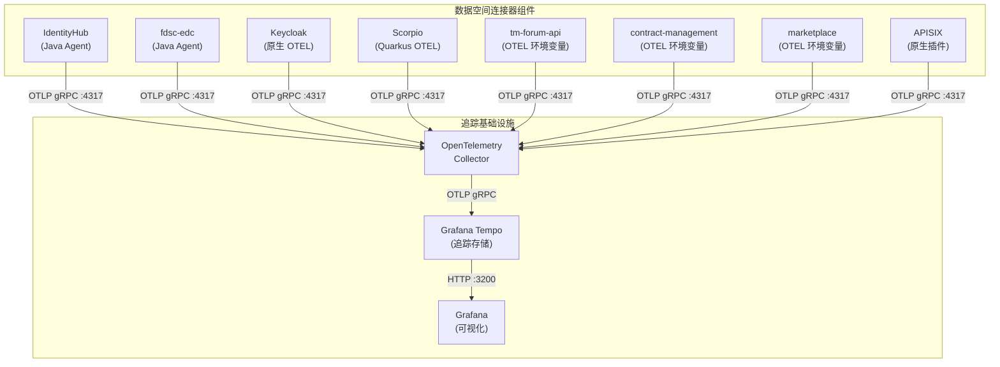
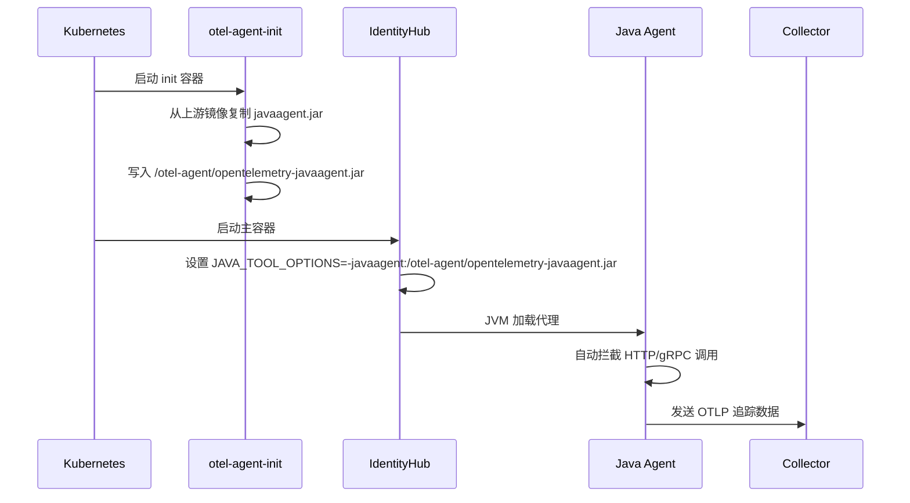

本文档详细说明 FIWARE Data Space Connector 中各组件的 OpenTelemetry（OTEL）分布式追踪接入方式。不同组件因运行时环境和集成深度的差异，采用了多样化的 OTEL 集成策略，包括 Java Agent 注入、原生 OTEL 支持、环境变量配置以及 OpenTelemetry Operator 自动注入等多种模式。

## 整体架构概览

FIWARE Data Space Connector 的分布式追踪架构采用**中心化 Collector 模式**，所有组件的追踪数据通过 OTLP 协议统一发送至集群内的 OpenTelemetry Collector，再由 Collector 转发至后端存储系统（如 Grafana Tempo、Jaeger 等）。



**关键架构特征**：

1. **统一出口**：所有组件通过 OTLP gRPC（端口 4317）或 OTLP HTTP（端口 4318）协议向 Collector 发送追踪数据
2. **灵活后端**：Collector 支持同时向多个后端导出数据（debug、Tempo、Jaeger、Honeycomb 等）
3. **默认安全**：追踪功能默认禁用，启用后仅向 Collector 的 debug 导出器发送数据（stdout 日志），不产生外部网络调用
4. **资源属性**：每个组件通过 `OTEL_RESOURCE_ATTRIBUTES` 注入服务名称等元数据

Sources: [README.md](doc/deployment-integration/observability/README.md#L35-L75)

## 组件接入方式总览

不同组件根据其运行时特性和 OTEL 支持程度，采用不同的接入策略：

| 组件 | 运行时 | 接入方式 | 关键配置 |
|------|--------|----------|----------|
| **IdentityHub** | Java | Java Agent 注入 | `identityhub.tracing.javaagent.enabled` |
| **fdsc-edc** | Java | Java Agent 注入 | `fdsc-edc.tracing.javaagent.enabled` |
| **Keycloak** | Java (Quarkus) | 原生 OTEL 支持 | `KC_TRACING_ENABLED=true` |
| **Scorpio** | Java (Quarkus) | 原生 OTEL 支持* | `QUARKUS_OTEL_ENABLED=true` |
| **tm-forum-api** | Java (Micronaut) | 环境变量 + 自动注入 | OTEL Operator 注解 |
| **contract-management** | Java (Micronaut) | 环境变量 + 自动注入 | OTEL Operator 注解 |
| **marketplace** | Python/Node.js | 环境变量 + 自动注入 | OTEL Operator 注解 |
| **APISIX** | Lua | 原生插件 | `opentelemetry` 插件全局规则 |
| **decentralizedIam** | 多种 | 前向兼容透传 | 继承全局配置 |

*注意：Scorpio 镜像当前缺少 `quarkus-opentelemetry` 扩展，需使用 OTEL Operator 自动注入

Sources: [README.md](doc/deployment-integration/observability/README.md#L555-L620)

## IdentityHub 接入详解

IdentityHub 采用 **Java Agent 注入**方式，通过 init 容器将 OpenTelemetry Java Agent JAR 文件复制到共享卷中，然后通过 `JAVA_TOOL_OPTIONS` 环境变量激活代理。

### 集成机制



### 配置示例

```yaml
identityhub:
  tracing:
    # 是否启用追踪（默认继承全局 tracing.enabled）
    enabled: true
    # 服务名称（显示在追踪后端中）
    serviceName: "identityhub"
    javaagent:
      # 是否注入 Java Agent（默认 true）
      enabled: true
      # Java Agent 镜像（默认使用官方 2.11.0 版本）
      image: "ghcr.io/open-telemetry/opentelemetry-java-instrumentation/autoinstrumentation-java:2.11.0"
      pullPolicy: "IfNotPresent"
```

### 实现细节

IdentityHub 的部署模板通过以下步骤实现 OTEL 集成：

1. **解析追踪状态**：检查 `identityhub.tracing.enabled` 是否覆盖全局 `tracing.enabled`
2. **条件注入 init 容器**：当追踪启用且 `javaagent.enabled=true` 时，注入 `otel-agent-init` 容器
3. **环境变量注入**：通过 `dsc.otel.env` 模板助手注入标准 `OTEL_*` 环境变量
4. **卷挂载**：创建 `otel-agent` 卷并挂载到主容器的 `/otel-agent` 路径

Sources: [identityhub-deployment.yaml](charts/data-space-connector/templates/identityhub-deployment.yaml#L1-L30)

## fdsc-edc 接入详解

fdsc-edc（FIWARE Data Space EDC）同样采用 **Java Agent 注入**方式，与 IdentityHub 使用相同的集成模式。

### 配置示例

```yaml
fdsc-edc:
  tracing:
    # 是否启用追踪（默认继承全局 tracing.enabled）
    enabled: true
    # 服务名称
    serviceName: "fdsc-edc"
    javaagent:
      # 是否注入 Java Agent
      enabled: true
      # Java Agent 镜像
      image: "ghcr.io/open-telemetry/opentelemetry-java-instrumentation/autoinstrumentation-java:2.11.0"
      pullPolicy: "IfNotPresent"
```

### 特殊注意事项

fdsc-edc 的集成通过子图的 `initContainers`、`additionalVolumes` 和 `additionalVolumeMounts` 扩展点实现。如果覆盖了 `fdsc-edc.common.additonalEnvVars`、`initContainers` 或卷设置，必须手动合并追踪相关条目。

**默认环境变量配置**：

```yaml
fdsc-edc:
  deployment:
    additionalEnvVars:
      # Java Agent 激活参数
      - name: JAVA_TOOL_OPTIONS
        value: "-javaagent:/otel-agent/opentelemetry-javaagent.jar"
      # 标准 OTEL SDK 环境变量
      - name: OTEL_SERVICE_NAME
        value: "fdsc-edc"
      - name: OTEL_EXPORTER_OTLP_ENDPOINT
        value: "http://dsc-opentelemetry-collector:4317"
      - name: OTEL_EXPORTER_OTLP_PROTOCOL
        value: "grpc"
      # ... 其他 OTEL 环境变量
```

Sources: [values.yaml](charts/data-space-connector/values.yaml#L1895-L1910)

## Keycloak 接入详解

Keycloak 25+ 提供**原生 OpenTelemetry 支持**，通过 `KC_TRACING_ENABLED=true` 环境变量激活，无需额外的 Agent 注入。

### 集成机制

Keycloak 的集成通过 ConfigMap 实现，将 `OTEL_*` 环境变量和 Keycloak 特定变量注入到 StatefulSet 中：


### 配置示例

```yaml
keycloak:
  tracing:
    # 是否启用追踪（默认继承全局 tracing.enabled）
    enabled: true
    # 服务名称
    serviceName: "keycloak"
```

### 注入的环境变量

Keycloak 的 ConfigMap 包含以下关键环境变量：

| 环境变量 | 值 | 说明 |
|----------|-----|------|
| `KC_TRACING_ENABLED` | `true` | Keycloak 原生 OTEL 支持开关 |
| `OTEL_SERVICE_NAME` | `keycloak` | 服务名称 |
| `OTEL_EXPORTER_OTLP_ENDPOINT` | `http://<release>-opentelemetry-collector:4317` | OTLP 端点 |
| `OTEL_EXPORTER_OTLP_PROTOCOL` | `grpc` | 传输协议 |
| `QUARKUS_OTEL_EXPORTER_OTLP_TRACES_ENDPOINT` | 同上 | Quarkus 特定端点（Keycloak 基于 Quarkus） |
| `OTEL_TRACES_SAMPLER` | `parentbased_traceidratio` | 采样策略 |
| `OTEL_TRACES_SAMPLER_ARG` | `1.0` | 采样率（100%） |
| `OTEL_PROPAGATORS` | `tracecontext,baggage` | 上下文传播格式 |
| `OTEL_RESOURCE_ATTRIBUTES` | `service.name=keycloak,...` | 资源属性 |
| `OTEL_METRICS_EXPORTER` | `none` | 禁用指标导出 |
| `OTEL_LOGS_EXPORTER` | `none` | 禁用日志导出 |

Sources: [keycloak-tracing-cm.yaml](charts/data-space-connector/templates/keycloak-tracing-cm.yaml#L45-L80)

## Scorpio 接入详解

Scorpio 是基于 Quarkus 的上下文代理，理论上支持原生 OTEL 集成，但当前镜像缺少 `quarkus-opentelemetry` 扩展，因此需要使用 **OpenTelemetry Operator 自动注入**。

### 原生 OTEL 支持（理论）

Scorpio 的 Quarkus 运行时支持以下环境变量：

```yaml
scorpio:
  additionalEnvVars:
    - name: QUARKUS_OTEL_ENABLED
      value: "true"
    - name: QUARKUS_OTEL_EXPORTER_OTLP_TRACES_ENDPOINT
      value: "http://dsc-opentelemetry-collector:4317"
    - name: QUARKUS_OTEL_EXPORTER_OTLP_TRACES_PROTOCOL
      value: "grpc"
    - name: QUARKUS_OTEL_SERVICE_NAME
      value: "scorpio"
```

### 实际接入方式：OTEL Operator 自动注入

由于当前镜像限制，推荐使用 OpenTelemetry Operator：

```yaml
scorpio:
  podAnnotations:
    instrumentation.opentelemetry.io/inject-java: "true"
```

### 配置示例

```yaml
scorpio:
  tracing:
    # 是否启用追踪（默认继承全局 tracing.enabled）
    enabled: true
    # 服务名称
    serviceName: "scorpio"
```

**重要提示**：如果使用自动注入，应移除静态 `QUARKUS_OTEL_*` 环境变量，避免与 Operator 注入的变量冲突。

Sources: [values.yaml](charts/data-space-connector/values.yaml#L257-L305)

## tm-forum-api、contract-management、marketplace 接入详解

这三个组件采用**环境变量 + OpenTelemetry Operator 自动注入**的组合方式。

### 为什么需要自动注入？

| 组件 | 运行时 | 限制 |
|------|--------|------|
| **tm-forum-api** | Micronaut (Java) | 镜像无 OTEL SDK 或 Java Agent |
| **contract-management** | Micronaut (Java) | 同上 |
| **marketplace (charging backend)** | Python | 无 OTEL SDK |
| **marketplace (logic proxy)** | Node.js | 无 OTEL SDK |

### 配置示例

**tm-forum-api**：
```yaml
tm-forum-api:
  tracing:
    serviceName: "tm-forum-api"
  defaultConfig:
    additionalAnnotations:
      instrumentation.opentelemetry.io/inject-java: "true"
```

**contract-management**：
```yaml
contract-management:
  tracing:
    serviceName: "contract-management"
  deployment:
    additionalAnnotations:
      instrumentation.opentelemetry.io/inject-java: "true"
```

**marketplace**：
```yaml
marketplace:
  tracing:
    serviceName: "marketplace"
  bizEcosystemChargingBackend:
    deployment:
      podAnnotations:
        instrumentation.opentelemetry.io/inject-python: "true"
  bizEcosystemLogicProxy:
    statefulset:
      additionalAnnotations:
        instrumentation.opentelemetry.io/inject-nodejs: "true"
```

### 静态环境变量配置

即使使用自动注入，这些组件仍会接收静态 `OTEL_*` 环境变量（通过子图的 `extraEnv` 钩子）：

| 环境变量 | 说明 |
|----------|------|
| `OTEL_SERVICE_NAME` | 服务名称 |
| `OTEL_EXPORTER_OTLP_ENDPOINT` | OTLP 端点 |
| `OTEL_EXPORTER_OTLP_PROTOCOL` | 传输协议 |
| `OTEL_TRACES_SAMPLER` | 采样策略 |
| `OTEL_TRACES_SAMPLER_ARG` | 采样率 |
| `OTEL_PROPAGATORS` | 上下文传播格式 |
| `OTEL_RESOURCE_ATTRIBUTES` | 资源属性 |
| `OTEL_METRICS_EXPORTER` | 指标导出器（none） |
| `OTEL_LOGS_EXPORTER` | 日志导出器（none） |

Sources: [README.md](doc/deployment-integration/observability/README.md#L600-L650)

## APISIX 接入详解

APISIX 使用**原生 OpenTelemetry 插件**进行追踪，无需依赖 Kubernetes OTel Operator。

### 集成机制

APISIX 的 OTEL 集成通过以下步骤实现：

1. **插件列表配置**：将 `opentelemetry` 添加到 APISIX 的插件列表
2. **插件属性配置**：通过 `pluginAttrs` 配置 Collector 连接参数
3. **全局规则注册**：通过 Helm hook 注册全局规则，使插件应用于所有路由

### 配置示例

```yaml
decentralizedIam:
  odrlAuthorization:
    apisix:
      apisix:
        # 显式添加 opentelemetry 插件到插件列表
        plugins:
          - real-ip
          - client-control
          # ... 其他必要插件
          - opentelemetry
        # 插件属性配置
        pluginAttrs:
          opentelemetry:
            resource:
              service.name: apisix
            collector:
              address: provider-opentelemetry-collector:4317
              request_timeout: 3
            trace_id_source: x-request-id
            batch_span_processor:
              max_queue_size: 1024
              batch_timeout: 2
              inactive_timeout: 1
              max_export_batch_size: 16
```

### 全局规则注册

Helm 会在安装/升级后自动执行 Job，通过 APISIX Admin API 注册全局规则：

```bash
curl -X PUT "$APISIX_ADMIN/apisix/admin/global_rules/otel-tracing" \
  -H "X-API-KEY: $API_KEY" \
  -H "Content-Type: application/json" \
  -d '{"plugins":{"opentelemetry":{}}}'
```

Sources: [apisix-otel-global-rule-job.yaml](charts/data-space-connector/templates/apisix-otel-global-rule-job.yaml#L50-L90)

## decentralizedIam 接入详解

decentralizedIam 组件（包括 trusted-issuers-list、vcverifier、credentials-config-service 等）采用**前向兼容透传**方式。

### 集成特点

1. **继承全局配置**：默认使用全局 `tracing.enabled` 设置
2. **子组件独立控制**：各子组件可通过独立的 `tracing.enabled` 覆盖全局设置
3. **环境变量透传**：通过子图的扩展点注入标准 `OTEL_*` 环境变量

### 配置示例

```yaml
decentralizedIam:
  vcAuthentication:
    trusted-issuers-list:
      deployment:
        additionalAnnotations:
          instrumentation.opentelemetry.io/inject-java: "true"
    vcverifier:
      deployment:
        additionalAnnotations:
          instrumentation.opentelemetry.io/inject-java: "true"
  odrlAuthorization:
    odrl-pap:
      deployment:
        additionalAnnotations:
          instrumentation.opentelemetry.io/inject-java: "true"
```

Sources: [monitoring.yaml](k3s/monitoring.yaml#L180-L200)

## OpenTelemetry Operator 自动注入详解

OpenTelemetry Operator 提供 Kubernetes 原生的自动注入能力，通过 mutating admission webhook 在 Pod 创建时注入语言特定的 Agent。

### 启用自动注入

```yaml
tracing:
  enabled: true
  autoInstrumentation:
    enabled: true

opentelemetry-operator:
  enabled: true
```

### Instrumentation 自定义资源

Operator 通过 `Instrumentation` CR 定义 Agent 镜像和配置：

```yaml
apiVersion: opentelemetry.io/v1alpha1
kind: Instrumentation
metadata:
  name: dsc-auto-instrumentation
spec:
  exporter:
    endpoint: "http://dsc-opentelemetry-collector:4317"
  propagators:
    - tracecontext
    - baggage
  sampler:
    type: parentbased_traceidratio
    argument: "1.0"
  java:
    image: "ghcr.io/open-telemetry/opentelemetry-operator/autoinstrumentation-java:2.11.0"
  python:
    image: "ghcr.io/open-telemetry/opentelemetry-operator/autoinstrumentation-python:0.54b0"
  nodejs:
    image: "ghcr.io/open-telemetry/opentelemetry-operator/autoinstrumentation-nodejs:0.75.0"
```

### 注入注解

Pod 必须携带特定注解才能被注入：

| 语言 | 注解 |
|------|------|
| Java | `instrumentation.opentelemetry.io/inject-java: "true"` |
| Python | `instrumentation.opentelemetry.io/inject-python: "true"` |
| Node.js | `instrumentation.opentelemetry.io/inject-nodejs: "true"` |

### 与静态环境变量的交互

当使用自动注入时，Operator 会从 `Instrumentation` CR 注入 `OTEL_*` 环境变量。如果 Pod 同时有静态 `OTEL_*` 环境变量，容器级变量会优先于 Operator 注入的变量。

**建议**：启用自动注入时，移除该组件的静态 `OTEL_*` 环境变量，仅保留非 OTEL 变量（如 `API_EXTENSION_ENABLED`、`LOGGER_LEVELS_ROOT` 等）。

Sources: [otel-instrumentation.yaml](charts/data-space-connector/templates/otel-instrumentation.yaml#L30-L77)

## 全局配置参考

### 全局追踪配置

这些值位于 `values.yaml` 的 `tracing:` 键下：

| 配置项 | 默认值 | 说明 |
|--------|--------|------|
| `tracing.enabled` | `false` | 全局追踪开关 |
| `tracing.exporter.otlp.endpoint` | `""`（自动计算） | OTLP 端点 URL。为空时默认为 `http://<release>-opentelemetry-collector:4317` |
| `tracing.exporter.otlp.protocol` | `"grpc"` | OTLP 传输协议（`grpc` 或 `http/protobuf`） |
| `tracing.exporter.otlp.insecure` | `true` | 禁用 OTLP 导出器的 TLS 验证（集群内默认） |
| `tracing.sampler` | `"parentbased_traceidratio"` | 追踪采样策略 |
| `tracing.samplerArg` | `"1.0"` | 采样参数（如 `"0.1"` 表示 10% 采样） |
| `tracing.resourceAttributes` | `{}` | 添加到每个 span 的额外 OTEL 资源属性 |
| `tracing.propagators` | `"tracecontext,baggage"` | 上下文传播格式（默认 W3C Trace Context + Baggage） |

### OpenTelemetry Collector 配置

这些值位于 `opentelemetry-collector:` 键下：

| 配置项 | 默认值 | 说明 |
|--------|--------|------|
| `opentelemetry-collector.enabled` | `false` | 部署捆绑的 Collector（`tracing.enabled=true` 时自动设为 `true`） |
| `opentelemetry-collector.mode` | `"deployment"` | Collector 拓扑（`deployment`、`daemonset` 或 `statefulset`） |
| `opentelemetry-collector.replicaCount` | `1` | Collector 副本数 |
| `opentelemetry-collector.resources.requests.cpu` | `"100m"` | CPU 请求 |
| `opentelemetry-collector.resources.requests.memory` | `"128Mi"` | 内存请求 |
| `opentelemetry-collector.resources.limits.cpu` | `"500m"` | CPU 限制 |
| `opentelemetry-collector.resources.limits.memory` | `"512Mi"` | 内存限制 |

### 自动注入配置

| 配置项 | 默认值 | 说明 |
|--------|--------|------|
| `tracing.autoInstrumentation.enabled` | `false` | 自动注入主开关 |
| `tracing.autoInstrumentation.java.image` | `ghcr.io/.../autoinstrumentation-java:2.11.0` | Java Agent 镜像 |
| `tracing.autoInstrumentation.python.image` | `ghcr.io/.../autoinstrumentation-python:0.54b0` | Python Agent 镜像 |
| `tracing.autoInstrumentation.nodejs.image` | `ghcr.io/.../autoinstrumentation-nodejs:0.75.0` | Node.js Agent 镜像 |
| `opentelemetry-operator.enabled` | `false` | 部署 OTel Operator 子图 |

Sources: [README.md](doc/deployment-integration/observability/README.md#L480-L550)

## 接入方式选择指南

根据组件特性和需求选择合适的接入方式：

| 场景 | 推荐方式 | 适用组件 |
|------|----------|----------|
| 应用镜像内置 OTEL 支持 | 静态环境变量 | Keycloak |
| 应用镜像捆绑 Java Agent | Init 容器注入 | IdentityHub、fdsc-edc |
| 应用镜像无 OTEL SDK 或 Agent | **OTel Operator 自动注入** | Scorpio、tm-forum-api、contract-management、marketplace |
| 混合部署多语言 | OTel Operator（支持 Java、Python、Node.js） | 全组件 |
| 原生插件支持 | 插件配置 | APISIX |

## 未纳入追踪的组件

以下组件**不包含**在此追踪集成中：

| 组件 | 原因 |
|------|------|
| **Rainbow** | 计划在未来版本中移除 |
| **注册任务**（participant-registration、tmf-registration 等） | 短生命周期批处理任务，无需持续追踪 |
| **MongoDB** | 数据库级追踪由应用驱动程序处理，而非服务器 |
| **HashiCorp Vault** | 基础设施组件；如需追踪需独立配置 |
| **cert-manager** | 集群级 Operator；超出应用追踪范围 |

Sources: [README.md](doc/deployment-integration/observability/README.md#L750-L780)

## 故障排查

### 验证 Collector 运行状态

```bash
# 检查 Collector Pod 状态
kubectl get pods -l app.kubernetes.io/name=opentelemetry-collector

# 查看 Collector 日志
kubectl logs -l app.kubernetes.io/name=opentelemetry-collector --tail=50
```

应看到启动消息：`"Everything is ready. Begin running and processing data."`

### 验证 Span 接收

使用默认 `debug` 导出器时，span 会出现在 Collector 的 stdout 中。增加详细程度：

```yaml
opentelemetry-collector:
  config:
    exporters:
      debug:
        verbosity: "detailed"
```

### 常见问题排查

| 症状 | 可能原因 | 解决方案 |
|------|----------|----------|
| Collector 日志中无 span | 工作负载未发送到 Collector 端点 | 检查 Pod 是否设置了 `OTEL_EXPORTER_OTLP_ENDPOINT`：`kubectl exec <pod> -- env \| grep OTEL` |
| 端口 4317 连接被拒绝 | Collector 未部署或 Service 名称错误 | 验证 `tracing.enabled=true` 且 Collector Service 存在 |
| Java Agent 未加载 | Init 容器镜像拉取失败 | 检查 init 容器状态：`kubectl describe pod <pod>` |
| Span 到达 Collector 但未到后端 | 导出器配置错误 | 检查 Collector 日志中的导出错误，验证端点、TLS 设置和认证头 |
| `QUARKUS_OTEL_ENABLED` 未生效 | Scorpio 镜像缺少 OTEL 扩展 | 使用 OTEL Operator 自动注入 |
| Collector 内存使用过高 | Span 过多，batch 过大 | 调整 `batch.send_batch_size` 和 `memory_limiter.limit_percentage` |
| 部分追踪（缺失 span） | 采样率过低或传播格式不匹配 | 验证 `tracing.samplerArg`（设为 `"1.0"` 表示 100%）和 `tracing.propagators` |

### 检查 Pod 的 OTEL 环境变量

```bash
# IdentityHub
kubectl exec deploy/<release>-identityhub -- env | grep OTEL

# Keycloak
kubectl exec sts/<release>-keycloak -- env | grep -E "OTEL|KC_TRACING"

# Scorpio
kubectl exec deploy/<release>-scorpio -- env | grep -E "OTEL|QUARKUS_OTEL"
```

### 生产环境降低追踪量

对于高流量部署，降低采样率以避免后端过载：

```yaml
tracing:
  samplerArg: "0.1"   # 采样 10% 的追踪
```

或在特定组件上使用 `parentbased_always_off` 采样器：

```yaml
scorpio:
  tracing:
    serviceName: "scorpio"
```

Sources: [README.md](doc/deployment-integration/observability/README.md#L800-L879)

## 最佳实践

1. **渐进式启用**：先在开发环境启用 `tracing.enabled=true`，验证 Collector 日志中的 span
2. **服务命名规范**：为每个组件设置有意义的 `serviceName`，便于在追踪后端中识别
3. **采样策略**：生产环境根据流量调整 `samplerArg`，避免存储成本过高
4. **资源属性**：使用 `tracing.resourceAttributes` 添加环境标识（如 `environment=production`）
5. **自动注入优先**：对于无内置 OTEL 支持的组件，优先使用 OTel Operator 自动注入
6. **配置分离**：避免静态环境变量与自动注入冲突，保持配置清晰

## 相关文档

- [OpenTelemetry 分布式追踪架构](24-opentelemetry-fen-bu-shi-zhui-zong-jia-gou)：了解整体架构设计
- [Grafana Tempo 集群内部追踪后端](25-grafana-tempo-ji-qun-nei-bu-zhui-zong-hou-duan)：配置追踪存储后端
- [values.yaml 全局配置参考](16-values-yaml-quan-ju-pei-zhi-can-kao)：完整的配置参数参考