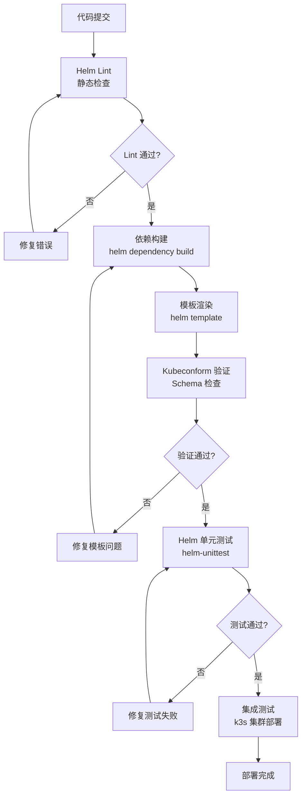

本页面详细介绍了 FIWARE Data Space Connector 项目中 Helm 图表的验证流程，包括代码静态检查、模板渲染验证和单元测试。这些验证机制确保 Helm 图表的质量和部署可靠性。

## Helm Lint 流程

项目使用 Helm Lint 工具对 Helm 图表进行静态代码检查。该流程通过 `.github/scripts/lint.sh` 脚本实现，为每个图表执行 `helm lint` 命令。

```bash
#!/bin/bash

CHARTS=./charts/*
for chart in $CHARTS
do
 docker run --rm -v $(pwd):/apps alpine/helm:2.9.0 lint $chart
done
```

**Lint 执行流程**：
1. 遍历 `charts/` 目录下的所有子目录
2. 对每个图表使用 Docker 容器执行 `helm lint`
3. 使用 `alpine/helm:2.9.0` 镜具确保环境一致性
4. 将当前目录挂载到容器的 `/apps` 路径

此脚本在 CI/CD 管道的 PR 检查阶段运行，确保提交的图表代码符合 Helm 规范。

Sources: [.github/scripts/lint.sh](.github/scripts/lint.sh#L1-L8)

## 模板渲染验证（Kubeconform）

项目使用 Kubeconform 工具验证 Helm 模板渲染输出是否符合 Kubernetes API 规范。此验证通过 `.github/scripts/eval.sh` 脚本实现。

```bash
#!/bin/bash

CHARTS=$(pwd)/charts/*
RETURN_VAL=0
for chart in $CHARTS
do
 [ ! -d "${chart}" ] && continue
 ./bin/helm dependency build ${chart}
 ./bin/helm template ${chart} | kubeconform -strict \
   -schema-location default \
   -schema-location 'https://raw.githubusercontent.com/datreeio/CRDs-catalog/main/{{.Group}}/{{.ResourceKind}}_{{.ResourceAPIVersion}}.json'

 ret=$?
 if [ $ret -ne 0 ]; then
     RETURN_VAL=$ret
 fi
done

if [ $RETURN_VAL -eq 0 ]; then
    echo "Chart evaluation successful !!!"
fi

exit $RETURN_VAL
```

**验证流程**：
1. **依赖构建**：首先执行 `helm dependency build` 解析图表依赖
2. **模板渲染**：使用 `helm template` 渲染图表模板
3. **Schema 验证**：通过 Kubeconform 验证渲染后的 YAML 是否符合 Kubernetes API 规范
4. **CRD 支持**：使用 Datreeio 的 CRDs-catalog 验证自定义资源定义
5. **严格模式**：启用 `-strict` 标志，将警告视为错误

此脚本确保所有模板渲染结果在部署前都是有效的 Kubernetes 资源定义。

Sources: [.github/scripts/eval.sh](.github/scripts/eval.sh#L1-L24)

## Helm 单元测试套件

项目使用 Helm Unittest 插件进行模板逻辑的单元测试。这些测试在本地和 CI 环境中运行，无需实际集群。

### 测试配置

在 `.github/workflows/test.yaml` 中定义了单元测试作业：

```yaml
# ---------------------------------------------------------------------------
# Helm unit tests – fast, no cluster required.  Validates the template
# rendering logic (tracing toggles, env-var injection, init containers, …)
# using the helm-unittest plugin.
# ---------------------------------------------------------------------------
unittest:
  runs-on: ubuntu-latest
  name: "Helm Unit Tests"
  steps:
    - uses: actions/checkout@v5

    - name: Set up Helm
      uses: azure/setup-helm@v4

    - name: Install helm-unittest plugin
      run: helm plugin install https://github.com/helm-unittest/helm-unittest --version "$HELM_UNITTEST_VERSION" --verify=false

    - name: Run unit tests
      run: helm unittest charts/data-space-connector
```

**测试环境**：
- 使用 Helm v3 和 helm-unittest 插件 v0.6.3
- 测试在无集群环境中执行
- 验证模板渲染逻辑而非实际部署

Sources: [.github/workflows/test.yaml](.github/workflows/test.yaml#L18-L40)

### 测试套件结构

测试文件位于 `charts/data-space-connector/tests/` 目录，每个文件针对特定的模板或功能：

| 测试套件 | 文件名 | 测试目标 |
|----------|--------|----------|
| OpenTelemetry 追踪 | `apisix-otel-global-rule_test.yaml` | APISIX 全局规则 Job 的渲染条件 |
| | `tracing_test.yaml` | IdentityHub 部署的 OTEL 环境变量注入 |
| | `keycloak-tracing_test.yaml` | Keycloak 追踪配置映射 |
| | `otel-instrumentation_test.yaml` | OpenTelemetry Operator Instrumentation CR |
| | `tempo_test.yaml` | Tempo 和 Grafana 集成表面 |

**测试套件示例**（`apisix-otel-global-rule_test.yaml`）：

```yaml
suite: OpenTelemetry tracing - APISIX global rule Job
templates:
  - templates/apisix-otel-global-rule-job.yaml
tests:
  # ==========================================================================
  # Rendering gate
  # ==========================================================================

  - it: should not render when tracing is disabled
    set:
      tracing.enabled: false
      decentralizedIam.enabled: true
    asserts:
      - hasDocuments:
          count: 0

  - it: should not render when decentralizedIam is disabled
    set:
      tracing.enabled: true
      decentralizedIam.enabled: false
    asserts:
      - hasDocuments:
          count: 0

  - it: should render when both tracing and decentralizedIam are enabled
    set:
      tracing.enabled: true
      decentralizedIam.enabled: true
    asserts:
      - hasDocuments:
          count: 1
      - isKind:
          of: Job
```

**测试模式**：
1. **渲染门控**：验证条件渲染逻辑（如 `tracing.enabled` 和 `decentralizedIam.enabled`）
2. **Helm Hook 注解**：检查 `helm.sh/hook` 和 `helm.sh/hook-weight` 注解
3. **Pod 安全上下文**：验证安全容器配置（`runAsNonRoot`、`readOnlyRootFilesystem` 等）
4. **配置覆盖**：测试自定义配置值如何影响模板输出

Sources: [charts/data-space-connector/tests/apisix-otel-global-rule_test.yaml](charts/data-space-connector/tests/apisix-otel-global-rule_test.yaml#L1-L136)

## CI/CD 集成

验证流程集成在 GitHub Actions 工作流中，确保每次代码更改都经过验证：

### PR 检查流程（`.github/workflows/check.yaml`）

1. **Lint 作业**：运行 `lint.sh` 进行静态检查
2. **Eval 作业**：运行 `eval.sh` 进行模板渲染验证
3. **标签检查**：验证语义化版本标签
4. **版本更新**：自动更新图表版本号

```yaml
jobs:
  lint:
    runs-on: ubuntu-latest
    steps:
      - uses: actions/checkout@v5
      - name: Lint
        run: ./.github/scripts/lint.sh

  eval:
    runs-on: ubuntu-latest
    needs:
      - lint
    steps:
      - uses: actions/checkout@v5
      - uses: actions/setup-go@v5
        with:
          go-version: '>=1.17.0'
        
      - name: Eval
        run: |
          .github/build/install.sh
          .github/scripts/eval.sh
```

**依赖关系**：Eval 作业依赖于 Lint 作业成功完成，确保只有通过静态检查的代码才会进行模板渲染验证。

Sources: [.github/workflows/check.yaml](.github/workflows/check.yaml#L13-L48)

### 工具安装脚本（`.github/build/install.sh`）

```bash
#!/bin/bash

wget "https://get.helm.sh/helm-v3.15.2-linux-amd64.tar.gz"
tar zxf helm-v3.15.2-linux-amd64.tar.gz
mkdir bin
mv linux-amd64/helm ./bin/helm

go install github.com/yannh/kubeconform/cmd/kubeconform@latest
```

此脚本安装特定版本的 Helm 和 Kubeconform，确保 CI 环境的可重复性。

Sources: [.github/build/install.sh](.github/build/install.sh#L1-L9)

## 验证流程可视化

下图展示了完整的 Helm 图表验证流程：



## 最佳实践

### 1. 测试策略
- **单元测试**：验证模板逻辑和条件渲染
- **集成测试**：在真实集群中验证部署
- **Schema 验证**：确保资源定义符合 API 规范

### 2. 测试覆盖
- 验证所有条件分支（`if/else` 逻辑）
- 测试默认值和自定义配置
- 检查安全上下文和资源限制

### 3. CI/CD 集成
- **快速反馈**：Lint 和单元测试提供快速反馈
- **分层验证**：Lint → 模板渲染 → 单元测试 → 集成测试
- **环境一致性**：使用容器化工具确保本地和 CI 环境一致

### 4. 调试技巧
- 使用 `helm template --debug` 查看渲染输出
- 使用 `helm unittest -u` 更新测试快照
- 检查 Kubeconform 的详细错误信息

## 下一步

完成 Helm Lint 和模板渲染验证后，建议继续阅读：
- [Helm Unittest 套件](28-helm-unittest-tao-jian) - 了解单元测试的详细编写方法
- [k3s 集成测试（Maven + Cucumber）](29-k3s-ji-cheng-ce-shi-maven-cucumber) - 了解端到端集成测试
- [values.yaml 全局配置参考](16-values-yaml-quan-ju-pei-zhi-can-kao) - 了解配置参数如何影响模板渲染