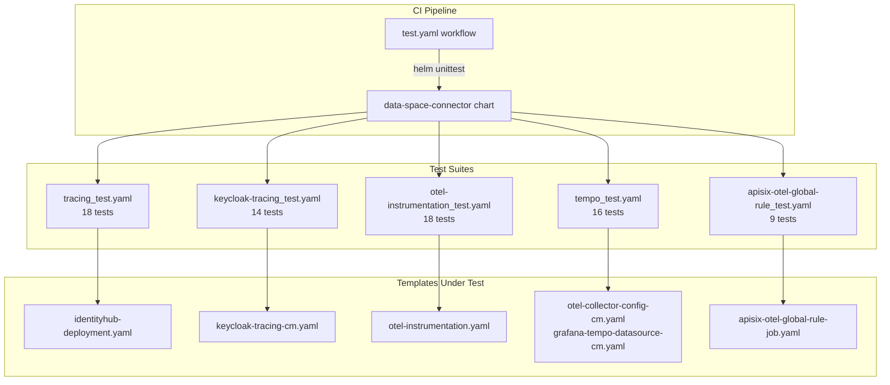

本文档介绍 Data Space Connector 项目中基于 [helm-unittest](https://github.com/helm-unittest/helm-unittest) 的 Helm 模板单元测试体系。该测试套件在无需 Kubernetes 集群的前提下，验证模板渲染逻辑的正确性——包括条件渲染门控、环境变量注入、Init Container 挂载以及多层配置覆盖等关键行为。

## 测试架构概览

测试套件位于 [`charts/data-space-connector/tests/`](charts/data-space-connector/tests) 目录，由 5 个测试套件文件组成，共计覆盖 **75 个测试用例**。每个文件对应一个 YAML schema 声明（`helm-testsuite.json`），遵循 `helm-unittest` 的声明式断言范式。



## CI 集成

单元测试通过 GitHub Actions 在每次 push 和 pull_request 时自动执行。插件版本通过环境变量统一管理，确保 CI 与本地开发环境的一致性。

```yaml
# 工作流关键配置
env:
  HELM_UNITTEST_VERSION: "0.6.3"

jobs:
  unittest:
    steps:
      - uses: azure/setup-helm@v4
      - run: helm plugin install https://github.com/helm-unittest/helm-unittest --version "$HELM_UNITTEST_VERSION" --verify=false
      - run: helm unittest charts/data-space-connector
```

Sources: [.github/workflows/test.yaml](.github/workflows/test.yaml#L1-L32)

## 测试套件详情

### 1. IdentityHub 部署追踪注入（tracing_test.yaml）

此套件是测试覆盖面最广的文件，验证 `identityhub-deployment.yaml` 模板中 OpenTelemetry 追踪的完整注入逻辑。测试维度涵盖环境变量、Init Container、Volume 挂载以及两级覆盖机制（全局 → 组件级）。

**测试矩阵**：

| 测试类别 | 核心断言 | 示例 |
|---------|---------|------|
| 渲染门控 | `hasDocuments: count: 0` | `identityhub.enabled: false` 时不渲染文档 |
| 追踪禁用 | `notContains` OTEL env vars | `tracing.enabled: false` 时无 OTEL 环境变量 |
| 追踪启用 | `contains` 6 个 OTEL env vars | 验证 `OTEL_EXPORTER_OTLP_ENDPOINT`、`OTEL_SERVICE_NAME` 等 |
| Init Container | `contains` initContainers | `otel-agent-init` 容器注入 |
| Volume 挂载 | `contains` volumes + volumeMounts | `otel-agent` emptyDir (32Mi) 只读挂载 |
| 组件级覆盖 | 正向/反向验证 | `identityhub.tracing.enabled` 独立于全局开关 |
| 配置自定义 | `equal` 精确值匹配 | 自定义 endpoint、protocol、sampler 参数 |
| Java Agent 开关 | 条件组合 | 禁用 agent 时保留 env vars 但移除 init container |

**关键测试模式——两级覆盖**：

组件级 `identityhub.tracing.enabled` 可独立于全局 `tracing.enabled` 开关，实现精细化控制。测试同时验证正向（组件启用 + 全局禁用）和反向（组件禁用 + 全局启用）场景：

```yaml
- it: should enable tracing per-component even when global tracing is off
  set:
    tracing.enabled: false
    identityhub.tracing.enabled: true
  asserts:
    - contains:
        path: spec.template.spec.containers[0].env
        content:
          name: OTEL_EXPORTER_OTLP_ENDPOINT
        any: true
```

Sources: [tracing_test.yaml](charts/data-space-connector/tests/tracing_test.yaml#L1-L361)

### 2. Keycloak 追踪 ConfigMap（keycloak-tracing_test.yaml）

验证 `keycloak-tracing-cm.yaml` 模板生成的 ConfigMap，该 ConfigMap 通过 Bitnami Keycloak 子 Chart 的 `extraEnvVarsCM` 钩子注入 OTEL/Quarkus 环境变量。

**双层渲染门控**：Keycloak 必须启用（`keycloak.enabled: true`），追踪状态决定 data 字段是否填充。

| 条件组合 | 渲染结果 |
|---------|---------|
| `keycloak.enabled: false` | 不渲染文档 |
| `keycloak.enabled: true` + `tracing.enabled: false` | 空 data 的 ConfigMap |
| `keycloak.enabled: true` + `tracing.enabled: true` | 完整 data 字段 |

**验证的环境变量**：
- **Keycloak 原生**：`KC_TRACING_ENABLED`
- **OTEL SDK 标准**：`OTEL_EXPORTER_OTLP_ENDPOINT`、`OTEL_SERVICE_NAME`、`OTEL_EXPORTER_OTLP_PROTOCOL`、`OTEL_METRICS_EXPORTER`、`OTEL_LOGS_EXPORTER`
- **Quarkus 特定**：`QUARKUS_OTEL_EXPORTER_OTLP_TRACES_ENDPOINT`、`QUARKUS_OTEL_EXPORTER_OTLP_TRACES_PROTOCOL`

组件级覆盖通过 `keycloak.tracing.enabled` 实现，逻辑与 IdentityHub 一致。

Sources: [keycloak-tracing_test.yaml](charts/data-space-connector/tests/keycloak-tracing_test.yaml#L1-L190)

### 3. OTel Operator Instrumentation CR（otel-instrumentation_test.yaml）

验证 `otel-instrumentation.yaml` 模板渲染的 `Instrumentation` 自定义资源（`opentelemetry.io/v1alpha1`）。该 CR 由 OTel Operator 的 Mutating Webhook 消费，自动向标注 Pod 注入语言特定的自动插桩 Agent。

**核心验证点**：

| 维度 | 断言逻辑 |
|-----|---------|
| CR 存在性 | `hasDocuments: count: 1` + `isKind: Instrumentation` + `isAPIVersion: opentelemetry.io/v1alpha1` |
| 命名规则 | `metadata.name` = `RELEASE-NAME-auto-instrumentation` |
| Exporter 端点 | 默认 `http://RELEASE-NAME-opentelemetry-collector:4317`，支持自定义覆盖 |
| Propagators | 默认 `tracecontext,baggage`，支持逗号分隔自定义列表 |
| Sampler | 默认 `parentbased_traceidratio` / `1.0`，支持 `always_on` 等模式 |
| Agent 镜像 | Java/Python/Node.js 三语言默认镜像版本 + 自定义覆盖 |

Sources: [otel-instrumentation_test.yaml](charts/data-space-connector/tests/otel-instrumentation_test.yaml#L1-L232)

### 4. Tempo 与 Grafana 集成（tempo_test.yaml）

这是套件中唯一使用**多模板联合测试**的文件，同时覆盖两个模板：

- `otel-collector-config-cm.yaml`：Collector 配置 ConfigMap
- `grafana-tempo-datasource-cm.yaml`：Grafana 数据源自动配置 ConfigMap

**测试策略**通过 `templates:` 字段在每个用例中精确指定目标模板，实现单套件内的模板隔离测试。

**Collector ConfigMap 测试矩阵**：

| tracing.enabled | tempo.enabled | 预期行为 |
|----------------|---------------|---------|
| false | — | 不渲染 |
| true | false | 不含 `otlp/tempo` exporter |
| true | true | 含 `otlp/tempo` exporter，目标端点 `http://RELEASE-NAME-tempo:4317` |

**Grafana Datasource ConfigMap 渲染门控**（AND 逻辑）：

| grafana.enabled | tempo.enabled | 预期行为 |
|----------------|---------------|---------|
| false | true | 不渲染 |
| true | false | 不渲染 |
| false | false | 不渲染 |
| true | true | 渲染完整的 Tempo datasource 配置 |

Sources: [tempo_test.yaml](charts/data-space-connector/tests/tempo_test.yaml#L1-L253)

### 5. APISIX OTEL 全局规则 Job（apisix-otel-global-rule_test.yaml）

验证 `apisix-otel-global-rule-job.yaml` 模板——一个 Helm Hook Job，通过 APISIX Admin API 注册全局 OpenTelemetry 插件规则。

**双重渲染门控**：`tracing.enabled` AND `decentralizedIam.enabled`。

**Helm Hook 验证**：
- `helm.sh/hook: post-install,post-upgrade`
- `helm.sh/hook-delete-policy: before-hook-creation,hook-succeeded`
- `helm.sh/hook-weight: 10`（确保在 `otel-restart` hook 之后执行）

**安全上下文断言**：
```yaml
- equal:
    path: spec.template.spec.containers[0].securityContext.runAsNonRoot
    value: true
- equal:
    path: spec.template.spec.containers[0].securityContext.readOnlyRootFilesystem
    value: true
```

**Admin API Key**：验证默认 key `edd1c9f034335f136f87ad84b625c8f1` 以及自定义 key 的正确注入。

Sources: [apisix-otel-global-rule_test.yaml](charts/data-space-connector/tests/apisix-otel-global-rule_test.yaml#L1-L136)

## 断言类型速查表

`helm-unittest` 提供的断言类型在本项目中的使用分布如下：

| 断言类型 | 用途 | 使用场景 |
|---------|------|---------|
| `hasDocuments` | 验证渲染文档数量 | 条件渲染门控（count: 0 或 1） |
| `isKind` | 验证资源类型 | Deployment、ConfigMap、Job、Instrumentation |
| `isAPIVersion` | 验证 API 版本 | `opentelemetry.io/v1alpha1` |
| `equal` | 精确值匹配 | metadata.name、env value、annotation value |
| `contains` | 数组包含断言 | env 列表、initContainers、volumes、volumeMounts |
| `notContains` | 数组不包含断言 | 禁用状态下的 env/initContainer 排除 |
| `matchRegex` | 正则匹配 | ConfigMap data 中的多行 YAML 内容匹配 |
| `notMatchRegex` | 正则不匹配 | 确认特定配置片段不存在 |
| `isNull` | 路径不存在 | initContainers、data 字段的空值断言 |
| `isNotNull` | 路径存在 | data 字段的非空断言 |

## 测试编写约定

### 文件命名

测试文件遵循 `{template-name}_test.yaml` 命名约定，放置于 `charts/data-space-connector/tests/` 目录。文件名中的模板名与 `templates/` 目录下的文件名对应。

### Schema 声明

每个测试文件顶部声明 JSON Schema 以获得 IDE 自动补全和校验：

```yaml
# yaml-language-server: $schema=https://raw.githubusercontent.com/helm-unittest/helm-unittest/main/schema/helm-testsuite.json
```

### Suite 命名

`suite` 字段使用人类可读的描述性名称，格式为 `{功能域} - {具体资源}`，例如：
- `OpenTelemetry tracing - IdentityHub deployment`
- `OpenTelemetry Operator - Instrumentation CR`
- `Tempo and Grafana integration`

### 测试分组

测试用例通过注释分隔符 `# ====` 组织为逻辑区块，典型分组包括：
- 渲染门控（Rendering gate）
- 默认行为（Default behavior）
- 启用/禁用状态
- 配置覆盖
- 组件级覆盖

### Values 覆盖

每个测试通过 `set:` 字段注入最小化的 values 覆盖，避免测试间耦合。Suite 级别的 `set:` 用于设置共性前提条件（如 `identityhub.enabled: true`），用例级别的 `set:` 用于测试特定场景。

## 本地运行指南

**前置条件**：安装 Helm 3 和 helm-unittest 插件。

```bash
# 安装插件
helm plugin install https://github.com/helm-unittest/helm-unittest --version 0.6.3

# 运行全部测试
helm unittest charts/data-space-connector

# 运行指定测试文件
helm unittest charts/data-space-connector -f tests/tracing_test.yaml

# 运行匹配名称的测试
helm unittest charts/data-space-connector -t "should not render"
```

**与集成测试的关系**：Helm 单元测试仅验证模板渲染逻辑，不涉及实际集群部署。完整的端到端验证由 [k3s 集成测试（Maven + Cucumber）](29-k3s-ji-cheng-ce-shi-maven-cucumber) 负责，两者在 CI 流水线中并行执行。

Sources: [.github/workflows/test.yaml](.github/workflows/test.yaml#L14-L32)

## 测试覆盖范围边界

当前测试套件聚焦于**可观测性（Observability）** 子系统的模板渲染验证。以下资源类型尚未纳入单元测试范围：

- IdentityHub 的 ConfigMap、Ingress、Service 等辅助模板
- 子 Chart（fdsc-edc、keycloak 等）的内部模板
- values.yaml 的 schema 校验

对于未覆盖的模板，可通过 [Helm Lint 与模板渲染验证](27-helm-lint-yu-mo-ban-xuan-ran-yan-zheng) 进行基础语法校验。

## Next Steps

- 了解模板渲染的基础校验流程：[Helm Lint 与模板渲染验证](27-helm-lint-yu-mo-ban-xuan-ran-yan-zheng)
- 了解完整的端到端测试流程：[k3s 集成测试（Maven + Cucumber）](29-k3s-ji-cheng-ce-shi-maven-cucumber)
- 查看可观测性架构的完整设计：[OpenTelemetry 分布式追踪架构](24-opentelemetry-fen-bu-shi-zhui-zong-jia-gou)
- 了解 values.yaml 的完整配置选项：[values.yaml 全局配置参考](16-values-yaml-quan-ju-pei-zhi-can-kao)