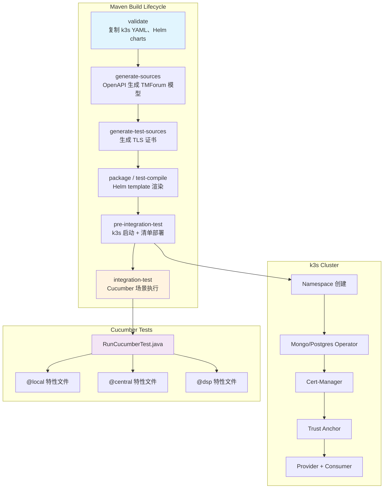
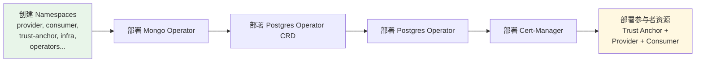
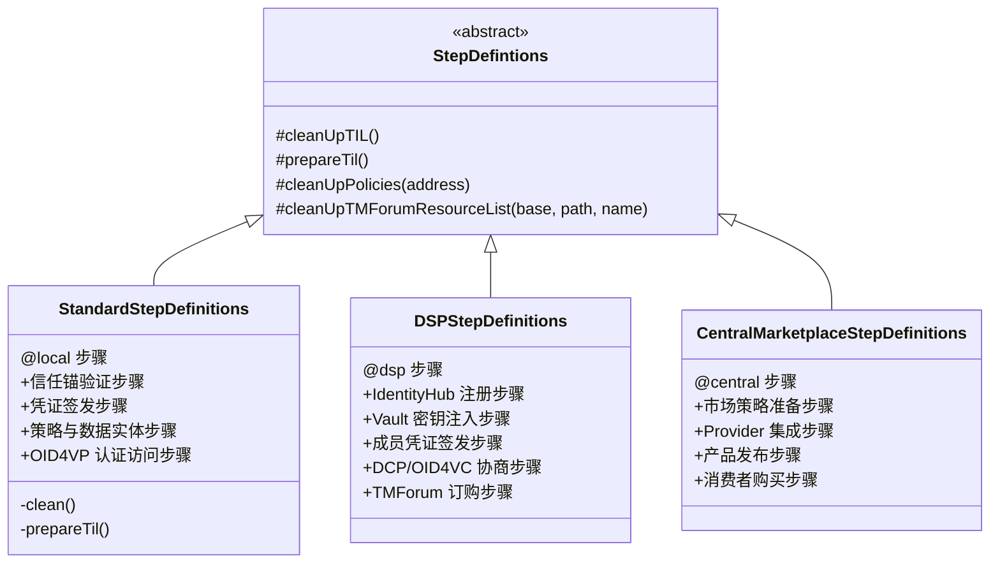

本页详细说明 Data Space Connector 项目中基于 **Maven + Cucumber + k3s** 的端到端集成测试体系。该体系在 CI 流水线中自动拉起一个轻量级 k3s 集群，通过 Helm 模板渲染并部署完整的 Provider / Consumer / Trust Anchor 拓扑，再以 Cucumber BDD 场景驱动黑盒验证数据空间的核心业务流程。

## 架构总览

集成测试的整体构建与执行遵循 Maven 生命周期，由三个核心 Maven 插件协同驱动：**maven-resources-plugin**（资源复制）、**helm-maven-plugin**（Helm 模板渲染）和 **k3s-maven-plugin**（集群生命周期与清单部署）。测试代码本身通过 **maven-failsafe-plugin** 在 `integration-test` 阶段触发，入口为 JUnit 5 Platform Suite 的 `RunCucumberTest` 类。



Sources: [pom.xml](pom.xml#L1-L1122), [it/pom.xml](it/pom.xml#L1-L531), [.github/workflows/test.yaml](.github/workflows/test.yaml#L1-L137)

## Maven 多模块与 Profile 体系

项目采用父子 POM 结构。根 [pom.xml](pom.xml) 定义全局插件版本和默认 `<skip>true</skip>` 的执行配置，子模块 [it/pom.xml](it/pom.xml) 继承父 POM 并引入 Cucumber、JUnit 5、OkHttp、Keycloak 等测试依赖。所有重型插件（k3s、Helm、资源复制）默认禁用，仅在激活特定 Profile 时开启。

### Profile 矩阵

| Profile | 类型 | 作用 | 典型组合 |
|---------|------|------|----------|
| `test` | 构建 | 启用证书生成、资源复制、Helm 渲染、k3s 部署和 Failsafe 执行 | 必选基础 |
| `local` | 部署 | 渲染标准 Provider/Consumer Helm chart，部署基础数据空间栈 | `test,local` |
| `central` | 部署 | 额外渲染 Consumer 的 auth+TMF overlay，含 Central Marketplace 配置 | `test,central` |
| `dsp` | 部署 | 额外叠加 `dsp-provider.yaml` / `dsp-consumer.yaml`，启用 EDC + IdentityHub | `test,dsp` |
| `elsi` | 部署 | 使用 ELSI 信任框架配置替代默认自签名 | `test,elsi` |
| `gaia-x` | 部署 | 部署 Gaia-X Registry 基础设施，使用 Gaia-X 专用 values | `test,gaia-x` |
| `monitoring` | 部署 | 额外部署 Prometheus 监控栈 | `test,monitoring` |
| `local-test` | 测试过滤 | 设置 `cucumber.filter.tags=@local` | `test,local,local-test` |
| `central-test` | 测试过滤 | 设置 `cucumber.filter.tags=@central` | `test,central,central-test` |
| `dsp-test` | 测试过滤 | 设置 `cucumber.filter.tags=@dsp` | `test,dsp,dsp-test` |

CI 矩阵使用三组组合：`test,local-test`、`test,central,central-test`、`test,dsp,dsp-test`，实现同一集群拓扑下按标签隔离执行不同场景集。

Sources: [it/pom.xml](it/pom.xml#L399-L531), [pom.xml](pom.xml#L470-L1122), [.github/workflows/test.yaml](.github/workflows/test.yaml#L50-L60)

## 构建阶段详解

### 资源准备（validate → package）

在 `validate` 阶段，`maven-resources-plugin` 将 `k3s/namespaces/`、`k3s/infra/`、`charts/` 等源目录复制到 `target/` 下。同时 `download-maven-plugin` 下载 Postgres Operator CRD。

在 `package` 阶段，`maven-resources-plugin` 再次执行更完整的资源复制，包括 `k3s/provider/`、`k3s/consumer/`、`k3s/certs/` 等附加资源。`maven-antrun-plugin` 还会对渲染后的 APISIX Ingress 清单做命名空间补丁，修复 Helm chart 中的已知问题。

Sources: [pom.xml](pom.xml#L200-L399), [it/pom.xml](it/pom.xml#L420-L480)

### Helm 模板渲染（package / test-compile）

`helm-maven-plugin` 执行 `helm dependency update` + `helm template`，将 Helm chart 渲染为纯 Kubernetes YAML 清单，输出到 `target/k3s/dsc-provider/`、`target/k3s/dsc-consumer/`、`target/k3s/trust-anchor/` 等目录。不同 Profile 使用不同的 values overlay 文件组合：

| 部署角色 | values 文件组合 |
|---------|----------------|
| Provider（标准） | `provider.yaml` |
| Provider（DSP） | `provider.yaml` + `dsp-provider.yaml` |
| Provider（Central） | `provider.yaml`（无 `--skip-tests`） |
| Consumer（标准） | `consumer.yaml` |
| Consumer（Central） | `consumer.yaml` + `consumer-auth.yaml` + `consumer-tmf.yaml` |
| Consumer（DSP） | `consumer.yaml` + `consumer-auth.yaml` + `consumer-tmf.yaml` + `dsp-consumer.yaml` |

Sources: [pom.xml](pom.xml#L300-L399), [k3s/provider.yaml](k3s/provider.yaml#L1-L200), [k3s/consumer.yaml](k3s/consumer.yaml#L1-L80)

### k3s 集群启动与清单部署（pre-integration-test）

`k3s-maven-plugin` 在 `pre-integration-test` 阶段自动启动一个嵌入式 k3s 集群，并按顺序 apply 渲染后的 Kubernetes 清单。部署顺序严格控制以满足依赖关系：



k3s 集群的端口绑定配置为：`8080:8080`（Traefik HTTP）、`8443:8443`（Traefik HTTPS）、`8888:8888`（Squid 代理）。所有测试端点通过 `*.127.0.0.1.nip.io` 域名访问，由 Traefik Ingress Controller 路由。

Sources: [pom.xml](pom.xml#L420-L470), [k3s/namespaces/provider.yaml](k3s/namespaces/provider.yaml#L1-L4)

## Cucumber 测试框架

### 入口与标签过滤

测试入口为 [RunCucumberTest.java](it/src/test/java/org/fiware/dataspace/it/components/RunCucumberTest.java)，它是一个 JUnit 5 `@Suite`，使用 `@IncludeEngines("cucumber")` 引擎，扫描 `it/` classpath 资源目录下的所有 `.feature` 文件。标签过滤通过 Maven Failsafe 的 `cucumber.filter.tags` 系统属性控制。

Sources: [RunCucumberTest.java](it/src/test/java/org/fiware/dataspace/it/components/RunCucumberTest.java#L1-L32)

### 特性文件（Feature Files）

项目包含 8 个 Cucumber 特性文件，按部署 Profile 标签分组：

| 标签 | 特性文件 | 场景数 | 验证范围 |
|------|---------|--------|---------|
| `@local` | [local_deployment.feature](it/src/test/resources/it/local_deployment.feature) | 5 | 信任锚注册、OID4VP 凭证签发、策略创建、认证数据访问、未认证拒绝 |
| `@local` | [mvds_basic.feature](it/src/test/resources/it/mvds_basic.feature) | 2 | 参与者间基本数据交换、运营商 K8S 集群创建 |
| `@local` | [local_marketplace.feature](it/src/test/resources/it/local_marketplace.feature) | 4 | 产品规格创建、自注册、购买受限/完全服务访问 |
| `@central` | [central_marketplace.feature](it/src/test/resources/it/central_marketplace.feature) | 4 | 中央市场策略准备、Provider 集成、产品发布、消费者购买与服务激活 |
| `@dsp` | [dsp_identity_setup.feature](it/src/test/resources/it/dsp_identity_setup.feature) | 4 | IdentityHub 注册、密钥 Vault 注入、成员凭证签发、TIL 配置 |
| `@dsp` | [dsp_dcp_flow.feature](it/src/test/resources/it/dsp_dcp_flow.feature) | 3 | DCP 目录浏览、合同协商、传输流程与数据获取 |
| `@dsp` | [dsp_oid4vc_flow.feature](it/src/test/resources/it/dsp_oid4vc_flow.feature) | 5 | OID4VC 目录浏览、合同协商、未认证拒绝、OpenID 配置验证、OID4VP 数据访问 |
| `@dsp` | [dsp_tmforum_ordering.feature](it/src/test/resources/it/dsp_tmforum_ordering.feature) | 4 | DSP 演示数据、TMForum 产品发布、策略准备、TMForum 订购流程 |

Sources: [local_deployment.feature](it/src/test/resources/it/local_deployment.feature#L1-L43), [mvds_basic.feature](it/src/test/resources/it/mvds_basic.feature#L1-L24), [central_marketplace.feature](it/src/test/resources/it/central_marketplace.feature#L1-L75), [dsp_identity_setup.feature](it/src/test/resources/it/dsp_identity_setup.feature#L1-L37), [dsp_dcp_flow.feature](it/src/test/resources/it/dsp_dcp_flow.feature#L1-L33), [dsp_oid4vc_flow.feature](it/src/test/resources/it/dsp_oid4vc_flow.feature#L1-L47), [dsp_tmforum_ordering.feature](it/src/test/resources/it/dsp_tmforum_ordering.feature#L1-L36)

### 步骤定义类（Step Definitions）

Cucumber 步骤定义采用继承结构，共享基础设施方法：



每个步骤定义类在 `@Before` 钩子中执行环境清理（清除残留的策略、实体、目录、协议状态等），确保场景间隔离。

Sources: [StepDefintions.java](it/src/test/java/org/fiware/dataspace/it/components/StepDefintions.java#L1-L177), [StandardStepDefinitions.java](it/src/test/java/org/fiware/dataspace/it/components/StandardStepDefinitions.java#L1-L200), [DSPStepDefinitions.java](it/src/test/java/org/fiware/dataspace/it/components/DSPStepDefinitions.java#L1-L100), [CentralMarketplaceStepDefinitions.java](it/src/test/java/org/fiware/dataspace/it/components/CentralMarketplaceStepDefinitions.java#L1-L60)

## 测试基础设施组件

### 环境常量类

环境常量类以抽象类形式定义各部署 Profile 的端点地址，所有服务通过 `127.0.0.1.nip.io` 通配域名访问：

| 类名 | 职责 | 关键端点示例 |
|------|------|------------|
| `MPOperationsEnvironment` | Provider 端点 | `keycloak-provider`、`pap-provider`、`mp-data-service`、`tm-forum-api`、`scorpio-provider` |
| `FancyMarketplaceEnvironment` | Consumer 端点 | `keycloak-consumer`、测试用户（`employee`/`operator`/`representative`） |
| `TrustAnchorEnvironment` | 信任锚端点 | `tir.127.0.0.1.nip.io` |
| `DSPEnvironment` | DSP 管理 API | `dsp-dcp-management`、`dsp-oid4vc-management`、`identityhub-management-*`、`vault-*` |
| `CentralMarketplaceEnvironment` | 中央市场端点 | `fancy-marketplace`、`contract-management`、`pap-consumer` |

Sources: [MPOperationsEnvironment.java](it/src/test/java/org/fiware/dataspace/it/components/MPOperationsEnvironment.java#L1-L56), [FancyMarketplaceEnvironment.java](it/src/test/java/org/fiware/dataspace/it/components/FancyMarketplaceEnvironment.java#L1-L41), [DSPEnvironment.java](it/src/test/java/org/fiware/dataspace/it/components/DSPEnvironment.java#L1-L102), [CentralMarketplaceEnvironment.java](it/src/test/java/org/fiware/dataspace/it/components/CentralMarketplaceEnvironment.java#L1-L44)

### 辅助类

| 类名 | 职责 | 核心能力 |
|------|------|---------|
| `KubernetesHelper` | kubectl 交互 | 从 k3s 集群中获取 cert-manager 签名密钥（`fetchTlsKeyFromSecret`），自动定位 kubeconfig |
| `IdentityHubHelper` | IdentityHub + Vault 操作 | 密钥 JWK 注入 Vault、参与者注册、凭证插入 IdentityHub |
| `DSPManagementHelper` | EDC 管理 API | 目录请求、合同协商、传输流程、EDR 获取（支持 DCP 和 OID4VC 两种端点） |
| `ScriptHelper` | Shell 脚本的 Java 等价实现 | OID4VC 凭证签发流程、OID4VP 令牌交换、JWT payload 解码 |
| `KeycloakHelper` | Keycloak 令牌管理 | 基于密码授权获取用户访问令牌 |
| `Wallet` | OID4VC 钱包模拟 | EC P-256 密钥对生成、凭证获取与存储、VP Token 构建与签名、凭证换取访问令牌 |
| `TestUtils` | 通用测试工具 | 信任所有证书的 OkHttp 客户端、Squid 代理配置、Socket 超时重试（指数退避 1s/2s/4s）、DID 获取 |

`TestUtils` 中的 HTTP 客户端配置尤其值得注意：它禁用了 SSL 证书验证（测试环境使用自签名证书），强制所有请求经过 `127.0.0.1:8888` 的 Squid 代理，并内置了最多 3 次的 Socket 超时重试机制。

Sources: [KubernetesHelper.java](it/src/test/java/org/fiware/dataspace/it/components/KubernetesHelper.java#L1-L123), [IdentityHubHelper.java](it/src/test/java/org/fiware/dataspace/it/components/IdentityHubHelper.java#L1-L200), [DSPManagementHelper.java](it/src/test/java/org/fiware/dataspace/it/components/DSPManagementHelper.java#L1-L80), [ScriptHelper.java](it/src/test/java/org/fiware/dataspace/it/components/ScriptHelper.java#L1-L200), [Wallet.java](it/src/test/java/org/fiware/dataspace/it/components/Wallet.java#L1-L200), [TestUtils.java](it/src/test/java/org/fiware/dataspace/it/components/TestUtils.java#L1-L198)

### ODRL 策略模板

测试资源中包含 13 个预定义的 ODRL 策略 JSON 文件，用于在 PAP 中注册访问控制策略：

| 策略文件 | 用途 |
|---------|------|
| `allowAgreementRead.json` | 允许读取合同协议 |
| `allowCatalogRead.json` | 允许读取产品目录 |
| `allowContractManagement.json` | 允许合同管理操作 |
| `allowProductOffering.json` | 允许读取产品 Offering |
| `allowProductOfferingCreation.json` | 允许创建产品 Offering |
| `allowProductOrder.json` | 允许产品订购 |
| `allowProductSpec.json` | 允许读取产品规格 |
| `allowSelfRegistration.json` | 允许组织自注册 |
| `allowSelfRegistrationLegalPerson.json` | 允许法人实体自注册 |
| `allowTMFAgreementRead.json` | 允许读取 TMForum 协议 |
| `clusterCreate.json` | 允许创建 K8S 集群 |
| `energyReport.json` | 能源报告数据策略 |
| `uptimeReport.json` | 正常运行时间报告数据策略 |

Sources: [allowProductOffering.json](it/src/test/resources/policies/allowProductOffering.json#L1-L39)

## k3s 基础设施拓扑

测试集群使用 k3s（轻量级 Kubernetes）作为运行时，通过 `k3s-maven-plugin` 管理生命周期。集群内部署了以下命名空间和基础设施组件：

```mermaid
graph TB
    subgraph "infra 命名空间"
        Traefik["Traefik Ingress<br/>HTTP:8080 / HTTPS:8443"]
        Squid["Squid Proxy<br/>:8888"]
        CoreDNS["CoreDNS<br/>自定义配置"]
        CertManagerConfig["cert-manager-config<br/>selfsigned-issuer"]
    end

    subgraph "trust-anchor 命名空间"
        TIR["Trusted Issuers<br/>Registry (TIR)"]
    end

    subgraph "provider 命名空间"
        PKC["Provider Keycloak"]
        PAP["Provider PAP"]
        Scorpio["Scorpio<br/>(NGSI-LD)"]
        TMF_P["TMForum API"]
        CCS["Credentials<br/>Config Service"]
        VCVerifier["VCVerifier"]
        Rainbow_P["Rainbow<br/>(Catalog)"]
        EDC_P["EDC Connector<br/>(DSP only)"]
        IdentityHub_P["IdentityHub<br/>(DSP only)"]
        Vault_P["Vault<br/>(DSP only)"]
    end

    subgraph "consumer 命名空间"
        CKC["Consumer Keycloak"]
        Rainbow_C["Rainbow<br/>(Consumer)"]
        TMF_C["Consumer TMForum"]
        EDC_C["EDC Connector<br/>(DSP only)"]
        IdentityHub_C["IdentityHub<br/>(DSP only)"]
        Vault_C["Vault<br/>(DSP only)"]
    end

    subgraph "operators"
        MongoOp["MongoDB Operator"]
        PostgresOp["Postgres Operator"]
    end

    Traefik --> PKC & PAP & Scorpio & TMF_P & CKC & Rainbow_C & TIR
    Squid -.->|HTTPS 代理| VCVerifier & EDC_P & EDC_C

    style Traefik fill:#e3f2fd
    style Squid fill:#e3f2fd
    style TIR fill:#fce4ec
```



所有外部可访问的 Ingress 端点均使用 `*.127.0.0.1.nip.io` 通配域名，由 cert-manager 的 `selfsigned-issuer` 签发 ECDSA 证书。Squid 代理作为集群内所有需要外部 HTTPS 访问的组件的统一出口，测试 HTTP 客户端也通过它路由请求。

Sources: [k3s/infra/traefik/](k3s/infra/traefik), [k3s/infra/squid/](k3s/infra/squid), [k3s/infra/cert-manager-config/](k3s/infra/cert-manager-config), [k3s/infra/coredns/](k3s/infra/coredns)

## CI 流水线

GitHub Actions 工作流 [test.yaml](.github/workflows/test.yaml) 在每次 push 和 PR 时触发，使用矩阵策略并行执行三组集成测试：

```yaml
matrix:
  include:
    - name: local
      profiles: "test,local-test"
    - name: central
      profiles: "test,central,central-test"
    - name: dsp
      profiles: "test,dsp,dsp-test"
```

每组测试的执行命令为：

```bash
mvn clean integration-test -P${{ matrix.profiles }} -Dhelm.version=3.17.3
```

CI 流水线还包含一个独立的 **Helm Unit Tests** 作业（`unittest`），使用 `helm-unittest` 插件验证模板渲染逻辑，无需集群即可运行。

失败时的**事后诊断**步骤会自动收集：节点状态、所有 Pod 列表、非运行 Pod 详情、Warning 事件、失败 Pod 日志、磁盘与内存使用情况等，便于排查。

Sources: [.github/workflows/test.yaml](.github/workflows/test.yaml#L1-L137)

## 本地执行指南

### 前置条件

- JDK 17+
- Maven 3.8+
- Docker（k3s-maven-plugin 需要 Docker 运行 k3s 容器）
- Linux 内核（需启用 `br_netfilter` 模块：`sudo modprobe br_netfilter`）

### 执行命令

```bash
# 执行全部集成测试（包含集群启动，耗时较长）
mvn clean integration-test -Ptest,local-test

# 仅执行 DSP 相关测试
mvn clean integration-test -Ptest,dsp,dsp-test

# 仅执行 Central Marketplace 测试
mvn clean integration-test -Ptest,central,central-test

# 执行所有测试（不过滤标签）
mvn clean integration-test -Ptest
```

### kubeconfig 访问

测试集群的 kubeconfig 自动生成在 `it/target/k3s.yaml`。可通过 `KUBECONFIG` 环境变量或直接指定路径来使用 `kubectl` 访问集群：

```bash
export KUBECONFIG=$(pwd)/it/target/k3s.yaml
kubectl get pods -A
```

Sources: [KubernetesHelper.java](it/src/test/java/org/fiware/dataspace/it/components/KubernetesHelper.java#L40-L60)

## 扩展测试的模式

### 添加新的特性文件

1. 在 `it/src/test/resources/it/` 下创建新的 `.feature` 文件
2. 使用适当的标签（`@local`、`@central`、`@dsp`）标注 Feature 或 Scenario
3. 在对应的步骤定义类中实现新的 `@Given` / `@When` / `@Then` 步骤
4. 如需新的端点常量，在对应的 Environment 类中添加

### 添加新的部署 Profile

1. 在根 `pom.xml` 中定义新的 `<profile>`，配置 Helm 渲染和 k3s 部署插件
2. 在 `it/pom.xml` 中添加对应的测试过滤 Profile（设置 `cucumber.filter.tags`）
3. 在 `.github/workflows/test.yaml` 的矩阵中添加新的条目

Sources: [it/pom.xml](it/pom.xml#L399-L531), [.github/workflows/test.yaml](.github/workflows/test.yaml#L50-L60)

## 关键依赖版本

| 依赖 | 版本 | 用途 |
|------|------|------|
| k3s-maven-plugin | 2.1.0 | k3s 集群生命周期管理 |
| helm-maven-plugin | 6.17.0 | Helm chart 模板渲染 |
| Cucumber | 7.11.1 | BDD 测试框架 |
| JUnit 5 | 5.9.2 | 测试引擎 |
| OkHttp | 4.12.0 | HTTP 客户端 |
| Keycloak | 24.0.4 | 身份管理客户端 |
| Nimbus JOSE+JWT | 10.5 | JWT/JWS 处理 |
| Awaitility | 4.2.0 | 异步断言 |
| OpenAPI Generator | 7.9.0 | TMForum 模型代码生成 |

Sources: [pom.xml](pom.xml#L1-L30), [it/pom.xml](it/pom.xml#L1-L50)

## 下一步阅读

- 了解集成测试所验证的 Helm chart 内部结构：[Helm Umbrella Chart 依赖图谱](8-helm-umbrella-chart-yi-lai-tu-pu)
- 了解 Helm 模板的单元测试方法：[Helm Unittest 套件](28-helm-unittest-tao-jian)
- 了解 DSP 部署 Profile 对应的协议架构：[DSP 与 EDC 集成架构](14-dsp-yu-edc-ji-cheng-jia-gou)
- 了解 Central Marketplace 集成的业务流程：[Central Marketplace 集成](22-central-marketplace-ji-cheng)
- 了解 Helm chart 渲染验证方法：[Helm Lint 与模板渲染验证](27-helm-lint-yu-mo-ban-xuan-ran-yan-zheng)