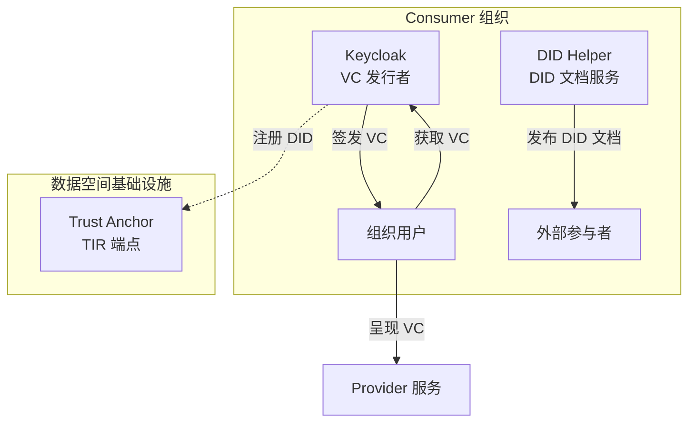
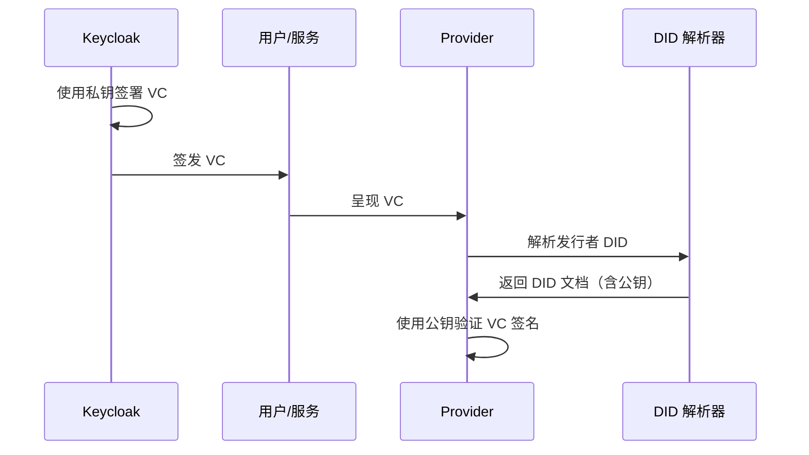

Consumer（消费者）是数据空间中**检索数据或服务**的参与者。Consumer 不托管数据服务本身，只需要为用户签发可验证凭证（Verifiable Credentials），以便向 Provider 证明身份并访问服务。本文档将指导您完成 Consumer 角色的部署配置。

## 核心组件与架构

Consumer 部署的核心架构围绕两个关键组件展开：**Keycloak** 作为可验证凭证发行者，以及 **DID Helper** 提供去中心化身份标识。这两个组件共同构成了 Consumer 在数据空间中的身份基础设施。



Sources: [doc/deployment-integration/roles/consumer/README.md](doc/deployment-integration/roles/consumer/README.md#L1-L8)

## 部署前准备

在开始部署之前，您需要与 **数据空间运营商（Operator)** 协调，完成以下关键步骤：

**与运营商协调的必要信息：**

| 准备项目 | 说明 | 负责方 |
|---------|------|--------|
| 组织 DID 注册 | 在 Trust Anchor 注册您组织的 DID | 运营商 |
| 凭证类型定义 | 确定允许发行的凭证类型及其配置 | 运营商 |
| TIR 端点 URL | Trust Anchor 的 TIR 端点地址 | 运营商 |
| 域名准备 | 为 `did:web` 准备受控域名 | 您的组织 |

**本地测试环境要求：**
- 24GB+ 内存（推荐）
- Java 17+
- Maven
- Docker
- kubectl（可选，用于调试）

Sources: [doc/deployment-integration/roles/consumer/README.md](doc/deployment-integration/roles/consumer/README.md#L9-L18), [doc/deployment-integration/local-deployment/LOCAL.MD](doc/deployment-integration/local-deployment/LOCAL.MD#L9-L28)

## DID 类型选择

Consumer 需要一个去中心化标识符（DID）来标识其在数据空间中的身份。根据环境选择合适的 DID 类型：

| DID 类型 | 适用场景 | 优点 | 缺点 |
|---------|---------|------|------|
| `did:web` | **生产环境** | 基于域名，可发现，支持密钥轮换 | 需要域名和 HTTPS |
| `did:key` | **测试/开发环境** | 简单生成，无需基础设施 | 不可发现，不支持密钥轮换 |

DID 文档包含 Consumer 的公钥，Provider 使用此公钥验证凭证是否由该组织签发。DID 必须在部署前注册到数据空间的 Trust Anchor。

Sources: [doc/deployment-integration/roles/consumer/README.md](doc/deployment-integration/roles/consumer/README.md#L28-L39)

## 基础部署配置

Consumer 角色实际上不需要部署完整的 FIWARE DSC，因为它只需要 DID 和 VC 发行者（Keycloak）。但为了简化部署，可以使用相同的 Helm 图表，通过禁用大部分组件来实现。

### Helm Values 基础配置

创建 `consumer-values.yaml` 文件，启用仅与 Consumer 相关的组件：

```yaml
# Consumer 专用部署的关键设置

# 启用 cert-manager（生产环境推荐）
cert-manager:
  enabled: true
  crds:
    enabled: true

# Keycloak 配置 - 详见 KEYCLOAK.md
keycloak:
  enabled: true
  ingress:
    enabled: true
    hostname: keycloak-consumer.your-domain.com
    annotations:
      cert-manager.io/cluster-issuer: "prod"  # 测试环境使用 "selfsigned-issuer"
    tls: true
  signingKey:
    did: did:web:your-domain.com
    keyAlgorithm: ES256

# DID Helper 配置
did:
  enabled: true
  config:
    server:
      hostUrl: "https://your-domain.com"
      certPath: "/certs/tls.crt"
  volumes:
    - name: certs
      secret:
        secretName: your-domain-tls
        items:
          - key: tls.crt
            path: tls.crt
  volumeMounts:
    - name: certs
      mountPath: /certs
  ingress:
    enabled: true
    hosts:
      - host: your-domain.com
        paths:
          - path: /
            pathType: ImplementationSpecific
    tls:
      - secretName: your-domain-tls
        hosts:
          - your-domain.com

# 禁用不需要的组件
decentralizedIam:
  enabled: true
  vcAuthentication:
    vcverifier:
      enabled: false
    credentials-config-service:
      enabled: false
    trusted-issuers-list:
      enabled: false
    managedPostgres:
      enabled: true
      config:
        volume:
          storageClass: ""  # 使用默认存储类或指定
  odrlAuthorization:
    odrl-pap:
      enabled: false
    apisix:
      enabled: false

contract-management:
  enabled: false
fdsc-edc:
  enabled: false
credentials:
  enabled: false
identityhub:
  enabled: false
vault:
  enabled: false
scorpio:
  enabled: false
tm-forum-api:
  enabled: false
```

Sources: [doc/deployment-integration/roles/consumer/README.md](doc/deployment-integration/roles/consumer/README.md#L61-L162)

### 部署命令

```shell
# 添加 FIWARE DSC Helm 仓库
helm repo add fiware-dsc https://fiware.github.io/data-space-connector

# 部署 Consumer
helm install consumer fiware-dsc/data-space-connector \
  -n consumer \
  --create-namespace \
  -f consumer-values.yaml
```

Sources: [doc/deployment-integration/roles/consumer/README.md](doc/deployment-integration/roles/consumer/README.md#L164-L177)

## Keycloak 配置详解

Keycloak 是 Consumer 部署中最关键的组件，负责身份验证和可验证凭证签发。

### 签名密钥与 DID 的关系

Keycloak 签署可验证凭证使用的**私钥必须与 DID 文档中发布的公钥对应**。这是信任模型的基础要求：

1. Keycloak 使用 PKCS12 密钥库中的私钥签署每个 VC
2. 验证者接收 VC 后，解析发行者的 DID 以获取 DID 文档中的公钥
3. 验证者使用该公钥验证 VC 签名

如果密钥库包含的密钥对与 DID 文档中引用的不同，**签名验证将失败**，签发的凭证将被数据空间中的其他参与者拒绝。



Sources: [doc/deployment-integration/roles/KEYCLOAK.md](doc/deployment-integration/roles/KEYCLOAK.md#L102-L112)

### Realm 配置结构

Keycloak Realm 配置定义了组织在数据空间中的身份结构：

```yaml
keycloak:
  realm:
    frontendUrl: https://keycloak-consumer.your-domain.com
    import: true
    name: test-realm
    attributes:
      issuerDid: "did:web:your-domain.com"
    
    # 凭证类型定义（每个条目渲染为一个 ClientScope）
    verifiableCredentials:
      user-credential:
        attributes:
          format: "jwt_vc_json"
          verifiable_credential_type: "UserCredential"
          credential_signing_alg: "ES256"
        protocolMappers:
          - name: context-mapper-uc
            protocol: oid4vc
            protocolMapper: oid4vc-context-mapper
            config:
              context: https://www.w3.org/2018/credentials/v1
          - name: email-mapper-uc
            protocol: oid4vc
            protocolMapper: oid4vc-user-attribute-mapper
            config:
              claim.name: email
              userAttribute: email
    
    # 客户端角色（按目标组织 DID 分组）
    clientRoles: |
      "did:web:provider-domain.com": [
        {
          "name": "customer",
          "description": "Is allowed to see offers",
          "clientRole": true
        }
      ]
    
    # 用户定义
    users: |
      {
        "username": "employee",
        "enabled": true,
        "email": "employee@consumer.org",
        "credentials": [{"type": "password", "value": "test"}],
        "clientRoles": {
          "did:web:provider-domain.com": ["customer"]
        }
      }
```

Sources: [doc/deployment-integration/roles/KEYCLOAK.md](doc/deployment-integration/roles/KEYCLOAK.md#L232-L278), [k3s/consumer.yaml](k3s/consumer.yaml#L75-L200)

### 可用的协议映射器类型

| 映射器类型 | `protocolMapper` 值 | 用途 | 关键配置字段 |
|-----------|---------------------|------|-------------|
| 上下文映射器 | `oid4vc-context-mapper` | 设置凭证的 JSON-LD `@context` | `context` |
| 用户属性映射器 | `oid4vc-user-attribute-mapper` | 将 Keycloak 用户属性映射到 VC 声明 | `claim.name`, `userAttribute` |
| 静态声明映射器 | `oid4vc-static-claim-mapper` | 向 VC 添加固定值声明 | `claim.name`, `staticValue` |
| 目标角色映射器 | `oid4vc-target-role-mapper` | 将特定目标（DID）的客户端角色映射到 VC | `claim.name`, `clientId` |

Sources: [doc/deployment-integration/roles/KEYCLOAK.md](doc/deployment-integration/roles/KEYCLOAK.md#L340-L391)

## 可选组件配置

### DSP 集成（FDSC-EDC 和 IdentityHub）

如果数据空间要求符合数据空间协议（DSP），Consumer 可以启用 Eclipse Dataspace Components 连接器。这添加了标准化的合同协商和数据传输支持。

**启用 DSP 的场景：**
- 数据空间强制要求 DSP 合规
- 需要与非 FIWARE DSP 兼容连接器交互
- 合同协商必须遵循 IDSA 协议

DSP 集成需要额外的 overlay 配置文件：

```shell
# 部署支持 DSP 的 Consumer
helm install consumer fiware/data-space-connector \
  -n consumer \
  -f k3s/consumer.yaml \
  -f k3s/consumer-auth.yaml \
  -f k3s/dsp-consumer.yaml
```

Sources: [doc/deployment-integration/roles/consumer/README.md](doc/deployment-integration/roles/consumer/README.md#L44-L53), [k3s/dsp-consumer.yaml](k3s/dsp-consumer.yaml#L1-L50)

### 可用的 Overlay 配置文件

Consumer 部署支持多种 overlay 配置文件，用于不同的部署场景：

| Overlay | 文件 | 描述 |
|---------|------|------|
| **ELSI** | [k3s/consumer-elsi.yaml](k3s/consumer-elsi.yaml) | 符合 ELSI 信任框架的部署配置 |
| **Gaia-X** | [k3s/consumer-gaia-x.yaml](k3s/consumer-gaia-x.yaml) | 符合 Gaia-X 标准的部署配置 |
| **TM Forum APIs** | [k3s/consumer-tmf.yaml](k3s/consumer-tmf.yaml) | 启用 TM Forum API（中央市场和 EDC 相关功能所需） |
| **Auth 组件** | [k3s/consumer-auth.yaml](k3s/consumer-auth.yaml) | 配置认证组件（中央市场和 EDC 相关功能所需） |
| **DSP** | [k3s/dsp-consumer.yaml](k3s/dsp-consumer.yaml) | 启用数据空间协议（DSP）连接器 |

Sources: [doc/deployment-integration/roles/consumer/README.md](doc/deployment-integration/roles/consumer/README.md#L185-L194)

## 生产环境注意事项

### TLS 证书

- 所有公开可达的端点**必须**使用 HTTPS 和由受信任 CA 签发的有效 TLS 证书
- 可以在 FIWARE DSC Helm 图表中启用 cert-manager 来自动化证书签发和续期

### DID 和密钥管理

- 使用您组织控制的注册域名作为 `did:web` 标识符
- 确保 DID 文档通过 HTTPS 提供，并使用有效证书
- 保护与 DID 关联的私钥——它是您组织在数据空间中身份的基础。如果泄露，攻击者可以代表您签发凭证

### Trust Anchor 注册

- 在部署前在数据空间的 Trust Anchor 注册您组织的 DID
- 与数据空间运营商协调：
  - Trust Anchor 的 TIR 端点 URL（Provider 凭证验证所需）

### 凭证配置

- 仅配置组织实际需要签发的凭证类型
- 为每种凭证类型定义适当的声明和属性映射
- 设置合理的凭证过期时间
- 审查凭证范围，确保遵循最小权限原则

### Keycloak 安全

- 不要在 values 文件中硬编码密码——使用 Kubernetes Secrets
- 定期轮换 Keycloak 管理员凭证和密钥库密码
- 为高可用性，部署至少 2 个副本并启用 Infinispan 缓存复制

### 升级策略

- 每次升级前审查 FIWARE Data Space Connector [发行说明](https://github.com/FIWARE/data-space-connector/releases)
- 尽可能保持数据空间中所有参与者的连接器版本一致，避免协议不兼容

Sources: [doc/deployment-integration/roles/consumer/README.md](doc/deployment-integration/roles/consumer/README.md#L206-L242)

## 验证部署

### 本地测试环境验证

部署完成后，可以通过以下步骤验证 Consumer 部署：

1. **获取 Keycloak 访问令牌：**

```shell
export ACCESS_TOKEN=$(curl -s -k -x localhost:8888 -X POST \
  https://keycloak-consumer.127.0.0.1.nip.io/realms/test-realm/protocol/openid-connect/token \
  --header 'Content-Type: application/x-www-form-urlencoded' \
  --data grant_type=password \
  --data client_id=account-console \
  --data username=employee \
  --data scope=openid \
  --data password=test | jq '.access_token' -r)
```

2. **获取凭证报价 URI：**

```shell
export OFFER_URI=$(curl -s -k -x localhost:8888 -X GET \
  'https://keycloak-consumer.127.0.0.1.nip.io/realms/test-realm/protocol/oid4vc/create-credential-offer?credential_configuration_id=user-credential&pre_authorized=true' \
  --header "Authorization: Bearer ${ACCESS_TOKEN}" | jq '"\(.issuer)/\(.nonce)"' -r)
```

3. **获取预授权代码：**

```shell
export PRE_AUTHORIZED_CODE=$(curl -s -k -x localhost:8888 -X GET ${OFFER_URI} \
  --header "Authorization: Bearer ${ACCESS_TOKEN}" | \
  jq '.grants."urn:ietf:params:oauth:grant-type:pre-authorized_code"."pre-authorized_code"' -r)
```

4. **交换预授权代码获取访问令牌：**

```shell
export CREDENTIAL_ACCESS_TOKEN=$(curl -s -k -x localhost:8888 -X POST \
  https://keycloak-consumer.127.0.0.1.nip.io/realms/test-realm/protocol/openid-connect/token \
  --header 'Content-Type: application/x-www-form-urlencoded' \
  --data grant_type=urn:ietf:params:oauth:grant-type:pre-authorized_code \
  --data pre-authorized_code=${PRE_AUTHORIZED_CODE} | jq '.access_token' -r)
```

5. **获取可验证凭证：**

```shell
export VERIFIABLE_CREDENTIAL=$(curl -s -k -x localhost:8888 -X POST \
  https://keycloak-consumer.127.0.0.1.nip.io/realms/test-realm/protocol/oid4vc/credential \
  --header 'Content-Type: application/json' \
  --header "Authorization: Bearer ${CREDENTIAL_ACCESS_TOKEN}" \
  --data '{
    "credential_configuration_id": "user-credential"
  }' | jq '.credentials[0].credential' -r)
```

成功获取 JWT 编码的凭证表示 Consumer 部署配置正确。

Sources: [doc/deployment-integration/local-deployment/LOCAL.MD](doc/deployment-integration/local-deployment/LOCAL.MD#L127-L200)

## 常见问题排查

| 问题 | 可能原因 | 解决方案 |
|------|---------|---------|
| Keycloak 启动失败 | 密钥库密码错误或缺失 | 检查 `keystore-password` Secret 是否存在 |
| 凭证签发失败 | DID 文档公钥与密钥库不匹配 | 确保使用相同的 TLS 证书和密钥 |
| 无法访问 Keycloak | Ingress 配置错误 | 检查 Ingress 注解和 TLS 配置 |
| 数据库连接失败 | PostgreSQL 未就绪 | 等待 PostgreSQL 启动完成或检查存储类配置 |

## 后续步骤

完成 Consumer 部署后，您可以：

- [Provider 角色部署](4-provider-jiao-se-bu-shu) - 了解如何部署数据提供者
- [Consumer + Provider 双角色部署](5-consumer-provider-shuang-jiao-se-bu-shu) - 如果您的组织同时需要消费和提供数据
- [Keycloak 与 OID4VCI 凭证签发配置](17-keycloak-yu-oid4vci-ping-zheng-qian-fa-pei-zhi) - 深入了解凭证签发配置
- [数字钱包兼容性与集成](18-shu-zi-qian-bao-jian-rong-xing-yu-ji-cheng) - 了解如何与数字钱包集成
