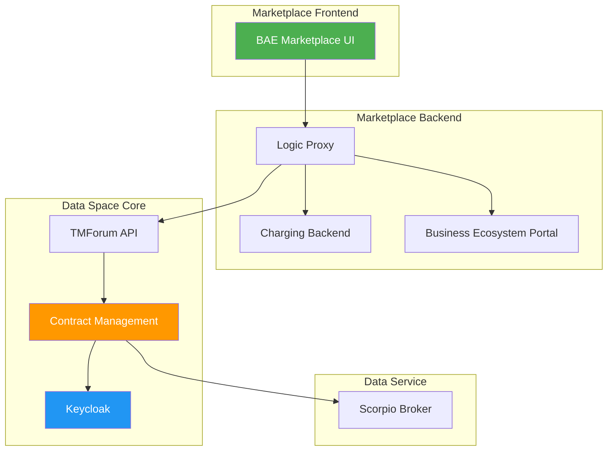
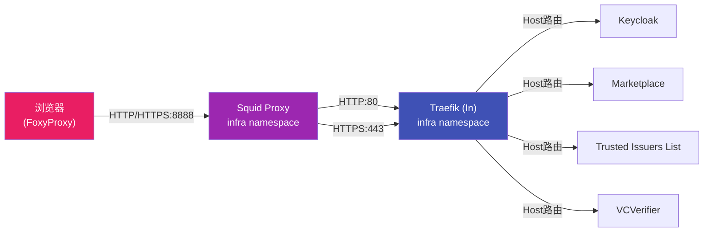
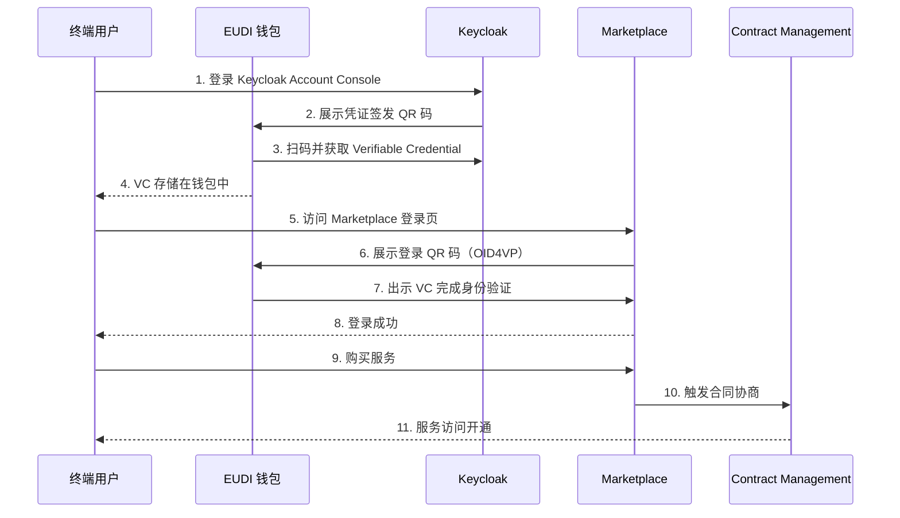

Data Space Connector 8.x 系列（涵盖 8.0.0 至 8.5.2）是该连接器在**市场前端集成、凭证签发协议演进、以及 EUDI 钱包兼容性**三个方向上的重大里程碑版本。本页将逐一拆解每个变更领域的核心内容、迁移要求及配置参考，帮助已有部署实例的开发者平滑升级。

## 8.x 版本时间线概览

| 版本 | 发布日期 | 关键变更 |
|------|---------|---------|
| 8.0.0 | 2026-05-06 | 首个正式 8.x 版本，包含 Marketplace 集成、Keycloak 26.3.2、TMForum API 1.3.6、ODRL-PAP 1.0.2、EUDI Wallet 兼容性改造 |
| 8.1.0 | 2026-05-06 | APISIX Dashboard 增强，provider.yaml 配置扩展 |

Sources: [Chart.yaml](charts/data-space-connector/Chart.yaml#L1-L7)

## Marketplace 集成（BAE Marketplace）

8.x 版本引入了 **FIWARE BAE Marketplace**（Business API Ecosystem）作为数据空间的前端交互界面。这意味着参与者可以通过可视化的 Web 界面完成产品上架、服务购买、以及基于凭证的身份认证登录，而不再仅限于 API 调用。

Marketplace 通过 Helm Chart 的 `marketplace.enabled: true` 配置启用。其底层架构包含以下组件：



**集成流程**要求参与者同时部署 Consumer 侧和 Provider 侧的 Keycloak 实例，分别签发 `customer` 和 `seller` 角色的 Verifiable Credential。用户通过 EUDI 兼容钱包扫描 Marketplace 的登录二维码，以 OID4VP 协议完成身份验证。

本地部署环境通过 **Squid 反向代理** 将浏览器请求路由到集群内部的 Traefik Ingress，从而使 Marketplace UI 可通过 `https://marketplace.127.0.0.1.nip.io` 访问。

Sources: [MARKETPLACE_INTEGRATION.md](doc/MARKETPLACE_INTEGRATION.md#L1-L10), [consumer-tmf.yaml](k3s/consumer-tmf.yaml#L1-L10), [squid-cm.yaml](k3s/infra/squid/squid-cm.yaml#L1-L43)

## Keycloak 升级至 26.3.2

Keycloak 在 8.x 版本中从旧版升级到 **26.3.2**，带来了 OID4VCI（OpenID for Verifiable Credential Issuance）协议支持上的根本性变化。这是 Keycloak 上游对可验证凭证签发功能进行架构重构的一部分，后续版本（9.x、10.x）将进一步迭代。

**主要变化**包括：
- Realm 的凭证配置格式发生变化，需要更新 `attributes`、`client-scopes` 和 `clients` 的定义方式
- 基础的 OID4VC 功能标志 `oid4vci` 需要在 Realm 中启用
- `account-console` 客户端需要显式声明 `oid4vci.enabled: "true"` 属性以允许调用 `/protocol/oid4vc/create-credential-offer` 端点

> ⚠️ **必需操作**：更新 Realm 配置以适配新格式。参考 `k3s/consumer.yaml` 中的 `client-scopes` 定义和 `values.yaml` 中的 `verifiableCredentials` 结构。

Sources: [values.yaml](charts/data-space-connector/values.yaml#L1150-L1210), [consumer.yaml](k3s/consumer.yaml#L1-L60)

## TMForum API 更新至 1.3.6

为更好地支持 Marketplace 集成和合同协商流程，TMForum API 子图表升级到 **1.3.6**。TMForum API 是连接器中负责产品目录管理、报价（Quote）、合同协议（Agreement）和产品订单（Product Order）的核心组件，通过 TM Forum Open APIs 标准化接口暴露能力。

该升级对未使用过 TMForum API 的实例**无影响**。

> ⚠️ **必需操作**：如果连接器实例中已包含来自 TMForum 1.0.0 之前版本的数据，需要执行数据迁移。参考 [tmforum-api/data-migrator](https://github.com/FIWARE/tmforum-api/tree/main/data-migrator)。

TMForum API 在 8.x 中与 Contract Management 组件协同工作，状态映射关系如下：

| IDSA 状态 | TMForum Quote 状态 | 说明 |
|-----------|-------------------|------|
| REQUESTED | IN_PROGRESS | 消费者发起请求 |
| OFFERED | QUOTED | Provider 发送报价 |
| ACCEPTED | ACCEPTED | 消费者接受报价 |
| AGREED | AGREED | 双方达成协议 |
| VERIFIED | VERIFIED | 消费者验证协议 |
| FINALIZED | COMPLETED | 数据开始传输 |

Sources: [consumer-tmf.yaml](k3s/consumer-tmf.yaml#L1-L10), [values.yaml](charts/data-space-connector/values.yaml#L1275-L1330), [CONTRACT_NEGOTIATION.md](doc/CONTRACT_NEGOTIATION.md#L1-L60)

## 本地部署增强（Squid 代理）

8.x 版本的本地部署新增了 **Squid 正向代理** 作为访问集群内部服务的入口。这是为了更好地支持包含终端用户和前端界面的 Demo 场景——特别是 Marketplace 需要通过浏览器访问，而 Traefik Ingress 使用的 `127.0.0.1.nip.io` 域名需要代理支持才能正确路由。

代理架构如下：



Squid 配置将集群外部请求通过 `cache_peer` 指向 Traefik 的 `traefik-loadbalancer-in` 服务，同时允许集群内部 `.svc.cluster.local` 域名的直接连接。浏览器端需配置 FoxyProxy 插件，将 HTTP 流量指向 `127.0.0.1:8888`。

Sources: [squid-cm.yaml](k3s/infra/squid/squid-cm.yaml#L1-L43), [squid-deployment.yaml](k3s/infra/squid/deployment.yaml#L1-L35), [LOCAL.MD](doc/deployment-integration/local-deployment/LOCAL.MD#L1-L60)

## ODRL-PAP 更新至 1.0.2

ODRL-PAP（Policy Administration Point）升级到 **1.0.2**，带来了两项关键改进：

1. **策略查询能力增强**：支持 `query-by-id`，即通过策略唯一标识符精确查询策略内容（参考 [ODRL-PAP API](https://github.com/wistefan/odrl-pap/blob/main/api/odrl.yaml)）
2. **ODRL 规范合规性**：所有策略现在必须包含 `odrl:uid` 字段，以符合 [ODRL 模型规范](https://www.w3.org/TR/odrl-model/#policy) 要求

> ⚠️ **必需操作**：更新所有现有策略，确保每条策略包含 `odrl:uid` 字段。

ODRL-PAP 在连接器架构中与 APISIX（网关）和 OPA（策略决策点）组成完整的授权链：

| 组件 | 角色 | 说明 |
|------|------|------|
| ODRL-PAP | PAP（策略管理点） | 存储和管理 ODRL 策略，提供 Bundle API |
| OPA | PDP（策略决策点） | 从 PAP 拉取策略 Bundle，执行策略评估 |
| APISIX | PEP（策略执行点） | API 网关，在请求处理时调用 OPA 进行策略检查 |

Sources: [values.yaml](charts/data-space-connector/values.yaml#L150-L200)

## Verifier 与 Credentials-Config-Service 更新（EUDI 钱包兼容）

为兼容当前的 [EUDI-Wallet](https://github.com/eu-digital-identity-wallet) 参考实现，VCVerifier 和 Credentials-Config-Service 在 8.x 中获得了多项 OID4VP 协议增强：

| 功能 | 说明 | 配置参考 |
|------|------|---------|
| **presentationDefinition** | 支持 OID4VP 规范中的 `presentationDefinition` 字段，用于声明钱包中需要出示的凭证 | `provider.yaml` L148-L189 |
| **jwtInclusion** | 可配置 VC Claims 是否包含在 JWT 中，减少 Token 体积并提高灵活性 | Credentials-Config-Service API |
| **requestMode** | 新增 `byValue` 和 `byReference` 请求模式（原有 `urlEncoded` 仍支持） | VCVerifier README |
| **request signing** | Verifier 可签名发送给钱包的 Request Object | `verifier.clientIdentification` 配置 |
| **horizontal scaling** | 支持通过外部 Key 文件提供 JWT 签名密钥，支持多实例水平扩展 | `verifier.keyAlgorithm`、`verifier.generateKey`、`verifier.keyPath` |

> ⚠️ **必需操作**：
> - 更新 Verifier 配置——参考 `provider.yaml` 中的 `vcverifier` 部分
> - 更新 Credentials-Config-Service 配置——参考 `provider.yaml` 中的 `credentials-config-service` 部分

以 Provider 侧的 Verifier 配置为例，关键字段如下：

```yaml
vcverifier:
  deployment:
    verifier:
      tirAddress: https://tir.127.0.0.1.nip.io/
      did: did:web:mp-operations.org
      supportedModes: ["byValue", "byReference"]
      clientIdentification:
        keyPath: /signing-key/tls.key
        certificatePath: /signing-key/tls.crt
```

Sources: [provider.yaml](k3s/provider.yaml#L50-L100), [values.yaml](charts/data-space-connector/values.yaml#L70-L148)

## 钱包集成（EUDI Wallet）

8.x 版本包含一个**可本地运行的端到端示例**，演示如何与 [EUDI Wallet 参考实现](https://github.com/eu-digital-identity-wallet/eudi-app-android-wallet-ui) 集成。这使得终端用户可以通过移动设备上的数字钱包获取可验证凭证、登录 Marketplace 并完成服务购买流程。

钱包集成的完整流程如下：



本地演示环境中，Android 模拟器配合 `v4l2loopback` 内核模块实现摄像头模拟，使得钱包可以扫描屏幕上显示的 QR 码。

Sources: [MARKETPLACE_INTEGRATION.md](doc/MARKETPLACE_INTEGRATION.md#L40-L100), [LOCAL.MD](doc/deployment-integration/local-deployment/LOCAL.MD#L1-L60)

## 迁移清单总结

| 变更领域 | 影响范围 | 必需操作 |
|---------|---------|---------|
| Keycloak 26.3.2 | 所有使用 OID4VC 签发凭证的实例 | 更新 Realm 配置（attributes、client-scopes、clients） |
| TMForum API 1.3.6 | 使用了旧版 TMForum 数据的实例 | 执行 data-migrator 迁移脚本 |
| ODRL-PAP 1.0.2 | 所有已部署策略 | 为每条策略添加 `odrl:uid` 字段 |
| Verifier OID4VP 增强 | 所有 Provider 实例 | 更新 Verifier 和 Credentials-Config-Service 配置 |
| Marketplace 集成 | 新功能，需主动启用 | 设置 `marketplace.enabled: true` 并配置 Keycloak 角色凭证 |
| Squid 代理 | 仅本地部署 | 自动包含在 `mvn clean deploy -Plocal` 流程中 |

## 下一步

- 8.x 后续的破坏性变更（IAM 组件整合、数据库迁移）在 [9.x 版本说明（破坏性变更）](31-9-x-ban-ben-shuo-ming-po-pi-xing-bian-geng) 中详细记录
- Keycloak 进一步迁移到 CloudPirates 图表并重写 OID4VCI Realm 模型，参见 [10.x 版本说明（Keycloak 迁移与 OID4VCI 重写）](32-10-x-ban-ben-shuo-ming-keycloak-qian-yi-yu-oid4vci-zhong-xie)
- 如需了解连接器的整体组件架构，参见 [组件总览与模块职责](7-zu-jian-zong-lan-yu-mo-kuai-zhi-ze)
- 关于 DSP 协议集成的详细说明，参见 [DSP 与 EDC 集成架构](14-dsp-yu-edc-ji-cheng-jia-gou)