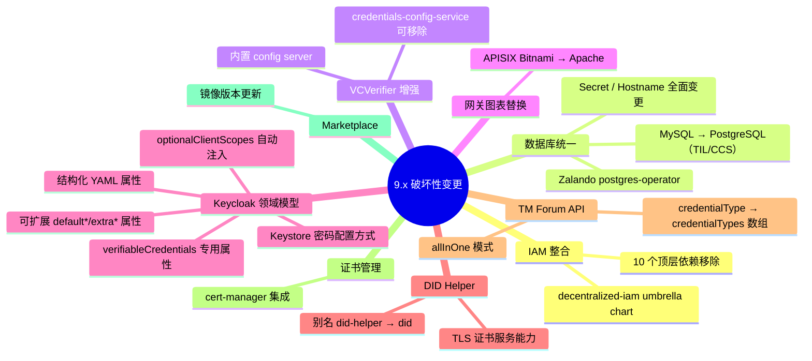

Data Space Connector 9.x 是一次**架构级别的重大重构**，涵盖 IAM 组件整合、数据库统一迁移、网关图表替换、Keycloak 领域模型全面升级等十多项破坏性变更。本文档逐项列出每个变更的背景、新旧对照和必选迁移操作，帮助从 8.x 升级的开发者快速定位影响范围并完成适配。

---

## 变更全景概览

下图以思维导图形式展示 9.x 所有破坏性变更之间的逻辑关系。**核心驱动力是 IAM 组件的 umbrella chart 整合**，它引发了一系列连锁的数据库、网关与配置结构变更。



---

## Decentralized-IAM 集成

9.x 最核心的变更是将所有 IAM 和授权组件统一收入新的 [`decentralized-iam`](https://github.com/FIWARE/decentralized-iam) umbrella chart。原先分散在顶层 `values.yaml` 的 10 个 chart 依赖被移除，其配置全部迁移至 `decentralizedIam` 命名空间下。

**被移除的顶层依赖 → 新位置映射：**

| 被移除的顶层依赖（8.5.2） | 新位置（9.0.0） |
|---|---|
| `mysql` | N/A — 被 postgres-operator 替代 |
| `postgresql`（auth/PAP/Keycloak/IdentityHub） | N/A — 被 postgres-operator 替代 |
| `postgis`（Scorpio） | N/A — 被 postgres-operator 替代 |
| `vcverifier` | `decentralizedIam.vcAuthentication.vcverifier` |
| `credentials-config-service` | `decentralizedIam.vcAuthentication.credentials-config-service` |
| `trusted-issuers-list` | `decentralizedIam.vcAuthentication.trusted-issuers-list` |
| `dss` | `decentralizedIam.vcAuthentication.dss` |
| `odrl-pap` | `decentralizedIam.odrlAuthorization.odrl-pap` |
| `apisix`（+ OPA sidecar） | `decentralizedIam.odrlAuthorization.apisix` |

**新 `values.yaml` 结构示例：**

```yaml
decentralizedIam:
  enabled: true
  vcAuthentication:
    trusted-issuers-list: ...
    vcverifier: ...
    credentials-config-service: ...
    dss: ...
  odrlAuthorization:
    apisix: ...
    odrl-pap: ...
    opa: ...
    tpp: ...
```

> ⚠️ **必选操作**：以下顶层 `values` key 在 9.0.0 中**完全失效**，必须删除或迁移至 `decentralizedIam` 下：
>
> `authentication.*`、`dataplane.*`、`didJson.*`、`mysql.*`、`postgresql.*`（顶层）、`postgis.*`、`vcverifier.*`（顶层）、`credentials-config-service.*`（顶层）、`trusted-issuers-list.*`（顶层）、`dss.*`（顶层）、`odrl-pap.*`（顶层）、`apisix.*`（顶层）、`opa.*`（顶层）、`tpp.*`（顶层）

Sources: [9-x.md](doc/release-notes/9-x.md#L5-L57)

---

## Zalando postgres-operator

9.x 不再为各认证组件部署独立的 Bitnami PostgreSQL 或 MySQL 实例，转而使用 [Zalando postgres-operator](https://github.com/zalando/postgres-operator) 创建和管理**统一的 PostgreSQL 集群**，所有认证相关数据库和用户均由该集群承载。

`vc-authentication` 子图（`decentralized-iam` 的一部分）将 `postgres-operator 1.15.1` 作为直接依赖。部署者有两个选择：

| 选项 | 适用场景 | 配置 |
|---|---|---|
| **Option A** — 由 chart 安装 operator | 新建安装（推荐） | `decentralizedIam.vcAuthentication.postgres-operator.enabled: true`（默认） |
| **Option B** — 使用外部管理的 operator | 已有 operator 的环境 | `decentralizedIam.vcAuthentication.postgres-operator.enabled: false` |

`managedPostgres` 节点控制 `postgresql.acid.zalan.do` CRD，定义实际集群参数：

```yaml
decentralizedIam:
  vcAuthentication:
    managedPostgres:
      enabled: true
      config:
        teamId: "dsc"
        numberOfInstances: 1
        postgresql:
          version: "16"
        volume:
          size: 1Gi
        users:
          admin: [superuser, createdb]
          til: [createdb]
          ccs: [createdb]
          pap: [createdb]
          keycloak: [createdb]
          ih: [createdb]
          issuer: [createdb]
        databases:
          tildb: til
          ccsdb: ccs
          papdb: pap
          keycloakdb: keycloak
          ih: ih
          issuer: issuer
```

> ⚠️ **Helm upgrade 注意事项**：Helm 仅在 `helm install` 时安装 CRD，`helm upgrade` 不会。若 postgres-operator CRD 发生变化，需手动执行：
> ```bash
> kubectl apply -f https://raw.githubusercontent.com/zalando/postgres-operator/refs/heads/master/charts/postgres-operator/crds/postgresqls.yaml
> kubectl apply -f https://raw.githubusercontent.com/zalando/postgres-operator/refs/heads/master/charts/postgres-operator/crds/operatorconfigurations.yaml
> kubectl apply -f https://raw.githubusercontent.com/zalando/postgres-operator/refs/heads/master/charts/postgres-operator/crds/postgresteams.yaml
> ```

**Secret 变更对照表** — operator 自动生成每用户一个 Secret，格式为 `{username}.postgres.credentials.postgresql.acid.zalan.do`：

| 组件 | 旧 Secret / Key | 新 Secret / Key |
|---|---|---|
| TIL, CCS | `authentication-database-secret` / `mysql-root-password` | `postgres.postgres.credentials.postgresql.acid.zalan.do` / `password` |
| ODRL-PAP, Keycloak, Scorpio | `database-secret` / `postgres-admin-password` | `postgres.postgres.credentials.postgresql.acid.zalan.do` / `password` |
| IdentityHub | `database-secret` / `postgres-admin-password` | `ih.postgres.credentials.postgresql.acid.zalan.do` / `password` |

**Hostname / DB 名变更对照表：**

| 组件 | 旧 Host / DB | 新 Host / DB |
|---|---|---|
| TIL, CCS | `authentication-mysql` / `tildb`, `ccsdb` | `postgres` / `tildb`, `ccsdb` |
| ODRL-PAP | `postgresql` / `pap` | `postgres` / `papdb` |
| Keycloak | `postgresql` / `keycloak` | `postgres` / `keycloakdb` |
| Scorpio | `data-service-postgis` | `postgres` |
| IdentityHub | *(空)* | `postgres` |

> 注意：ODRL-PAP 数据库名从 `pap` 更名为 `papdb`，升级前须迁移已有策略数据。

Sources: [9-x.md](doc/release-notes/9-x.md#L59-L143)

---

## TIL 与 CCS：MySQL 替换为 PostgreSQL

`trusted-issuers-list` 和 `credentials-config-service` 原先使用 MySQL 存储，9.x 全部切换为 PostgreSQL。首次启动时 Liquibase 迁移脚本会自动在新数据库中执行初始化。

> ⚠️ **必选操作**：
> 1. 若已有 MySQL 数据库（`tildb`、`ccsdb`）中的数据，须在升级前使用 [pgloader](https://pgloader.io/) 等工具迁移至新的 PostgreSQL 实例。
> 2. 更新 `values.yaml` 中的数据库方言配置：

```yaml
decentralizedIam:
  vcAuthentication:
    trusted-issuers-list:
      database:
        dialect: POSTGRES
        host: postgres
        port: 5432
        username: postgres
        existingSecret:
          name: postgres.postgres.credentials.postgresql.acid.zalan.do
          key: password
        name: tildb
```

Sources: [9-x.md](doc/release-notes/9-x.md#L145-L168)

---

## Verifier 内置配置服务器

`vcverifier` 现在内置一个配置服务器，直接从同一 PostgreSQL 数据库（原先由 `credentials-config-service` 管理的 `ccsdb`）读取凭证配置。因此**不再需要**单独部署 `credentials-config-service`。

> ⚠️ **必选操作**（两步）：
>
> **第一步** — 配置 verifier 的数据库连接，并启用内置 config server：
> ```yaml
> decentralizedIam:
>   vcAuthentication:
>     vcverifier:
>       deployment:
>         verifier:
>           database:
>             persistence: true
>             dialect: POSTGRES
>             username: postgres
>             existingSecret:
>               enabled: true
>               name: postgres.postgres.credentials.postgresql.acid.zalan.do
>               key: password
>             host: postgres
>             port: 5432
>             name: ccsdb
>         configServer:
>           enabled: true
>         configRepo:
>           configEndpoint: ""
> ```
>
> **第二步** — 禁用独立的 `credentials-config-service`：
> ```yaml
> decentralizedIam:
>   vcAuthentication:
>     credentials-config-service:
>       enabled: false
> ```

> 💡 **关键**：`configRepo.configEndpoint` 必须设为空字符串，以阻止 verifier 尝试连接外部 `credentials-config-service` 端点。

Sources: [9-x.md](doc/release-notes/9-x.md#L170-L210)

---

## APISIX：Bitnami 图表替换为 Apache 图表

APISIX 网关的 chart 依赖从 Bitnami 封装版本切换为官方 Apache APISIX chart：

| | 8.5.2 | 9.0.0 |
|---|---|---|
| Chart | `bitnami/apisix 6.0.0` | `apisix/apisix 2.13.0` |
| Repository | `oci://registry-1.docker.io/bitnamicharts` | `https://apache.github.io/apisix-helm-chart` |
| 位置 | 顶层依赖 | `decentralizedIam.odrlAuthorization.apisix` |

> ⚠️ **必选操作**：Bitnami chart 的所有特有配置 key 在 9.0.0 中均无效。Bitnami 版本使用了显著不同的结构（`controlPlane`、`dataPlane`、`etcd` 等 section，`bitnamilegacy` 镜像，以及用于路由和 OPA 的额外 volume）。若曾有自定义 APISIX 路由或 OPA 配置，需参照 [Apache APISIX Helm Chart 文档](https://github.com/apache/apisix-helm-chart) 进行翻译。

Sources: [9-x.md](doc/release-notes/9-x.md#L212-L224)

---

## Keycloak 变更

9.x 对 Keycloak 进行了多项配置层面的重构，涵盖 keystore 密码、领

域属性格式、可扩展属性设计以及 verifiable credentials 声明方式。

### Keystore 密码配置方式变更

8.5.2 中 keystore 密码通过 `STORE_PASS` 环境变量从 `kc-keystore` Kubernetes Secret 注入。9.0.0 中此方式已移除，keystore 凭据改为直接在 values 中配置，渲染进 Keycloak 领域配置。

**Option A — `did:elsi` 方式（顶层 `elsi` section）：**

```yaml
elsi:
  enabled: true
  did: did:elsi:myDid
  keyAlgorithm: EC
  storePath: /path/to/keystore.p12
  storePassword: my-store-password
  keyAlias: my-key-alias
  keyPassword: my-key-password
```

**Option B — 通用签名密钥（`keycloak.signingKey`）：**

```yaml
keycloak:
  signingKey:
    storePath: /path/to/keystore.p12
    storePassword: my-store-password
    keyAlias: my-key-alias
    keyPassword: my-key-password
    keyAlgorithm: EC
```

> ⚠️ **安全提示**：密码会被内联渲染到 realm ConfigMap 中。为避免明文密码出现在 values 文件中，建议使用 `${ENV_VAR}` 占位符 + `keycloak.extraEnvVars` 从 Kubernetes Secret 加载：
> ```yaml
> elsi:
>   storePassword: "${STORE_PASS}"
>   keyPassword: "${KEY_PASS}"
>
> keycloak:
>   extraEnvVars:
>     - name: STORE_PASS
>       valueFrom:
>         secretKeyRef:
>           name: my-keystore-secret
>           key: store-password
>     - name: KEY_PASS
>       valueFrom:
>         secretKeyRef:
>           name: my-keystore-secret
>           key: key-password
> ```

Sources: [9-x.md](doc/release-notes/9-x.md#L226-L278)

### 领域属性：结构化 YAML 格式

以下 `keycloak.realm` 属性现在同时支持原生 YAML 结构和旧版原始 JSON 字符串格式（向后兼容）：

| 属性 | 旧格式（JSON 字符串） | 新格式（YAML） |
|---|---|---|
| `attributes` | `"myKey": "myValue"` | `myKey: myValue`（map） |
| `clientRoles` | `"my-client": [{"name": "my-role"}]` | `my-client: [{name: my-role}]`（map → list） |
| `users` | `{"username": "admin", ...}` | `[{username: admin, ...}]`（list） |
| `clients` | `{"clientId": "my-client", ...}` | `[{clientId: my-client, ...}]`（list） |
| `clientScopes` | `{"name": "my-scope", ...}` | `[{name: my-scope, ...}]`（list） |

**`attributes` 新旧对比示例：**

```yaml
# 旧（字符串）
keycloak:
  realm:
    attributes: |
      "myKey": "myValue",
      "anotherKey": "anotherValue"

# 新（map）
keycloak:
  realm:
    attributes:
      myKey: myValue
      anotherKey: anotherValue
```

**`users` 新旧对比示例：**

```yaml
# 旧（字符串）
keycloak:
  realm:
    users: |
      {"username": "admin", "enabled": true},
      {"username": "test", "enabled": true}

# 新（list）
keycloak:
  realm:
    users:
      - username: admin
        enabled: true
      - username: test
        enabled: true
```

Sources: [9-x.md](doc/release-notes/9-x.md#L280-L376)

### 领域属性：默认值拆分为可扩展属性

原先硬编码的默认领域属性被拆分为 `default*` key（chart 管理的默认值）和 `extra*` / 覆盖 key（用户追加），支持**不重写默认值的前提下扩展内容**。

| 属性 | 默认 key | 扩展 key | 类型 |
|---|---|---|---|
| Realm roles | `defaultRealmRoles` | `extraRealmRoles` | list |
| Groups | `defaultGroups` | `extraGroups` | list |
| Client scopes | `defaultClientScopes` | `clientScopes` | list |
| Default default client scopes | `defaultDefaultClientScopes` | `extraDefaultClientScopes` | list |
| Default optional client scopes | `defaultOptionalClientScopes` | `extraOptionalClientScopes` | list |
| Client roles | `defaultClientRoles` | `clientRoles` | dict |
| Clients | `defaultClients` | `clients` | list |
| Key providers | `defaultKeyProviders` | `extraKeyProviders` | list |

**迁移对比示例**（添加一个自定义 realm role）：

```yaml
# 旧 — 需重复所有已有角色 + 新角色
keycloak:
  realm:
    realmRoles: '{"name": "default-roles-provider"}, {"name": "offline_access"}, {"name": "my-custom-role"}'

# 新 — 仅定义新增内容
keycloak:
  realm:
    extraRealmRoles:
      - name: my-custom-role
```

Sources: [9-x.md](doc/release-notes/9-x.md#L378-L418)

### 领域属性：`optionalClientScopes` 自动注入

chart 现在会自动为 `keycloak.realm.defaultClients` 中定义的每个客户端填充 `optionalClientScopes`。注入的 scope 来自三个来源：

1. `keycloak.realm.defaultClientScopes` — chart 管理的默认 scope
2. `keycloak.realm.clientScopes` — 用户定义的额外 scope
3. 从 `keycloak.realm.verifiableCredentials` 自动生成的 scope

仅当某个 scope **尚未出现在**该客户端的 `defaultClientScopes` 中时才会被添加到 `optionalClientScopes`，避免两个列表间的重复。

Sources: [9-x.md](doc/release-notes/9-x.md#L420-L428)

### 领域属性：`verifiableCredentials` 专用属性

9.x 引入了 `keycloak.realm.verifiableCredentials` 属性，将 VC 声明、ClientScope 生成和 protocol mapper 绑定整合到一个自包含的配置块中。

> 💡 **推荐使用 `verifiableCredentials` 配置 VC**，而非通过 `clientScopes` 和 `attributes` 手动组合。Keycloak 26.3 之后的版本将对 VC 配置方式引入破坏性变更，提前迁移可确保平滑过渡。

**支持的字段：**

| 字段 | 描述 |
|---|---|
| `attributes` | VC 属性 Map，自动展平为 `vc.{id}.{attr}` 写入领域属性。对象值会自动序列化为 JSON 字符串。 |
| `clientScope.create` | 是否自动生成 ClientScope。默认 `true`，设为 `false` 跳过创建。 |
| `protocolMappers` | 绑定到生成的 ClientScope 的 protocol mapper 列表。 |

**完整示例：**

```yaml
keycloak:
  realm:
    verifiableCredentials:
      my-credential:
        attributes:
          credential_signing_alg_values_supported: "ES256"
          format: "vc+sd-jwt"
          scope: "MyCredential"
          vct: "MyCredential"
          credential_build_config.signing_algorithm: "ES256"
          credential_build_config.token_jws_type: "vc+sd-jwt"
          credential_build_config.visible_claims: "roles,email"
          credential_build_config.proof_types_supported:
            jwt:
              proof_signing_alg_values_supported:
                - ES256
        clientScope:
          create: true
        protocolMappers:
          - name: email-mapper
            protocol: oid4vc
            protocolMapper: oid4vc-user-attribute-mapper
            config:
              subjectProperty: email
              userAttribute: email
              supportedCredentialTypes: MyCredential
          - name: role-mapper
            protocol: oid4vc
            protocolMapper: oid4vc-target-role-mapper
            config:
              subjectProperty: roles
              clientId: did:web:my-did.example.org
              supportedCredentialTypes: MyCredential
```

`attributes` 块生成的领域属性键格式为 `vc.my-credential.<attr>`，且**优先于** `keycloak.realm.attributes` 中的同名键。

> ⚠️ **迁移提示**：若之前在 `keycloak.realm.clientScopes` 中声明了 VC 相关的 client scope，需迁移至 `verifiableCredentials` 并从 `clientScopes` 中删除重复条目，否则该 scope 会在领域中出现两次。

Sources: [9-x.md](doc/release-notes/9-x.md#L430-L500)

---

## did-helper：别名变更与证书服务能力

`did-helper` chart 的别名和条件键已变更：

| | 8.5.2 | 9.0.0 |
|---|---|---|
| 别名 | `did-helper` | `did` |
| 条件 | `did-helper.enabled` | `did.enabled` |

9.0.0 中 `did-helper` 新增了 `GET /.well-known/tls.crt` 端点，可挂载外部 CA 签发的 TLS 证书（如 cert-manager），支持两种密钥模式：

- **`generateKey`（默认）**：启动时生成新的 EC（或 RSA）密钥对和自签名证书，适用于开发测试。
- **`provideKeystore`**：使用通过 Kubernetes Secret 提供的现有 PKCS12 keystore，适用于生产环境。

**配置示例**（使用 cert-manager 签发的证书）：

```yaml
did:
  enabled: true
  ingress:
    enabled: true
    className: nginx
    annotations:
      cert-manager.io/issuer: selfsigned-issuer
      cert-manager.io/common-name: did-provider.127.0.0.1.nip.io
      cert-manager.io/private-key-algorithm: ECDSA
    hosts:
      - host: did-provider.127.0.0.1.nip.io
        paths:
          - path: /
            pathType: ImplementationSpecific
    tls:
      - secretName: did-provider.127.0.0.1.nip.io-tls
        hosts:
          - did-provider.127.0.0.1.nip.io
  volumes:
    - name: certs
      secret:
        secretName: did-provider.127.0.0.1.nip.io-tls
        items:
          - key: tls.crt
            path: tls.crt
  volumeMounts:
    - name: certs
      mountPath: /certs
  config:
    server:
      hostUrl: "https://did-provider.127.0.0.1.nip.io"
      certPath: "/certs/tls.crt"
    generateKey:
      enabled: false
```

> ⚠️ **必选操作**：在 values 文件中将 `did-helper` 重命名为 `did`。顶层 `didJson` section 也已移除，需替换为上述 `did` 子图配置。

Sources: [9-x.md](doc/release-notes/9-x.md#L502-L557)

---

## TM Forum API：allInOne 模式与 credentialTypes

TM Forum API 发生两项配置变更：

1. **`credentialType`（字符串）→ `credentialTypes`（数组）**
2. **新增 `allInOne` 模式** — 将所有 TM Forum API 部署到单个 Pod

```yaml
# 旧
credentialType: VerifiableCredential

# 新
credentialTypes:
  - VerifiableCredential
```

当 `allInOne.enabled: true` 时，所有 API 通过单一 service `tm-forum-api:8080` 提供服务。需更新所有引用独立 API service 的组件（特别是 marketplace）：

```yaml
marketplace:
  externalApis:
    catalog: http://tm-forum-api-svc:8080
    inventory: http://tm-forum-api-svc:8080
    ordering: http://tm-forum-api-svc:8080
    billing: http://tm-forum-api-svc:8080
    usage: http://tm-forum-api-svc:8080
    party: http://tm-forum-api-svc:8080
    customer: http://tm-forum-api-svc:8080
```

当 `allInOne.enabled: false`（默认）时，每个 API 保留独立的 service name 和 port，行为与之前一致。

Sources: [9-x.md](doc/release-notes/9-x.md#L559-L592)

---

## Marketplace 镜像更新

`business-api-ecosystem` 逻辑代理镜像 tag 从 `10.5.0-PRE-1` 更新为 `11.15.0`。

Sources: [9-x.md](doc/release-notes/9-x.md#L594-L596)

---

## cert-manager 集成

9.x 新增了可选的 [cert-manager](https://cert-manager.io) chart 依赖，可统一管理所有 connector ingress 的 TLS 证书，取代此前通过 `helpers/certs` 脚本手动签发和分发证书的方式（该脚本已移除）。

两个新增的配置 section：

**`cert-manager`** — 作为子图安装 cert-manager 本身（默认禁用）：

```yaml
cert-manager:
  enabled: true
  crds:
    enabled: true
  startupapicheck:
    enabled: false
```

**`certManagerResources`** — 在 cert-manager 就绪后部署 ClusterIssuer（默认禁用）：

```yaml
certManagerResources:
  enabled: true
  namespace: cert-manager
  type: selfsigned          # "selfsigned" 或 "prod"
  acmeEmail: admins@example.com   # 仅 "prod" 需要
  ingressClass: nginx             # 仅 "prod" 需要
```

**支持两种 Issuer 类型：**

| 类型 | 用途 | 要求 |
|---|---|---|
| `selfsigned` | 开发 / 内部环境 | 创建自签名 CA + `selfsigned-issuer` ClusterIssuer，无需外部 DNS 或 HTTP challenge |
| `prod` | 生产环境 | 创建 Let's Encrypt 生产级 `prod-issuer`（HTTP-01 ACME challenge），需公网可达 ingress + 有效域名 |

部署完成后，在 ingress 上添加注解即可自动请求证书：

```yaml
ingress:
  annotations:
    cert-manager.io/issuer: selfsigned-issuer        # selfsigned
    # cert-manager.io/cluster-issuer: prod-issuer    # Let's Encrypt
```

> 💡 `certManagerResources` 使用 Helm post-install/post-upgrade hooks 部署 ClusterIssuer，确保在 cert-manager 就绪后按正确顺序自动创建。

Sources: [9-x.md](doc/release-notes/9-x.md#L598-L641)

---

## 迁移检查清单

下表汇总 9.x 所有必选迁移操作，可作为升级前后的逐项检查依据：

| # | 影响范围 | 操作 | 优先级 |
|---|---|---|---|
| 1 | IAM 配置结构 | 将所有 IAM 组件配置从顶层 key 迁移至 `decentralizedIam` 命名空间 | 🔴 关键 |
| 2 | 数据库 Secret | 更新所有组件的数据库 Secret 引用（hostname、Secret name、key） | 🔴 关键 |
| 3 | 数据库迁移 | 从 MySQL 迁移 TIL/CCS 数据至 PostgreSQL（使用 pgloader 等工具） | 🔴 关键 |
| 4 | ODRL-PAP 数据库 | 迁移 `pap` → `papdb` 的策略数据 | 🔴 关键 |
| 5 | Verifier 配置 | 配置内置 config server 的数据库连接，设置 `configEndpoint: ""` | 🔴 关键 |
| 6 | credentials-config-service | 设为 `enabled: false`（如不再需要独立实例） | 🟡 重要 |
| 7 | APISIX 配置 | 将 Bitnami 格式的 APISIX 配置转换为 Apache chart 格式 | 🔴 关键 |
| 8 | Keycloak Keystore | 将 `STORE_PASS` 环境变量迁移至 `elsi` 或 `keycloak.signingKey` 配置 | 🟡 重要 |
| 9 | Keycloak 领域属性 | 将 JSON 字符串格式的 `attributes`/`users`/`clients` 等迁移至 YAML 结构 | 🟢 推荐 |
| 10 | Keycloak 默认属性 | 利用 `default*`/`extra*` 拆分简化自定义扩展 | 🟢 推荐 |
| 11 | VC 配置 | 将 VC 相关的 `clientScopes` 迁移至 `verifiableCredentials` | 🟡 重要 |
| 12 | did-helper | 重命名为 `did`，移除 `didJson` section | 🟡 重要 |
| 13 | TM Forum API | `credentialType` → `credentialTypes`（数组） | 🟡 重要 |
| 14 | TM Forum API | 若使用 allInOne 模式，更新 marketplace 等组件的 service 引用 | 🟡 重要 |

Sources: [9-x.md](doc/release-notes/9-x.md#L1-L641)

---

## 下一步

完成 9.x 迁移后，建议按照以下路径继续阅读：

- 如计划进一步升级至 10.x，可查阅 [10.x 版本说明（Keycloak 迁移与 OID4VCI 重写）](32-10-x-ban-ben-shuo-ming-keycloak-qian-yi-yu-oid4vci-zhong-xie)，了解 Keycloak chart 迁移和 OID4VCI 领域模型的进一步重构。
- 如需回顾 9.x 之前的变更历史，可查阅 [8.x 版本说明](30-8-x-ban-ben-shuo-ming)。
- 9.x 引入的 `decentralized-iam` 架构细节可参考 [OID4VC 认证框架（VCVerifier、Trusted Issuers List）](9-oid4vc-ren-zheng-kuang-jia-vcverifier-trusted-issuers-list)。
- cert-manager 和 TLS 证书管理的生产级实践可参考 [Secret 管理与生产环境安全](19-secret-guan-li-yu-sheng-chan-huan-jing-an-quan)。
- Keycloak realm 属性的完整配置参考可查阅 [Keycloak 与 OID4VCI 凭证签发配置](17-keycloak-yu-oid4vci-ping-zheng-qian-fa-pei-zhi)。