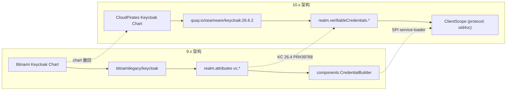
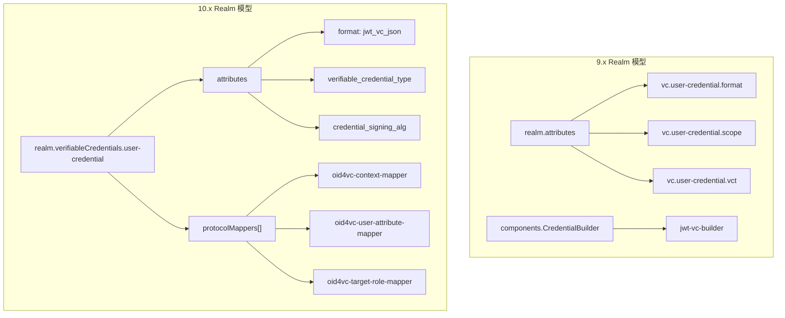
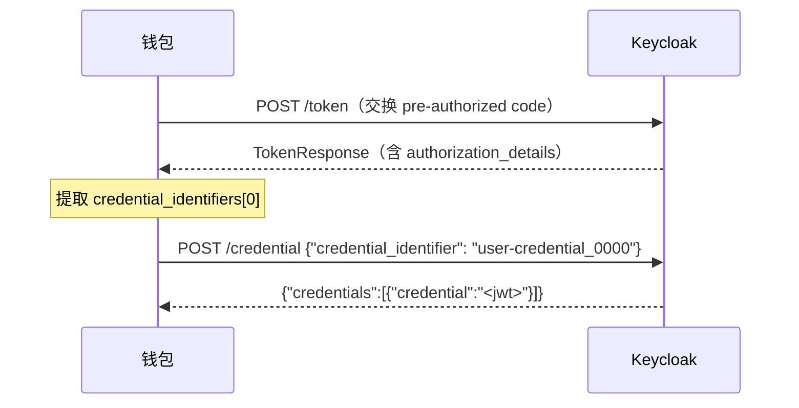

10.x 是 Data Space Connector 的一次重大架构升级，涉及两个核心驱动变更：**Bitnami Keycloak Helm Chart 被撤回**，umbrella 图表切换至 CloudPirates 社区 chart；同时 **Keycloak 26.4 重新设计了 OID4VCI realm 模型**（[keycloak/keycloak#39768](https://github.com/keycloak/keycloak/pull/39768)），将凭证配置从 `realm.attributes` 的 `vc.<name>.*` 命名空间迁移至独立的 `ClientScope` 属性体系。本页为已部署 9.x 的用户提供完整的迁移路径、端点变化说明和兼容性矩阵。



## Keycloak Chart 迁移：Bitnami → CloudPirates

Umbrella 图表的 Keycloak 子 chart 从 Bitnami 迁移至 CloudPirates 社区维护版本，镜像同步切换至 Keycloak 官方 Quarkus 镜像。Realm 数据导入路径从 `/opt/bitnami/keycloak/data/import` 变更为 `/opt/keycloak/data/import`。

| 维度 | 9.x（已移除） | 10.x（新增） |
|---|---|---|
| Chart 来源 | `oci://registry-1.docker.io/bitnamicharts/keycloak 25.2.0` | `oci://registry-1.docker.io/cloudpirates/keycloak 0.21.7` |
| 运行时镜像 | `bitnamilegacy/keycloak` | `quay.io/seamware/keycloak:26.6.2`（上游 Quarkus + SEAMWARE OID4VCI QR 补丁） |
| Realm 导入路径 | `/opt/bitnami/keycloak/data/import` | `/opt/keycloak/data/import` |
| 功能开关方式 | Bitnami helper 环境变量（`KEYCLOAK_EXTRA_ARGS` 等） | 原生 CLI flags + `keycloak.features.enabled` |
| 管理端口暴露 | 主 Service 暴露 9000 | 独立 Service `<release>-keycloak-metrics:9000`（需 `metrics.enabled: true`） |

Sources: [Chart.yaml](charts/data-space-connector/Chart.yaml#L19-L22), [values.yaml](charts/data-space-connector/values.yaml#L325-L370), [doc/release-notes/10-x.md](doc/release-notes/10-x.md#L1-L12)

### `keycloak:` values 重命名对照表

CloudPirates chart 不识别任何 Bitnami 专有 key。下表列出了必须迁移的配置项及其新位置：

| 9.x 路径（已移除） | 10.x 路径 |
|---|---|
| `keycloak.auth.adminUser` | `keycloak.keycloak.adminUser` |
| `keycloak.auth.existingSecret` | `keycloak.keycloak.existingSecret` |
| `keycloak.auth.passwordSecretKey` | `keycloak.keycloak.secretKeys.adminPasswordKey` |
| `keycloak.proxyHeaders` | `keycloak.keycloak.proxyHeaders` |
| `keycloak.service.ports.http` | `keycloak.service.httpPort` |
| `keycloak.postgresql.enabled` | `keycloak.postgres.enabled` |
| `keycloak.externalDatabase.host` | `keycloak.database.host` |
| `keycloak.externalDatabase.database` | `keycloak.database.name` |
| `keycloak.externalDatabase.user` | `keycloak.database.username` |
| `keycloak.externalDatabase.existingSecret` | `keycloak.database.existingSecret` |
| `keycloak.externalDatabase.existingSecretPasswordKey` | `keycloak.database.secretKeys.passwordKey` |
| `keycloak.initContainers` | `keycloak.extraInitContainers` |
| `keycloak.ingress.hostname` | `keycloak.ingress.hosts[0].host` |
| `keycloak.ingress.extraTls` | 合并入 `keycloak.ingress.tls`（单一列表） |
| `keycloak.ingress.pathType` | `keycloak.ingress.hosts[0].paths[0].pathType` |

若外部 Postgres Secret 的用户名 key 不是 `db-username`（例如 Zalando postgres-operator 写入 `username`），还需额外设置：

```yaml
keycloak:
  database:
    secretKeys:
      usernameKey: username
```

Sources: [values.yaml](charts/data-space-connector/values.yaml#L386-L403), [doc/release-notes/10-x.md](doc/release-notes/10-x.md#L14-L40)

### 不再有效、必须删除的 key

以下 Bitnami 专有 key 在 CloudPirates chart 中无对应项，必须从自定义 overlay 中移除：

- `keycloak.kubeVersion`
- `keycloak.global.security.allowInsecureImages`
- `keycloak.image.repository`（默认已由 chart 提供，仅自定义镜像时需覆盖）
- `keycloak.containerSecurityContext.enabled`
- `keycloak.proxy`（改用 `keycloak.keycloak.proxyHeaders` + ingress TLS 终结）
- `keycloak.service.extraPorts`（管理端口通过 `metrics.enabled` 控制）
- `keycloak.extraEnvVars` 中的 `KEYCLOAK_EXTRA_ARGS`、`KC_FEATURES`、`KC_HEALTH_ENABLED`、`KC_ADMIN_PASSWORD`

Sources: [doc/release-notes/10-x.md](doc/release-notes/10-x.md#L42-L56)

### 管理端口（9000）变更

CloudPirates chart 不在主 Service 上暴露 9000 端口。启用 `metrics.enabled: true`（10.x 默认已开启）后，健康检查端口发布在独立的 `<release>-keycloak-metrics:9000` Service 上。

**必须操作**：若你有 `wait-for-keycloak` initContainer 或自定义探针指向 `<release>-keycloak:9000/health/ready`，需将目标主机改为 `<release>-keycloak-metrics:9000`。

Sources: [values.yaml](charts/data-space-connector/values.yaml#L374-L375), [doc/release-notes/10-x.md](doc/release-notes/10-x.md#L58-L65)

## OID4VCI Realm 模型重写

Keycloak 26.4 的 OID4VCI 重新设计是本次升级的核心变化。旧模型将凭证配置分散在 `realm.attributes` 的 `vc.<name>.*` 属性和 `components.CredentialBuilder` 块中；新模型统一收敛到 `realm.verifiableCredentials.<name>`，每个条目由 DSC chart 模板渲染为一个 `protocol: "oid4vc"` 的 `ClientScope`，属性直接附加到 scope 上。



`verifiableCredentials` 下的 key（如 `user-credential`）即为 `ClientScope` 名称，也是钱包在 `credential_configuration_id` 参数中发送的值。Realm 级别的 `credentialBuilder` 块被完全移除——在 KC 26.4+ 中，credential builders 通过 SPI service-loader 加载，不再需要 realm 配置。

Sources: [doc/release-notes/10-x.md](doc/release-notes/10-x.md#L67-L99), [values.yaml](charts/data-space-connector/values.yaml#L1145-L1207), [_realm.tpl](charts/data-space-connector/templates/_realm.tpl#L260-L297)

### 配置对比：Before / After

**9.x 配置**（`realm.attributes` 散列 + `credentialBuilder`）：

```yaml
keycloak:
  realm:
    attributes: |
      "vc.user-credential.format": "jwt_vc",
      "vc.user-credential.scope": "UserCredential",
      "vc.user-credential.vct": "UserCredential",
      "vc.user-credential.credential_signing_alg_values_supported": "ES256"
    credentialBuilder:
      jwt-vc-builder:
        id: jwt-vc-builder
        name: jwt_vc
```

**10.x 配置**（`verifiableCredentials` 结构化模型）：

```yaml
keycloak:
  realm:
    verifiableCredentials:
      user-credential:
        attributes:
          format: "jwt_vc_json"
          verifiable_credential_type: "UserCredential"
          credential_signing_alg: "ES256"
          credential_build_config.token_jws_type: "JWT"
        protocolMappers:
          - name: context-mapper
            protocol: oid4vc
            protocolMapper: oid4vc-context-mapper
            config:
              context: https://www.w3.org/2018/credentials/v1
          - name: email-mapper
            protocol: oid4vc
            protocolMapper: oid4vc-user-attribute-mapper
            config:
              claim.name: email
              userAttribute: email
```

Sources: [doc/release-notes/10-x.md](doc/release-notes/10-x.md#L82-L99), [k3s/consumer.yaml](k3s/consumer.yaml#L102-L165)

### 格式字符串重命名

| 格式 | 9.x 值 | 10.x 值 |
|---|---|---|
| SD-JWT VC | `vc+sd-jwt` | `dc+sd-jwt` |
| JWT-VC JSON | `jwt_vc` | `jwt_vc_json` |

此重命名影响所有出现该字符串的位置：`verifiableCredentials.<name>.attributes.format`、DCQL 查询、以及任何引用格式名的 mapper 配置。源头为 Keycloak 仓库的 `core/src/main/java/org/keycloak/VCFormat.java`。

Sources: [doc/release-notes/10-x.md](doc/release-notes/10-x.md#L100-L109)

### 模板自动推导（DSC chart）

DSC 的 `_realm.tpl` 模板在用户未显式设置时自动填充两个 `ClientScope` 属性：

- **`vc.issuer_did`** — 依次从 `elsi.did`（`elsi.enabled: true` 时）、`keycloak.issuerDid`、`${DID}` 回退值中解析。驱动每个签发的 JWT VC 的 `iss` claim。
- **`vc.supported_credential_types`** — 默认取 `vc.verifiable_credential_type` 的值。控制 JWT-VC JSON 凭证的 `type` 数组和元数据 `credential_definition.type`。若需与 SD-JWT 的 `vct` 使用不同值，须在 `attributes` 中显式设置。

Sources: [_realm.tpl](charts/data-space-connector/templates/_realm.tpl#L260-L297), [doc/release-notes/10-x.md](doc/release-notes/10-x.md#L110-L119)

### Mapper 配置重命名

| Mapper | 9.x key | 10.x key |
|---|---|---|
| 所有 mapper | `supportedCredentialTypes` | 已移除；mapper 归属由结构决定（scope 级别） |
| `oid4vc-user-attribute-mapper`、`oid4vc-target-role-mapper`、`oid4vc-static-claim-mapper`、`oid4vc-generated-id-mapper`、`oid4vc-issued-at-time-claim-mapper` | `subjectProperty` | `claim.name` |
| `oid4vc-subject-id-mapper` | `subjectIdProperty` | `claim.name`（加 `userAttribute`） |
| `oid4vc-vc-type-mapper` | （整个 mapper） | 已废弃；改用 scope 属性 `vc.verifiable_credential_type` |

一个 mapper 若在 9.x 中通过 `supportedCredentialTypes` 同时关联多个凭证类型，现在必须在每个 VC 条目的 `protocolMappers` 列表中各声明一次。同一 VC 下的 mapper `name` 必须唯一——建议用 VC key 后缀（`-uc`、`-lpc` 等）区分。

> **重要约束**：KC 26.4+ 不允许同一 scope 中存在两个 `claim.name` 相同的 `oid4vc-target-role-mapper`。每个 VC 只能选取一个 target，或使用不同的 claim name。下游 verifier（FIWARE vcverifier、ODRL/OPA）会查找 `credentialSubject.roles[*].target` 路径。

Sources: [oid4vc-protocol-mappers.md](doc/keycloak/oid4vc-protocol-mappers.md#L8-L27), [doc/release-notes/10-x.md](doc/release-notes/10-x.md#L120-L137)

## 功能开关与 Feature Flags

Keycloak 26.4+ 将原始的 `oid4vc` 实验性 feature flag 拆分为一个基础 flag 加两个子 feature。**三者必须全部启用**，DSC 的签发流程才能正常工作：

```yaml
keycloak:
  features:
    enabled:
      - oid4vc-vci                          # OID4VCI 基础功能
      - oid4vc-vci-preauth-code             # KC 26.4+: 控制 pre-authorized_code grant
      - oid4vc-vci-rest-credential-offer    # KC main / SEAMWARE 26.6.2: 控制 /create-credential-offer
```

若未启用 `oid4vc-vci-rest-credential-offer`，Keycloak 会返回 `403 invalid_client: "REST credential offer functionality is not enabled"`。该 flag 定义于 [`Profile.Feature.OID4VC_VCI_REST_CREDENTIAL_OFFER`](https://github.com/keycloak/keycloak/blob/main/common/src/main/java/org/keycloak/common/Profile.java)，上游 vanilla 26.6.2 不包含此功能，仅存在于 SEAMWARE 补丁镜像中。Umbrella chart 已默认配置全部三个 flag。

Sources: [values.yaml](charts/data-space-connector/values.yaml#L356-L368), [doc/release-notes/10-x.md](doc/release-notes/10-x.md#L138-L165)

## OID4VCI 端点变化

KC 26.3 → 26.4 → 26.6.2 的端点和载荷发生了多次变化。自定义钱包或脚本需按以下对照表更新：

| 流程步骤 | 旧端点（KC 26.3） | 新端点（KC 26.4 → 26.6.2） | SEAMWARE 补丁 26.6.2 |
|---|---|---|---|
| 请求 offer URI | `GET /protocol/oid4vc/credential-offer-uri?credential_configuration_id=X` | `GET /protocol/oid4vc/create-credential-offer?credential_configuration_id=X&pre_authorized=true` | 同左 |
| 构建 offer URL | `${issuer}${nonce}` | `${issuer}/${nonce}` | 同左 |
| `/credential` 请求体 | `{"credential_identifier":"X","format":"jwt_vc"}` | `{"credential_configuration_id":"X"}` | `{"credential_identifier":"<id-from-token-response>"}` |
| `/credential` 响应体 | `{"credential":"<jwt>"}` | `{"credentials":[{"credential":"<jwt>"}]}` | 同左 |
| `credential_identifier` 来源 | 不适用（任意值均可） | 不适用 | **必须**来自 `/token` 响应的 `authorization_details[].credential_identifiers` |

`pre_authorized` 查询参数默认为 `false`，须显式设置才能获取 pre-authorized_code grant。

Sources: [doc/release-notes/10-x.md](doc/release-notes/10-x.md#L167-L190)

### `credential_identifier` 流程（KC main / SEAMWARE 26.6.2）

补丁 26.6.2 镜像携带了上游规则：`/credential` 仅接受 `credential_identifier`，不接受 `credential_configuration_id`。标识符有短生命周期且绑定到已签发的 access token：



`/token` 响应中的 `authorization_details` 结构如下：

```json
{
  "authorization_details": [{
    "type": "openid_credential",
    "credential_configuration_id": "user-credential",
    "credential_identifiers": ["user-credential_0000"]
  }]
}
```

若发送旧版 `{"credential_configuration_id": "..."}` 请求体，返回 `400 invalid_credential_request`。集成测试框架的 `Wallet.java` 已同步更新：优先从 `TokenResponse` 的 `authorization_details` 读取 identifier，字段不存在时回退到 `credential_configuration_id` 方式以兼容旧版 Keycloak。

Sources: [doc/release-notes/10-x.md](doc/release-notes/10-x.md#L192-L220)

## Client Roles 一致性约束

KC 26.4+ 拒绝 user → client role 赋值中 client 本身未声明该 role 的情况。Realm 导入尝试自动创建缺失 role，若同一批次中多个用户赋值同一 role，将触发 `duplicate key violates unique constraint` 错误。

**必须操作**：对于 `clientRoles.<clientId>: [...]` 中每个用户分配的 role，须在 `realm.clientRoles.<clientId>` 中预先声明。参考 `k3s/consumer.yaml` 和 `k3s/provider.yaml` 中的范例 overlay。

Sources: [doc/release-notes/10-x.md](doc/release-notes/10-x.md#L221-L235)

## Per-user `verifiableCredentials` 赋权

KC main（由 SEAMWARE 补丁 26.6.2 镜像携带 —— 见 [keycloak/keycloak@6ef5a79](https://github.com/keycloak/keycloak/commit/6ef5a79)）将 `/create-credential-offer` 绑定到用户的 `verifiableCredentials` 列表。未被显式授予凭证的用户将收到：

```
400 invalid_credential_offer_request
"User 'X' does not have verifiable credential 'Y'."
```

在 realm 导入 JSON 中，该列表位于每个用户条目：

```json
{
  "username": "employee",
  "verifiableCredentials": [
    { "credentialScopeName": "user-credential" },
    { "credentialScopeName": "operator-credential" }
  ]
}
```

**必须操作**：要么为每个用户设置该列表，要么启用图表的自动赋权 flag。DSC chart 提供了 `issueCredentialsToUsers` 选项，可将 realm 中声明的所有 VC 自动分配给未声明自身列表的用户：

```yaml
keycloak:
  realm:
    wallets:
      issueCredentialsToUsers: true
```

> `wallets.enabled` 与此 flag 独立——`issueCredentialsToUsers` 无需 `wallets.enabled: true` 即可生效。本地 k3s overlay（`k3s/consumer.yaml`、`k3s/provider.yaml`）默认启用此选项；生产环境建议显式声明 per-user 列表。

Sources: [values.yaml](charts/data-space-connector/values.yaml#L1219-L1234), [_realm.tpl](charts/data-space-connector/templates/_realm.tpl#L101-L128), [k3s/consumer.yaml](k3s/consumer.yaml#L97-L101)

## SD-JWT Red List 约束

KC 26.6.2 强制执行 SD-JWT VC 的"red list"——以下标准 claim **必须不可选择性披露（must not be undisclosed）**：`iss`、`iat`、`nbf`、`exp`、`cnf`、`vct`、`status`（来源：`DisclosureRedList.java`）。

若你覆盖了 `verifiableCredentials.<name>.attributes.credential_build_config.sd_jwt.visible_claims`，必须在域特定 claim 之外包含这七个标准 claim，否则签发失败并抛出 `IllegalArgumentException: UndisclosedClaims contains red listed claim names`：

```yaml
keycloak:
  realm:
    verifiableCredentials:
      user-sd:
        attributes:
          format: "dc+sd-jwt"
          verifiable_credential_type: "LegalPersonCredential"
          credential_signing_alg: "ES256"
          credential_build_config.token_jws_type: "dc+sd-jwt"
          credential_build_config.sd_jwt.visible_claims: "iss,iat,nbf,exp,cnf,vct,status,roles,email"
          sd_jwt.number_of_decoys: "0"
```

参考 `k3s/consumer.yaml` 中 `user-sd` VC 的完整配置示例。

Sources: [k3s/consumer.yaml](k3s/consumer.yaml#L111-L125), [k3s/provider.yaml](k3s/provider.yaml#L1028-L1042), [doc/release-notes/10-x.md](doc/release-notes/10-x.md#L236-L257)

## 钱包兼容性

10.x 包含一个可选的 **wallet 预设**（默认关闭），注册了已验证钱包所需的 OIDC client。预设仅配置 client——凭证类型仍需部署者在 `keycloak.realm.verifiableCredentials` 中声明。

| 钱包 | 平台 | 测试版本 | 默认 clientId | OIDC 要求 | 推荐场景 |
|---|---|---|---|---|---|
| [Lissi ID Wallet](https://lissi.id/) | iOS | 3.1.3 | `9c481dc3-2ad0-4fe0-881d-c32ad02fe0fc` | PKCE S256 | **生产环境** |
| [Lissi ID Wallet](https://lissi.id/) | Android | 3.1.1 | `9c481dc3-2ad0-4fe0-881d-c32ad02fe0fc` | PKCE S256 | **生产环境** |
| EUDI Reference Wallet（forked .DEV build） | iOS | — | `wallet-dev` | PAR + DPoP + PKCE S256 | 开发/本地测试 |

> **Lissi** 是生产环境推荐钱包。**EUDI Reference Wallet 需使用 fork 版本**——上游 EUDI iOS app/lib 尚未实现 KC 26.6.2 对应的 OID4VCI Draft 15 模型。fork 版本包含两项变更使其可用于 DSC 本地开发：(1) 凭证签发流程更新至 Draft 15 端点/载荷；(2) 接受自签名 TLS 证书以兼容 `cert-manager` 签发的本地 k3s 集群。**切勿在生产环境使用 forked EUDI 构建**——其自签名证书处理破坏了信任模型。

启用 wallet 预设：

```yaml
keycloak:
  realm:
    wallets:
      enabled: true
      issueCredentialsToUsers: false  # 可选：为无自定义 VC 列表的用户自动赋权
```

可覆盖单个字段而不重定义整个 client：

```yaml
keycloak:
  realm:
    wallets:
      enabled: true
      lissi:
        clientId: <your-rotated-lissi-id>
```

不在列表中的钱包不会被阻止——任何支持 OID4VCI Draft 15 且兼容 PKCE S256 或 PAR+DPoP+PKCE S256 的钱包，均可通过在 `keycloak.realm.clients` 中手动声明 OIDC client 接入。

Sources: [values.yaml](charts/data-space-connector/values.yaml#L1219-L1255), [_realm.tpl](charts/data-space-connector/templates/_realm.tpl#L200-L260), [doc/release-notes/10-x.md](doc/release-notes/10-x.md#L259-L310)

## OID4VCI Draft 15 合规性

Keycloak 26.6.2 实现了 **[OID4VCI Draft 15](https://openid.net/specs/openid-4-verifiable-credential-issuance-1_0.html)**。26.4 的重新设计显式对齐了 Draft 15 的规范变更：

- `CredentialSubject` 从 `CredentialDefinition` 中移除
- `format` 字段从 `CredentialRequest` 中移除
- 元数据端点 claims 结构重写
- `cwt` proof type 移除

自定义钱包或测试工具应以 Draft 15 端点和载荷为目标。完整的端点变化详见上方 [OID4VCI 端点变化](#oid4vci-端点变化) 章节。

Sources: [doc/release-notes/10-x.md](doc/release-notes/10-x.md#L312-L327)

## 迁移检查清单

以下为从 9.x 升级至 10.x 的完整操作清单，按执行顺序排列：

| # | 操作 | 关键文件 |
|---|---|---|
| 1 | 对 `keycloak:` block 应用 values 重命名；删除已废弃的 Bitnami key | `charts/data-space-connector/values.yaml` |
| 2 | 将 `keycloak.realm.attributes` 中 `vc.<name>.*` 格式的条目改写为 `verifiableCredentials.<name>` block（含 `attributes` + `protocolMappers`）；完全移除 `credentialBuilder` block | `k3s/consumer.yaml`, `k3s/provider.yaml` |
| 3 | 更新格式字符串：`vc+sd-jwt` → `dc+sd-jwt`，`jwt_vc` → `jwt_vc_json`（realm 配置及 DCQL 查询） | realm JSON, 自定义钱包代码 |
| 4 | 若覆盖了 `keycloak.realm.defaultClients`，保留 `account-console.attributes.oid4vci.enabled: "true"` | 自定义 overlay |
| 5 | 在 `keycloak.features.enabled` 中添加 `oid4vc-vci-preauth-code` 和 `oid4vc-vci-rest-credential-offer` | `charts/data-space-connector/values.yaml` |
| 6 | 更新自定义 `wait-for-keycloak` 探针目标至 `<release>-keycloak-metrics:9000` | initContainer 配置 |
| 7 | 本地验证：`helm template charts/data-space-connector -f your-values.yaml` + 对 26.6.2 pod 执行 `kc.sh import --dir=/opt/keycloak/data/import` | CI pipeline |
| 8 | 重跑集成测试；确认 consumer 和 provider Keycloak 均输出 `Listening on http://0.0.0.0:8080`，VC 签发流程完成 | IT 套件 |

完整的端到端迁移示例参见随版发布的 `k3s/consumer.yaml` 和 `k3s/provider.yaml` overlay，以及更新后的 [OID4VC Protocol Mappers](doc/keycloak/oid4vc-protocol-mappers.md) 参考文档。

Sources: [doc/release-notes/10-x.md](doc/release-notes/10-x.md#L329-L382), [k3s/consumer.yaml](k3s/consumer.yaml#L90-L200), [k3s/provider.yaml](k3s/provider.yaml#L1010-L1130)

---

**推荐阅读路径**：若需了解整体组件架构，建议查阅 [组件总览与模块职责](7-zu-jian-zong-lan-yu-mo-kuai-zhi-ze)；若需深入 OID4VC 认证框架，参阅 [OID4VC 认证框架（VCVerifier、Trusted Issuers List）](9-oid4vc-ren-zheng-kuang-jia-vcverifier-trusted-issuers-list)；若需了解 10.x 之前的破坏性变更历史，参阅 [9.x 版本说明（破坏性变更）](31-9-x-ban-ben-shuo-ming-po-pi-xing-bian-geng)。