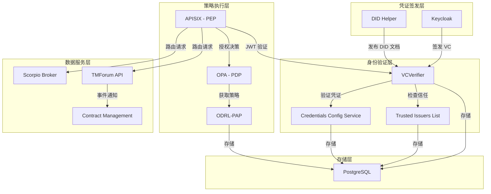

本页面详细说明如何部署 FIWARE Data Space Connector 的 Provider 角色。Provider 是数据空间中**向其他参与者提供数据服务**的组织，需要部署完整的身份验证、授权和数据服务组件栈。

## Provider 角色概述

在 FIWARE 数据空间中，Provider 承担着数据服务提供者的角色。它需要托管一个或多个数据服务（如 API、Web 应用程序等），并使用**去中心化身份与访问管理（IAM）**栈来保护这些服务。所有传入请求必须通过可验证凭证（VC）进行身份验证，并根据 ODRL 策略进行授权。

Provider 部署包含 [Consumer 角色](3-consumer-jiao-se-bu-shu) 的所有基础组件，同时增加了**认证验证**、**策略执行**和**数据服务集成**所需的额外组件。

Sources: [README.md](doc/deployment-integration/roles/provider/README.md#L1-L20)

## 核心组件架构

Provider 的组件栈分为三个层次：**凭证签发**、**身份验证**和**策略执行**。下图展示了这些组件如何协同工作：



Sources: [README.md](doc/deployment-integration/roles/provider/README.md#L22-L60), [Chart.yaml](charts/data-space-connector/Chart.yaml#L1-L92)

## 必需组件详解

### 凭证签发组件（来自 Consumer 角色）

Provider 需要与 Consumer 相同的基础组件来签发自己的可验证凭证：

| 组件 | 说明 | 配置参考 |
|------|------|----------|
| **Keycloak** | VC 签发者，为 Provider 的用户签发可验证凭证 | [KEYCLOAK.md](doc/deployment-integration/roles/KEYCLOAK.md) |
| **DID Helper** | 发布组织的 DID 文档，建立组织在数据空间中的身份 | [k3s/provider-gaia-x.yaml](k3s/provider-gaia-x.yaml#L100-L150) |
| **Managed PostgreSQL** | 为 IAM 组件提供数据库支持 | [values.yaml](charts/data-space-connector/values.yaml#L1-L50) |

Sources: [README.md](doc/deployment-integration/roles/provider/README.md#L22-L35), [KEYCLOAK.md](doc/deployment-integration/roles/KEYCLOAK.md#L1-L50)

### 认证验证组件

认证验证组件负责验证传入的可验证凭证，并将其转换为 JWT 访问令牌：

| 组件 | 功能 | 关键配置 |
|------|------|----------|
| **VCVerifier** | 通过 OID4VP 验证传入的可验证凭证，检查凭证签名、发行者信任和凭证类型接受度 | `tirAddress`、`did`、`server.host` |
| **Credentials Config Service** | 配置每个受保护服务接受的凭证类型，定义要检查的可信发行者列表和可信参与者列表 | `registration.services` |
| **Trusted Issuers List（本地）** | Provider 本地的可信发行者列表，与信任锚的注册表配合使用 | `ingress.til` |

Sources: [README.md](doc/deployment-integration/roles/provider/README.md#L37-L50), [provider.yaml](k3s/provider.yaml#L30-L100)

### 策略执行组件

策略执行组件实现了**策略执行点（PEP）**、**策略决策点（PDP）**和**策略管理点（PAP）**的完整授权架构：

| 组件 | 角色 | 说明 |
|------|------|------|
| **APISIX** | PEP | API 网关，验证来自 VCVerifier 的 JWT 令牌，并将授权决策委托给 OPA |
| **OPA** | PDP | 策略决策点，评估每个传入请求的授权策略（Rego 格式），返回允许/拒绝决策 |
| **ODRL-PAP** | PAP | 策略管理点，允许 Provider 使用 ODRL 定义访问策略，并将其转换为 OPA 的 Rego 策略 |

Sources: [README.md](doc/deployment-integration/roles/provider/README.md#L52-L65), [provider-gaia-x.yaml](k3s/provider-gaia-x.yaml#L50-L100)

## 可选组件

根据数据空间的具体需求，Provider 可以启用以下可选组件：

### TMForum API + Contract Management + Marketplace

当数据空间使用**市场模型**时启用这些组件。TMForum API 提供标准化的产品生命周期管理接口，Contract Management 根据合同自动执行访问控制。

| 组件 | 功能 | 启用场景 |
|------|------|----------|
| **TMForum API** | 实现产品目录管理、订购、库存等标准化 API | 需要通过结构化目录提供数据产品时 |
| **Contract Management** | 监听合同管理事件，自动授予/撤销访问权限 | 使用 TMForum API 进行产品订购时 |
| **Marketplace (BAE)** | 提供 Web 门户，用于浏览和订购产品 | 需要用户界面的本地市场 |

Sources: [README.md](doc/deployment-integration/roles/provider/README.md#L67-L100), [provider-gaia-x.yaml](k3s/provider-gaia-x.yaml#L200-L300)

### FDSC-EDC（数据空间协议）

当数据空间需要符合**数据空间协议（DSP）**时启用。FDSC-EDC 提供 Eclipse Dataspace Components 连接器，支持 OID4VC 和 DCP 两种认证方式。

| 认证方式 | 说明 | 配置文件 |
|----------|------|----------|
| **OID4VC** | 使用 OpenID for Verifiable Credentials 协议进行连接器间认证 | [dsp-provider.yaml](k3s/dsp-provider.yaml) |
| **DCP** | 使用去中心化声明协议进行连接器间认证 | [dsp-provider.yaml](k3s/dsp-provider.yaml) |

Sources: [DSP_INTEGRATION.md](doc/DSP_INTEGRATION.md#L1-L50), [dsp-provider.yaml](k3s/dsp-provider.yaml#L1-L100)

## 部署步骤

### 步骤 1：准备部署前工作

在部署之前，请联系**数据空间运营商**以启动组织的入驻流程。运营商将指导您完成：

- 加入数据空间所需的文档和要求
- 在信任锚注册组织的 DID
- 组织允许签发的凭证类型及其配置
- 信任锚的 TIR 端点 URL

这些信息对于配置 Keycloak、DID、VCVerifier 和可验证凭证至关重要。

Sources: [README.md](doc/deployment-integration/roles/provider/README.md#L10-L20)

### 步骤 2：创建 values.yaml 配置文件

创建 Helm `values.yaml` 文件，配置 Provider 部署的关键设置。以下是一个最小化配置示例：

```yaml
# Provider 部署关键设置

# 启用 cert-manager（生产环境）
cert-manager:
  enabled: true
  crds:
    enabled: true

certManagerResources:
  enabled: true
  type: "prod"

# Keycloak 配置 - 详见 KEYCLOAK.md
keycloak:
  enabled: true
  ingress:
    enabled: true
    hostname: <your-keycloak-domain>
    annotations:
      traefik.ingress.kubernetes.io/router.tls: "true"
      cert-manager.io/cluster-issuer: "prod"
      cert-manager.io/private-key-algorithm: "ECDSA"
    tls: true

# DID 配置
did:
  enabled: true
  config:
    server:
      hostUrl: "http://<your_did_domain>"
      certPath: "/certs/tls.crt"
  volumes:
    - name: certs
      secret:
        secretName: <your_did_domain>-tls
        items:
          - key: tls.crt
            path: tls.crt
  volumeMounts:
    - name: certs
      mountPath: /certs
  ingress:
    enabled: true
    annotations:
      traefik.ingress.kubernetes.io/router.tls: "true"
      cert-manager.io/cluster-issuer: "prod"
      cert-manager.io/private-key-algorithm: "ECDSA"
    hosts:
      - host: <your_did_domain>
        paths:
          - path: /
    tls:
      - secretName: <your_did_domain>-tls
        hosts:
          - <your_did_domain>

# 身份验证和授权配置
decentralizedIam:
  enabled: true
  vcAuthentication:
    # VCVerifier 配置
    vcverifier:
      ingress:
        enabled: true
        annotations:
          traefik.ingress.kubernetes.io/router.tls: "true"
          cert-manager.io/cluster-issuer: "prod"
          cert-manager.io/private-key-algorithm: "ECDSA"
        tls:
          - hosts:
              - <your_verifier_domain>
            secretName: <your_verifier_domain>-tls
        hosts:
          - host: <your_verifier_domain>
            paths:
              - "/"
      deployment:
        verifier:
          tirAddress: <trust_anchor_tir_url>
          did: <your-organization's-DID>
        server:
          host: https://<your_verifier_domain>
        configRepo:
          configEndpoint: http://verifier:8090

    # Credentials Config Service 配置
    credentials-config-service:
      ingress:
        enabled: true
        annotations:
          cert-manager.io/cluster-issuer: "prod"
          cert-manager.io/private-key-algorithm: "ECDSA"
        hosts:
          - host: <your_ccs_domain>
            paths:
              - "/"
        tls:
          - secretName: <your_ccs_domain>-tls
            hosts:
              - <your_ccs_domain>
      registration:
        enabled: true
        services:
          - id: data-service
            defaultOidcScope: "default"
            authorizationType: "DEEPLINK"
            oidcScopes:
              "default":
                credentials:
                  - type: UserCredential
                    trustedParticipantsLists:
                      - <trust_anchor_tir_url>
                    trustedIssuersLists:
                      - http://trusted-issuers-list:8080

    # Trusted Issuers List 配置
    trusted-issuers-list:
      ingress:
        til:
          enabled: true
          annotations:
            cert-manager.io/cluster-issuer: "prod"
            cert-manager.io/private-key-algorithm: "ECDSA"
          hosts:
            - host: <your_til_domain>
              paths:
                - /
          tls:
            - secretName: <your_til_domain>-tls
              hosts:
                - <your_til_domain>

    # PostgreSQL 配置
    managedPostgres:
      enabled: true
      config:
        volume:
          storageClass: ""

  # 授权组件配置
  odrlAuthorization:
    apisix:
      apisix:
        admin:
          credentials:
            admin: <your_apisix_admin_password>
      ingress:
        enabled: true
        annotations:
          cert-manager.io/cluster-issuer: "prod"
          cert-manager.io/private-key-algorithm: "ECDSA"
        hosts:
          - host: <your_data_service_domain>
            paths: ["/"]
        tls:
          - secretName: <your_apisix_tls_secret>
            hosts:
              - <your_data_service_domain>
      routes:
        - uri: /.well-known/openid-configuration
          host: <your_data_service_domain>
          upstream:
            nodes:
              verifier:3000: 1
            type: roundrobin
          plugins:
            proxy-rewrite:
              uri: /services/data-service/.well-known/openid-configuration
        - uri: /*
          host: <your_data_service_domain>
          upstream:
            nodes:
              <your_backend_service>: 1
            type: roundrobin
          plugins:
            openid-connect:
              bearer_only: true
              use_jwks: true
              client_id: data-service
              client_secret: unused
              ssl_verify: false
              discovery: https://<your_verifier_domain>/services/data-service/.well-known/openid-configuration
            opa:
              host: http://localhost:8181
              policy: policy/main

    # ODRL-PAP 配置
    odrl-pap:
      additionalEnvVars:
        - name: GENERAL_ORGANIZATION_DID
          value: <your-organization's-DID>
      ingress:
        enabled: true
        annotations:
          cert-manager.io/cluster-issuer: "prod"
          cert-manager.io/private-key-algorithm: "ECDSA"
        hosts:
          - host: <your_pap_domain>
            paths:
              - "/"
        tls:
          - secretName: <your_pap_domain>-tls
            hosts:
              - <your_pap_domain>

# 可选组件（默认禁用）
scorpio:
  enabled: true

tm-forum-api:
  enabled: false

contract-management:
  enabled: false

marketplace:
  enabled: false

fdsc-edc:
  enabled: false
```

Sources: [README.md](doc/deployment-integration/roles/provider/README.md#L100-L250), [provider.yaml](k3s/provider.yaml#L1-L200)

### 步骤 3：添加 Helm 仓库并安装

```shell
# 添加 FIWARE DSC Helm 仓库
helm repo add fiware-dsc https://fiware.github.io/data-space-connector

# 安装 Provider
helm install provider fiware-dsc/data-space-connector \
  -n provider \
  --create-namespace \
  -f provider-values.yaml
```

Sources: [README.md](doc/deployment-integration/roles/provider/README.md#L250-L270)

### 步骤 4：使用覆盖文件进行高级部署

对于特定合规要求，可以使用覆盖文件扩展基础 `provider.yaml`：

| 覆盖类型 | 文件 | 说明 |
|----------|------|------|
| **ELSI 合规** | [k3s/provider-elsi.yaml](k3s/provider-elsi.yaml) | 符合 ELSI 信任框架的部署配置 |
| **Gaia-X 合规** | [k3s/provider-gaia-x.yaml](k3s/provider-gaia-x.yaml) | 符合 Gaia-X 的部署配置 |
| **DSP 集成** | [k3s/dsp-provider.yaml](k3s/dsp-provider.yaml) | 启用数据空间协议连接器 |

部署示例（ELSI 合规）：

```shell
helm install provider fiware/data-space-connector \
  -n provider \
  -f k3s/provider.yaml \
  -f k3s/provider-elsi.yaml
```

Sources: [README.md](doc/deployment-integration/roles/provider/README.md#L270-L300), [provider-elsi.yaml](k3s/provider-elsi.yaml#L1-L50)

## APISIX 路由配置详解

APISIX 作为 API 网关，需要配置路由规则来保护数据服务。以下是一个典型的路由配置示例：

```yaml
routes:
  # OpenID 配置端点（VCVerifier）
  - uri: /.well-known/openid-configuration
    host: mp-data-service.127.0.0.1.nip.io
    upstream:
      nodes:
        verifier:3000: 1
      type: roundrobin
    plugins:
      proxy-rewrite:
        uri: /services/data-service/.well-known/openid-configuration
  
  # 数据空间配置端点
  - uri: /.well-known/data-space-configuration
    upstream:
      nodes:
        dsconfig:3002: 1
      type: roundrobin
    plugins:
      proxy-rewrite:
        uri: /.well-known/data-space-configuration/data-space-configuration.json
      response-rewrite:
        headers:
          set:
            content-type: application/json
  
  # 数据服务路由（需要认证和授权）
  - uri: /*
    host: mp-data-service.127.0.0.1.nip.io
    upstream:
      nodes:
        data-service-scorpio:9090: 1
      type: roundrobin
    plugins:
      openid-connect:
        bearer_only: true
        use_jwks: true
        client_id: data-service
        client_secret: unused
        ssl_verify: false
        discovery: http://verifier:3000/services/data-service/.well-known/openid-configuration
      opa:
        host: "http://localhost:8181"
        policy: policy/main
        with_body: true
```

Sources: [provider-gaia-x.yaml](k3s/provider-gaia-x.yaml#L100-L150), [provider.yaml](k3s/provider.yaml#L400-L500)

## 服务注册配置

在 Credentials Config Service 中注册受保护的服务，定义每个服务接受的凭证类型：

```yaml
registration:
  enabled: true
  services:
    # 数据服务
    - id: data-service
      defaultOidcScope: "default"
      authorizationType: "DEEPLINK"
      oidcScopes:
        "default":
          credentials:
            - type: UserCredential
              trustedParticipantsLists:
                - https://tir.127.0.0.1.nip.io
              trustedIssuersLists:
                - http://trusted-issuers-list:8080
              jwtInclusion:
                enabled: true
                fullInclusion: true
    
    # TMForum API 服务
    - id: bae
      defaultOidcScope: "openid learcredential"
      authorizationType: "FRONTEND_V2"
      oidcScopes:
        "openid learcredential":
          credentials:
            - type: LegalPersonCredential
              trustedParticipantsLists:
                - https://tir.127.0.0.1.nip.io
              trustedIssuersLists:
                - http://trusted-issuers-list:8080
              jwtInclusion:
                enabled: true
                fullInclusion: true
    
    # DSP 服务
    - id: dsp
      defaultOidcScope: "openid"
      authorizationType: "DEEPLINK"
      oidcScopes:
        "openid":
          credentials:
            - type: MembershipCredential
              trustedParticipantsLists:
                - https://tir.127.0.0.1.nip.io
              trustedIssuersLists:
                - "*"
              jwtInclusion:
                enabled: true
                fullInclusion: true
```

Sources: [provider.yaml](k3s/provider.yaml#L200-L300)

## 生产环境注意事项

### TLS 证书管理

- 所有公开可达的端点**必须**使用 HTTPS，并由受信任的 CA 签发有效的 TLS 证书
- 可以在 Helm chart 中启用 cert-manager 来自动化证书签发和续期

### DID 和密钥管理

- 使用组织控制的已注册域名作为 `did:web` 标识符
- 确保 DID 文档通过 HTTPS 提供，并使用有效证书
- 保护与 DID 关联的私钥——它是组织在数据空间中身份的基础

### 不要暴露内部 API

以下 Ingress 在开发环境中有用，但在生产环境中**不应**公开访问：
- **Scorpio Broker** 直接 Ingress——所有访问必须通过 APISIX
- **ODRL-PAP** Ingress——策略管理应限制为授权运营商
- **Trusted Issuers List** 管理 API——限制为内部访问
- **Credentials Config Service**——限制为内部访问

### APISIX 配置

- 更改 APISIX `admin` 凭据的默认值
- 配置适当的错误响应（不要泄露内部服务详细信息）

### VCVerifier 配置

- 将 `tirAddress` 配置为指向生产环境信任锚的 TIR 端点
- 确保 VCVerifier 可以通过 HTTPS 访问信任锚，并使用有效证书
- 如果使用代理，请适当配置 `HTTPS_PROXY`/`NO_PROXY`
- VCVerifier 的签名密钥（用于 JWT 签发）必须受到保护

### 策略管理

- 根据最小权限原则定义 ODRL 策略
- 考虑对策略进行版本控制（存储在版本控制中并通过 CI/CD 应用）

Sources: [README.md](doc/deployment-integration/roles/provider/README.md#L300-L400)

## 参与中央市场

如果 Provider 参与[中央市场](22-central-marketplace-ji-cheng)，需要执行以下额外配置：

### 步骤 1：启用并配置 Contract Management

```yaml
contract-management:
  enabled: true
  enableCentralMarketplace: true
  enableOdrlPap: true
  did: <your-organization-DID>
  til:
    credentialType: <YourCredentialType>
  services:
    odrl:
      url: http://odrl-pap:8080
  notification:
    enabled: true
    host: contract-management
  deployment:
    image:
      tag: 3.3.8
```

### 步骤 2：通过 APISIX 暴露 Contract Management

```yaml
decentralizedIam:
  odrlAuthorization:
    apisix:
      ingress:
        hosts:
          - host: <your_contract_management_domain>
            paths: ["/"]
      routes:
        - uri: /*/.well-known/openid-configuration
          host: <your_contract_management_domain>
          upstream:
            nodes:
              verifier:3000: 1
            type: roundrobin
          plugins:
            proxy-rewrite:
              uri: /services/contract-management/.well-known/openid-configuration
        - uri: /*
          host: <your_contract_management_domain>
          upstream:
            nodes:
              contract-management:8080: 1
            type: roundrobin
          plugins:
            openid-connect:
              bearer_only: true
              use_jwks: true
              client_id: contract-management
              client_secret: unused
              ssl_verify: false
              discovery: http://verifier:3000/services/contract-management/.well-known/openid-configuration
            opa:
              host: http://localhost:8181
              policy: policy/main
              with_body: true
```

### 步骤 3：注册 Contract Management 服务

```yaml
decentralizedIam:
  vcAuthentication:
    credentials-config-service:
      registration:
        enabled: true
        services:
          - id: contract-management
            defaultOidcScope: "external-marketplace"
            authorizationType: "DEEPLINK"
            oidcScopes:
              "external-marketplace":
                credentials:
                  - type: MarketplaceCredential
                    trustedParticipantsLists:
                      - <trust_anchor_tir_url>
                    trustedIssuersLists:
                      - "*"
                    jwtInclusion:
                      enabled: true
                      fullInclusion: true
```

### 步骤 4：在 PAP 注册策略

在接收第一个通知之前，Provider 必须在其 PAP 安装一个策略，授予中央市场访问 Contract Management 端点的权限。

### 步骤 5：在中央市场注册 Provider

中央市场需要知道 Provider 的 Contract Management 端点和用于认证的 OIDC 客户端。

Sources: [README.md](doc/deployment-integration/roles/provider/README.md#L100-L200)

## 升级策略

- 在每次升级前查看 FIWARE Data Space Connector [发布说明](https://github.com/FIWARE/data-space-connector/releases)
- 尽可能保持数据空间中所有参与者的连接器版本一致，以避免协议不兼容

Sources: [README.md](doc/deployment-integration/roles/provider/README.md#L400-L450)

## 相关页面

- [Consumer 角色部署](3-consumer-jiao-se-bu-shu)：了解 Consumer 角色的部署配置
- [Consumer + Provider 双角色部署](5-consumer-provider-shuang-jiao-se-bu-shu)：同时承担两种角色的部署指南
- [Keycloak 与 OID4VCI 凭证签发配置](17-keycloak-yu-oid4vci-ping-zheng-qian-fa-pei-zhi)：Keycloak 详细配置说明
- [ODRL 授权框架](12-odrl-shou-quan-kuang-jia-apisix-opa-odrl-pap)：授权组件详细说明
- [DSP 与 EDC 集成架构](14-dsp-yu-edc-ji-cheng-jia-gou)：数据空间协议集成说明
- [values.yaml 全局配置参考](16-values-yaml-quan-ju-pei-zhi-can-kao)：完整配置参考