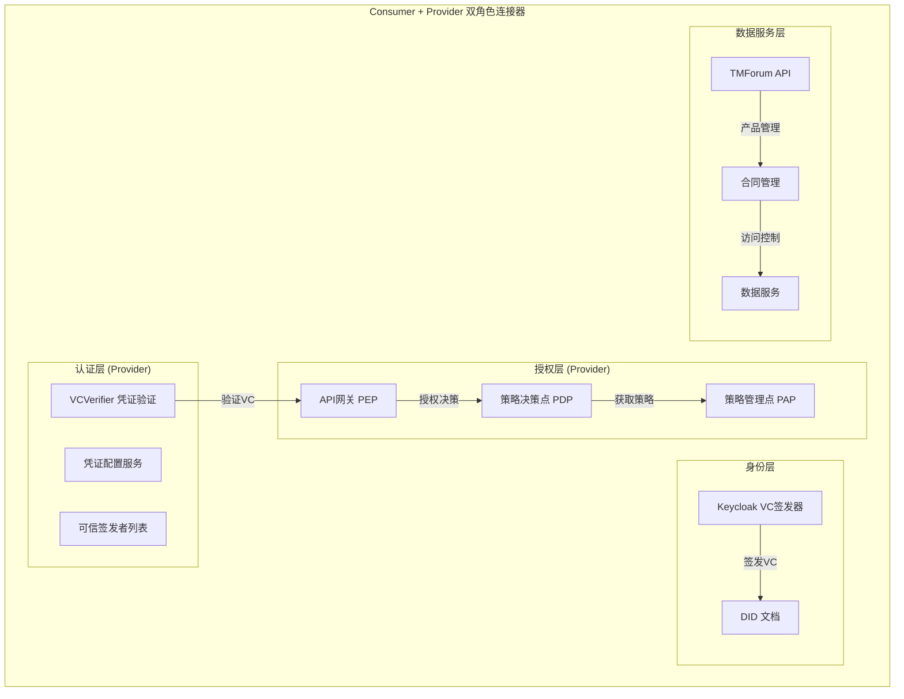
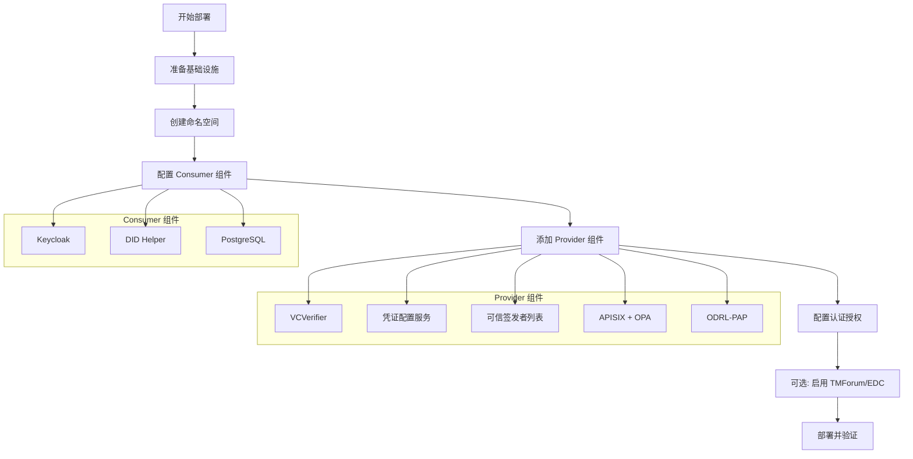

在真实的数据空间中，大多数参与者通常**同时扮演消费者和提供者两个角色**。组织既向其他参与者提供自己的数据或服务，同时也消费来自其他参与者的数据。这种双角色部署是数据空间中最常见的部署场景，它允许组织在一个单一的连接器实例中同时执行数据消费和数据提供功能。

## 架构概览

双角色部署的核心架构基于**单一身份标识**原则：组织在数据空间中拥有一个唯一的去中心化标识符（DID），无论其扮演多少角色。这种设计避免了身份碎片化，确保了操作的简洁性和一致性。



Sources: [doc/deployment-integration/roles/README.md](doc/deployment-integration/roles/README.md#L1-L172)

## 组件矩阵

根据角色的不同，FIWARE 数据空间连接器提供了不同的组件配置。Consumer + Provider 双角色需要以下组件：

| 组件分类 | 组件 | 功能 | 双角色状态 |
|---------|------|------|-----------|
| **身份与信任** | Keycloak | 签发可验证凭证 (OID4VCI) | **必需** |
| | DID Helper | 发布组织的 DID 文档 | **必需** |
| **认证** | VCVerifier | 通过 OID4VP 验证传入的 VC | **必需** |
| | 凭证配置服务 | 配置哪些 VC 类型用于访问服务 | **必需** |
| | 可信签发者列表 | 提供 EBSI 可信签发者注册表 API | **必需** |
| **授权** | APISIX | API网关 (策略执行点 PEP) | **必需** |
| | OPA | 策略决策点 (PDP) | **必需** |
| | ODRL-PAP | 策略管理点 | **必需** |
| **数据服务** | TMForum API | 产品目录管理 | 可选 |
| | 合同管理 | 基于合同的访问控制 | 可选 |
| | FDSC-EDC | 数据空间协议支持 | 可选 |
| **基础设施** | PostgreSQL | 数据库服务 | **必需** |

Sources: [doc/deployment-integration/roles/README.md](doc/deployment-integration/roles/README.md#L30-L100)

## 部署策略

### 核心原则

双角色部署遵循以下核心原则：

1. **单一身份**：组织在数据空间中拥有一个 DID，不为消费者和提供者功能创建单独的 DID
2. **单一 Keycloak 实例**：一个 Keycloak 实例同时为两个角色签发可验证凭证
3. **组件共享**：PostgreSQL 和 Keycloak 等共享组件同时服务于消费者和提供者功能
4. **可扩展性**：可以从单一角色逐步演进到双角色

Sources: [doc/deployment-integration/roles/consumer-provider/README.md](doc/deployment-integration/roles/consumer-provider/README.md#L1-L30)

### 部署流程

双角色部署可以通过以下步骤完成：



## 配置方法

### 基础配置文件

双角色部署使用以下基础配置文件：

| 配置文件 | 描述 | 用途 |
|---------|------|------|
| [k3s/consumer.yaml](k3s/consumer.yaml) | Consumer 基础配置 | Keycloak、DID、基本身份验证 |
| [k3s/provider.yaml](k3s/provider.yaml) | Provider 基础配置 | 认证、授权、数据服务组件 |
| [k3s/consumer-auth.yaml](k3s/consumer-auth.yaml) | Consumer 认证扩展 | 启用 Consumer 端的认证组件 |
| [k3s/consumer-tmf.yaml](k3s/consumer-tmf.yaml) | TMForum 集成 | 启用市场功能 |

Sources: [k3s/consumer.yaml](k3s/consumer.yaml#L1-L728), [k3s/provider.yaml](k3s/provider.yaml#L1-L1504)

### Helm 部署命令

双角色部署可以通过叠加多个配置文件实现：

```shell
# 添加 Helm 仓库
helm repo add fiware-dsc https://fiware.github.io/data-space-connector

# 部署双角色连接器
helm install dual-role fiware-dsc/data-space-connector \
  -n data-space \
  --create-namespace \
  -f k3s/consumer.yaml \
  -f k3s/consumer-auth.yaml \
  -f k3s/consumer-tmf.yaml \
  -f k3s/provider.yaml
```

或者使用简化的 values 文件：

```yaml
# 双角色部署的核心配置

# 基础设施
cert-manager:
  enabled: true
  crds:
    enabled: true

# 身份层 - 两个角色共享
keycloak:
  enabled: true
  # 配置详见 ../KEYCLOAK.md
  realm:
    name: data-space-realm
    import: true

did:
  enabled: true
  # 配置详见 DID 文档

# 认证组件 (Provider)
decentralizedIam:
  enabled: true
  vcAuthentication:
    vcverifier:
      enabled: true
    credentials-config-service:
      enabled: true
    trusted-issuers-list:
      enabled: true
    managedPostgres:
      enabled: true
  
  # 授权组件 (Provider)
  odrlAuthorization:
    apisix:
      enabled: true
    opa:
      enabled: true
    odrl-pap:
      enabled: true

# 可选组件
tm-forum-api:
  enabled: true  # 启用市场功能

contract-management:
  enabled: true  # 启用合同管理

# 数据服务
scorpio:
  enabled: true  # NGSI-LD 上下文代理
```

Sources: [doc/deployment-integration/roles/consumer/README.md](doc/deployment-integration/roles/consumer/README.md#L80-L160), [doc/deployment-integration/roles/provider/README.md](doc/deployment-integration/roles/provider/README.md#L200-L400)

### Keycloak 配置要点

Keycloak 在双角色部署中的配置需要特别注意：

1. **单一 Realm**：使用一个 Realm 管理所有凭证类型
2. **多客户端**：为每个外部组织（通过 DID 标识）创建客户端
3. **角色映射**：定义客户端角色以控制用户在不同提供者处的权限
4. **凭证类型**：配置为客户端作用域，支持多种凭证格式

```yaml
keycloak:
  enabled: true
  realm:
    name: data-space-realm
    import: true
    clientRoles: |
      "did:web:provider.example.com": [
        {
          "name": "reader",
          "description": "Can read data",
          "clientRole": true
        },
        {
          "name": "admin",
          "description": "Administrative access",
          "clientRole": true
        }
      ]
    verifiableCredentials:
      user-credential:
        attributes:
          format: "jwt_vc_json"
          verifiable_credential_type: "UserCredential"
          credential_signing_alg: "ES256"
        protocolMappers:
          - name: email-mapper
            protocol: oid4vc
            protocolMapper: oid4vc-user-attribute-mapper
            config:
              claim.name: email
              userAttribute: email
```

Sources: [doc/deployment-integration/roles/KEYCLOAK.md](doc/deployment-integration/roles/KEYCLOAK.md#L1-L200)

## 可选功能集成

### DSP (数据空间协议) 集成

如果数据空间需要符合 [数据空间协议 (DSP)](https://docs.internationaldataspaces.org/ids-knowledgebase/dataspace-protocol)，可以通过叠加 DSP 配置文件启用 Eclipse Dataspace Components：

```shell
# 启用 DSP 支持的双角色部署
helm install dual-role fiware-dsc/data-space-connector \
  -n data-space \
  -f k3s/consumer.yaml \
  -f k3s/consumer-auth.yaml \
  -f k3s/provider.yaml \
  -f k3s/dsp-consumer.yaml \
  -f k3s/dsp-provider.yaml
```

DSP 集成需要配置 IdentityHub 来提供去中心化声明协议 (DCP) 功能：

```yaml
fdsc-edc:
  enabled: true
  common:
    config:
      issuerId: did:web:your-organization.com
      dcp:
        enabled: true
        scopes:
          catalog: org.eclipse.tractusx.vc.type:MembershipCredential:read
          negotiation: org.eclipse.tractusx.vc.type:MembershipCredential:read

identityhub:
  enabled: true
  didIngress:
    hosts:
      - host: your-organization.com
        paths:
          - /
    tls:
      - secretName: your-organization.com-tls
        hosts:
          - your-organization.com
```

Sources: [k3s/dsp-consumer.yaml](k3s/dsp-consumer.yaml#L1-L272), [k3s/dsp-provider.yaml](k3s/dsp-provider.yaml#L1-L301)

### ELSI/Gaia-X 合规性

根据信任框架要求，可以叠加 ELSI 或 Gaia-X 配置：

| 合规性 | Consumer 配置 | Provider 配置 |
|-------|---------------|---------------|
| **ELSI** | [k3s/consumer-elsi.yaml](k3s/consumer-elsi.yaml) | [k3s/provider-elsi.yaml](k3s/provider-elsi.yaml) |
| **Gaia-X** | [k3s/consumer-gaia-x.yaml](k3s/consumer-gaia-x.yaml) | [k3s/provider-gaia-x.yaml](k3s/provider-gaia-x.yaml) |

Sources: [k3s/consumer-elsi.yaml](k3s/consumer-elsi.yaml#L1-L350), [k3s/provider-gaia-x.yaml](k3s/provider-gaia-x.yaml#L1-L398)

## 从单角色演进

### Consumer 到 Provider 的演进

如果组织最初仅作为 Consumer 部署，后续可以添加 Provider 组件：

1. **添加认证组件**：启用 VCVerifier、凭证配置服务、可信签发者列表
2. **添加授权组件**：启用 APISIX、OPA、ODRL-PAP
3. **配置数据服务**：部署并配置需要保护的数据服务
4. **更新 Keycloak**：添加新的客户端角色和凭证类型


### Provider 到 Consumer 的演进

如果组织已作为 Provider 部署，实际上已包含 Consumer 所需的所有组件：

1. **Keycloak 已存在**：用于签发组织用户的可验证凭证
2. **DID 已配置**：组织的身份标识已就位
3. **只需配置**：在 Keycloak 中添加适当的客户端、角色和凭证类型

Sources: [doc/deployment-integration/roles/consumer-provider/README.md](doc/deployment-integration/roles/consumer-provider/README.md#L20-L30)

## 生产环境考虑

### 高可用性设计

双角色部署中，共享组件的故障会影响消费者和提供者功能。建议：

1. **Keycloak 高可用性**：
   - 部署至少 2 个副本
   - 启用 Infinispan 缓存复制
   - 使用外部数据库（如 PostgreSQL 集群）

2. **PostgreSQL 高可用性**：
   - 使用 Zalando Postgres Operator 进行管理
   - 配置主从复制
   - 定期备份

3. **APISIX 集群**：
   - 部署多个数据平面节点
   - 使用共享 etcd 集群
   - 配置健康检查和故障转移

### 安全配置

| 配置项 | 建议 |
|-------|------|
| **TLS 证书** | 使用 cert-manager 自动管理，生产环境使用真实 CA 签发的证书 |
| **DID 密钥** | 使用组织控制的域名，保护私钥安全 |
| **APISIX 凭证** | 更改默认管理员密码 |
| **Keycloak 管理** | 不要在 values 文件中硬编码密码，使用 Kubernetes Secrets |
| **网络策略** | 限制内部 API（如 Scorpio、PAP）的外部访问 |

### 资源规划

双角色部署需要更多资源，建议配置：

```yaml
# 资源请求和限制建议
keycloak:
  resources:
    requests:
      memory: "1Gi"
      cpu: "500m"
    limits:
      memory: "2Gi"
      cpu: "1000m"

scorpio:
  resources:
    requests:
      memory: "512Mi"
      cpu: "250m"
    limits:
      memory: "1Gi"
      cpu: "500m"

vcverifier:
  resources:
    requests:
      memory: "256Mi"
      cpu: "100m"
    limits:
      memory: "512Mi"
      cpu: "250m"
```

Sources: [doc/deployment-integration/roles/consumer/README.md](doc/deployment-integration/roles/consumer/README.md#L220-L242), [doc/deployment-integration/roles/provider/README.md](doc/deployment-integration/roles/provider/README.md#L500-L542)

## 命名空间策略

双角色部署建议使用单一命名空间或分离命名空间：

| 策略 | 优点 | 缺点 |
|------|------|------|
| **单一命名空间** | 简化配置，组件间通信简单 | 故障隔离性差 |
| **分离命名空间** | 更好的故障隔离，更清晰的资源管理 | 需要配置跨命名空间服务发现 |

推荐的命名空间配置：

```yaml
# 创建命名空间
apiVersion: v1
kind: Namespace
metadata:
  name: data-space-participant
```

Sources: [k3s/namespaces/consumer.yaml](k3s/namespaces/consumer.yaml#L1-L4), [k3s/namespaces/provider.yaml](k3s/namespaces/provider.yaml#L1-L4)

## 故障排除

### 常见问题

| 问题 | 可能原因 | 解决方案 |
|------|---------|---------|
| Keycloak 启动失败 | 数据库连接问题 | 检查 PostgreSQL Pod 状态和连接配置 |
| VC 验证失败 | DID 文档不匹配 | 确保签名密钥与 DID 文档中的公钥匹配 |
| 策略不生效 | ODRL-PAP 配置错误 | 检查策略格式和 PAP 服务状态 |
| API 网关 502 错误 | 上游服务未就绪 | 验证后端服务的健康检查端点 |
| DSP 连接失败 | IdentityHub 配置问题 | 检查 DID ingress 和 TLS 证书配置 |

### 健康检查

使用以下命令验证部署状态：

```shell
# 检查所有 Pod 状态
kubectl get pods -n data-space-participant

# 检查 Keycloak 健康状态
kubectl get svc -n data-space-participant | grep keycloak

# 验证 VCVerifier 端点
curl -k https://verifier.your-domain.com/.well-known/openid-configuration

# 检查 APISIX 路由
curl http://apisix-admin:9180/apisix/admin/routes -H 'X-API-KEY: admin'
```

## 下一步

完成双角色部署后，建议按以下顺序阅读相关文档：

1. **[组件总览与模块职责](7-zu-jian-zong-lan-yu-mo-kuai-zhi-ze)** - 深入理解各组件的详细职责
2. **[OID4VC 认证框架](9-oid4vc-ren-zheng-kuang-jia-vcverifier-trusted-issuers-list)** - 了解认证框架的详细配置
3. **[ODRL 授权框架](12-odrl-shou-quan-kuang-jia-apisix-opa-odrl-pap)** - 配置访问控制策略
4. **[TM Forum 合同管理](13-tm-forum-open-apis-he-tong-guan-li-liu-cheng)** - 启用市场功能
5. **[DSP 与 EDC 集成](14-dsp-yu-edc-ji-cheng-jia-gou)** - 数据空间协议集成
6. **[values.yaml 全局配置参考](16-values-yaml-quan-ju-pei-zhi-can-kao)** - 完整的配置参考

对于开发和测试环境，可以使用本地部署指南快速启动：[本地部署指南](doc/deployment-integration/local-deployment/LOCAL.MD)