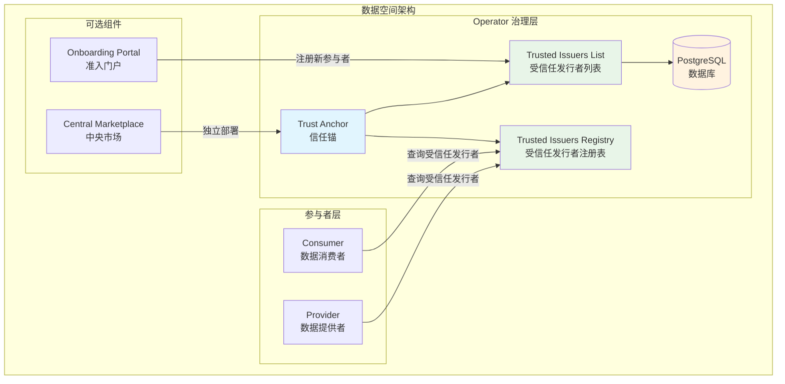
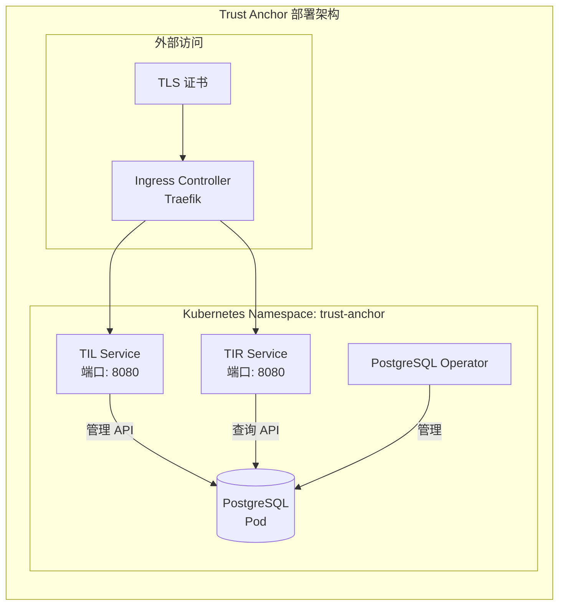
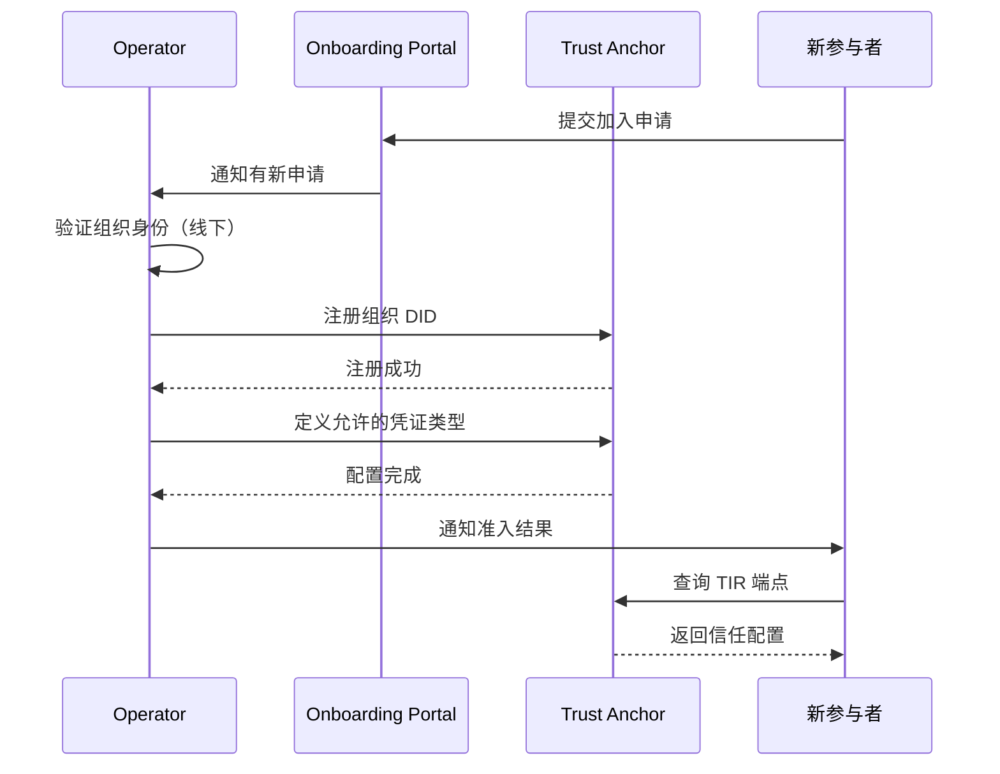
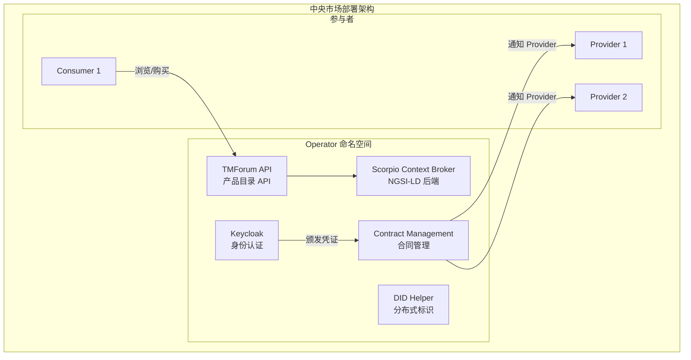

本页面介绍如何部署和配置数据空间 Operator 角色。Operator 是数据空间中的中立治理实体，负责维护所有参与者之间的信任基础设施。与 Consumer 和 Provider 角色不同，Operator 不参与数据交换，而是作为中立权威机构，确保所有参与者能够安全、可信地交互。

## Operator 角色概述

在 FIWARE 数据空间中，Operator 的核心职责是运营 **Trust Anchor（信任锚）**：一个集中式注册中心，用于注册所有受信任的参与者及其凭证。Operator 还负责新组织的准入管理，包括验证身份、注册 DID（分布式标识符）以及定义允许的凭证类型。



## 核心组件：Trust Anchor

Trust Anchor 是 Operator 的必备组件，它实现了 EBSI Trusted Issuers Registry API 标准，为数据空间提供标准化的信任查询机制。

### 架构设计

Trust Anchor 由三个核心部分组成：

1. **Trusted Issuers Registry (TIR)**：提供只读 API（`/v4/issuers`），供参与者查询受信任的发行者列表
2. **Trusted Issuers List (TIL)**：提供管理 API（`/issuer`），供 Operator 注册和管理受信任的发行者
3. **PostgreSQL 数据库**：持久化存储受信任发行者信息



### Helm Chart 部署

Operator 使用专用的 Helm Chart `fiware/trust-anchor` 进行部署。该 Chart 包含了 Trust Anchor 运行所需的所有组件。

**Chart 依赖关系：**

| 组件 | 版本 | 用途 |
|------|------|------|
| trusted-issuers-list | 0.16.0 | EBSI Trusted Issuers Registry 实现 |
| postgres-operator | 1.15.1 | PostgreSQL 数据库操作符 |

**核心配置参数：**

```yaml
# charts/trust-anchor/values.yaml
postgres-operator:
  enabled: true  # 是否安装 PostgreSQL Operator
  configKubernetes:
    enable_readiness_probe: true

managedPostgres:
  enabled: true  # 是否启用托管的 PostgreSQL 实例
  config:
    teamId: "trust-anchor"
    numberOfInstances: 1
    postgresql:
      version: "16"
    volume:
      size: 1Gi  # 生产环境应适当增大
    users:
      admin: [superuser, createdb]
      til: [createdb]
    databases:
      tildb: til

trusted-issuers-list:
  enabled: true
  fullnameOverride: tir  # 固定服务名称，便于访问
  database:
    persistence: true
    dialect: POSTGRES
    username: til
    existingSecret:
      enabled: true
      name: til.postgres.credentials.postgresql.acid.zalan.do
      key: password
    host: postgres
    port: 5443
    name: tildb
```

### 生产环境部署

#### 1. 准备基础设施

生产环境中，Trust Anchor 必须部署在独立的基础设施上，与参与者完全隔离：

- **独立的 Kubernetes 集群**或至少专用的命名空间，并配置严格的 RBAC
- **专用数据库实例**，不与任何 Provider 或 Consumer 共享
- **独立的运维团队**和访问控制

#### 2. 部署 Helm Chart

使用 Helm CLI 部署 Trust Anchor：

```bash
# 添加 FIWARE Helm Chart 仓库
helm repo add fiware https://fiware.github.io/helm-charts
helm repo update

# 创建命名空间
kubectl create namespace trust-anchor

# 部署 Trust Anchor
helm install trust-anchor fiware/trust-anchor \
  -n trust-anchor \
  -f values-trust-anchor.yaml
```

#### 3. 生产环境配置示例

创建 `values-trust-anchor.yaml` 文件：

```yaml
# PostgreSQL 配置
postgres-operator:
  enabled: true

managedPostgres:
  enabled: true
  config:
    teamId: "trust-anchor"
    numberOfInstances: 2  # 高可用配置
    postgresql:
      version: "16"
    volume:
      size: 100Gi  # 生产环境存储需求
    users:
      admin: [superuser, createdb]
      til: [createdb]
    databases:
      tildb: til
    patroni:
      pg_hba:
        - local all all trust
        - hostssl all all 0.0.0.0/0 md5

# TIR 配置
trusted-issuers-list:
  enabled: true
  fullnameOverride: tir
  database:
    persistence: true
    dialect: POSTGRES
    username: til
    existingSecret:
      enabled: true
      name: til.postgres.credentials.postgresql.acid.zalan.do
      key: password
    host: postgres
    port: 5432
    name: tildb
  
  # Ingress 配置
  ingress:
    tir:
      enabled: true
      annotations:
        traefik.ingress.kubernetes.io/router.tls: "true"
        cert-manager.io/cluster-issuer: "letsencrypt-prod"
        cert-manager.io/common-name: "tir.your-dataspace.com"
        cert-manager.io/alt-names: "tir.your-dataspace.com"
      hosts:
        - host: tir.your-dataspace.com
    til:
      enabled: true
      annotations:
        traefik.ingress.kubernetes.io/router.tls: "true"
        cert-manager.io/cluster-issuer: "letsencrypt-prod"
        cert-manager.io/common-name: "til.your-dataspace.com"
        cert-manager.io/alt-names: "til.your-dataspace.com"
      hosts:
        - host: til.your-dataspace.com
  
  # 资源限制
  deployment:
    resources:
      limits:
        cpu: 500m
        memory: 1Gi
      requests:
        cpu: 200m
        memory: 512Mi
```

### 安全配置

#### TLS 证书配置

Trust Anchor 必须使用有效的 TLS 证书（非自签名）：

```yaml
# 使用 cert-manager 自动管理证书
ingress:
  tir:
    annotations:
      cert-manager.io/cluster-issuer: "letsencrypt-prod"
      cert-manager.io/private-key-algorithm: "ECDSA"
      cert-manager.io/common-name: "tir.your-dataspace.com"
```

#### 网络安全策略

- TIR 只读 API（`/v4/issuers`）应公开可访问
- TIL 管理 API（`/issuer`）必须严格限制访问，仅允许授权的操作员
- 实施网络策略，限制 Pod 间通信

```yaml
# Kubernetes NetworkPolicy 示例
apiVersion: networking.k8s.io/v1
kind: NetworkPolicy
metadata:
  name: trust-anchor-network-policy
  namespace: trust-anchor
spec:
  podSelector:
    matchLabels:
      app: trusted-issuers-list
  policyTypes:
    - Ingress
    - Egress
  ingress:
    - from:
        - namespaceSelector:
            matchLabels:
              name: ingress-nginx
      ports:
        - protocol: TCP
          port: 8080
  egress:
    - to:
        - namespaceSelector:
            matchLabels:
              name: trust-anchor
      ports:
        - protocol: TCP
          port: 5432
```

## 参与者准入管理

Operator 负责新组织的准入流程，这是数据空间治理的关键环节。

### 准入流程



### 准入操作步骤

#### 1. 验证组织身份（线下流程）

在注册前，Operator 必须通过线下方式验证：
- 组织的合法性和身份证明
- 业务资质和合规性
- 数据空间参与协议的签署

#### 2. 注册组织 DID

使用 TIL API 注册新参与者的 DID：

```bash
# 注册新参与者
curl -X POST https://til.your-dataspace.com/issuer \
  -H 'Content-Type: application/json' \
  -d '{
    "did": "did:key:z6MknewParticipant",
    "credentials": [
      {
        "type": "MembershipCredential",
        "trustedApplicablePolicy": "https://gaia-x.eu/trust-framework#membership"
      }
    ]
  }'
```

#### 3. 验证注册结果

查询 TIR 确认注册成功：

```bash
# 查询所有受信任的发行者
curl https://tir.your-dataspace.com/v4/issuers | jq .

# 查询特定发行者
curl https://tir.your-dataspace.com/v4/issuers/did:key:z6MknewParticipant | jq .
```

### 准入门户（可选组件）

[Onboarding Portal](https://github.com/SEAMWARE/On-Boarding-Portal/tree/main) 是一个 Web 应用程序，提供图形化界面简化准入流程：

- 提交和审核加入数据空间所需的文档
- 验证组织身份和 DID
- 批准后自动注册到 Trust Anchor

**部署方式：**

```bash
# 使用 Docker 部署
docker run -d \
  --name onboarding-portal \
  -p 8080:8080 \
  -e TRUST_ANCHOR_URL=https://til.your-dataspace.com \
  -e TIR_API_URL=https://tir.your-dataspace.com \
  quay.io/seamware/onboarding-portal:latest
```

## 中央市场（可选组件）

某些数据空间运行共享的中央市场，Operator 可作为中立托管方。中央市场允许 Provider 发布产品，Consumer 浏览和购买访问权限。

### 架构概述



### 部署中央市场

中央市场使用与 Provider 相同的 `fiware/data-space-connector` Helm Chart，但启用特定组件子集：

```yaml
# 中央市场核心配置
contract-management:
  enabled: true
  did: "did:web:marketplace.your-dataspace.com"
  enableCentralMarketplace: true
  enableOdrlPap: false
  enableTrustedIssuersList: false
  organization:
    provider:
      role: seller
  oid4vp:
    enabled: true
    credentialsFolder: /credential-repo
    holder:
      holderId: "did:web:marketplace.your-dataspace.com"
      keyType: EC
      keyPath: /app/resources/signing-key/tls.key
      signatureAlgorithm: ECDH-ES
  services:
    product-order: { url: http://tm-forum-api-svc:8080 }
    party: { url: http://tm-forum-api-svc:8080 }
    product-catalog: { url: http:tm-forum-api-svc:8080 }
    service-catalog: { url: http://tm-forum-api-svc:8080 }
    tmforum-agreement-api: { url: http://tm-forum-api-svc:8080 }
    quote: { url: http://tm-forum-api-svc:8080 }
  notification:
    enabled: true
    host: contract-management

tm-forum-api:
  enabled: true
  allInOne:
    enabled: true
  defaultConfig:
    ngsiLd:
      url: http://data-service-scorpio:9090

scorpio:
  enabled: true
  fullnameOverride: data-service-scorpio
  ingress:
    enabled: false

keycloak:
  enabled: true
  # ... Keycloak 配置

credentials:
  enabled: true
  configurations:
    - id: marketplace-credential
      format: jwt_vc
      targetFile: marketplace-credential.jwt
```

## 监控与维护

### 关键监控指标

| 指标类别 | 具体指标 | 告警阈值 |
|----------|----------|----------|
| **可用性** | TIR API 可用率 | < 99.9% |
| **性能** | TIR API 响应时间 | > 500ms |
| **存储** | 数据库连接数 | > 80% 最大连接数 |
| **存储** | 磁盘使用率 | > 80% |
| **安全** | 异常注册尝试 | 连续失败 > 5 次 |
| **证书** | TLS 证书过期时间 | < 30 天 |

### 备份策略

```bash
# PostgreSQL 数据库备份
kubectl exec -n trust-anchor postgres-0 -- pg_dump -U til -d tildb > backup.sql

# 定期备份 CronJob
apiVersion: batch/v1
kind: CronJob
metadata:
  name: trust-anchor-backup
  namespace: trust-anchor
spec:
  schedule: "0 2 * * *"  # 每天凌晨 2 点
  jobTemplate:
    spec:
      template:
        spec:
          containers:
            - name: backup
              image: postgres:16
              command:
                - /bin/bash
                - -c
                - |
                  pg_dump -h postgres -U til -d tildb > /backup/backup-$(date +%Y%m%d).sql
              volumeMounts:
                - name: backup-storage
                  mountPath: /backup
          volumes:
            - name: backup-storage
              persistentVolumeClaim:
                claimName: backup-pvc
          restartPolicy: OnFailure
```

### 高可用部署

```yaml
# PostgreSQL 高可用配置
managedPostgres:
  config:
    numberOfInstances: 3  # 3 副本高可用
    patroni:
      synchronous_mode: true  # 同步复制
      synchronous_mode_strict: true
    volume:
      size: 500Gi
    resources:
      requests:
        cpu: 1000m
        memory: 4Gi
      limits:
        cpu: 2000m
        memory: 8Gi
```

## 故障排除

### 常见问题及解决方案

| 问题 | 可能原因 | 解决方案 |
|------|----------|----------|
| TIR API 无法访问 | Ingress 配置错误 | 检查 Ingress 注解和 TLS 配置 |
| 数据库连接失败 | 认证信息错误 | 验证 Secret 中的密码 |
| 注册新发行者失败 | 权限不足 | 检查 TIL API 访问权限 |
| 高延迟 | 资源不足 | 增加 Pod 资源限制 |
| 数据库存储满 | 未配置自动扩容 | 扩展 PVC 或增加存储 |

### 调试命令

```bash
# 查看 Trust Anchor Pod 状态
kubectl get pods -n trust-anchor

# 查看 Pod 日志
kubectl logs -n trust-anchor -l app=trusted-issuers-list

# 检查数据库连接
kubectl exec -n trust-anchor -it postgres-0 -- psql -U til -d tildb

# 测试 TIR API
curl -k https://tir.your-dataspace.com/v4/issuers

# 检查证书状态
kubectl get certificate -n trust-anchor
```

## 集成信任框架

生产环境的数据空间应考虑集成既有的信任框架：

### Gaia-X 集成

集成 [Gaia-X Digital Clearing Houses (GXDCH)](https://gaia-x.eu/gxdch) 以实现 Gaia-X 合规：

```yaml
# 使用 GXDCH 作为信任源
trusted-issuers-list:
  externalTrustFramework:
    enabled: true
    type: gaia-x
    registryUrl: https://registry.gaia-x.eu
```

### EBSI 集成

集成 [European Blockchain Services Infrastructure](https://ec.europa.eu/digital-building-blocks/sites/display/EBSI)：

```yaml
# EBSI 配置
trusted-issuers-list:
  ebsiIntegration:
    enabled: true
    apiUrl: https://api-pilot.ebsi.eu
    network: pilot
```

## 下一步

完成 Operator 部署后，建议继续阅读以下文档：

- [Consumer 角色部署](consumer-jiao-se-bu-shu)：了解如何部署数据消费者
- [Provider 角色部署](provider-jiao-se-bu-shu)：了解如何部署数据提供者
- [组件总览与模块职责](zu-jian-zong-lan-yu-mo-kuai-zhi-ze)：深入理解各组件的架构设计
- [Helm Umbrella Chart 依赖图谱](helm-umbrella-chart-yi-lai-tu-pu)：了解完整的依赖关系
- [Central Marketplace 集成](central-marketplace-ji-cheng)：了解中央市场的完整集成指南

## 参考资料

- [Trust Anchor Helm Chart](https://github.com/FIWARE/helm-charts/tree/main/charts/trust-anchor)
- [Trusted Issuers List 项目](https://github.com/FIWARE/trusted-issuers-list)
- [EBSI Trusted Issuers Registry API](https://hub.ebsi.eu/apis/pilot/trusted-issuers-registry/v4)
- [Gaia-X Trust Framework](https://gaia-x.gitlab.io/policy-rules-committee/trust-framework/)
- [FIWARE Data Space Connector 文档](https://github.com/FIWARE/data-space-connector)