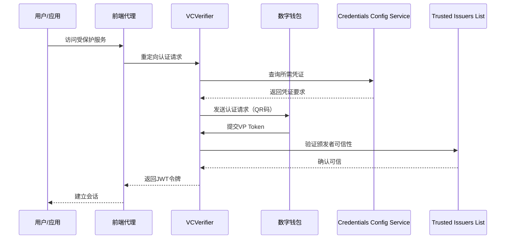
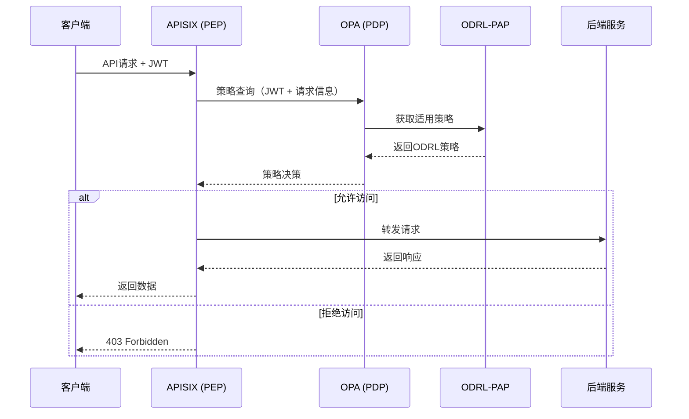

FIWARE Data Space Connector（FIWARE DSC）是一个集成化的数据空间连接器，通过整合FIWARE数据空间组件（FDC）和Eclipse数据空间组件（EDC）的开源软件组件构建而成。参与数据空间的每个组织都可以部署此连接器来"连接"数据空间，充当数据（处理）服务提供者、数据（处理）服务消费者，或同时扮演两种角色。本文档将全面介绍FIWARE DSC的核心架构组件及其职责划分。

## 整体架构概览

FIWARE DSC采用Helm Umbrella Chart架构，将所有子图表及其依赖项组合在一起，通过Helm部署到支持Kubernetes的环境中。其核心设计理念是模块化，允许根据组织在数据空间中的角色灵活配置所需组件。

```mermaid
graph TB
    subgraph "外部接口层"
        Marketplace[Marketplace Portal<br/>BAE Marketplace]
        APIGateway[API Gateway<br/>APISIX]
    end
    
    subgraph "身份与信任层"
        VCVerifier[VCVerifier]
        CCS[Credentials Config Service]
        TIL[Trusted Issuers List]
        Keycloak[Keycloak<br/>OID4VCI Issuer]
    end
    
    subgraph "授权策略层"
        OPA[Open Policy Agent<br/>PDP]
        ODRLPAP[ODRL-PAP<br/>PAP/PRP]
    end
    
    subgraph "产品管理与合同层"
        TMForumAPI[TMForum API]
        ContractMgmt[Contract Management]
    end
    
    subgraph "数据空间协议层"
        FDSCEdC[FDSC-EDC<br/>Eclipse Dataspace Components]
        IdentityHub[Identity Hub]
    end
    
    subgraph "数据服务层"
        Scorpio[Scorpio Broker<br/>NGSI-LD]
        DataService[其他数据服务<br/>S3, REST API等]
    end
    
    subgraph "基础设施层"
        PostgreSQL[PostgreSQL]
        CertManager[Cert Manager]
        DIDHelper[DID Helper]
    end
    
    Marketplace --> TMForumAPI
    APIGateway --> VCVerifier
    APIGateway --> OPA
    VCVerifier --> CCS
    VCVerifier --> TIL
    Keycloak --> VCVerifier
    OPA --> ODRLPAP
    TMForumAPI --> ContractMgmt
    FDSCEdC --> TMForumAPI
    FDSCEdC --> IdentityHub
    FDSCEdC --> APIGateway
    APIGateway --> Scorpio
    APIGateway --> DataService
    VCVerifier --> PostgreSQL
    TMForumAPI --> PostgreSQL
    TIL --> PostgreSQL
</mermaid>

**Sources**: [README.md](README.md#L84-L88), [Chart.yaml](charts/data-space-connector/Chart.yaml#L1-L92)

## 核心组件分类

FIWARE DSC的组件可以分为以下几个主要类别，每个类别承担特定的架构职责：

### 1. 身份与信任框架组件

身份与信任框架是数据空间安全运行的基础，基于OID4VC（OpenID for Verifiable Credentials）协议族实现去中心化身份管理。

**核心组件**：

| 组件 | 职责 | 关键特性 |
|------|------|----------|
| **VCVerifier** | 验证可验证凭证（VC）并将其交换为JWT令牌 | 实现OID4VP协议，支持H2M和M2M场景 |
| **Credentials Config Service** | 维护每个产品/服务所需的VC配置 | 定义访问特定服务所需的凭证类型和声明 |
| **Trusted Issuers List** | 维护可信凭证颁发者注册表 | 提供EBSI可信颁发者注册表兼容API |
| **Keycloak** | 消费者侧的凭证颁发者（OID4VCI） | 支持OID4VCI Draft 15，颁发包含角色的VC |

**Sources**: [README.md](README.md#L204-L231), [values.yaml](charts/data-space-connector/values.yaml#L50-L119)

### 2. 授权策略框架组件

授权策略框架实现基于属性的访问控制（ABAC），使用W3C ODRL标准定义策略。

**核心组件**：

| 组件 | 职责 | 架构角色 |
|------|------|----------|
| **Apache APISIX** | API网关，执行策略强制 | PEP（策略执行点） |
| **Open Policy Agent (OPA)** | 解释和应用ODRL策略 | PDP（策略决策点） |
| **ODRL-PAP** | 配置ODRL策略供OPA使用 | PAP/PRP（策略管理点/策略检索点） |

**Sources**: [README.md](README.md#L309-L331), [values.yaml](charts/data-space-connector/values.yaml#L134-L197)

### 3. 产品目录与合同管理框架

基于TM Forum Open APIs实现产品生命周期管理，包括产品规格、报价、订单和库存管理。

**核心组件**：

| 组件 | 职责 | 集成点 |
|------|------|--------|
| **TMForum API** | 实现TM Forum Open APIs的产品目录管理 | 与EDC框架集成，提供存储后端 |
| **Contract Management** | 监听合同管理事件，自动化信任关系建立 | 在产品订单完成时注册消费者DID为可信颁发者 |

**Sources**: [README.md](README.md#L350-L382), [values.yaml](charts/data-space-connector/values.yaml#L198-L304)

### 4. 数据空间协议（DSP）框架

实现Eclipse/IDSA数据空间协议，支持跨数据空间的互操作性。

**核心组件**：

| 组件 | 职责 | 协议支持 |
|------|------|----------|
| **FDSC-EDC** | Eclipse数据空间组件实现 | Catalog、Contract Negotiation、Transfer Process协议 |
| **Identity Hub** | 实现EDC身份服务，支持DCP认证 | 提供STS、DID解析和凭证服务 |

**关键特性**：
- 支持两种认证方式：OID4VC和Eclipse DCP
- 使用TMForum API作为存储后端
- 实现控制平面与数据平面分离

**Sources**: [README.md](README.md#L384-L399), [DSP_INTEGRATION.md](doc/DSP_INTEGRATION.md#L1-L21)

### 5. 市场门户组件

提供图形化Web界面，封装TM Forum APIs的访问，支持产品管理、合同协商和库存管理。

**核心组件**：

| 组件 | 职责 | 用户角色 |
|------|------|----------|
| **Business API Ecosystem (BAE)** | 基于FIWARE BAE Marketplace的市场门户 | 管理员、最终用户 |

**Sources**: [README.md](README.md#L479-L485), [MARKETPLACE_INTEGRATION.md](doc/MARKETPLACE_INTEGRATION.md#L1-L4)

### 6. 数据服务组件

提供实际的数据交换能力，支持多种数据协议和格式。

**核心组件**：

| 组件 | 职责 | 支持协议 |
|------|------|----------|
| **Scorpio Broker** | NGSI-LD上下文经纪人 | ETSI NGSI-LD |
| **其他数据服务** | 可扩展的数据服务支持 | S3, REST API, A2A, MCP等 |

**Sources**: [README.md](README.md#L79-L83), [values.yaml](charts/data-space-connector/values.yaml#L198-L304)

## 组件依赖关系图

```mermaid
graph LR
    subgraph "核心依赖链"
        A[Keycloak] --> B[VCVerifier]
        B --> C[Credentials Config Service]
        B --> D[Trusted Issuers List]
        E[APISIX] --> F[OPA]
        F --> G[ODRL-PAP]
        H[TMForum API] --> I[Contract Management]
        J[FDSC-EDC] --> H
        J --> K[Identity Hub]
    end
    
    subgraph "数据存储"
        L[(PostgreSQL)]
        B --> L
        C --> L
        D --> L
        G --> L
        H --> L
        K --> L
    end
    
    subgraph "外部集成"
        M[Gaia-X Trust Framework]
        N[Marketplace Portal]
        N --> H
        M --> D
    end
```

**Sources**: [Chart.yaml](charts/data-space-connector/Chart.yaml#L6-L92), [values.yaml](charts/data-space-connector/values.yaml#L1-L3095)

## 按角色部署的组件矩阵

不同数据空间角色需要部署不同的组件组合：

| 组件 | Consumer | Provider | Consumer + Provider | Operator |
|------|----------|----------|---------------------|----------|
| **VCVerifier** | - | 必需 | 必需 | - |
| **Credentials Config Service** | - | 必需 | 必需 | - |
| **Trusted Issuers List** | - | 必需 | 必需 | - |
| **APISIX** | - | 必需 | 必需 | - |
| **OPA** | - | 必需 | 必需 | - |
| **ODRL-PAP** | - | 必需 | 必需 | - |
| **Keycloak** | 必需 | 必需 | 必需 | - |
| **TMForum API** | - | 可选 | 可选 | - |
| **Contract Management** | - | 可选 | 可选 | - |
| **FDSC-EDC** | 可选 | 可选 | 可选 | - |
| **Trusted Issuers Registry** | - | - | - | 必需 |
| **PostgreSQL** | 必需 | 必需 | 必需 | 必需 |

**图例**：
- **必需**：该角色必须部署此组件
- **可选**：该组件增强功能但非基础角色所需
- **-**：该组件与此角色无关

**Sources**: [roles/README.md](doc/deployment-integration/roles/README.md#L20-L156)

## 组件交互模式

### 认证流程交互

FIWARE DSC支持两种主要的认证场景：

1. **H2M（人对机器）场景**：用户通过数字钱包扫描二维码，完成OID4VP认证流程
2. **M2M（机器对机器）场景**：软件代理直接与VCVerifier交互，完成凭证验证

**典型认证流程**：


**Sources**: [README.md](README.md#L256-L303), [service_invocation_end_user.png](doc/img/service_invocation_end_user.png)

### 授权策略交互



**Sources**: [README.md](README.md#L309-L348), [authorization_framework.png](doc/img/authorization_framework.png)

## 配置与扩展性

FIWARE DSC通过Helm values.yaml提供灵活的配置选项：

**主要配置维度**：
1. **组件启用/禁用**：通过`<component>.enabled: true/false`控制
2. **数据库配置**：支持PostgreSQL，可配置持久化、用户权限等
3. **安全配置**：证书管理、密钥存储、TLS设置
4. **集成配置**：外部服务端点、信任锚配置
5. **可观测性配置**：OpenTelemetry、Prometheus、Grafana集成

**示例配置片段**：
```yaml
# 启用/禁用组件
decentralizedIam:
  enabled: true
keycloak:
  enabled: true
scorpio:
  enabled: true
marketplace:
  enabled: false

# 数据库配置
managedPostgres:
  enabled: true
  config:
    volume:
      size: 1Gi
    users:
      admin: [superuser, createdb]
```

**Sources**: [values.yaml](charts/data-space-connector/values.yaml#L1-L100), [Chart.yaml](charts/data-space-connector/Chart.yaml#L6-L92)

## 信任框架集成

FIWARE DSC支持与多种信任框架集成：

1. **EBSI可信颁发者注册表**：默认的信任锚实现
2. **Gaia-X数字清算所**：作为可信颁发者注册表使用
3. **自定义信任锚**：通过Trusted Issuers List组件实现

**Gaia-X集成特性**：
- 支持`did:web`作为凭证颁发者标识
- 集成Gaia-X ODRL配置文件
- 支持`ovc:Constraint`、`ovc:leftOperand`、`ovc:credentialSubjectType`

**Sources**: [GAIA_X.MD](doc/GAIA_X.MD#L1-L14), [GAIA_X.MD](doc/GAIA_X.MD#L71-L100)

## 可观测性支持

FIWARE DSC内置完整的可观测性支持：

**监控组件**：
- **Prometheus**：指标收集和存储
- **Grafana**：可视化仪表板
- **OpenTelemetry**：分布式追踪

**追踪支持**：
- 自动仪器化：Keycloak、Scorpio等组件原生支持
- 追踪后端：支持Grafana Tempo、Jaeger、Honeycomb等
- 配置灵活性：可按组件独立启用/禁用追踪

**Sources**: [Chart.yaml](charts/data-space-connector/Chart.yaml#L78-L92), [values.yaml](charts/data-space-connector/values.yaml#L257-L304)

## 部署架构选择

根据部署场景，FIWARE DSC支持多种架构模式：

### 1. 最小化部署（学习/开发）
- 部署所有组件到单一命名空间
- 使用k3s本地集群
- 包含完整的Consumer和Provider角色

### 2. 角色分离部署（生产环境）
- **Consumer部署**：Keycloak、DID、市场门户
- **Provider部署**：认证框架、授权框架、数据服务
- **双角色部署**：完整组件集

### 3. 信任基础设施部署（Operator）
- 部署Trusted Issuers Registry
- 管理数据空间信任锚
- 通常由中立治理机构运营

**Sources**: [roles/README.md](doc/deployment-integration/roles/README.md#L1-L14), [LOCAL.MD](doc/deployment-integration/local-deployment/LOCAL.MD#L1-L50)

## 扩展与集成点

FIWARE DSC提供多个扩展点，支持自定义集成：

### 1. 数据平面扩展
- 支持多种数据协议：NGSI-LD、S3、REST API、A2A、MCP
- 可集成自定义数据服务
- 支持AI代理功能

### 2. 认证机制扩展
- 支持多种数字钱包：Lissi ID Wallet、EUDI参考钱包
- 可集成自定义凭证颁发者
- 支持多种DID方法：did:key、did:web、did:elsi

### 3. 策略引擎扩展
- 支持自定义ODRL策略
- 可集成外部策略源
- 支持Gaia-X ODRL配置文件

**Sources**: [README.md](README.md#L79-L83), [MARKETPLACE_INTEGRATION.md](doc/MARKETPLACE_INTEGRATION.md#L1-L4)

## 总结

FIWARE Data Space Connector通过模块化的架构设计，实现了数据空间所需的核心功能：

1. **去中心化身份管理**：基于OID4VC的认证框架
2. **细粒度访问控制**：基于ODRL的ABAC授权策略
3. **标准化产品管理**：TM Forum Open APIs实现
4. **协议互操作性**：Eclipse数据空间协议支持
5. **完整市场生态**：图形化市场门户

其Helm Umbrella Chart架构使得组件可以根据组织需求灵活组合，支持从学习开发到生产部署的全场景应用。通过清晰的组件职责划分和标准化的接口设计，FIWARE DSC为构建可信、互操作的数据空间提供了坚实的技术基础。

## 下一步阅读

建议按照以下顺序深入理解FIWARE DSC：

1. **[Helm Umbrella Chart 依赖图谱](8-helm-umbrella-chart-yi-lai-tu-pu)**：了解组件间的依赖关系
2. **[OID4VC 认证框架](9-oid4vc-ren-zheng-kuang-jia-vcverifier-trusted-issuers-list)**：深入身份认证机制
3. **[ODRL 授权框架](12-odrl-shou-quan-kuang-jia-apisix-opa-odrl-pap)**：理解策略授权体系
4. **[TM Forum Open APIs 合同管理流程](13-tm-forum-open-apis-he-tong-guan-li-liu-cheng)**：掌握产品生命周期管理
5. **[DSP 与 EDC 集成架构](14-dsp-yu-edc-ji-cheng-jia-gou)**：学习数据空间协议实现

通过循序渐进的学习，您将全面掌握FIWARE Data Space Connector的架构设计、组件职责和部署实践。