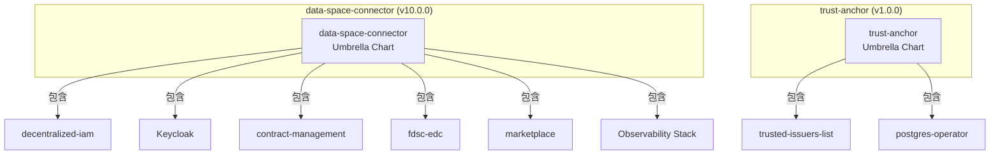
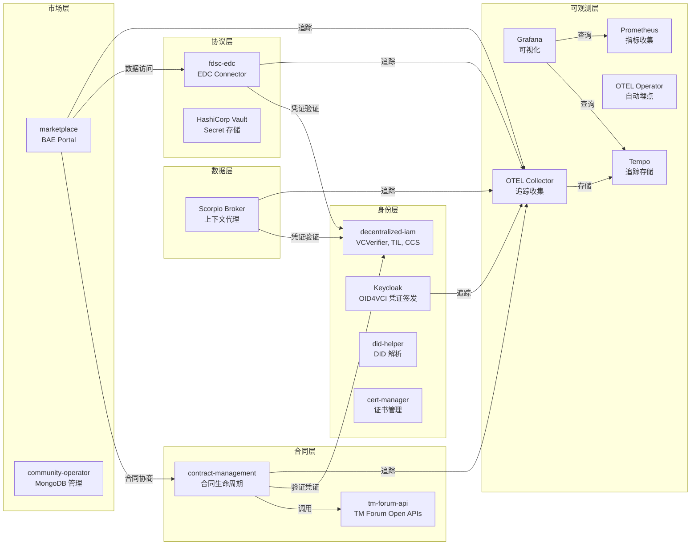
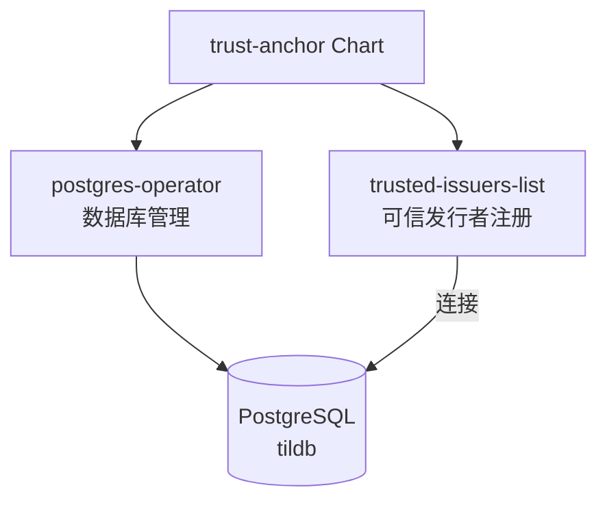
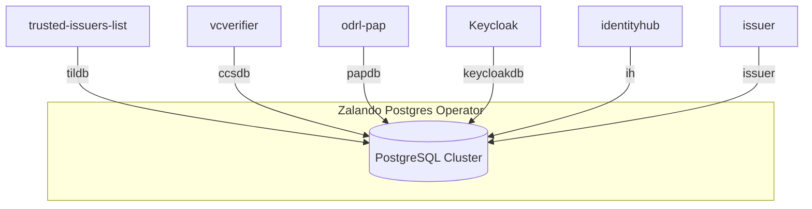

本文档详细解析 FIWARE Data Space Connector 的 Helm Umbrella Chart 依赖架构，帮助开发者理解各组件之间的依赖关系、版本约束和配置联动机制。

## Chart 架构概览

FIWARE Data Space Connector 采用 Helm Umbrella Chart 模式，将所有核心组件打包为一个统一的部署单元。项目包含两个主要 Chart：

- **data-space-connector**：主 Chart，包含数据空间连接器的全部功能组件
- **trust-anchor**：独立的信任锚 Chart，提供最小化的信任基础设施数



Sources: [Chart.yaml](charts/data-space-connector/Chart.yaml#L1-L92), [Chart.yaml](charts/trust-anchor/Chart.yaml#L1-L14)

## 主 Chart 依赖矩阵

data-space-connector Chart 共声明 **18 个子 Chart 依赖**，按功能域划分为以下类别：

| 功能域 | 依赖名称 | 版本 | 别名 | 条件字段 | 仓库 |
|--------|----------|------|------|----------|------|
| **身份与信任** | decentralized-iam | 2.0.15 | decentralizedIam | decentralizedIam.enabled | fiware.github.io |
| **身份与信任** | keycloak | 0.21.7 | - | keycloak.enabled | oci://registry-1.docker.io/cloudpirates |
| **身份与信任** | did-helper | 0.1.15 | did | did.enabled | fiware.github.io |
| **身份与信任** | cert-manager | 1.20.0 | cert-manager | cert-manager.enabled | charts.jetstack.io |
| **数据服务** | scorpio-broker-aaio | 0.4.12 | scorpio | scorpio.enabled | fiware.github.io |
| **合同管理** | tm-forum-api | 0.16.10 | - | tm-forum-api.enabled | fiware.github.io |
| **合同管理** | contract-management | 3.5.28 | - | contract-management.enabled | fiware.github.io |
| **市场门户** | business-api-ecosystem | 0.11.32 | marketplace | marketplace.enabled | fiware.github.io |
| **市场门户** | community-operator | 0.13.0 | mongo-operator | mongo-operator.enabled | mongodb.github.io |
| **DSP 协议** | fdsc-edc | 0.2.9 | - | fdsc-edc.enabled | fiware.github.io |
| **DSP 协议** | vault | 0.29.1 | vault | vault.enabled | helm.releases.hashicorp.com |
| **仪表板** | fdsc-dashboard | 0.6.1 | - | fdsc-dashboard.enabled | fiware.github.io |
| **可观测性** | prometheus | 29.2.1 | - | prometheus.enabled | prometheus-community.github.io |
| **可观测性** | grafana | 12.1.1 | - | grafana.enabled | grafana-community.github.io |
| **可观测性** | opentelemetry-operator | 0.86.0 | - | opentelemetry-operator.enabled | open-telemetry.github.io |
| **可观测性** | opentelemetry-collector | 0.152.0 | - | opentelemetry-collector.enabled | open-telemetry.github.io |
| **可观测性** | tempo | 1.24.4 | - | tempo.enabled | grafana.github.io |

Sources: [Chart.yaml](charts/data-space-connector/Chart.yaml#L6-L92)

## 组件依赖关系图

以下 Mermaid 图展示了各组件之间的核心依赖关系和数据流向：



Sources: [values.yaml](charts/data-space-connector/values.yaml#L1-L3095)

## 条件启用机制

所有子 Chart 均通过 `condition` 字段实现按需启用。默认配置下，以下组件**默认启用**：

| 组件 | 默认状态 | 说明 |
|------|----------|------|
| decentralizedIam | ✅ 启用 | 核心身份框架，包含 VCVerifier、TIL、ODRL 授权 |
| keycloak | ✅ 启用 | 凭证签发服务 |
| scorpio | ✅ 启用 | 上下文代理（数据服务） |
| tm-forum-api | ✅ 启用 | TM Forum Open APIs |
| contract-management | ✅ 合同管理服务 |
| cert-manager | ✅ 启用 | 证书管理（需预装 CRDs） |

以下组件**默认禁用**，需显式启用：

| 组件 | 默认状态 | 启用场景 |
|------|----------|----------|
| marketplace | ❌ 禁用 | 需要 Market Portal 时启用 |
| mongo-operator | ❌ 禁用 | marketplace 启用时联动启用 |
| fdsc-edc | ❌ 禁用 | 需要 DSP 协议集成时启用 |
| vault | ❌ 禁用 | 生产环境 Secret 管理 |
| fdsc-dashboard | ❌ 禁用 | 需要可视化仪表板时启用 |
| did | ❌ 禁用 | 需要 DID 解析功能时启用 |
| prometheus | ❌ 禁用 | 需要指标监控时启用 |
| grafana | ❌ 禁用 | 需要可视化时启用 |
| opentelemetry-operator | ❌ 禁用 | 需要自动埋点时启用 |
| opentelemetry-collector | ❌ 禁用 | 需要分布式追踪时启用 |
| tempo | ❌ 禁用 | 需要追踪存储后端时启用 |

Sources: [values.yaml](charts/data-space-connector/values.yaml#L13-L3095)

## Trust Anchor Chart

Trust Anchor 是一个独立的 Umbrella Chart，提供最小化的信任基础设施，主要用于本地开发和测试环境：

| 依赖名称 | 版本 | 用途 |
|----------|------|------|
| trusted-issuers-list | 0.16.0 | 可信发行者列表（TIR） |
| postgres-operator | 1.15.1 | PostgreSQL 数据库管理 |



Sources: [Chart.yaml](charts/trust-anchor/Chart.yaml#L1-L14), [values.yaml](charts/trust-anchor/values.yaml#L1-L59)

## 数据库依赖拓扑

多个组件共享 PostgreSQL 数据库实例，通过 Zalando Postgres Operator 管理：

| 数据库 | 使用组件 | 用途 |
|--------|----------|------|
| tildb | trusted-issuers-list | 可信发行者列表存储 |
| ccsdb | vcverifier | 凭证配置服务 |
| papdb | odrl-pap | ODRL 策略管理 |
| keycloakdb | Keycloak | 身份提供者数据 |
| ih | identityhub | 身份中心 |
| issuer | issuer | 凭证签发 |



Sources: [values.yaml](charts/data-space-connector/values.yaml#L20-L70)

## 可观测性栈配置

可观测性组件采用分层架构，支持灵活的后端选择：

| 层级 | 组件 | 默认状态 | 说明 |
|------|------|----------|------|
| 埋点层 | 各组件 OTEL SDK | 内置 | 通过环境变量控制 |
| 收集层 | opentelemetry-collector | 禁用 | 聚合和处理追踪数据 |
| 存储层 | tempo | 禁用 | 追踪数据持久化 |
| 可视化层 | grafana | 禁用 | 仪表板和查询 |
| 指标层 | prometheus | 禁用 | 指标收集 |
| 自动埋点 | opentelemetry-operator | 禁用 | 注入语言特定代理 |

全局追踪配置通过 `tracing.enabled` 统一控制：

```yaml
tracing:
  enabled: false  # 全局开关
  exporter:
    otlp:
      endpoint: ""  # 默认指向集群内 Collector
      protocol: "grpc"
      insecure: true
  sampler: "parentbased_traceidratio"
  samplerArg: "1.0"
```

Sources: [values.yaml](charts/data-space-connector/values.yaml#L2755-L3095)

## Secret 管理策略

Chart 支持两种 Secret 管理模式：

| 模式 | 配置 | 适用场景 |
|------|------|----------|
| 自动生成 | `*.generatePasswords: true` | 开发/演示环境 |
| 外部管理 | `*.generatePasswords: false` | 生产环境（GitOps、External Secrets Operator） |

关键 Secret 名称：

| Secret 名称 | 用途 | 键 |
|-------------|------|-----|
| issuance-secret | Keycloak 管理员密码 | keycloak-admin |
| mongodb-admin-password | MongoDB 管理员密码 | password |
| mongodb-charging-password | Marketplace 计费后端 | password |
| mongodb-belp-password | Marketplace 逻辑代理 | password |

Sources: [README.md](charts/README.md#L1-L39)

## 部署角色与 Chart 配置映射

不同部署角色对应不同的 Chart 配置组合：

| 部署角色 | 核心组件 | 可选组件 |
|----------|----------|----------|
| Consumer | decentralizedIam, keycloak, contract-management, tm-forum-api | fdsc-edc, marketplace |
| Provider | decentralizedIam, keycloak, scorpio, contract-management | fdsc-edc, vault |
| Consumer + Provider | 全部核心组件 | marketplace, observability |
| Operator（治理） | trust-anchor, postgres-operator | - |

Sources: [k3s](k3s/), [values.yaml](charts/data-space-connector/values.yaml#L1-L3095)

## 下一步阅读

- **[values.yaml 全局配置参考](16-values-yaml-quan-ju-pei-zhi-can-kao)**：了解所有可配置参数的详细说明
- **[组件总览与模块职责](7-zu-jian-zong-lan-yu-mo-kuai-zhi-ze)**：深入了解各组件的具体职责
- **[Consumer 角色部署](3-consumer-jiao-se-bu-shu)**：了解 Consumer 角色的最小化部署配置
- **[Provider 角色部署](4-provider-jiao-se-bu-shu)**：了解 Provider 角色的最小化部署配置