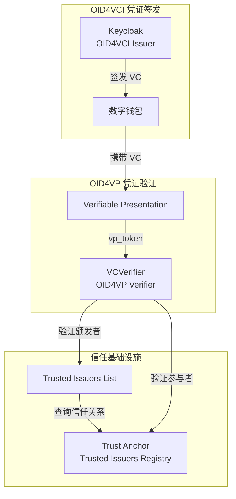
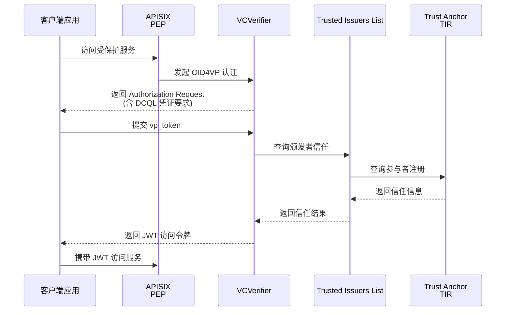
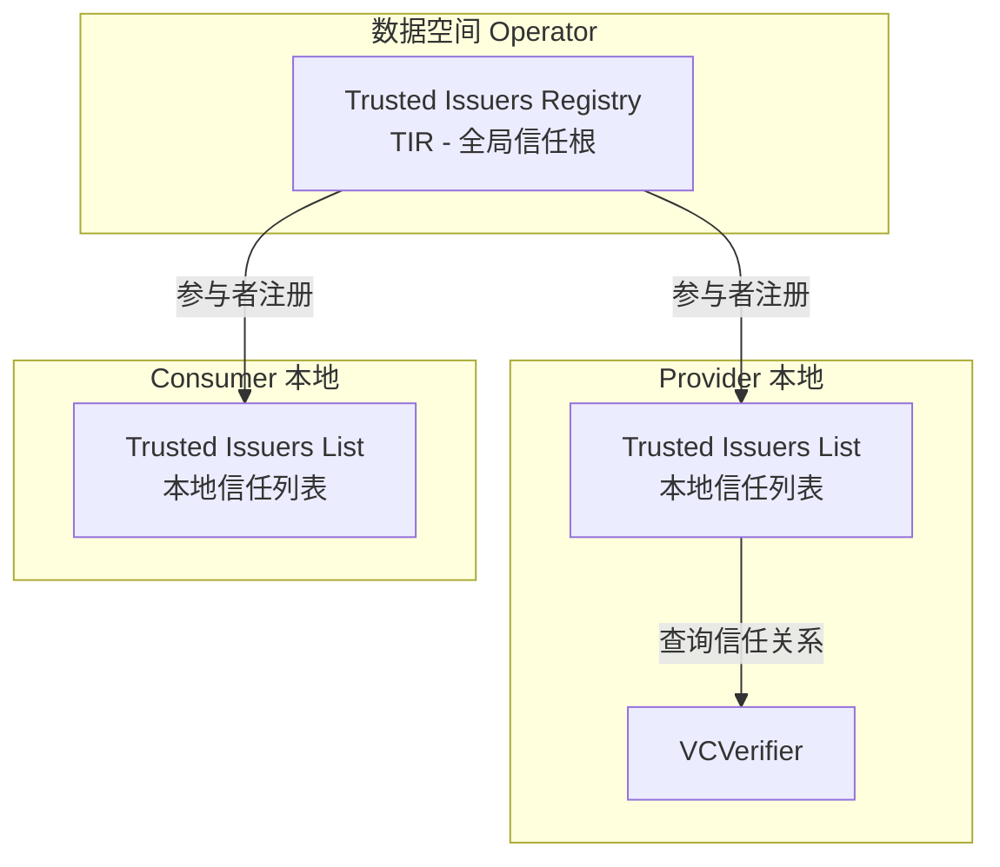
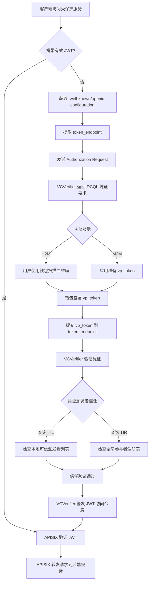

FIWARE Data Space Connector 的 OID4VC 认证框架基于 OpenID for Verifiable Credentials（OID4VC）协议族实现去中心化身份管理，是数据空间安全运行的基础。该框架通过 **VCVerifier** 验证可验证凭证（Verifiable Credentials），通过 **Trusted Issuers List（TIL）** 维护可信凭证颁发者注册表，共同实现对数据空间参与者的身份认证和信任建立。本文将深入剖析这两大核心组件的架构原理、配置方式和交互流程。

## OID4VC 协议族概述

OID4VC 是一系列基于 OpenID Connect 的扩展协议，专为可验证凭证的签发和验证而设计。FIWARE DSC 实现了以下关键协议规范：

- **OID4VCI（OpenID for Verifiable Credential Issuance）**：定义凭证签发流程，Keycloak 作为 Issuer 实现 Draft 15 规范
- **OID4VP（OpenID for Verifiable Presentations）**：定义凭证验证流程，VCVerifier 作为 Verifier 实现验证逻辑
- **DCQL（Digital Credentials Query Language）**：用于描述期望的凭证格式和声明要求

这些协议共同构建了从凭证签发（Issuance）到凭证验证（Verification）的完整信任链。



**Sources**: [Chart.yaml](charts/data-space-connector/Chart.yaml#L13-L16), [doc/keycloak/oid4vc-protocol-mappers.md](doc/keycloak/oid4vc-protocol-mappers.md#L1-L10)

## VCVerifier：凭证验证引擎

VCVerifier 是 OID4VC 认证框架的核心组件，负责验证传入的可验证凭证并将其交换为 JWT 访问令牌。它实现了完整的 OID4VP 协议流程，支持 H2M（人对机器）和 M2M（机器对机器）两种认证场景。

### 架构职责

VCVerifier 的核心职责包括三个层面。首先是 **凭证格式验证**，支持 JWT-VC（`jwt_vc_json`）和 SD-JWT-VC（`dc+sd-jwt`）两种凭证格式的解析与签名验证。其次是 **颁发者信任检查**，通过查询 Trusted Issuers List 和 Trusted Issuers Registry（TIR）验证凭证颁发者的可信性。最后是 **凭证类型接受度验证**，根据 Credentials Config Service 的配置检查凭证类型是否符合服务要求。



**Sources**: [doc/deployment-integration/roles/provider/README.md](doc/deployment-integration/roles/provider/README.md#L37-L42), [k3s/provider.yaml](k3s/provider.yaml#L100-L145)

### 配置参数详解

VCVerifier 的配置通过 Helm values 文件中的 `decentralizedIam.vcAuthentication.vcverifier` 节点进行管理。以下表格列出了关键配置参数：

| 参数 | 说明 | 示例值 |
|------|------|--------|
| `deployment.verifier.tirAddress` | Trust Anchor 的 TIR 端点地址 | `https://tir.127.0.0.1.nip.io/` |
| `deployment.verifier.did` | 本组织的 DID 标识符 | `did:web:mp-operations.org` |
| `deployment.verifier.supportedModes` | 支持的凭证呈现模式 | `["byValue", "byReference"]` |
| `deployment.verifier.tilCacheExpiry` | TIL 缓存过期时间（秒） | `1` |
| `deployment.verifier.tirCacheExpiry` | TIR 缓存过期时间（秒） | `1` |
| `deployment.verifier.clientIdentification.keyPath` | M2M 客户端识别密钥路径 | `/signing-key/tls.key` |
| `deployment.verifier.clientIdentification.certificatePath` | M2M 客户端识别证书路径 | `/signing-key/tls.crt` |
| `deployment.verifier.clientIdentification.requestKeyAlgorithm` | 请求密钥算法 | `ES256` |
| `deployment.server.host` | VCVerifier 的服务端点地址 | `https://verifier.mp-operations.org` |

**Sources**: [k3s/provider.yaml](k3s/provider.yaml#L100-L120), [charts/data-space-connector/values.yaml](charts/data-space-connector/values.yaml#L73-L88)

### 支持的凭证格式

VCVerifier 支持两种主流的可验证凭证格式，每种格式具有不同的特性和适用场景：

| 格式 | 标识符 | 特性 | 适用场景 |
|------|--------|------|----------|
| **JWT-VC** | `jwt_vc_json` | 基于 JWT 的凭证，完整的声明暴露 | 传统凭证迁移、需要完整声明可见的场景 |
| **SD-JWT-VC** | `dc+sd-jwt` | 选择性披露凭证，支持声明隐藏 | 隐私敏感场景、最小化数据暴露 |

配置示例中展示了两种格式的凭证定义：

```yaml
# SD-JWT 格式的 LegalPersonCredential
legal-person-credential:
  attributes:
    format: "dc+sd-jwt"
    verifiable_credential_type: "LegalPersonCredential"
    credential_signing_alg: "ES256"

# JWT-VC 格式的 UserCredential
user-credential:
  attributes:
    format: "jwt_vc_json"
    verifiable_credential_type: "UserCredential"
    credential_signing_alg: "ES256"
```

**Sources**: [k3s/consumer.yaml](k3s/consumer.yaml#L200-L250), [doc/keycloak/oid4vc-protocol-mappers.md](doc/keycloak/oid4vc-protocol-mappers.md#L50-L100)

### 服务注册与凭证要求配置

VCVerifier 通过 Credentials Config Service（CCS）的 `registration.services` 配置定义每个受保护服务的凭证要求。每个服务可以配置多个 OIDC Scope，每个 Scope 指定所需的凭证类型、可信颁发者列表和可信参与者列表。

以下是典型的服务注册配置结构：

```yaml
registration:
  services:
    - id: data-service                    # 服务标识符
      defaultOidcScope: "default"         # 默认 OIDC Scope
      authorizationType: "DEEPLINK"       # 认证类型（DEEPLINK 或 FRONTEND_V2）
      oidcScopes:
        "default":
          credentials:
            - type: UserCredential        # 所需凭证类型
              trustedParticipantsLists:
                - https://tir.127.0.0.1.nip.io  # 可信参与者列表
              trustedIssuersLists:
                - http://trusted-issuers-list:8080  # 可信颁发者列表
              jwtInclusion:
                enabled: true
                fullInclusion: true
          dcql:                           # DCQL 凭证查询描述
            credentials:
              - id: user-query
                format: "jwt_vc_json"
                multiple: true
                meta:
                  type_values:
                    - [UserCredential]
```

`authorizationType` 参数决定了认证交互方式：`DEEPLINK` 模式适用于 M2M 场景，通过深度链接完成认证；`FRONTEND_V2` 模式适用于 H2M 场景，通过前端交互完成认证。

**Sources**: [k3s/provider.yaml](k3s/provider.yaml#L150-L300), [doc/deployment-integration/roles/provider/README.md](doc/deployment-integration/roles/provider/README.md#L44-L55)

## Trusted Issuers List：可信颁发者注册表

Trusted Issuers List（TIL）是 OID4VC 认证框架的信任基础设施，维护着数据空间中所有可信凭证颁发者的注册信息。它提供 EBSI（European Blockchain Services Infrastructure）可信颁发者注册表兼容 API，是 VCVerifier 进行信任决策的核心数据源。

### 双层信任架构

FIWARE DSC 采用双层信任架构来管理颁发者信任关系：

1. **全局信任层（Trust Anchor）**：由数据空间 Operator 管理的 Trusted Issuers Registry（TIR），作为全局信任根节点。每个参与者在加入数据空间时需在 TIR 注册其 DID 和支持的凭证类型。

2. **本地信任层（Local TIL）**：每个参与者本地部署的 Trusted Issuers List，维护该参与者信任的其他颁发者信息。本地 TIL 与全局 TIR 配合使用，共同决定哪些组织可以颁发特定类型的凭证。



**Sources**: [charts/trust-anchor/values.yaml](charts/trust-anchor/values.yaml#L1-L59), [k3s/trust-anchor.yaml](k3s/trust-anchor.yaml#L1-L35)

### 配置参数

TIL 的配置通过 `decentralizedIam.vcAuthentication.trusted-issuers-list` 节点管理。关键配置参数如下：

| 参数 | 说明 | 示例值 |
|------|------|--------|
| `enabled` | 是否启用本地 TIL | `true` |
| `fullnameOverride` | 服务名称覆盖 | `trusted-issuers-list` |
| `database.persistence` | 是否启用持久化 | `true` |
| `database.dialect` | 数据库方言 | `POSTGRES` |
| `database.host` | 数据库主机 | `postgres` |
| `database.port` | 数据库端口 | `5432` |
| `database.name` | 数据库名称 | `tildb` |
| `ingress.tir.enabled` | 是否暴露 TIR API | `true` |
| `ingress.til.enabled` | 是否暴露 TIL API | `true` |

**Sources**: [charts/data-space-connector/values.yaml](charts/data-space-connector/values.yaml#L55-L72), [charts/trust-anchor/values.yaml](charts/trust-anchor/values.yaml#L40-L59)

### 颁发者注册流程

每个参与者在启动时需要将其 DID 注册到 Trust Anchor 的 TIR 中。这通过 initContainer `register-at-tir` 完成：

```yaml
- name: register-at-tir
  image: curlimages/curl:8.18.0
  command:
    - /bin/sh
  args:
    - -ec
    - |
      curl -X 'POST' 'http://tir.trust-anchor.svc.cluster.local:8080/issuer' \
        -H 'Content-Type: application/json' \
        -d "{
          \"did\": \"did:web:mp-operations.org\",
          \"credentials\": []
        }"
```

注册完成后，参与者还需通过 `registration` 配置将其支持的凭证类型注册到本地 TIL：

```yaml
registration:
  enabled: true
  til: http://trusted-issuers-list.provider.svc.cluster.local:8080
  issuer:
    - did: did:web:mp-operations.org
      credentialTypes:
        - LegalPersonCredential
    - did: did:web:fancy-marketplace.biz
      credentialTypes:
        - LegalPersonCredential
        - UserCredential
        - MembershipCredential
```

**Sources**: [k3s/provider.yaml](k3s/provider.yaml#L120-L135), [k3s/provider.yaml](k3s/provider.yaml#L130-L150), [charts/data-space-connector/templates/participant-registration.yaml](charts/data-space-connector/templates/participant-registration.yaml#L1-L38)

## OID4VP 认证流程详解

OID4VP（OpenID for Verifiable Presentations）是 FIWARE DSC 的核心认证协议，定义了凭证持有者向验证者呈现凭证的完整流程。该流程支持两种主要场景：H2M（人对机器）场景中用户通过数字钱包完成认证，M2M（机器对机器）场景中软件代理直接与 VCVerifier 交互。

### 完整认证流程

以下流程图展示了 OID4VP 认证的完整步骤：



**Sources**: [doc/DSP_INTEGRATION.md](doc/DSP_INTEGRATION.md#L10-L25), [doc/flows/service-interaction-m2m/README.md](doc/flows/service-interaction-m2m/README.md#L1-L50)

### 步骤详解

**步骤 1：获取 OpenID Configuration**

客户端首先访问受保护服务的 `.well-known/openid-configuration` 端点，获取认证元数据：

```shell
curl -X GET https://<SERVICE_HOST>/.well-known/openid-configuration
```

返回的 JSON 包含 `grant_types_supported` 和 `token_endpoint` 等关键信息：

```json
{
  "grant_types_supported": ["vp_token"],
  "token_endpoint": "https://<SERVICE_TOKEN_HOST>/path/to/token"
}
```

**步骤 2：发送 Authorization Request**

客户端向 VCVerifier 的 Authorization Endpoint 发送请求，VCVerifier 返回包含 DCQL 凭证要求的 Authorization Response。DCQL 描述了期望的凭证格式、类型和声明。

**步骤 3：准备 vp_token**

客户端根据 DCQL 要求选择合适的凭证，构建 Verifiable Presentation（VP）并签署为 vp_token。vp_token 是一个签名的 JWT，包含以下结构：

- **Header**：指定签名算法（如 ES256）和密钥标识符（kid）
- **Payload**：包含 iss（颁发者）、aud（受众）、exp（过期时间）等标准声明，以及 vp 字段包含的可验证凭证

**步骤 4：提交 vp_token 并获取 JWT**

客户端将 vp_token 提交到 VCVerifier 的 Token Endpoint：

```shell
curl -X POST 'https://<SERVICE_TOKEN_HOST>/path/to/token' \
  -H 'Content-Type: application/x-www-form-urlencoded' \
  -H 'Accept: application/json' \
  -d "vp_token=<SIGNED_VP_TOKEN>&grant_type=vp_token&scope=<SCOPE>"
```

VCVerifier 验证凭证签名、检查颁发者信任后，返回 JWT 访问令牌。

**Sources**: [doc/flows/service-interaction-m2m/README.md](doc/flows/service-interaction-m2m/README.md#L50-L120), [doc/DSP_INTEGRATION.md](doc/DSP_INTEGRATION.md#L10-L30)

### H2M 与 M2M 场景对比

| 特性 | H2M（人对机器） | M2M（机器对机器） |
|------|------------------|-------------------|
| **认证主体** | 人类用户 | 软件代理/服务 |
| **凭证持有** | 数字钱包 | 文件系统或内存 |
| **交互方式** | 扫描二维码/深度链接 | 直接 API 调用 |
| **authorizationType** | `FRONTEND_V2` | `DEEPLINK` |
| **典型场景** | 用户访问 Marketplace | 服务间调用、DSP 协议交互 |
| **凭证格式** | 通常为 SD-JWT（隐私保护） | 通常为 JWT-VC |

**Sources**: [doc/deployment-integration/roles/provider/README.md](doc/deployment-integration/roles/provider/README.md#L25-L35), [k3s/provider.yaml](k3s/provider.yaml#L150-L200)

## DID 与密钥管理

OID4VC 认证框架依赖去中心化标识符（DID）和密码学密钥来建立身份和签署凭证。FIWARE DSC 支持多种 DID 方法和密钥管理方式。

### 支持的 DID 方法

| DID 方法 | 格式示例 | 特性 | 适用场景 |
|----------|----------|------|----------|
| **did:web** | `did:web:mp-operations.org` | 基于 Web 域名，易部署 | 生产环境、标准组织 |
| **did:elsi** | `did:elsi:VATDE-1234567` | 基于 ETSI Legal Person Semantic Identifier | 欧盟法律实体 |
| **did:key** | `did:key:zDnaeiVpxCT7ARwqLndbWiCeGG2YZXvLfWFs1cGPgKUe8GPLe` | 自包含密钥标识符 | 临时测试、短期交互 |

### 密钥配置

VCVerifier 的客户端识别（Client Identification）使用 TLS 证书进行 M2M 场景的身份验证：

```yaml
deployment:
  verifier:
    clientIdentification:
      keyPath: /signing-key/tls.key
      certificatePath: /signing-key/tls.crt
      requestKeyAlgorithm: ES256
      id: x509_san_dns:verifier.mp-operations.org
```

密钥通过 cert-manager 管理，挂载到 VCVerifier 容器的 `/signing-key` 路径：

```yaml
additionalVolumes:
  - name: signing-key
    secret:
      secretName: verifier.mp-operations.org-tls
additionalVolumeMounts:
  - name: signing-key
    mountPath: /signing-key
```

**Sources**: [k3s/provider.yaml](k3s/provider.yaml#L100-L120), [k3s/consumer-elsi.yaml](k3s/consumer-elsi.yaml#L1-L50)

## 与 APISIX 集成

VCVerifier 与 APISIX API 网关紧密集成，形成完整的认证-授权链路。APISIX 作为策略执行点（PEP），通过 `openid-connect` 插件与 VCVerifier 交互，实现透明的认证流程。

### 路由配置

APISIX 的路由配置将 `.well-known/openid-configuration` 请求代理到 VCVerifier，同时将实际服务请求受保护路由：

```yaml
routes: |-
  - uri: /.well-known/openid-configuration
    host: mp-data-service.127.0.0.1.nip.io
    upstream:
      nodes:
        verifier:3000: 1
    plugins:
      proxy-rewrite:
        uri: /services/data-service/.well-known/openid-configuration
  
  - uri: /*
    host: mp-data-service.127.0.0.1.nip.io
    upstream:
      nodes:
        data-service-scorpio:9090: 1
    plugins:
      openid-connect:
        bearer_only: true
        use_jwks: true
        client_id: data-service
        discovery: http://verifier:3000/services/data-service/.well-known/openid-configuration
      opa:
        host: "http://localhost:8181"
        policy: policy/main
        with_body: true
```

这种配置实现了：VCVerifier 作为 OpenID Provider 提供认证服务，APISIX 的 `openid-connect` 插件自动处理 JWT 验证，OPA 侧车执行 ODRL 策略决策。

**Sources**: [k3s/provider-elsi.yaml](k3s/provider-elsi.yaml#L140-L200), [k3s/provider.yaml](k3s/provider.yaml#L350-L450)

## 常见凭证类型

FIWARE DSC 支持多种标准凭证类型，用于不同的信任场景：

| 凭证类型 | 格式 | 用途 | 颁发者 |
|----------|------|------|--------|
| **LegalPersonCredential** | `dc+sd-jwt` | 法律实体身份验证 | Keycloak（Consumer） |
| **UserCredential** | `jwt_vc_json` | 用户身份凭证 | Keycloak（Consumer） |
| **MembershipCredential** | `jwt_vc_json` | 数据空间成员资格 | Keycloak（Consumer） |
| **OperatorCredential** | `jwt_vc_json` | 数据空间操作员权限 | Keycloak（Consumer） |
| **MarketplaceCredential** | `jwt_vc_json` | Marketplace 访问权限 | Keycloak（Consumer） |

每种凭证类型在 Keycloak 中通过 `realm.verifiableCredentials` 配置定义，并通过 OID4VC 协议映射器（Protocol Mappers）将用户属性映射到凭证声明中。

**Sources**: [k3s/consumer.yaml](k3s/consumer.yaml#L180-L250), [doc/keycloak/oid4vc-protocol-mappers.md](doc/keycloak/oid4vc-protocol-mappers.md#L1-L50)

## 下一步阅读

- **[H2M 服务调用流程](10-h2m-fu-wu-diao-yong-liu-cheng)**：深入了解人对机器场景的完整认证流程
- **[M2M 服务调用流程](11-m2m-fu-wu-diao-yong-liu-cheng)**：了解机器对机器场景的凭证验证细节
- **[Keycloak 与 OID4VCI 凭证签发配置](17-keycloak-yu-oid4vci-ping-zheng-qian-fa-pei-zhi)**：配置 Keycloak 签发可验证凭证
- **[ODRL 授权框架（APISIX + OPA + ODRL-PAP）](12-odrl-shou-quan-kuang-jia-apisix-opa-odrl-pap)**：了解认证后的授权策略执行
- **[DSP 与 EDC 集成架构](14-dsp-yu-edc-ji-cheng-jia-gou)**：了解 OID4VC 在数据空间协议中的应用